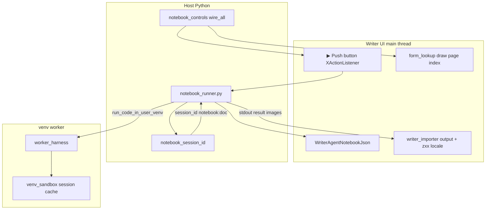

# Incremental Dev Plan: Interactive Jupyter Notebook in Writer

## Purpose

WriterAgent **imports** `.ipynb` files into Writer ([`jupyter-notebook-import.md`](jupyter-notebook-import.md)): markdown, editable code **TextFields** (`nb_cell_{i}_code`), frozen outputs, and (since Phase 1) **▶ Run** per code cell against a **shared `notebook:…` venv kernel**.

Still to build: Run All / Stop, cell CRUD, sidebar, `.ipynb` export, and (later) in-kernel UNO via host proxy.

This plan is **Writer-first**. Calc notebook import is out of scope unless explicitly added later.

**Related but separate (do not merge in Phase 1–2):**

| Feature | Session policy | Notes |
|---------|----------------|-------|
| **`=PYTHON()`** Calc | Opt-in via `scripting.python_session_mode` → `shared` | [`session_manager.py`](../plugin/scripting/session_manager.py), `calc:…` session ids — [python-in-excel-dev-plan.md](python-in-excel-dev-plan.md) Phase 1 |
| **Run Python Script…** | **Isolated** per Run | Document-attached named scripts shipped ([`document_scripts.py`](../plugin/scripting/document_scripts.py)); notebook cells remain TextFields + registry |
| **Chat `run_venv_python_script`** | **Always isolated** | Do not pass `session_id` |
| **Notebook Run** | **Always shared** per Writer doc | `notebook:…` session id; one kernel per imported notebook document |

---

## Current status (2026-05-28)

| Phase | State | Summary |
|-------|--------|---------|
| **0** | **Shipped** | Registry JSON on document, stable `cell_id` (UUID), output bookmarks, `notebook:…` session id, reset via **WriterAgent → Reset Python Session** |
| **1** | **Shipped (core)** | In-flow ▶ push buttons, `notebook_runner`, shared kernel, gutter `[In [n]]` updates, venv execution + UI drain |
| **2–6** | **Not started** | Run All / Stop, CRUD, sidebar, export, UNO proxy |

**Manual smoke (verified on small notebook):** Import → `wired 3/3 run button(s)` in log → click ▶ → `notebook run cell index=…` → venv worker runs → second cell sees variables from first after cell 0 run.

### Shipped modules (interactive stack)

| Module | Role |
|--------|------|
| [`cell_registry.py`](../plugin/notebook/cell_registry.py) | `WriterAgentNotebookJson` / `WriterAgentNotebookSourcePath`; `NotebookCodeCell` with `cell_id`, `code_field_name`, `output_start_bookmark`, `execution_count` |
| [`writer_importer.py`](../plugin/notebook/writer_importer.py) | Import loop, ▶ + code fields, registry init, **`zxx` spellcheck-off** at import start, `flush_ui_idle` |
| [`form_lookup.py`](../plugin/notebook/form_lookup.py) | Find form models by name via **document draw page** `ControlShape` scan (text `Frame` enumeration alone misses in-flow controls) |
| [`notebook_controls.py`](../plugin/notebook/notebook_controls.py) | Wire ▶ `XActionListener` after import; PyUNO `uno.getTypeByName` for `XControlAccess` / `XButton` |
| [`notebook_runner.py`](../plugin/notebook/notebook_runner.py) | `run_cell`, `read_code_from_field`, `apply_run_result`, `clear_cell_output`, protocol URL `notebook.run_cell.{hex}` |
| [`import_dialog.py`](../plugin/notebook/import_dialog.py) | File picker, post-import wiring + design mode off |
| [`session_manager.py`](../plugin/scripting/session_manager.py) | `notebook_session_id`, `reset_notebook_python_session` / Writer branch of **Reset Python Session** |
| [`main.py`](../plugin/main.py) | `notebook.run_cell.*` dispatch; `install_notebook_run_button_wiring` on bootstrap |

### Tests

[`tests/notebook/`](../tests/notebook/): `test_cell_registry.py`, `test_session_manager_notebook.py`, `test_writer_importer.py`, `test_form_lookup.py`, `test_notebook_controls.py`, `test_notebook_runner.py`.

### Known gaps / bugs (Phase 1 follow-up)

1. **`clear_cell_output`** — uses `text.deleteContents(...)`, which is not valid on Writer `XText` in PyUNO (`AttributeError: deleteContents`). Re-runs log `failed to clear output for cell N`; new stdout may **append** beside old output until fixed (use cursor `setString("")` or `removeContents` on the selection range).
2. **Re-import** — replaces registry; no merge UX (Phase 3).
3. **Form URL buttons** — rejected; `TargetURL` / protocol handler does not fire for in-flow form buttons. Use **PUSH** + `XActionListener` only.
4. **Untitled documents** — `doc.getURL()` empty; listener keeps strong ref to `doc` (PyUNO objects cannot use `weakref`).
5. **Config keys** — `notebook.enable_interactive` / `notebook.run_on_import` not added yet; Run is always on when registry exists.
6. **Large imports** — still main-thread synchronous; 100+ cells pause UI (performance backlog unchanged).

### Implementation lessons (UNO / PyUNO)

- **`queryInterface`** must use `uno.getTypeByName("com.sun.star.view.XControlAccess")`, not imported IDL classes (same pattern as [`pivot.py`](../plugin/calc/pivot.py)).
- **Control lookup** — in-flow `ControlShape` models live on **`doc.getDrawPage()`**, not only as `TextPortionType == "Frame"` in body enumeration ([`form_lookup.py`](../plugin/notebook/form_lookup.py); mirrors [`list_form_controls`](../plugin/writer/specialized/forms.py)).
- **Wire timing** — attach listeners **after** import + `processEventsToIdle()`, not per-cell during insert; batch `wire_all_notebook_run_buttons` once.
- **Spellcheck** — set document + paragraph styles to **`zxx`** (no linguistic content) at import start ([`rich_text.py`](../plugin/chatbot/rich_text.py) uses the same locale).

---

## What existed before interactive (baseline)

| Component | Role |
|-----------|------|
| [`plugin/contrib/nbformat/`](../plugin/contrib/nbformat/) | Vendored nbformat **v4 read** only |
| [`import_dialog.py`](../plugin/notebook/import_dialog.py) | File picker, Writer-only, completion msgbox |
| [`writer_importer.py`](../plugin/notebook/writer_importer.py) | Cell loop, gutter style, in-flow code fields, output text + images |
| [`venv_worker.py`](../plugin/scripting/venv_worker.py) | Warm worker, `session_id`, `reset_session` |
| [`venv_sandbox.py`](../plugin/scripting/venv_sandbox.py) | `LocalPythonExecutor` cache per `session_id` |

**Still not shipped:** Run All, Stop, cell CRUD, export `.ipynb`, background import, nbformat v3, UNO from notebook code, `notebook.*` config keys in Settings UI.

---

## Design principles

1. **Main thread for UNO** — Document mutations on the LO UI thread; venv IPC on worker via `run_blocking_in_thread` + mandatory `flush_ui_idle` / `processEventsToIdle` after runs ([`notebook_runner.py`](../plugin/notebook/notebook_runner.py)).

2. **Stable cell identity** — Registry uses **`cell_id` (UUID)** and hex id in control names (`nb_run_{hex}`, `nb_out_{hex}`). Field names still include index (`nb_cell_{i}_code`) for readability; Phase 3 may avoid renumbering pain via UUID-only refs.

3. **Session id** — `notebook:{workbook_key}` from [`notebook_session_id`](../plugin/scripting/session_manager.py). Not gated on `python_session_mode` (Calc-only).

4. **Output refresh** — On run: clear output region (bookmark → next cell boundary), then `apply_run_result`. **Clear step currently broken** — see known gaps.

5. **LLM stays out** — Notebook kernel variables are not visible to chat tools.

6. **Stop** — Phase 2; single-cell runs use `python_exec_timeout` until batch controller exists.

7. **Sandbox AST policy** — User venv code is subject to the project AST checker (e.g. dunder methods blocked by design); not loosened for notebooks.

---

## Architecture (as built for Phase 0–1)

---

## Phase 0: Document notebook model — **done**

**Goal:** Imported notebooks addressable for execution without full-document re-parse.

**Built:**

- [`cell_registry.py`](../plugin/notebook/cell_registry.py): `load_registry` / `save_registry`, `NotebookDocState`, `NotebookCodeCell`, `new_code_cell_entry`, `find_cell_by_hex`, output bookmarks `nb_out_*`
- UserDefinedProperties: `WriterAgentNotebookJson` (version 1), `WriterAgentNotebookSourcePath`
- Import writes registry + bookmarks; `init_registry_execution_counter` after import
- [`session_manager.py`](../plugin/scripting/session_manager.py): `notebook_session_id`, `reset_notebook_python_session`; **Reset Python Session** detects Writer + registry

**Tests:** [`test_cell_registry.py`](../tests/notebook/test_cell_registry.py), [`test_session_manager_notebook.py`](../tests/notebook/test_session_manager_notebook.py).

---

## Phase 1: Run single code cell — **done (core); polish pending**

**Goal:** User clicks **▶**; code runs in shared kernel; output area updates; gutter shows `[In [n]]`.

**Built:**

- **Run control:** In-flow `CommandButton` (`Label` ▶, `ButtonType` PUSH) before each code `TextField`; names `nb_run_{hex}`
- [`notebook_controls.py`](../plugin/notebook/notebook_controls.py): `wire_all_notebook_run_buttons`, `get_control_view_for_model`, listener → `run_cell_for_doc_hex`
- [`notebook_runner.py`](../plugin/notebook/notebook_runner.py): `read_code_from_field` (via `form_lookup`), `execute_code` + `run_blocking_in_thread`, `run_cell`, `apply_run_result`, `update_in_prompt`
- [`main.py`](../plugin/main.py): `_dispatch_command` for `notebook.run_cell.{hex}`; bootstrap wiring hook
- Import: spellcheck off (`zxx`); wire after import in `import_ipynb_to_writer` and `import_dialog.py`

**Rejected approach:** Form URL / `TargetURL` buttons — do not reach `ProtocolHandler`; kept PUSH + listener only.

**Remaining Phase 1 work:**

- Fix `clear_cell_output` UNO API so re-run replaces output cleanly
- Optional UNO test: `tests/notebook/test_notebook_run_uno.py` (tiny ipynb, run cell, assert body text)
- Session persistence test through `notebook_runner` API (mirror `test_session_persistence.py`)

**Out of scope (unchanged):** Run All, Stop, export.

---

## Phase 2: Run All, Run from here, Stop — **not started**

**Goal:** Jupyter-like batch execution with cancel.

**What to build:**

- **Run All** — menu or toolbar; loop code cells in registry order; `processEventsToIdle()` between cells
- **Run from here** — from selected cell index to end
- **Stop** — `NotebookRunController.cancelled`; check between cells; optional `worker_harness` `interrupt`
- Disable ▶ while batch running; status (“Running cell 3/12…”)
- One batch per document at a time

**Tests:** Unit tests for cancel flag; mock loop stops mid-way.

---

## Phase 3: Create / delete / reorder cells — **not started**

**Goal:** Notebook editable beyond static import.

**What to build:**

- Add / delete code cell (heading, gutter, field, ▶, registry entry)
- Re-import: replace all vs merge (warn if registry exists)
- Optional move up/down

Registry already has stable `cell_id` UUID for Phase 3.

---

## Phase 4: Notebook sidebar / toolbar — **not started**

**Goal:** Discoverability and bulk actions for long documents.

**What to build:**

- Deck or dialog: cell list, Run, Run All, Clear outputs, Reset kernel
- Click row → scroll to bookmark
- Reuse chat sidebar patterns only if consistent

---

## Phase 5: Export to `.ipynb` — **not started**

**Goal:** Round-trip collaboration.

**What to build:**

- nbformat v4 **write** (minimal or vendored)
- Walk registry + read code fields + serialize outputs
- Menu: **Export Jupyter Notebook…**

---

## Phase 6 (deferred): UNO / LibreOffice API from notebook code

**Goal:** Notebook code drives the document via WriterAgent tool surface, not raw UNO in the sandbox.

**Recommended approach (when ready):**

1. Host **NotebookHostBridge** RPC (child → main thread → `ToolRegistry`)
2. Shim `wa.run_tool(...)` in session namespace
3. Same auth as chat tools
4. Security / threading review before starting

---

## Cross-feature: Run Python Script “saved with document”

Separate roadmap — store scripts in UserDefinedProperties, library UI, isolated execution unless explicit “use notebook kernel” when registry present.

---

## Config and settings

| Key | Purpose | Default | Status |
|-----|---------|---------|--------|
| `scripting.python_session_mode` | Calc `=PYTHON()` only | `isolated` | Exists |
| `notebook.enable_interactive` | Show Run / allow execution | `true` | **Not added** (Run on when registry exists) |
| `notebook.run_on_import` | Auto Run All after import | `false` | **Not added** |
| `scripting.python_exec_timeout` | Per-cell wall clock | 10 | Exists |

Add keys in [`plugin/notebook/module.yaml`](../plugin/notebook/module.yaml) when manifest entry is formalized ([`scripts/manifest_registry.py`](../scripts/manifest_registry.py)).

---

## Performance backlog (parallel / lower priority)

From [`jupyter-notebook-import.md`](jupyter-notebook-import.md):

- Background import: decode images off-thread, UNO insert on main thread every *k* images
- nbformat **v3** upgrade path
- Full CommonMark markdown (today: HTML-tagged cells only)

---

## Suggested implementation order for a fresh agent

1. Read [`jupyter-notebook-import.md`](jupyter-notebook-import.md) and this file’s **Current status** section.
2. **Fix Phase 1 polish** — `clear_cell_output` API; confirm output replace in Writer.
3. **Phase 2** — Run All + Stop + menubar entries.
4. **Phase 3** — cell CRUD + re-import merge dialog.
5. Update shipped/deferred tables in `jupyter-notebook-import.md` after each phase.
6. `make test` + manual Writer smoke.

**Manual smoke (Phase 1 — current):**

1. `make deploy writer` (or restart LO after OXT update).
2. Import small two-cell notebook (`x = 1` / `print(x)`).
3. Log: `notebook controls: wired 2/2 run button(s)`.
4. Run cell 0, then cell 1 → `print` shows `1`.
5. **Reset Python Session** → cell 1 fails until cell 0 re-run.
6. Re-run cell 0 → verify output region (after clear-output fix, no duplicate paragraphs).

**Debug log keywords:** `notebook controls`, `wired`, `notebook run cell`, `failed to clear output`, `venv_worker`.

---

## Files touched (summary)

| Phase | New | Modified |
|-------|-----|----------|
| 0 | `cell_registry.py` | `writer_importer.py`, `session_manager.py` |
| 1 | `notebook_runner.py`, `notebook_controls.py`, `form_lookup.py` | `writer_importer.py`, `import_dialog.py`, `main.py` |
| 1 polish | — | `notebook_runner.py` (`clear_cell_output`) |
| 2 | `notebook_run_controller.py` (planned) | `notebook_runner.py`, menus / `Addons.xcu` |
| 3 | `cell_edit.py` (planned) | registry, importer |
| 4 | `notebook_panel.py` or dialog (planned) | optional `panel_factory` |
| 5 | `ipynb_export.py` (planned) | registry, nbformat write |
| 6 | `notebook_host_bridge.py` (planned) | `venv_worker`, tool loop |

---

## References

- [Jupyter notebook import (user-facing)](jupyter-notebook-import.md)
- [Python-in-Calc dev plan (shared kernel)](python-in-excel-dev-plan.md)
- [NumPy / venv bridge](enabling_numpy_in_libreoffice.md)
- [Writer forms / in-flow controls](../plugin/writer/specialized/forms.py)
- [Session persistence tests](../tests/scripting/test_session_persistence.py)
