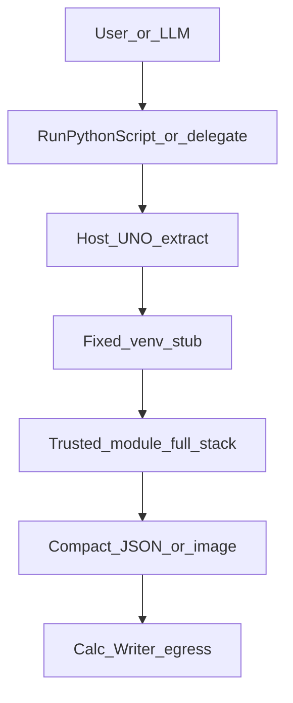
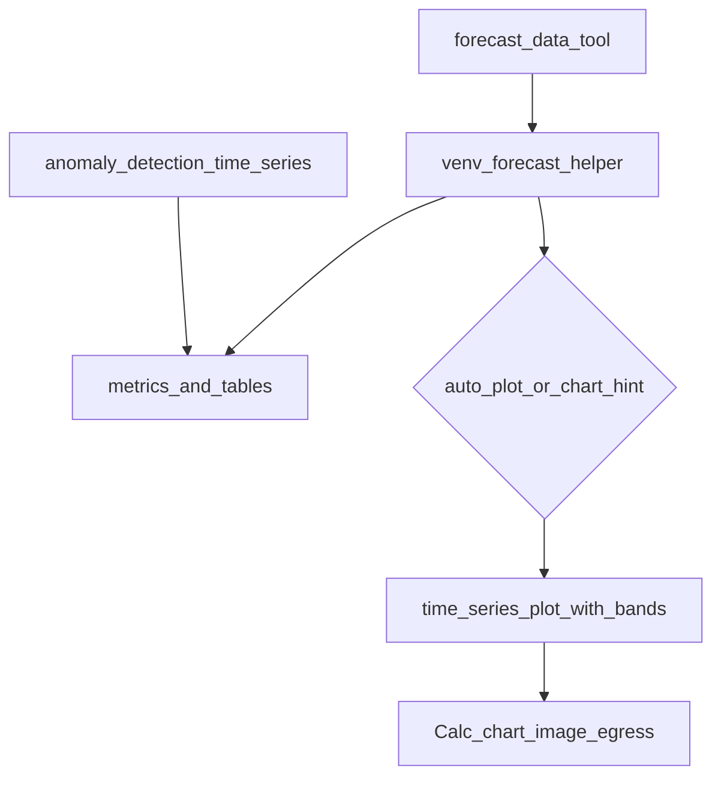

# NumPy Domains — Trusted Scientific Helpers

Back to [Enabling NumPy & Python in LibreOffice](enabling_numpy_in_libreoffice.md) (core venv bridge, `=PYTHON()`, architecture, sandbox).

WriterAgent builds **domain-specific trusted helpers** on top of the warm venv subprocess: fixed host stubs call reviewed modules under `plugin/scripting/` (and related packages) with the full scientific stack — no AST sandbox inside those modules. This document covers Analysis, Visualization, Symbolic Math, Units, Text Analytics, Forecasting, Optimization, Quant, and planned domains (Geospatial, Audio).

**Related:** [Analysis Sub-Agent](analysis-sub-agent.md) · [Image Recognition](image-recognition.md) (Vision) · [Embeddings](embeddings.md) · [DuckDB Calc](duckdb-calc-dev-plan.md) · [SageMath (deferred)](sagemath-integration-dev-plan.md) · [Venv IPC & serialization](numpy-serialization.md)

---

## Table of contents

1. [Venv packages by domain](#venv-packages-by-domain)
2. [Scientific domain roadmap (trusted helpers)](#scientific-domain-roadmap-trusted-helpers)
   - [Domain helper pattern](#domain-helper-pattern-analysis--vision-canonical)
   - [Visualization & Plotting](#visualization)
   - [Time Series & Forecasting](#forecasting)
   - [Forecasting Phase 1 (next agent)](#forecasting-phase-1)
   - [Symbolic Mathematics](#symbolic-math)
   - [Data Engineering / Units (Pint)](#data-engineering-units)
   - [Text / Document Analytics](#text-analytics)
   - [Optimization & OR](#optimization)
   - [Geospatial](#geospatial)
   - [Audio / Signal Processing](#audio-signal)
   - [Implementation phasing](#implementation-phasing-cross-domain)

---

## Venv packages by domain {#venv-packages-by-domain}

Trusted helpers require packages in the user venv (`scripting.python_venv_path`). Settings → Python **Test** reports Present/Missing per group.

### Required venv packages (trusted analysis helpers)

The 14 Calc **Analysis Helpers** in [`plugin/scripting/analysis.py`](../plugin/scripting/analysis.py) require a fixed scientific stack in the user venv. Settings → Python **Test** reports these under **Data Analysis / EDA Libraries** and prints an install line when any are missing.

```bash
uv pip install numpy pandas scipy scikit-learn statsmodels ydata-profiling pandas-montecarlo
```

| Package | Used by |
|---------|---------|
| `numpy`, `pandas` | All helpers (coercion, tables, aggregates) |
| `scipy` | `detect_outliers` (IQR, z-score) |
| `scikit-learn` | `detect_outliers` (`isolation_forest`), `cluster_numeric` |
| [ydata-profiling](https://github.com/ydataai/ydata-profiling) (`data_profiling`) | `describe_data` |
| `statsmodels` | `run_regression`, [`forecast_time_series` / `decompose_time_series`](../plugin/scripting/forecast.py) |
| [pandas-montecarlo](https://github.com/ranaroussi/pandas-montecarlo) | `monte_carlo` |

Helpers that need a missing package return `MISSING_PACKAGE` with the install line above — there is no in-code fallback to alternate libraries. See [Analysis Sub-Agent](analysis-sub-agent.md).

### Demo workbook (all NumPy domains)

Manual QA fixture covering Analysis, Forecast, Viz, Math, Quant, Optimize, Units, and Goal Seek/Solver: [`tests/fixtures/numpy_domains_demo.ods`](../tests/fixtures/numpy_domains_demo.ods) ([`numpy_domains_demo.README.md`](../tests/fixtures/numpy_domains_demo.README.md)). Native ODS preserves uppercase `=PYTHON()` (LibreOffice lowercases custom add-ins when importing XLSX). One sheet per domain with sample data, `=PYTHON()` scalar checks where applicable, Run Python Script picker hints, and chat prompts for tools that expose a Calc chat surface. Regenerate from repo root:

```bash
python scripts/generate_numpy_domains_demo_spreadsheet.py
```

Case definitions: [`tests/calc/numpy_domains_demo_cases.py`](../tests/calc/numpy_domains_demo_cases.py).

### Planned domain package groups {#planned-domain-package-groups}

Future trusted-helper domains (Geospatial, Audio, optional `prophet`) will each declare required venv packages and a Settings → Python **Test** group when implemented. **Shipped today:**

| Domain | Settings → Python **Test** group | Entry doc |
|--------|----------------------------------|-----------|
| **Vision** | **Vision Libraries** (`docling`, `rapidocr`, `paddleocr`, `paddle`, `ultralytics`, optional `skimage`) | [image-recognition.md](image-recognition.md) |
| **Embeddings** | **Embeddings Libraries** (`envwrap`, `sentence_transformers`, `sqlite_vec`, `langgraph`, `langchain_core`, `langchain_text_splitters`) | [embeddings.md](embeddings.md#embeddings-venv-packages) |
| **Visualization** | **Visualization Libraries** (`matplotlib`, `seaborn`) | [Visualization § Phase A–C](#visualization) |
| **Symbolic Math (SymPy)** | **Computer Algebra** (`sympy`) | [Symbolic Math §3](#symbolic-math) |
| **Units (Pint)** | **Data Engineering Libraries** (`pint`, `duckdb`) | [Data Engineering / Units §3b](#data-engineering-units) |
| **Forecasting** | **Data Analysis / EDA Libraries** (`statsmodels` — shared with analysis) | [Forecasting §2](#forecasting) |
| **Text Analytics** | **Text / NLP Libraries** (`spacy`, `textdescriptives`, `transformers`, …) | [Text Analytics §4](#text-analytics) |
| **Quantitative Finance** | **Quantitative Finance Libraries** (`yfinance`, `pandas_ta`, …) | Run Python Script **Quant Helpers** |

SageMath remains a future optional extension — [sagemath-integration-dev-plan.md](sagemath-integration-dev-plan.md).

---

## Scientific domain roadmap (trusted helpers) {#scientific-domain-roadmap-trusted-helpers}

The sections below are **roadmaps and reference** for scientific capabilities. **Shipped domains:** **Analysis** ([analysis-sub-agent.md](analysis-sub-agent.md)), **Vision** ([image-recognition.md](image-recognition.md)), **Visualization** ([§1](#visualization)), **Symbolic Math (SymPy)** ([§3](#symbolic-math)), **Units (Pint)** ([§3b](#data-engineering-units)), **Forecasting** ([§2](#forecasting)), **Text Analytics** ([§4](#text-analytics)), **Optimization** (partial — [§5](#optimization)), and **Quant** (Run Python Script). DuckDB SQL helpers (up to Phase C: multi-table catalog with named ranges + folder files) are implemented under the same trusted + Run Python Script + analysis-domain pattern; see [duckdb-calc-dev-plan.md](duckdb-calc-dev-plan.md). Remaining domains (Geospatial, Audio) follow the same pattern: trusted modules under `plugin/scripting/`, fixed venv stubs, host extract → IPC → compact results → document egress, plus optional Run Python Script templates and specialized sub-agent exposure.

### Domain helper pattern (Analysis + Vision canonical)

Shipped domains prove the stack. New domains should mirror them—not invent parallel plumbing.

**Register host glue once:** add an RPS entry (and optional script-picker entry) in [`plugin/scripting/domain_registry.py`](../plugin/scripting/domain_registry.py), use shared header/template helpers from [`helper_domain.py`](../plugin/scripting/helper_domain.py), and keep compute/egress in the domain modules. Do not copy another `if *_meta is not None` block into `python_runner.execute_and_insert_result`.

| Layer | Analysis | Vision | Viz | Symbolic (SymPy) | Units (Pint) | Forecast | Planned |
|-------|----------|--------|-----|------------------|--------------|----------|---------|
| Trusted module | [`analysis.py`](../plugin/scripting/analysis.py) | [`vision.py`](../plugin/vision/venv/vision.py) | [`viz.py`](../plugin/scripting/viz.py) | [`symbolic.py`](../plugin/scripting/symbolic.py) | [`units.py`](../plugin/scripting/units.py) | [`forecast.py`](../plugin/scripting/forecast.py) | `text_analytics.py`, … |
| Templates | `run_analysis(...)` script | `# writeragent:vision` | `run_viz(...)` script | `run_symbolic(...)` script | `run_units(...)` script | `# writeragent:forecast` | … |
| Host client | [`client.py`](../plugin/scripting/client.py) `run_analysis` | [`client.py`](../plugin/scripting/client.py) `run_vision` | [`client.py`](../plugin/scripting/client.py) `run_viz` | [`client.py`](../plugin/scripting/client.py) `run_symbolic` | [`client.py`](../plugin/scripting/client.py) `run_units` | [`client.py`](../plugin/scripting/client.py) `run_forecast` | Same RPC shape |
| Runner / egress | [`analysis_runner.py`](../plugin/calc/analysis_runner.py), [`analysis_egress.py`](../plugin/calc/analysis_egress.py) | [`vision_runner.py`](../plugin/vision/vision_runner.py), [`vision_egress.py`](../plugin/vision/vision_egress.py) | egress in [`viz.py`](../plugin/scripting/viz.py) | egress in [`symbolic.py`](../plugin/scripting/symbolic.py) | egress in [`units.py`](../plugin/scripting/units.py) | egress in [`forecast.py`](../plugin/scripting/forecast.py) | Per domain |
| Run Python Script | register in [`domain_registry.py`](../plugin/scripting/domain_registry.py) `PICKER` / `RPS` | same | same | same | same | same | Host glue: [`helper_domain.py`](../plugin/scripting/helper_domain.py) + registry; picker via [`document_scripts.py`](../plugin/scripting/document_scripts.py) |
| Fast path order | venv + post-venv | 1st (header) | venv + post-venv | venv + post-venv | venv + post-venv | header only | Ordered in [`get_rps_domains()`](../plugin/scripting/domain_registry.py). **Header fast path** remains for vision, quant, optimize, forecast. **Analysis, viz, math, units, text** execute visible `run_*()` Python (text: host injects `text` + `document_context` on Writer) and route via post-venv insert. |
| Settings Test | **Data Analysis / EDA** | **Vision Libraries** | **Visualization Libraries** | **Computer Algebra** | **Data Engineering Libraries** | **Data Analysis / EDA** (`statsmodels`) | Per domain when shipped |
| LLM surface | Calc `domain="analysis"` — [`analyze_data`](../plugin/calc/analysis.py), [`plot_data`](../plugin/calc/viz.py) | `analyze_image` deferred | `plot_data` (analysis); raw matplotlib via `run_venv_python_script` | `domain="python"` — [`symbolic_math`](../plugin/calc/symbolic_math.py) | Run Python Script **Units Helpers** only | [`forecast_data`](../plugin/calc/forecast.py) in `domain="analysis"` | Extend analysis or add domains |



**Dual access model:** Prefer high-level `run_*({helper, params}, data, context)` (or domain-specific inputs like vision's `image`). Keep `run_venv_python_script` / `=PYTHON()` as the escape hatch for novel work. Return `MISSING_PACKAGE` when required venv packages are absent; optional pure-Python or ASCII fallbacks per domain.

**Data handoff:** Reuse [`calc_addin_data.py`](../plugin/calc/calc_addin_data.py) and [`payload_codec`](../plugin/scripting/payload_codec.py) split-grid. For LLM/sub-agent paths, pass **`data_range`** (late binding) rather than full grids in chat context — see [Analysis Sub-Agent — Data Handoff](analysis-sub-agent.md#data-handoff--context-limits-out-of-band-data).

**Visualization note:** Phase A uses the venv worker and `__wa_payload__: "image"` envelope for raw matplotlib (no trusted module required). **Phases B–C shipped:** Run Python Script image egress and trusted Viz helpers (`viz.py`, `[Viz]` templates, `plot_data`, analysis auto-plot).

### New Domain Proposals

We are actively expanding the set of supported scientific libraries. These packages are not part of the standard LLM sandbox and must be accessed via trusted extension modules.

| Domain | Packages | Implementation |
|--------|----------|----------------|
| **Data Engineering** | `pint`, `pyarrow` | Trusted module `plugin/scripting/units.py` or `io.py` |
| **NLP** | `langdetect` (grammar Local + embeddings plain-text locale), `spacy` (shipped via [`text_analytics.py`](../plugin/scripting/text_analytics.py)) | Venv `langdetect` via [`langdetect_rpc.py`](../plugin/embeddings/venv/langdetect_rpc.py); Writer dialog + `# writeragent:text` |
| **Bayesian Opt** | `scikit-optimize` | Trusted module `plugin/scripting/optimization.py` |

The implementation should follow the [Domain helper pattern](#domain-helper-pattern-analysis--vision-canonical) using the established RPC stub architecture.

### Prioritization

| Priority | Domain | Status today | First target |
|----------|--------|--------------|--------------|
| 0 | **Analysis** (numeric EDA, regression, clustering, …) | **Shipped** — [analysis-sub-agent.md](analysis-sub-agent.md); Viz auto-plot via [`viz_auto_plot.py`](../plugin/calc/viz_auto_plot.py) | Maintenance |
| 1 | **Visualization & Plotting** | **Shipped** (Phase A–C) | `plot_data`, `[Viz] quick_plot` |
| 2 | **Time Series & Forecasting** | **Shipped (Phase 1)** — anomalies, viz bands, `auto_plot`; Prophet deferred | Optional `prophet` model (Phase 2) |
| 3 | **Symbolic Mathematics** | **Shipped** (SymPy only; Sage deferred) | `symbolic_math`, `[Math] solve_equation` |
| 4 | **Text / Document Analytics** | **Shipped** — spaCy + topics + sentiment; Writer dialog; no LLM tool yet | LLM tool surface |
| 5 | **Optimization & OR** | **Partial** — `optimize_data` + scipy helpers shipped; pulp/ortools deferred | `pulp` / `ortools` |
| 6 | **Geospatial** | Not started | `[Geo] map_data` |
| 7 | **Audio / Signal Processing** | Recording shipped; no librosa analysis | Spectrogram via Viz egress |
| 8 | **Data Engineering** | **Shipped (Pint)** — [`units.py`](../plugin/scripting/units.py), `[Units]` templates; `pyarrow` IO deferred | `convert_quantity`, `parse_quantity` |
| 9 | **NLP** | **Partial** — `langdetect` in embeddings venv; spaCy in text analytics | LLM tool for text analytics |
| 10 | **Bayesian Opt** | Not started | `skopt` |

---

### 1. Visualization & Plotting {#visualization}

**Status:** **Phase A–C shipped** (raw matplotlib pipeline, Run Python Script image egress, trusted Viz helpers).

**Goal:** Turn analysis results into publication-quality charts inside LibreOffice—Calc sheet graphics or Writer inline images—without requiring the LLM to write matplotlib every time. Highest immediate ROI for demos and shareable workflows.

**Why:** Users respond to visuals. "I generated a professional chart from my spreadsheet in two clicks" is a strong adoption story. Pairs naturally with the analysis sub-agent (auto-plot regression, clusters, Monte Carlo distributions).

#### Phase A — Raw matplotlib pipeline (shipped)

No `viz.py` yet. Matplotlib figures from user/LLM code are captured in the venv and inserted via the existing image envelope.

| Component | Module | Behavior |
|-----------|--------|----------|
| Figure → bytes | [`venv/venv_sandbox.py`](../plugin/scripting/venv/venv_sandbox.py) | `_figure_to_image_payload()` (SVG default); `_capture_open_figures_payload()` merges multiple open figures vertically; `serialize_result()` for returned `Figure`; `Agg` backend; figure cleanup |
| Wire format | [`payload_codec.py`](../plugin/scripting/payload_codec.py) | `PAYLOAD_IMAGE`, `is_image_payload()`; shared temp-file helper |
| Calc `=PYTHON()` | [`python_function.py`](../plugin/calc/python/function.py), [`python_image_egress.py`](../plugin/calc/python/image_egress.py) | `insert_image_result_on_sheet()` → `GraphicObjectShape` anchored to active cell |
| Chat / LLM | [`venv_python.py`](../plugin/calc/python/venv.py) | **Calc:** auto-insert on active sheet + `image_path`. **Writer/Draw:** `image_path` → `insert_image` |
| Writer notebook | [`notebook_runner.py`](../plugin/notebook/notebook_runner.py) | Inline image insert (SVG + PNG) on notebook cell run |
| LLM prompts | [`import_policy.py`](../plugin/scripting/import_policy.py) | App-specific `format_matplotlib_plot_hint()` (Calc / Writer / Draw); not in global import policy |
| LLM sandbox | [`sandbox.py`](../plugin/scripting/sandbox.py) | `matplotlib`, `seaborn` whitelisted |
| Settings Test | [`venv_worker.py`](../plugin/scripting/venv_worker.py) | `matplotlib` under **Scientific Libraries**; **Visualization Libraries** group (`matplotlib`, `seaborn`) when Viz helpers are used |
| Tests | [`test_matplotlib_output.py`](../tests/scripting/test_matplotlib_output.py), [`test_python_function.py`](../tests/calc/python/test_function.py), [`test_venv_python_image.py`](../tests/calc/python/test_venv_image.py), [`test_python_runner_viz.py`](../tests/scripting/test_python_runner_viz.py), [`test_viz.py`](../tests/scripting/test_viz.py), [`test_plot_data.py`](../tests/calc/test_plot_data.py) | Codec, sandbox e2e, multi-figure merge, Calc chat insert, RPS fast path, trusted helpers |

**Works today:**

```python
# =PYTHON() — implicit plt.show() or explicit Figure return
import matplotlib.pyplot as plt
plt.plot([1, 2, 3])
```

```text
# Calc chat — one step (plot inserts on active sheet; image_path still returned)
run_venv_python_script(code="… plt.plot(…) …")

# Writer / Draw chat — two steps
1. run_venv_python_script(code="… plt.plot(…) …")
2. insert_image(image_path=<returned path>)
```

**Native LO charts** ([`charts.py`](../plugin/calc/charts.py) — `UpsertChart`, `ListCharts`, …) are a **separate** UNO chart path, not matplotlib. The LLM can already create native Calc/Writer charts from structured data; Viz helpers complement that with statistical plotting (seaborn, heatmaps, distribution plots).

**Known limitations:** No UNO e2e test for full `=PYTHON()` plot insertion (geometry unit-tested with mocks). Multiple open figures are merged into one vertical stack (PNG). Optional polish: [python-in-excel-dev-plan.md Phase 3](python-in-excel-dev-plan.md#phase-3-monaco--calc-editor-ux-in-progress).

#### Phase B — Run Python Script + Writer image egress (shipped)

[`python_runner.py`](../plugin/scripting/python_runner.py) `execute_and_insert_result()` checks `is_viz_result()` / `is_image_payload()` after venv execution and inserts plots via [`viz.py`](../plugin/scripting/viz.py) egress helpers (Calc → [`insert_image_result_on_sheet`](../plugin/calc/python/image_egress.py); Writer → [`insert_image_at_locator`](../plugin/writer/images/image_tools.py)). Viz templates execute the visible `run_viz(...)` call in the venv; results route via post-venv insert. Tests: [`test_python_runner_viz.py`](../tests/scripting/test_python_runner_viz.py).

#### Phase C — Trusted Viz helpers (shipped)

[`viz.py`](../plugin/scripting/viz.py) (templates, trusted runner, Calc/Writer egress), [`client.py`](../plugin/scripting/client.py) `run_viz`, `_viz_script_section` in [`document_scripts.py`](../plugin/scripting/document_scripts.py), post-venv routing in `python_runner.py`, [`plot_data`](../plugin/calc/viz.py) analysis-domain tool, and `analyze_data` auto-plot via [`viz_auto_plot.py`](../plugin/calc/viz_auto_plot.py).

| Helper | Purpose | Notes |
|--------|---------|-------|
| `plot_data` | Auto chart from numeric grid + `spec` | Chart-type recommendation, title/legend metadata |
| `correlation_heatmap` | Heatmap | Builds on `correlation_matrix` analysis output |
| `time_series_plot` | Date-indexed line plot | Shared with Forecast domain |
| `quick_plot` | Default Run Python Script template | Phase B egress for insert |

**Run Python Script templates:** **Viz Helpers →** `[Viz] quick_plot`, `[Viz] correlation_heatmap`, `[Viz] time_series`.

**Result contract (draft):** `{status, helper, image: {format, data}, title, legend, chart_type, writer_cleanup_hints}` — image bytes use the same `__wa_payload__: "image"` envelope as Phase A.

**Analysis sub-agent:** After `run_regression`, `cluster_numeric`, `monte_carlo`, or `correlation_matrix`, `analyze_data` can auto-call a matching viz helper when `auto_plot=true` or the task hint mentions charts (see [`viz_auto_plot.py`](../plugin/calc/viz_auto_plot.py)).

**Packages:** `matplotlib` (required); `seaborn` (recommended). Settings → Python **Visualization Libraries** group lists both.

**Fallback:** ASCII mini-charts or compact text tables when matplotlib is missing (`MISSING_PACKAGE`).

**Phase 2+ (deferred):** `create_interactive_chart` — static multi-view export or embedded HTML/JS if LibreOffice egress supports it.

---

### 2. Time Series & Forecasting {#forecasting}

**Status:** **Shipped (Phase 1).** Trusted helpers via [`forecast.py`](../plugin/scripting/forecast.py), Run Python Script **Forecast Helpers**, and `forecast_data` chat tool (`domain="analysis"`). Phase 1 adds `anomaly_detection_time_series`, confidence-band `time_series_plot`, and `forecast_data` `auto_plot`. Optional `prophet` deferred to Phase 2.

**Goal:** Forecast, decompose, and flag anomalies on date-indexed Calc data—natural fit for spreadsheets (finance, ops, sales).

**Why:** Strong Calc synergy; pairs with Visualization for confidence-band plots (Phase 1).

**Already in codebase:**

| Piece | Location |
|-------|----------|
| Period-over-period change | [`compare_periods`](../plugin/scripting/analysis.py) in analysis helpers |
| Outlier detection | [`detect_outliers`](../plugin/scripting/analysis.py) — cross-sectional; use [`anomaly_detection_time_series`](../plugin/scripting/forecast.py) for temporal anomalies |
| OLS / statsmodels | [`run_regression`](../plugin/scripting/analysis.py); `statsmodels` in analysis venv install line |
| Range → pandas | [`calc_addin_data.py`](../plugin/calc/calc_addin_data.py), [`venv/analysis.py`](../plugin/scripting/venv/analysis.py) `coerce_to_dataframe` |

**Shipped helpers:**

| Helper | Purpose | Key params |
|--------|---------|------------|
| `forecast_time_series` | Forward predictions + intervals when available | `periods=12`, `model="auto"` (Holt-Winters / ARIMA / moving-average fallback) |
| `decompose_time_series` | Trend / seasonal / residual | `date_col`, `value_col`, `period`, `model` |
| `anomaly_detection_time_series` | Series-aware outliers (STL residuals + robust z-score) | `date_col`, `value_col`, `period`, `threshold=3.0`, `method="stl_residual"` |

**Phase 2 (deferred):**

| Helper | Purpose |
|--------|---------|
| `forecast_time_series` with `model="prophet"` | Facebook Prophet (heavy optional dep) |

**Module layout:** [`plugin/scripting/forecast.py`](../plugin/scripting/forecast.py) + [`plugin/scripting/venv/forecast.py`](../plugin/scripting/venv/forecast.py).

**Packages:** `statsmodels` (required for decomposition and most forecasts; already in analysis stack); optional `prophet` (heavy — future Test group, `MISSING_PACKAGE` if absent).

**Run Python Script:** **Forecast Helpers →** `[Forecast] forecast_time_series`, `[Forecast] decompose_time_series`, `[Forecast] anomaly_detection_time_series`.

**Output:** Predictions / decomposition / anomaly tables (analysis egress pattern). `forecast_data` with `auto_plot=true` (or chart keywords in `task_hint`) inserts a confidence-band chart via extended `time_series_plot`.

**Sub-agent:** [`forecast_data`](../plugin/calc/forecast.py) in `domain="analysis"` — same delegation as EDA/regression (`optimize_data` precedent); supports `auto_plot` for band charts ([`forecast_auto_plot.py`](../plugin/calc/forecast_auto_plot.py)).

**Fallback:** Simple moving-average projection in pandas when statsmodels forecasting APIs unavailable (`forecast_time_series` with `model="auto"` or `"moving_average"`).

**Tests:** [`test_forecast.py`](../tests/scripting/test_forecast.py), [`test_forecast_templates.py`](../tests/scripting/test_forecast_templates.py), [`test_python_runner_forecast.py`](../tests/scripting/test_python_runner_forecast.py), [`test_forecast_data.py`](../tests/calc/test_forecast_data.py), [`test_forecast_auto_plot.py`](../tests/calc/test_forecast_auto_plot.py).

#### Forecasting Phase 1 {#forecasting-phase-1}

**Status:** **Shipped** (items 1–3). Prophet remains Phase 2.

**Goal:** Temporal anomaly detection, forecast confidence-band charts on Calc, and optional Facebook Prophet — without bloating Phase 0’s tabular-only surface.

**Prerequisite:** Phase 0 is shipped ([`plugin/scripting/forecast.py`](../plugin/scripting/forecast.py), [`plugin/scripting/venv/forecast.py`](../plugin/scripting/venv/forecast.py), [`plugin/calc/forecast.py`](../plugin/calc/forecast.py), RPS **Forecast Helpers**, `forecast_data` in `domain="analysis"`). Mirror Optimize/Analysis patterns; do **not** add forecast helpers to `analyze_data` `HELPER_NAMES`.

##### Locked decisions

| Decision | Choice | Why |
|----------|--------|-----|
| Anomaly helper | `anomaly_detection_time_series` in existing `forecast.py` / `venv/forecast.py` | Same module + RPC; reuses `_prepare_time_series` |
| Anomaly method | STL / seasonal-decompose residuals + robust z-score | Cross-sectional `detect_outliers` is wrong for seasonality; decompose already shipped |
| Viz bands | Extend `time_series_plot` in [`venv/viz.py`](../plugin/scripting/venv/viz.py) | Doc already says “shared with Forecast”; avoid a third plot helper unless extension is too messy |
| Auto-plot | New [`plugin/calc/forecast_auto_plot.py`](../plugin/calc/forecast_auto_plot.py) + hook in `ForecastDataTool` | Copy [`viz_auto_plot.py`](../plugin/calc/viz_auto_plot.py) + [`AnalyzeDataTool`](../plugin/calc/analysis.py) lines 476–512 |
| Prophet | Optional `model="prophet"` on `forecast_time_series` only | Heavy dep; separate Settings group; `MISSING_PACKAGE` when absent |
| LLM tool | Still `forecast_data` only; add `auto_plot` param | Same as `analyze_data`; no new chat tool |
| Writer | Still Calc-only RPS | Phase 0 scope unchanged |



##### Work item 1 — `anomaly_detection_time_series`

**Purpose:** Flag dates where the value is an outlier **relative to trend and seasonality**, not column-wise IQR.

**Params (defaults):**

| Param | Default | Notes |
|-------|---------|-------|
| `date_col` | `"Date"` | Same as Phase 0 |
| `value_col` | `"Value"` | Same as Phase 0 |
| `period` | auto (12 if n≥24) | Passed to STL/decompose |
| `method` | `"stl_residual"` | Phase 1 ships one method only |
| `threshold` | `3.0` | Flag when \|residual\| > threshold × MAD or std |

**Algorithm (recommended):**

1. Reuse `_prepare_time_series` from [`venv/forecast.py`](../plugin/scripting/venv/forecast.py).
2. Run `statsmodels.tsa.seasonal.STL` (preferred over `seasonal_decompose` for robust residuals) with `period=season`.
3. Compute robust z-scores on `resid` (MAD-based); mark rows where \|z\| > `threshold`.
4. Return tabular egress:

```json
{
  "status": "ok",
  "helper": "anomaly_detection_time_series",
  "metrics": {"n_anomalies": 2, "period": 12, "threshold": 3.0},
  "tables": [
    {
      "name": "anomalies",
      "columns": ["date", "observed", "expected", "residual", "score"],
      "rows": [...]
    }
  ]
}
```

Optional second table `all_scores` (truncated) for debugging — keep behind `params.include_all=false` default to limit sheet size.

**Errors:** `MISSING_PACKAGE` (statsmodels), `INSUFFICIENT_DATA` (need ≥ 2×period points, same as decompose).

**Files:**

| File | Change |
|------|--------|
| [`plugin/scripting/forecast.py`](../plugin/scripting/forecast.py) | Add to `HELPER_NAMES`, `_DEFAULT_PARAMS`, template |
| [`plugin/scripting/venv/forecast.py`](../plugin/scripting/venv/forecast.py) | Implement helper + `_dispatch_helper` branch |
| [`tests/scripting/test_forecast.py`](../tests/scripting/test_forecast.py) | Inject one obvious spike in `FORECAST_GRID`; assert flagged |
| [`tests/calc/numpy_domains_demo_cases.py`](../tests/calc/numpy_domains_demo_cases.py) | Third forecast case + regenerate ODS |

**Do not** document cross-sectional `detect_outliers` as time-series anomalies — that was the Phase 0 doc drift risk.

##### Work item 2 — Viz confidence-band plots

**Purpose:** After `forecast_time_series`, insert a chart: historical line + forecast line + shaded confidence band when `lower`/`upper` columns exist.

**Extend** [`time_series_plot`](../plugin/scripting/venv/viz.py) (lines 250–291) with optional params:

| Param | Purpose |
|-------|---------|
| `forecast_col` | Column name for forward forecast values (overlay) |
| `lower_col` / `upper_col` | Band edges; use `fill_between` when both present |
| `historical_value_col` | When plotting merged history+forecast frame |

**Alternative (if extension gets messy):** add viz helper `forecast_band_plot` that accepts the **forecast result table** via `params.forecast_table` (columns from Phase 0 `forecast` table) plus `data_range` for history — host merges in `run_trusted_viz` before IPC. Prefer single-helper extension first.

**Matplotlib behavior:**

- Plot historical `date`/`value_col` as solid line.
- Plot forecast segment as dashed line.
- `ax.fill_between(dates, lower, upper, alpha=0.2)` when intervals exist.
- Do not invent bands when model omitted intervals (Phase 0 Holt-Winters path may lack CIs).

**Files:**

| File | Change |
|------|--------|
| [`plugin/scripting/venv/viz.py`](../plugin/scripting/venv/viz.py) | Band overlay logic |
| [`plugin/scripting/viz.py`](../plugin/scripting/viz.py) | Pass new params through templates if exposed |
| [`tests/scripting/test_viz.py`](../tests/scripting/test_viz.py) | Unit test with synthetic history + forecast columns (mock Agg) |
| Demo | Optional `check_mode: visual` case on forecast sheet |

##### Work item 3 — `forecast_data` auto-plot

**Purpose:** Match analysis UX: `forecast_data` with `auto_plot=true` (or chart keywords in `task_hint`) inserts band chart on Calc after table egress.

**Pattern:** Copy analysis auto-plot wiring:

1. Add [`plugin/calc/forecast_auto_plot.py`](../plugin/calc/forecast_auto_plot.py):
   - `AUTO_PLOT_FORECAST_HELPERS = frozenset({"forecast_time_series"})`
   - `build_viz_request(forecast_helper, forecast_result, forecast_params) -> ("time_series_plot", {...})` — merge history from `data_range` with forecast table rows; map `forecast`/`lower`/`upper` columns.
   - Reuse `task_hint_implies_plot` from [`viz_auto_plot.py`](../plugin/calc/viz_auto_plot.py) (import, do not duplicate regex).
2. In [`ForecastDataTool.execute`](../plugin/calc/forecast.py): after successful run + optional `output_range` write, mirror [`AnalyzeDataTool`](../plugin/calc/analysis.py) lines 476–512 (`run_auto_plot_after_forecast`, `insert_viz_result_into_doc`).
3. Add `auto_plot: bool` to `forecast_data` parameters (default `false` to match conservative Phase 0; or `true` to match `analyze_data` — **pick `false`** unless product wants parity).

**Tests:**

| File | Coverage |
|------|----------|
| [`tests/calc/test_forecast_auto_plot.py`](../tests/calc/test_forecast_auto_plot.py) | `build_viz_request` mapping; mock viz insert |
| [`tests/calc/test_forecast_data.py`](../tests/calc/test_forecast_data.py) | `auto_plot=true` calls viz path (mocked) |

##### Work item 4 — Optional Prophet (stretch / end of Phase 1)

**Only if time permits after items 1–3.**

| Piece | Detail |
|-------|--------|
| Model | `forecast_time_series` with `model="prophet"` |
| Package | `prophet` — add **Forecasting Libraries** group in [`venv_diagnostics.py`](../plugin/scripting/venv_diagnostics.py) `_SANDBOX_SELF_CHECK_GROUPS` |
| Install hint | `uv pip install prophet` (note: can be slow/heavy on some platforms) |
| Fallback | `MISSING_PACKAGE` with hint; do not auto-fallback to Holt-Winters when user asked for prophet |
| Tests | Skip if `prophet` not installed (`pytest.importorskip`) |

##### Files checklist (Phase 1 complete)

| Action | Path |
|--------|------|
| Edit | `plugin/scripting/venv/forecast.py`, `plugin/scripting/forecast.py` |
| Add | `plugin/calc/forecast_auto_plot.py` |
| Edit | `plugin/calc/forecast.py` (`auto_plot` param + hook) |
| Edit | `plugin/scripting/venv/viz.py` (+ maybe `viz.py` templates) |
| Edit | `plugin/scripting/writeragent_api.py` | Regenerate via `python scripts/generate_tool_proxies.py` after tool schema change |
| Tests | `test_forecast.py`, `test_viz.py`, `test_forecast_auto_plot.py`, `test_forecast_data.py`, demo cases |
| Docs | This section → mark Phase 1 shipped; update prioritization row; [`analysis-sub-agent.md`](analysis-sub-agent.md) one line on `auto_plot` for forecasts |
| Diagnostics | Only if Prophet shipped |

##### Implementation order

1. `anomaly_detection_time_series` (venv + host + template + tests + demo case)
2. Extend `time_series_plot` for bands (+ viz tests)
3. `forecast_auto_plot.py` + `ForecastDataTool` hook (+ tests)
4. Prophet (optional) + Settings group
5. Regenerate demo ODS; `make test`

##### Explicitly out of Phase 1

- Stuffing forecast helpers into `analyze_data`
- Writer RPS / Writer egress for forecast
- `create_interactive_chart` (Viz Phase 2+)
- Geospatial / Audio / Quant test debt
- Auto-plot for `decompose_time_series` (optional nice-to-have; not required for Phase 1 sign-off)

##### Phase 1 sign-off criteria

- [x] `anomaly_detection_time_series` flags injected spike in unit test and demo sheet
- [x] `forecast_data` with `auto_plot=true` inserts chart on Calc when matplotlib present
- [x] `time_series_plot` draws band when `lower`/`upper` provided
- [x] All new tests pass; `make test` green
- [x] Prioritization table updated; Prophet noted as Phase 2

---

### 3. Symbolic Mathematics & Equation Solving {#symbolic-math}

**Status:** **Shipped (SymPy).** Trusted helpers via [`symbolic.py`](../plugin/scripting/symbolic.py), Run Python Script **Math Helpers**, and `symbolic_math` chat tool (`domain="python"`). SageMath remains a future optional extension — see [sagemath-integration-dev-plan.md](sagemath-integration-dev-plan.md).

**Goal:** Solve, simplify, integrate, and differentiate equations; round-trip LaTeX ↔ LibreOffice Math objects; bridge Writer, Calc `=PYTHON()`, and Vision OCR of handwritten equations.

**Why:** Appeals to students, engineers, researchers; synergizes with Docling/Vision → sympy → Writer Math OLE.

**Shipped helpers:**

| Helper | Purpose |
|--------|---------|
| `solve_equation` | Symbolic solve for variables |
| `symbolic_simplify` / `integrate` / `differentiate` | Core SymPy wrappers |
| `latex_to_math_object` | Validate/normalize LaTeX for Writer Math insert |

**Integration:**

| Piece | Location |
|-------|----------|
| Trusted module | [`symbolic.py`](../plugin/scripting/symbolic.py), [`symbolic_client.py`](../plugin/framework/client/symbolic_client.py) |
| Run Python Script | `# writeragent:math` templates in [`symbolic_templates.py`](../plugin/scripting/symbolic_templates.py), **Math Helpers** in [`document_scripts.py`](../plugin/scripting/document_scripts.py) |
| Writer Math insert | [`symbolic_egress.py`](../plugin/scripting/symbolic_egress.py) → [`math_mml_convert.py`](../plugin/writer/math/math_mml_convert.py) |
| Chat tool | [`symbolic_math`](../plugin/calc/symbolic_math.py) (`domain="python"`) |

**Packages:** `sympy` (required). Settings → Python **Computer Algebra** group lists sympy.

**Run Python Script templates:** **Math Helpers →** `[Math] solve_equation`, `[Math] symbolic_simplify`, `[Math] integrate`.

**Tests:** [`test_symbolic.py`](../tests/scripting/test_symbolic.py), [`test_symbolic_templates.py`](../tests/scripting/test_symbolic_templates.py), [`test_python_runner_symbolic.py`](../tests/scripting/test_python_runner_symbolic.py), [`test_symbolic_tool.py`](../tests/scripting/test_symbolic_tool.py).

**Out of scope (deferred):** SageMath backend, `sage` sandbox whitelist — [sagemath-integration-dev-plan.md](sagemath-integration-dev-plan.md).

---

### 3b. Data Engineering / Units (Pint) {#data-engineering-units}

**Status:** **Shipped (Pint).** Trusted helpers via [`units.py`](../plugin/scripting/units.py) and Run Python Script **Units Helpers**. `pyarrow` / Arrow IO remains deferred.

**Goal:** Convert, parse, format, and dimensionally-check physical quantities inside LibreOffice without requiring the LLM to manage `UnitRegistry()` singletons or serialization.

**Why:** Unit normalization composes with analysis and vision workflows (OCR tables, lab data, engineering spreadsheets). Pint covers compound units (`m/s` → `km/h`) beyond Calc's built-in `CONVERT()` symbol set.

**Shipped helpers:**

| Helper | Purpose |
|--------|---------|
| `convert_quantity` | Convert a value between units |
| `parse_quantity` | Parse a quantity string |
| `format_quantity` | Format magnitude + units for display |
| `check_dimensionality` | Test dimensional compatibility |

**Integration:**

| Piece | Location |
|-------|----------|
| Trusted module | [`units.py`](../plugin/scripting/units.py), [`client.py`](../plugin/scripting/client.py) `run_units` |
| Run Python Script | `# writeragent:units` templates, **Units Helpers** in [`document_scripts.py`](../plugin/scripting/document_scripts.py) |
| Writer / Calc egress | `insert_units_result_into_doc` in [`units.py`](../plugin/scripting/units.py) |

**Packages:** `pint` (required). Settings → Python **Data Engineering Libraries** group lists pint.

**Run Python Script templates:** **Units Helpers →** `[Units] convert_quantity`, `[Units] parse_quantity`, `[Units] check_dimensionality`. Edit parameters in the `run_units(...)` call.

**Calc egress:** By default, `convert_quantity` and `parse_quantity` write a **single formatted cell** at the selection anchor (e.g. `36 km/h`). Writer inserts the same formatted string as plain text. For a debug/report layout, pass `output_style: "detailed"` in the `run_units` **params** dict — this writes a key-value grid (formatted value on the first row, then magnitude/units or compatibility fields). `check_dimensionality` defaults to `detailed`.

```text
# formatted (default for convert/parse) — anchor cell:
36 km/h

# detailed — starting at anchor cell:
36 km/h
Magnitude | 36
Units     | kilometer / hour
```

**Tests:** [`test_units.py`](../tests/scripting/test_units.py), [`test_units_templates.py`](../tests/scripting/test_units_templates.py), [`test_python_runner_units.py`](../tests/scripting/test_python_runner_units.py).

**Out of scope (deferred):** `xl.convert()` Calc-parity wrapper, `pyarrow` / `plugin/scripting/io.py`.

---

### 4. Text / Document Analytics {#text-analytics}

**Status:** High-quality spaCy implementation (multilingual via textdescriptives + spaCy pipelines) plus `topics` (NMF) using scikit-learn. Exposed via modeless dialog (Writer), Run Python Script templates (Writer), direct imports, and Settings Python self-check. No stdlib fallback.

**Goal:** Readability, topic structure, key phrases, sentiment by section, and cross-document comparison for reports and long-form Writer content.

**Why:** Strengthens core Writer use case; overlaps with professional writers, legal, academic users.

**Input sources (host):** Document text (whole or selection) is extracted on the host and sent to the venv worker.

**High-quality spaCy features (multilingual):**

- Readability + descriptive stats via `textdescriptives`
- Entity extraction (NER)
- Key phrases (noun chunks)
- Linguistic profile

**Sentiment by section** (lexicon-based, works on sections extracted from headings)

**Fancier: Topics**

`topics` helper (added in 2026) performs lightweight topic modeling with TF-IDF + NMF from scikit-learn. It is especially useful on whole documents because the host extracts logical sections (using the heading tree) and passes a list of section texts. The result includes:

- Top terms per topic
- (When sections are provided) dominant topic + strength per section

This gives writers an at-a-glance "map" of the major themes and where they appear — exactly the "topic structure" goal.

**Sentiment (by section)**

`sentiment` helper uses `transformers` + a strong multilingual model (default: `cardiffnlp/twitter-xlm-roberta-base-sentiment`, an XLM-RoBERTa model with good cross-lingual performance). When run on the whole document it uses heading-based section extraction and returns both overall sentiment and per-section results. This delivers the "sentiment by section" goal for reports and long-form Writer content across 34 locales.

The old spacytextblob implementation has been removed (it provided only limited multilingual support).

Install hint (CPU wheels recommended for broad compatibility):

    uv pip install transformers torch --index-url https://download.pytorch.org/whl/cpu

Override the model (or engine in future) via the JSON setting `text_analytics_sentiment_model` (see config).

Results are inserted as compact tables and usable from scripts.

**Module:** Host facade [`text_analytics.py`](../plugin/scripting/text_analytics.py); compute in [`venv/text_analytics.py`](../plugin/scripting/venv/text_analytics.py) (spaCy + textdescriptives; runs inside the user venv).

**UI (minimal):** WriterAgent → **Text Analytics...** opens a modeless dialog with buttons for Readability (doc/sel), Entities, Key Phrases, **Topics**, Check Venv, and "Insert report here". All work is done with real spaCy pipelines (or sklearn for topics) in your configured Python venv (Settings → Python).

**Advanced scripting:** Run Python Script **Text Helpers** templates call `run_text_analytics(...)`. Edit the helper and `params` in that call; on Run the host injects `text` and `document_context` from the Writer document, then inserts results as a compact HTML table after the caret/selection.

**Settings → Python Test:** Reports a "Text / NLP Libraries" group (spacy, textdescriptives, transformers). For topics also install scikit-learn. Install hint: `uv pip install spacy textdescriptives transformers torch --index-url https://download.pytorch.org/whl/cpu && python -m spacy download xx_sent_ud_sm`.

**Requirements in the venv:** `spacy` + `textdescriptives` + at least one model for the spaCy features. `transformers` + `torch` (CPU) for the `sentiment` helper (multilingual XLM-RoBERTa default). `scikit-learn` for the `topics` helper. The document's `CharLocale` (if present) is passed to prefer a better model for spaCy.

**Direct use:** From any `run_venv_python_script` or Run Python Script you can `from writeragent.scripting.text_analytics import analyze_text, run_text_analytics`.

**No LLM tool surface** for this helper yet; access via the dialog or by writing/running scripts. The LLM can still reach it via the `python` domain / `run_venv_python_script` or by invoking the trusted helper directly.

---

### 5. Optimization & Operations Research {#optimization}

**Status:** **Partial.** `scipy` optimization shipped; [`monte_carlo`](../plugin/scripting/analysis.py) shipped. *Note: `pulp` and `ortools` integration is deferred to a later phase; current helpers rely on `scipy.optimize`.*

**Goal:** Linear programming, scheduling, portfolio optimization inside Calc—appeals to analysts, supply chain, finance.

**Proposed helpers:**

| `optimize_portfolio` | Mean-variance or constraint-based | `scipy.optimize`, numpy |
| `linear_programming` | LP from spec dict | `scipy.optimize.linprog` (pulp deferred) |
| `solve_scheduling_problem` | Assignment / small IP | `scipy.optimize.linear_sum_assignment` (ortools/pulp deferred) |

**Run Python Script:** **Optimize Helpers →** `[Optimize] portfolio`, `[Optimize] linear_program`.

**Tie-in:** Stochastic optimization with existing `monte_carlo` helper.

**Sub-agent:** Extend `domain="analysis"`.

**Packages:** `scipy` (required).

---

### 6. Geospatial {#geospatial}

**Status:** **Not started** (niche; lower priority unless demand appears).

**Goal:** Static map image + attribute table from location columns in Calc.

**Proposed helper:** `map_data(data_range, …)` → image envelope (same as Viz Phase A/C) + summary table.

**Packages (all optional):** `geopandas`, `folium`, `shapely` — ship only if users request; `MISSING_PACKAGE` otherwise.

**Run Python Script:** **Geo Helpers →** `[Geo] map_data`.

**Egress:** Viz image path + analysis-style table insert.

---

### 7. Audio / Signal Processing {#audio-signal}

**Status:** **Partial.** Voice recording runs in the user venv ([audio-architecture.md](audio-architecture.md)); venv analysis helpers (librosa) not shipped yet.

**Goal:** Analyze imported audio (including recordings saved from the chat panel): spectrograms, basic features, optional transcription post-processing.

**Synergy:** Recording produces WAV in user workflow; capture and analysis both run in the **venv** (`sounddevice` for mic input; optional `librosa` for analysis helpers).

**Proposed helpers:**

| Helper | Purpose |
|--------|---------|
| `analyze_audio` | Duration, RMS, tempo, key features |
| `spectrogram_plot` | Image via Viz envelope |

**Run Python Script:** **Audio Helpers →** `[Audio] analyze`, `[Audio] spectrogram`.

**Packages:** `librosa` (optional Test group); matplotlib for plots.

**Sub-agent:** Writer main or specialized; optional link to STT pipeline in [audio-architecture.md](audio-architecture.md).

---

### Implementation phasing (cross-domain)

| Phase | Scope | Domains |
|-------|--------|---------|
| **0** | Trusted module + 1–2 helpers + Run Python Script section + unit tests | Forecast Phase 0 shipped; next: Geospatial or Text LLM tool |
| **0b** | Glue without full trusted module | **Viz Phase B** — `is_image_payload` in Run Python Script |
| **1** | Sub-agent / `analyze_data`-style tools + delegation prompts | Geospatial or Text LLM tool; Forecast Phase 2 (`prophet`) |
| **2** | Egress polish, optional caches, Writer cleanup hints | All |

Keep each domain lean: reuse `payload_codec`, split-grid, document-attached scripts + Monaco, and Settings Test reporting—the same surfaces that make Analysis and Vision usable without an LLM.

Shared-kernel **Calc semantics** (reset, recalc, idempotent cells): [enabling_numpy_in_libreoffice.md §6 — Session modes](enabling_numpy_in_libreoffice.md#session-modes-and-recalc-semantics). Worker lifecycle and code hot cache: [numpy-serialization.md — Warm worker](numpy-serialization.md#warm-worker-lifecycle). Trusted-code pattern (generic): [enabling_numpy_in_libreoffice.md §5](enabling_numpy_in_libreoffice.md#trusted-extension-code-in-the-venv).
