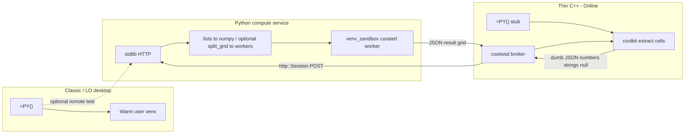

# Collabora Online and jail-safe execution

> **Status: Step A (compute service) + Step B (kit/wsd wire) + Step C (Core Calc AddIn) landed.** Step C: C++ `scaddins` **pythoncompute** AddIn (`=PY()` / `=PYTHON()`) returns `XVolatileResult` with interim **`"#BUSY!"`** (not `FormulaError::Busy`), posts dumb JSON via coolkit → coolwsd → compute service, then applies scalar / `ScMatrix` spill on `pythoncomputeresult:`. Plot/`images[]` insert and Monaco remain backlog. Classic remains the warm-venv path. ER: [CollaboraOnline/online#16010](https://github.com/CollaboraOnline/online/issues/16010).

Related architecture comparison (AI chat / kit protocol, not Python compute): [collabora-online-ai-comparison.md](collabora-online-ai-comparison.md).

## Product picture


| Product                                       | UI toolkit                                                 | Python / UNO                                                                                                                                   | Desktop `=PY()` today                                   |
| --------------------------------------------- | ---------------------------------------------------------- | ---------------------------------------------------------------------------------------------------------------------------------------------- | ------------------------------------------------------- |
| **Collabora Office Classic**                  | VCL (LibreOffice-based)                                    | Full PyUNO, extensions, macros — essentially desktop LibreOffice                                                                               | **Feasible as-is** (local warm venv)                    |
| **Collabora Online** (server)                 | Browser canvas                                             | Macros (incl. Python) off by default; admin must set `enable_macros_execution` in `coolwsd.xml`; scripts typically baked into the server image | **Blocked** — kit jail forbids spawn/shell/wide FS      |
| **Collabora Office (new desktop, Nov 2025+)** | Web UI (JS / Canvas / WebGL); same Online codebase lineage | Limited to running existing scripts; no full macro IDE or desktop extension UI                                                                 | **Same blocker as Online** — rewrite would benefit both |


Macros online were further constrained after [CVE-2025-24796](https://www.cve.org/CVERecord?id=CVE-2025-24796) (remote malicious macro execution); defaults keep execution disabled.

## Why the desktop design cannot enter the kit jail

The NumPy strategy ([§1](enabling_numpy_in_libreoffice.md#1-the-problem-abi-and-embedded-python), [§2](enabling_numpy_in_libreoffice.md#2-strategy-decision)) is deliberately a **separate interpreter**:

1. `subprocess.Popen` **of a user venv** — `[PythonWorkerManager](../plugin/scripting/venv_worker.py)` keeps a warm child talking Pickle5 over pipes ([IPC](numpy-serialization.md#worker-protocol)).
2. **Host filesystem** — resolve `scripting.python_venv_path`, put the extension tree on the child’s `sys.path`, and let trusted helpers open DBs/models.
3. **Flatpak escape** — `[wrap_command_for_sandbox](../plugin/scripting/sandbox.py)` can use `flatpak-spawn --host` so the venv runs on the real host. That is the opposite of kit isolation.
4. **Desktop editor** — Monaco via **pywebview/Qt** needs a display and a child window; Online renders in a browser canvas.
5. **Long-lived shared kernel** — optional workbook namespace inside the warm process assumes a desktop process lifecycle, not an ephemeral per-document kit.

Collabora Online’s document work runs in a **jailed** `coolkit` **/ LOKit** child. That jail is not allowed to call arbitrary external programs, use the shell, or reach the wider filesystem. The warm-venv path depends on exactly those privileges.

**Hardening the AST sandbox inside the jail does not fix this.** The sandbox in `[venv_sandbox.py](../plugin/scripting/venv/venv_sandbox.py)` is defense-in-depth for untrusted script *strings*; Online needs **OS-level isolation**, and the kit already provides it by *denying* the operations the desktop design needs for NumPy.

## Approaches that fail or are insufficient


| Approach                                         | Why it fails for Online / new desktop                                                                                                                                                |
| ------------------------------------------------ | ------------------------------------------------------------------------------------------------------------------------------------------------------------------------------------ |
| **Run the warm user-venv worker inside the kit** | Jail forbids fork/exec of arbitrary host Pythons and host venv paths; no `~/.writeragent_venv` story for multi-tenant cells.                                                         |
| `import numpy` **in LOKit’s embedded Python**    | Same [ABI crash risk](enabling_numpy_in_libreoffice.md#1-the-problem-abi-and-embedded-python) as desktop in-process; one bad wheel can take the document kit with it; still no admin-curated scientific stack story. |
| **Only enable** `enable_macros_execution`        | Unlocks Basic/Python *playback* of image-baked scripts — not spawn of a user data-science stack or desktop extension UI.                                                             |
| **Pure-Python / Wasm-only cell runtime**         | Useful for light scripting; not a substitute for NumPy/pandas/scipy C-extension stacks.                                                                                              |
| **Ship pywebview Monaco into Online**            | Desktop windowing does not map onto browser canvas; Online already has a web UI surface for an editor.                                                                               |


**Jail-safe NumPy is not “put the current worker in a smaller box.” It is: do not run the scientific interpreter in the kit at all.**

## Proposed solution: native `=PY()` via thin C++ hooks → Python compute service

Track with Collabora: [online#16010](https://github.com/CollaboraOnline/online/issues/16010). Related AI/kit split (orchestration vs document mutation): [collabora-online-ai-comparison.md](collabora-online-ai-comparison.md).

**Goal:** real Calc **`=PY()`** on Online / new desktop (same formula surface as Classic — [§6](enabling_numpy_in_libreoffice.md#6-the-py-calc-function)):

- **Small C++ hooks** in coolkit + coolwsd that call out to a Python compute service (same outbound-HTTP *shape* as AI chat’s `http::Session`).
- **All NumPy / packing / sandbox** stay in **Python** — C++ never implements [`split_grid`](numpy-serialization.md#strategy-3-split-grid-serialization-detail) or Pickle5.
- **Lightweight service** — **stdlib `http.server`** (or equivalent minimal HTTP) so coolwsd can POST JSON.



### Split of responsibility

| Layer | Language | Does | Does not |
|-------|----------|------|----------|
| Kit `=PY()` stub | C++ (small) | Register formula; on recalc read ranges via existing LOKit/cell APIs into **plain nested values**; send request up; apply returned scalar/matrix to cells | `split_grid`, Pickle, NumPy, AST sandbox |
| coolwsd | C++ (small) | Feature flag + URL config; `http::Session` POST/response routing (copy Online `AIChatSession` outbound HTTP) | Compute or dense packing logic |
| Compute service | **Python** | Parse dumb JSON → numpy/lists; optional internal [`payload_codec`](../plugin/scripting/payload_codec.py) if talking to a warm worker; run sandboxed code; return JSON result | Live inside kit jail |

**Dumb JSON** means cell values LO already exposes (float / string / empty / error string)—not LibrePy’s binary `split_grid` envelope. Dense optimization happens **inside** the Python service when bridging to workers, if at all. The kit never loads NumPy.

### Python compute service

- Live tree: [`compute_service/`](../compute_service/) (`server.py`, `executor.py`, [`json_egress.py`](../compute_service/json_egress.py)); tests under `tests/compute_service/`.
- Listen with **stdlib** `http.server` / `ThreadingHTTPServer` (no FastAPI).
- `POST /v1/execute` body: `{ "code", "data", "session_id?", "timeout_ms?", "mode?" }` → `{ "status", "result"|"error", "stdout?", "images?" }`.
- **Dumb JSON egress only** toward kit/coolwsd: ndarrays and `split_grid` become nested lists; NaN/Inf → `null`; `json.dumps(..., allow_nan=False)`. Plots go in top-level `images[]` (`format` + `data_b64`), not desktop Pickle envelopes.
- `mode`: `isolated` (default) ignores `session_id`; `shared` needs a session id and serializes executes per session with a lock.
- Reuse desktop sandbox: [`venv_sandbox`](../plugin/scripting/venv/venv_sandbox.py), import whitelist, curated Docker image (pinned numpy/pandas/**Pillow**/…).
- Prefer an **in-process executor in the service** first (fewer hops). Add Pickle5 warm workers later only if the service host needs ABI isolation.

### C++ hooks (deliberately dumb)

Live in the Collabora Online / LibreOffice trees (`collabofficefull`), not writeragent:

1. **Config:** `security.python_compute.enable` (default `false`) + `security.python_compute.url` in `coolwsd.xml.in` / `ConfigUtil.cpp`.
2. **coolwsd:** `ClientSession::handlePythonComputeFromKit` — kit `pythoncompute:` → `http::Session` POST → `pythoncomputeresult:`.
3. **kit:** `PythonComputeEmitter` installs `pythoncompute_set_emitter` after load; `handlePythonComputeResult` calls `pythoncompute_complete_json`. Test kick: `pythonexecute <json>`.
4. **Core AddIn (Step C):** [`engine/scaddins/source/pythoncompute/`](file:///home/keithcu/Desktop/collabofficefull/engine/scaddins/source/pythoncompute/) — `getPy` / `getPython`, `XVolatileResult` interim `"#BUSY!"`, Any↔dumb JSON, pending map, matrix via `sequence<sequence<…>>` → `ScUnoAddInCall::SetResult` / `#SPILL!`. No `FormulaError::Busy`.
5. **Still backlog:** plot/`images[]` Online insert, Monaco editor, Core shared-kernel session mode.

### Security invariants

1. **Compute is out-of-kit** — kit compromise ≠ host Python; Python compromise ≠ kit filesystem/network (seccomp, no capabilities, no docker.sock).
2. **Admin-baked image** — packages like Online macros today; **not** arbitrary tenant `pip` in multi-tenant Online.
3. **Per-document / per-session isolation** — no shared kernel across tenants; shared kernel only within one document session if enabled.
4. **Default deny** — no outbound network, no host mounts, scratch-only FS, hard CPU/RAM/wall-clock quotas.
5. **Separate feature flag** from `enable_macros_execution`.
6. **Import whitelist** inside the container ([`VENV_AUTHORIZED_IMPORTS`](../plugin/scripting/venv/venv_sandbox.py)) as defense-in-depth; OS isolation is the real boundary.

### Product matrix

| Product | Execution backend | Editor |
|---------|-------------------|--------|
| **Collabora Office Classic** + stock LibreOffice | **Local warm venv** (shipped) | Monaco via pywebview, or native dialog fallback |
| **Collabora Online** + **new web desktop** | **Python Compute Service** via thin coolwsd hooks | Browser Monaco / Online UI (no pywebview) |

Same `=PY(code, data…)` / `result =` semantics; different backends.

### Classic remote testing (optional)

Same HTTP API: a `RemoteComputeBackend` behind [`run_code_in_user_venv`](../plugin/scripting/venv_worker.py) can POST dumb lists (or run local pack and use the service only for execute) so the **service** can be debugged without an Online rebuild.

### Explicit non-goals for the C++ tip

- No C++ port of [`payload_codec.py`](../plugin/scripting/payload_codec.py) / `split_grid`
- No embedding user venvs or NumPy inside the kit jail
- No heavy Python web frameworks for the compute service

### Layout / build order

```
writeragent/
  compute_service/     # NEW — stdlib HTTP + sandbox + Dockerfile
  plugin/scripting/    # optional RemoteComputeBackend for Classic

collabora-online (kit/wsd)/
  kit/                 # =PY stub + dumb JSON extract/apply
  wsd/                 # feature flag + http::Session to python_compute_url
  coolwsd.xml.in       # enable_python_compute, python_compute_url
```

1. Python compute service + Dockerfile + tests against JSON grids.
2. Classic `RemoteComputeBackend` against the service (fast Python-only iteration).
3. C++ hooks: kit stub + coolwsd broker → wire works (`pythonexecute` / `pythoncompute:` / `pythoncomputeresult:`). **Done.**
4. Core `=PY()` AddIn + `#BUSY!` volatile + matrix spill. **Done** (scaddins `pythoncompute` + kit emitter). Rebuild LibreOffice (`libpythoncomputelo.so`) + Online coolkit to pick up.

Until Collabora ships images with Step C linked, **Classic** remains the product where full desktop NumPy `=PY()` works end-to-end without a Core rebuild.
