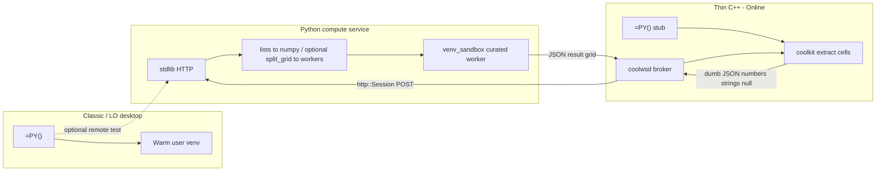

# Collabora Online and jail-safe execution

> **Status: Step A (compute service) + Step B (kit/wsd wire) + Step C (Core Calc AddIn) landed.** Step C: C++ `scaddins` **pythoncompute** AddIn (`=PY()` / `=PYTHON()`) returns `XVolatileResult` with interim **`"#BUSY!"`** (not `FormulaError::Busy`), posts dumb JSON via coolkit → coolwsd → compute service, then applies scalar / `ScMatrix` spill on `pythoncomputeresult:`. Engine CppUnit (`CppunitTest_scaddins_pythoncompute`, **12** cases) covers AddIn + JSON + emitter round-trip + unique request ids + volatile identity. **Any↔JSON now uses** [`tools::JsonWriter`](file:///home/keithcu/Desktop/collabofficefull/engine/include/tools/json_writer.hxx) + `boost::property_tree::read_json` ([details](#json-codec-lo-helpers-done)). Pre-submit ROI + **correctness** landed: atomic request ids, `pythonexecute` gate, emitter multi-view + `dlsym` retry, sibling license headers / product-neutral Core copy, [`XVolatileResult` identity](#correctness-plan-xvolatileresult-identity), [SolarMutex / UserEvent on finish](#correctness-plan-solarmutex--userevent-on-finish) — see [Pre-submit checklist](#pre-submit-checklist-core--online). Still open separately: shipped XML `enable=true`, `PY` naming, F1. Next product slices: [Future work](#future-work-prototype--hardened-online). Classic remains the warm-venv path. ER: [CollaboraOnline/online#16010](https://github.com/CollaboraOnline/online/issues/16010).

Related architecture comparison (AI chat / kit protocol, not Python compute): [collabora-online-ai-comparison.md](collabora-online-ai-comparison.md).

## Product picture


| Product                                       | UI toolkit                                                 | Python / UNO                                                                                                                                   | Desktop `=PY()` today                                   |
| --------------------------------------------- | ---------------------------------------------------------- | ---------------------------------------------------------------------------------------------------------------------------------------------- | ------------------------------------------------------- |
| **Collabora Office Classic**                  | VCL (LibreOffice-based)                                    | Full PyUNO, extensions, macros — essentially desktop LibreOffice                                                                               | **Feasible as-is** (local warm venv)                    |
| **Collabora Online** (server)                 | Browser canvas                                             | Macros (incl. Python) off by default; admin must set `enable_macros_execution` in `coolwsd.xml`; scripts typically baked into the server image | **Blocked** — kit jail forbids spawn/shell/wide FS      |
| **Collabora Office (new desktop, Nov 2025+)** | Web UI (JS / Canvas / WebGL); same Online codebase lineage | Limited to running existing scripts; no full macro IDE or desktop extension UI                                                                 | **Same blocker as Online** — rewrite would benefit both |


Macros online were further constrained after [CVE-2025-24796](https://www.cve.org/CVERecord?id=CVE-2025-24796) (remote malicious macro execution); defaults keep execution disabled.

## Why the desktop design cannot enter the kit jail

The NumPy strategy ([§1](enabling_numpy_in_libreoffice.md#1-the-problem-abi-and-embedded-python), [§2](enabling_numpy_in_libreoffice.md#2-strategy-decision)) is deliberately a **separate interpreter**:

1. `subprocess.Popen` **of a user venv** — `[PythonWorkerManager](../plugin/scripting/venv_worker.py)` keeps a warm child talking Pickle5 over pipes ([IPC](numpy-serialization.md#worker-protocol)).
2. **Host filesystem** — resolve `scripting.python_venv_path`, put the extension tree on the child’s `sys.path`, and let trusted helpers open DBs/models.
3. **Flatpak escape** — `[wrap_command_for_sandbox](../plugin/scripting/sandbox.py)` can use `flatpak-spawn --host` so the venv runs on the real host. That is the opposite of kit isolation.
4. **Desktop editor** — Monaco via **pywebview/Qt** needs a display and a child window; Online renders in a browser canvas.
5. **Long-lived shared kernel** — optional workbook namespace inside the warm process assumes a desktop process lifecycle, not an ephemeral per-document kit.

Collabora Online’s document work runs in a **jailed** `coolkit` **/ LOKit** child. That jail is not allowed to call arbitrary external programs, use the shell, or reach the wider filesystem. The warm-venv path depends on exactly those privileges.

**Hardening the AST sandbox inside the jail does not fix this.** The sandbox in `[venv_sandbox.py](../plugin/scripting/venv/venv_sandbox.py)` is defense-in-depth for untrusted script *strings*; Online needs **OS-level isolation**, and the kit already provides it by *denying* the operations the desktop design needs for NumPy.

## Approaches that fail or are insufficient


| Approach                                         | Why it fails for Online / new desktop                                                                                                                                                |
| ------------------------------------------------ | ------------------------------------------------------------------------------------------------------------------------------------------------------------------------------------ |
| **Run the warm user-venv worker inside the kit** | Jail forbids fork/exec of arbitrary host Pythons and host venv paths; no `~/.writeragent_venv` story for multi-tenant cells.                                                         |
| `import numpy` **in LOKit’s embedded Python**    | Same [ABI crash risk](enabling_numpy_in_libreoffice.md#1-the-problem-abi-and-embedded-python) as desktop in-process; one bad wheel can take the document kit with it; still no admin-curated scientific stack story. |
| **Only enable** `enable_macros_execution`        | Unlocks Basic/Python *playback* of image-baked scripts — not spawn of a user data-science stack or desktop extension UI.                                                             |
| **Pure-Python / Wasm-only cell runtime**         | Useful for light scripting; not a substitute for NumPy/pandas/scipy C-extension stacks.                                                                                              |
| **Ship pywebview Monaco into Online**            | Desktop windowing does not map onto browser canvas; Online already has a web UI surface for an editor.                                                                               |


**Jail-safe NumPy is not “put the current worker in a smaller box.” It is: do not run the scientific interpreter in the kit at all.**

## Proposed solution: native `=PY()` via thin C++ hooks → Python compute service

Track with Collabora: [online#16010](https://github.com/CollaboraOnline/online/issues/16010). Related AI/kit split (orchestration vs document mutation): [collabora-online-ai-comparison.md](collabora-online-ai-comparison.md).

**Goal:** real Calc **`=PY()`** on Online / new desktop (same formula surface as Classic — [§6](enabling_numpy_in_libreoffice.md#6-the-py-calc-function)):

- **Small C++ hooks** in coolkit + coolwsd that call out to a Python compute service (same outbound-HTTP *shape* as AI chat’s `http::Session`).
- **All NumPy / packing / sandbox** stay in **Python** — C++ never implements [`split_grid`](numpy-serialization.md#strategy-3-split-grid-serialization-detail) or Pickle5.
- **Lightweight service** — **stdlib `http.server`** (or equivalent minimal HTTP) so coolwsd can POST JSON.



### Split of responsibility

| Layer | Language | Does | Does not |
|-------|----------|------|----------|
| Kit `=PY()` stub | C++ (small) | Register formula; on recalc read ranges via existing LOKit/cell APIs into **plain nested values**; send request up; apply returned scalar/matrix to cells | `split_grid`, Pickle, NumPy, AST sandbox |
| coolwsd | C++ (small) | Feature flag + URL config; `http::Session` POST/response routing (copy Online `AIChatSession` outbound HTTP) | Compute or dense packing logic |
| Compute service | **Python** | Parse dumb JSON → numpy/lists; optional internal [`payload_codec`](../plugin/scripting/payload_codec.py) if talking to a warm worker; run sandboxed code; return JSON result | Live inside kit jail |

**Dumb JSON** means cell values LO already exposes (float / string / empty / error string)—not LibrePy’s binary `split_grid` envelope. Dense optimization happens **inside** the Python service when bridging to workers, if at all. The kit never loads NumPy.

### Python compute service

- Live tree: [`compute_service/`](../compute_service/) (`server.py`, `executor.py`, [`json_egress.py`](../compute_service/json_egress.py)); tests under `tests/compute_service/`.
- Listen with **stdlib** `http.server` / `ThreadingHTTPServer` (no FastAPI).
- `POST /v1/execute` body: `{ "code", "data", "session_id?", "timeout_ms?", "mode?" }` → `{ "status", "result"|"error", "stdout?", "images?" }`.
- **Dumb JSON egress only** toward kit/coolwsd: ndarrays and `split_grid` become nested lists; NaN/Inf → `null`; `json.dumps(..., allow_nan=False)`. Plots go in top-level `images[]` (`format` + `data_b64`), not desktop Pickle envelopes.
- `mode`: `isolated` (default) ignores `session_id`; `shared` needs a session id and serializes executes per session with a lock.
- Reuse desktop sandbox: [`venv_sandbox`](../plugin/scripting/venv/venv_sandbox.py), import whitelist, curated Docker image (pinned numpy/pandas/**Pillow**/…).
- Prefer an **in-process executor in the service** first (fewer hops). Add Pickle5 warm workers later only if the service host needs ABI isolation.

### C++ hooks (deliberately dumb)

Live in the Collabora Online / LibreOffice trees (`collabofficefull`), not writeragent:

1. **Config:** `security.python_compute.enable` (default `false`) + `security.python_compute.url` in `coolwsd.xml.in` / `ConfigUtil.cpp`.
2. **coolwsd:** `ClientSession::handlePythonComputeFromKit` — kit `pythoncompute:` → `http::Session` POST → `pythoncomputeresult:`.
3. **kit:** `PythonComputeEmitter` installs `pythoncompute_set_emitter` after load; `handlePythonComputeResult` calls `pythoncompute_complete_json`. Tracks live `ChildSession`s and reinstalls on another view when the owner clears; retries `dlsym` until both AddIn symbols resolve. Test kick: `pythonexecute <json>` (wsd-gated: writable + `security.python_compute.enable`).
4. **Core AddIn (Step C):** [`engine/scaddins/source/pythoncompute/`](file:///home/keithcu/Desktop/collabofficefull/engine/scaddins/source/pythoncompute/) — `getPy` / `getPython`, `XVolatileResult` interim `"#BUSY!"`, param→volatile identity cache, Solar/UserEvent-safe `finish`, Any↔dumb JSON, pending map, matrix via `sequence<sequence<…>>` → `ScUnoAddInCall::SetResult` / `#SPILL!`. No `FormulaError::Busy`.
5. **Future work:** see [below](#future-work-prototype--hardened-online). Monaco / browser cell editor remains a separate Online UI track (LibrePy uses pywebview; do not port that into the kit).

### Security invariants

1. **Compute is out-of-kit** — kit compromise ≠ host Python; Python compromise ≠ kit filesystem/network (seccomp, no capabilities, no docker.sock).
2. **Admin-baked image** — packages like Online macros today; **not** arbitrary tenant `pip` in multi-tenant Online.
3. **Per-document / per-session isolation** — no shared kernel across tenants; shared kernel only within one document session if enabled.
4. **Default deny** — no outbound network, no host mounts, scratch-only FS, hard CPU/RAM/wall-clock quotas.
5. **Separate feature flag** from `enable_macros_execution`.
6. **Import whitelist** inside the container ([`VENV_AUTHORIZED_IMPORTS`](../plugin/scripting/venv/venv_sandbox.py)) as defense-in-depth; OS isolation is the real boundary.

### Product matrix

| Product | Execution backend | Editor |
|---------|-------------------|--------|
| **Collabora Office Classic** + stock LibreOffice | **Local warm venv** (shipped) | Monaco via pywebview, or native dialog fallback |
| **Collabora Online** + **new web desktop** | **Python Compute Service** via thin coolwsd hooks | Browser Monaco / Online UI (no pywebview) |

Same `=PY(code, data…)` / `result =` semantics; different backends.

### Classic remote testing (optional)

Same HTTP API: a `RemoteComputeBackend` behind [`run_code_in_user_venv`](../plugin/scripting/venv_worker.py) can POST dumb lists (or run local pack and use the service only for execute) so the **service** can be debugged without an Online rebuild.

### Explicit non-goals for the C++ tip

- No C++ port of [`payload_codec.py`](../plugin/scripting/payload_codec.py) / `split_grid`
- No embedding user venvs or NumPy inside the kit jail
- No heavy Python web frameworks for the compute service

### Layout / build order

```
writeragent/
  compute_service/     # NEW — stdlib HTTP + sandbox + Dockerfile
  plugin/scripting/    # optional RemoteComputeBackend for Classic

collabora-online (kit/wsd)/
  kit/                 # =PY stub + dumb JSON extract/apply
  wsd/                 # feature flag + http::Session to python_compute_url
  coolwsd.xml.in       # enable_python_compute, python_compute_url
```

1. Python compute service + Dockerfile + tests against JSON grids.
2. Classic `RemoteComputeBackend` against the service (fast Python-only iteration).
3. C++ hooks: kit stub + coolwsd broker → wire works (`pythonexecute` / `pythoncompute:` / `pythoncomputeresult:`). **Done.**
4. Core `=PY()` AddIn + `#BUSY!` volatile + matrix spill. **Done** (scaddins `pythoncompute` + kit emitter). Rebuild LibreOffice (`libpythoncomputelo.so`) + Online coolkit to pick up.
5. Future work below — prove the jail wire in CI, smoke NumPy out-of-kit, then plots / container hardening / shared kernel.

Until Collabora ships images with Step C linked, **Classic** remains the product where full desktop NumPy `=PY()` works end-to-end without a Core rebuild.

---

## Future work (prototype → hardened Online)

Spill-shape polish and AddIn `timeout_ms` emission are **deferred**: both are fiddly Calc/`ScMatrix`/`http::Session` edge work and are not required to prove the jail model. Decimal matrix spill already "works enough" for scalar demos; nested-list quirks can land later when Online auto-spill parity with LibrePy actually matters.

Browser Monaco / Edit-Python-in-cell for Online is also **out of this list** for now (LibrePy's pywebview Monaco does not map; Online needs a canvas/JSDialog surface of its own).

### Ordered slices

| # | Slice | Primary tree | Why |
|---|-------|--------------|-----|
| F1 | UnitWSD wire CI | `collabofficefull/test/` | Proves kit↔wsd↔HTTP without waiting on Core rebuilds in CI |
| F2 | Scalar NumPy smoke | writeragent + local coolwsd | Human/demo proof NumPy never enters the kit |
| F3 | `images[]` sheet insert | Core AddIn + kit (+ maybe browser) | Service already emits plots; Online currently stubs a string |
| F4 | Compute container hardening | `compute_service/Dockerfile` + run scripts | Makes the OS boundary real for Collabora admins |
| F5 | Shared workbook kernel | AddIn + kit + service (already half-ready) | LibrePy `mode=shared` parity; tenant-safe session ids |

---

### F1 — UnitWSD wire test (`pythonexecute` → POST → `pythoncomputeresult:`)

**Goal:** CI-enforce the security claim that coolwsd is the only network hop, independent of LibreOffice AddIn mapping.

**Files (Online tree):**

- New: `test/UnitPythonCompute.cpp` (subclass `UnitWSD`, same pattern as `UnitKitChildSession` / `UnitHTTP`).
- Edit: `test/Makefile.am` — `unit_python_compute_la_SOURCES = UnitPythonCompute.cpp` + plugin registration like siblings.
- Reuse: `kit/ChildSession::requestPythonCompute` (`pythonexecute <json>`), `wsd/ClientSession::handlePythonComputeFromKit`, config knobs in `common/ConfigUtil.cpp` / `coolwsd.xml.in`.

**Stub HTTP inside the unit (do not hit writeragent in CI):**

Online units already spin `SocketPoll` and outbound `http::Session`. Mirror how LLM/WOPI tests stand up local endpoints:

1. In `configure()`, force:
   - `security.python_compute.enable` = `true`
   - `security.python_compute.url` = `http://127.0.0.1:<ephemeral>/v1/execute`
2. Bind a tiny accepting socket on that port (Poco `HTTPServer` / existing test HTTP helper if one exists for redirects). Handler must:
   - Accept `POST /v1/execute`
   - Parse JSON body; assert `code` present; echo `id`
   - Reply `200` + `{"id":"…","status":"ok","result":42}`
   - Record that a POST happened (atomic counter)
3. In `invokeWSDTest()`:
   - Load any small `.ods` via the normal unit doc helper (emitter install happens on load; for echo path, load still matters for session wiring).
   - WS send: `pythonexecute {"id":"t1","code":"result=1"}`
   - Wait (poll / callback) until client receives a frame starting with `pythoncomputeresult:`
   - `LOK_ASSERT` body JSON `result == 42` (or status/`id` match)
   - `LOK_ASSERT_EQUAL(1, postCount)`

**Negative case:** same unit (or second method) with `enable=false` — expect `pythoncomputeresult:` with `status=error` / `"Python compute is disabled"` and **zero** POSTs to the stub.

**Fallback path note:** `ChildSession::handlePythonComputeResult` echoes to the browser when `pythoncompute_complete_json` is not mapped (`dlsym` miss). That is **desirable** for F1: the unit proves broker HTTP without requiring `libpythoncomputelo.so` in the unit harness. Add a follow-up assert later once the test kit image links the AddIn (then `completeFromJson` returns 1 and the echo may stop).

**Out of scope for F1:** real NumPy, formula evaluation, `KIT_HOST_ALLOWLIST` matrix (cover with a third case only if allowlist is always-on in your install).

**Done when:** `make check` / `unittest` runs `unit_python_compute` green on a stock Online build.

---

### F2 — Scalar NumPy smoke (manual / scripted demo)

**Goal:** One command path a Collabora engineer can run that shows `import numpy` succeeding **only** in the service process.

**Procedure (local):**

1. From writeragent: `python compute_service/server.py` (or `docker build -f compute_service/Dockerfile` + run `-p 8000:8000`). Confirm `GET /health` → `{"status":"healthy"}`.
2. coolwsd config (overrides):
   ```xml
   <python_compute desc="…" enable="true">
     <url desc="…" default="http://127.0.0.1:8000/v1/execute"></url>
   </python_compute>
   ```
   Keep `security.python_compute.enable` **false** in ConfigUtil defaults; only the running `coolwsd.xml` enables it for the demo host.
3. Rebuild / install Online kit that embeds Step C (`libpythoncomputelo.so` on the kit `LD_LIBRARY_PATH` / LO foundation). Without it, `=PY()` finishes immediately with `"Python compute unavailable"`.
4. Open Calc Online, enter:
   ```text
   =PY("import numpy as np; result = float(np.sum([1,2,3]))")
   ```
   Expect interim `#BUSY!`, then `6`.
5. Process proof: `ps` / container logs show numpy import in the **service** PID, never in `coolkit`. Optionally add a temporary log line in `compute_service/executor.py` on successful `import numpy` in the sandbox namespace.

**Wire-only without formula:** browser/devtools WS:
```text
pythonexecute {"id":"smoke1","code":"import numpy as np\nresult = float(np.pi)"}
```
then watch `pythoncomputeresult:` (echo or volatile-complete).

**Keep scripts next to the service:** e.g. `compute_service/smoke_online.md` or a small shell that curls `/v1/execute` first (sanity), then prints the coolwsd XML snippet. Do not bake NumPy into Online's unit harness for F2.

**Done when:** documented smoke path works on a developer machine in <15 minutes without matrix spill expectations.

---

### F3 — Online `images[]` / plot insert

**Today:**

- Service [`json_egress.py`](../compute_service/json_egress.py) promotes viz payloads to top-level `images: [{format, data_b64}]` and may null out `result`.
- Core [`pythoncompute_anyjson.cxx`](file:///home/keithcu/Desktop/collabofficefull/engine/scaddins/source/pythoncompute/pythoncompute_anyjson.cxx) detects `"images"` + null result and finishes the volatile with the placeholder string `"Image generated (plot insert not supported yet)"`.
- Classic LibrePy inserts via [`plugin/scripting/viz.py`](../plugin/scripting/viz.py) / [`insert_image_result_on_sheet`](../plugin/calc/python/image_egress.py) on the UNO main thread — **not** available as-is inside coolkit jail policies.

**Design for Online (stay dumb in C++):**

Prefer **kit-side binary insert via existing LOK document APIs**, not reimplementing LibrePy's PyUNO insert stack.

1. **Wire extension (minimal JSON unchanged):** keep `images[]` as-is from the service. Do not base64-decode in coolwsd.
2. **After `pythoncompute_complete_json`:** when the body has non-empty `images[]`:
   - Decode PNG (v1: only `format=="png"`; reject others with cell error string).
   - Cap size (e.g. 8 MiB decoded) before alloc.
   - Insert graphic near the formula cell:
     - Prefer existing Online/kit paths used for pasted images / `.uno:InsertGraphic` equivalents already exercised by CopyPaste tests.
     - Anchor: formula cell address if available from LOKit; else active cell.
3. **Volatile result text:** if `result` is non-null, finish volatile with the numeric/string result **and** insert plots as side effect. If `result` is null/images-only, finish volatile with `""` or a short success marker — **not** leave `#BUSY!`.
4. **Where the decode lives:**
   - **Preferred:** kit (`ChildSession::handlePythonComputeResult`) after attempting `completeFromJson`, because LOKit document mutation APIs live there. Pass a side channel: either extend the AddIn ABI with `pythoncompute_take_pending_images` (ugly) **or** parse `images[]` in kit independently of the AddIn (duplicate JSON field walk — accept it; C++ tip stays free of NumPy).
   - **Avoid:** decoding megabyte base64 in coolwsd then shoving binary through kit protocol without size limits.
5. **Multi-image:** insert stacked / offset like Classic's multi-figure merge; v1 can take `images[0]` only and log a warning for the rest.
6. **Tests:**
   - Service already has compute_service image tests.
   - Add AddIn/CppUnit for "images + null result → empty/`""` not placeholder" once insert is wired (insert itself may stay UnitWSD / manual: graphic presence is painful in LOKit unit stubs).
   - UnitWSD: stub returns tiny 1×1 PNG base64; assert no hang + cell not `#BUSY!`; optional tile hash change if the unit infrastructure already supports it.

**Security:** treat `data_b64` as untrusted input from the **admin** compute service (same trust as LLM image returns). Still enforce size/format; do not execute anything in the image stream.

**Done when:** `=PY("import matplotlib.pyplot as plt; …; result = None")` with service returning `images[]` drops a PNG on the sheet in Online.

---

### F4 — Compute service container hardening

**Goal:** Make the security invariants in this doc **operational**, not aspirational. The kit jail is only half the story; a compromised compute container must not become host RCE.

**Current Dockerfile** ([`compute_service/Dockerfile`](../compute_service/Dockerfile)): `python:3.12-slim`, build-essential, pinned scientific stack, `USER appuser`, port 8000. Missing: read-only root, memory/CPU, no network egress for tenant code, no docker.sock, seccomp.

**Implement (writeragent-first):**

1. **Runtime flags (compose / k8s / systemd snippet in-repo):**
   ```bash
   docker run --read-only --tmpfs /tmp:rw,size=64m,mode=1777 \
     --memory=1g --cpus=1 --pids-limit=256 \
     --security-opt no-new-privileges \
     --cap-drop ALL \
     --network <internal-bridge-only> \
     -p 127.0.0.1:8000:8000 \
     …
   ```
   coolwsd on the host reaches `127.0.0.1:8000`; the container has **no** route to the public internet (tenant `urllib` / sockets die). If the sandbox AST already blocks many imports, network isolation is still the real boundary for C-extension sockets.
2. **Drop `build-essential` from the final image:** multi-stage build — builder installs wheels, runtime copies site-packages only (smaller attack surface; no compiler in prod).
3. **Import whitelist:** keep executing via [`run_sandboxed_code`](../plugin/scripting/venv/venv_sandbox.py) / `VENV_AUTHORIZED_IMPORTS`. Add a CI test that `import os; os.system("…")` and raw `socket` fail closed under the service executor.
4. **No docker.sock, no privileged, no host FS mounts** of tenant data. Scratch only under `/tmp`. If models/weights are needed later, bake into the image (admin curates) — never bind-mount `~/.writeragent_venv`.
5. **Auth between coolwsd and service (optional but recommended before multi-tenant):**
   - Shared secret header `Authorization: Bearer …` configured next to `security.python_compute.url` (new `security.python_compute.auth_header` or reuse URL userinfo carefully).
   - Service rejects missing/wrong token with 401; UnitWSD stub can ignore.
6. **Resource quotas already partially exist:** `timeout_ms` / `clamp_timeout_sec` in [`executor.py`](../compute_service/executor.py); add RSS watch or rely on cgroup `--memory`. Document that wall-clock alone does not stop a malloc bomb — cgroup does.
7. **Health / readiness:** keep `/health`; orchestrators use it. Do not expose `/v1/execute` without the allowlist auth once enabled.

**Docs for Collabora ops:** short "Deploy compute beside coolwsd" section (listen on localhost or private net; never expose `/v1/execute` on the public edge).

**Done when:** `docker run` snippet in-repo matches the invariants list above, and at least one test proves sandbox + (if feasible in CI) no outbound TCP from user code.

---

### F5 — Shared workbook kernel (`mode:shared` + `session_id`)

**Today:**

- Service [`execute_code`](../compute_service/executor.py) already honors `mode=="shared"` + non-empty `session_id`, with a per-id `threading.Lock`.
- Online AddIn [`buildExecuteRequestJson`](file:///home/keithcu/Desktop/collabofficefull/engine/scaddins/source/pythoncompute/pythoncompute_anyjson.cxx) **hard-codes** `"mode": "isolated"` (via `tools::JsonWriter`) and never sends `session_id` / `init_script`.
- LibrePy derives workbook ids via [`session_manager.calc_workbook_base_session_id`](../plugin/scripting/session_manager.py) and seeds init scripts from document properties.

**Online design constraints:**

- **Never** share a kernel across tenants / DocumentBrokers. `session_id` must include something unique to the doc instance coolwsd already trusts (e.g. docKey / jail id / `DocumentBroker::getDocKey()`), **not** a client-supplied string from formula text.
- Kit compromise forging `session_id` is OK only if coolwsd **overwrites** the id on the way out (wsd is the trust boundary for tenancy).

**Implementation sketch:**

1. **Config:** `security.python_compute.session_mode` = `isolated` \| `shared` (default isolated). Separate from macros. Matching LibrePy setting conceptually, but admin-global for Online v1 (per-doc UI later).
2. **coolwsd `handlePythonComputeFromKit`:** after parsing JSON, if shared mode:
   - Set `mode` to `shared`.
   - Set `session_id` to a server-derived string, e.g. `py:` + docKey (+ view id **not** included — workbook-scoped like Classic).
   - Strip any client/kit-provided `session_id` (ignore untrusted).
   - Optionally inject `init_script` once per docKey (cache flag on DocumentBroker) by reading a document property via an existing kit command if available; v1 can skip init and only share namespace across `=PY` cells.
3. **AddIn:** keep emitting isolated always **or** emit `mode` omit and let wsd decide — prefer **wsd owns mode** so a rebuilt AddIn is not required to flip admin policy.
4. **Lifecycle:**
   - On DocumentBroker destroy / last session leave: `POST /v1/session/reset` (new service endpoint) or include `reset:true` on next unused call — implement `reset` in executor by dropping sandboxed globals for that `session_id` (mirror LibrePy `reset_python_session`).
   - TTL: expire idle shared sessions in the service (dict + last-used timestamp) to bound memory.
5. **Recalc semantics:** document Online limitation — without Excel-style co-volatility, shared cells can see stale ordering unless `data` precedents are used (same advisory as LibrePy §6). Do not invent Online co-volatility in v1.
6. **Tests:**
   - Service unit: two sequential executes with same `session_id` share a name; different ids do not.
   - UnitWSD: enable shared; `pythonexecute` twice with `code` setting then reading a global; assert second sees first; second docKey does not.

**Multi-tenant footgun:** if anyone ever points two coolwsd instances at one compute service without unique docKeys globally, kernels can collide — prefix with deployment id / hostname in `session_id`.

**Done when:** admin can flip shared mode and two `=PY` cells in one Online doc share `x = 1` / `result = x + 1` without shipping LibrePy into the jail.

---

### Explicitly deferred (not proto-blocking)

| Item | Why deferred |
|------|----------------|
| Nested-list → true 2D `sequence<sequence<double>>` spill parity | Calc matrix coercion edge cases; scalars suffice for demos |
| AddIn-emitted `timeout_ms` | WSD already defaults 60s; service clamps; pending map 90s — good enough |
| Browser Monaco / cell editor | Separate Online UI project; LibrePy pywebview is Classic-only |
| C++ `split_grid` / Pickle5 | Violates the dumb-JSON tip on purpose |
| Kit-side NumPy / warm venv | Jail-incompatible by design |

---

## Pre-submit checklist (Core + Online)

Prototype is fine for demos. Treat the items below as **must-fix / must-document before opening a LibreOffice Core or Collabora Online PR**. They come from a Senior-style review of `collabofficefull` (`scaddins/source/pythoncompute`, kit emitter, coolwsd broker) vs sibling addins and AI-chat HTTP patterns.

### Verdict

- **Ready to demo / iterate.** Wire + AddIn + CppUnit exist (**12** cases: emit/complete, unique ids, volatile identity).
- **Correctness gates for identity + Solar finish: done.** Still later / separate before a Collabora-facing PR: shipped `coolwsd.xml.in` enable mismatch, `PY` naming politics, UnitWSD (F1), remaining Core nits below.

### Core / scaddins — blocking

| Issue | Where | Status |
|-------|--------|--------|
| **Request id collisions** | [`pythoncompute_bridge.cxx`](file:///home/keithcu/Desktop/collabofficefull/engine/scaddins/source/pythoncompute/pythoncompute_bridge.cxx) | **Done** — atomic `py-<n>` counter; displaced pending gets `finish("…superseded")`; CppUnit `test_requestIdsUnique` (distinct codes for new emits; same args share one volatile via identity cache) |
| **`XVolatileResult` identity** | `offapi` AddIn.idl: same args → same volatile object | **Done** — see [plan / landing notes](#correctness-plan-xvolatileresult-identity) |
| **Kit C ABI in Core AddIn** | [`pythoncompute_bridge.h`](file:///home/keithcu/Desktop/collabofficefull/engine/scaddins/source/pythoncompute/pythoncompute_bridge.h) `pythoncompute_set_emitter` / `complete_json` | **Partly done** — kit retries `dlsym` + multi-view emitter ownership (see Online rows). Still open: document stability for reviewers; consider LOK injection vs `RTLD_DEFAULT`; Calc error vs string when emitter missing on desktop |
| **License headers** | scaddins `pythoncompute` sources | **Done** — sibling-style Collabora Office + full MPL + ASF notice |
| **Async → SolarMutex** | `finish` → listeners → `ScAddInListener::modified` takes SolarMutex | **Done** — see [plan / landing notes](#correctness-plan-solarmutex--userevent-on-finish) |
| **Display name `PY`** | Excel Python `PY` collision politics | **Open** — release-note / IDL comment; conscious compatibility choice |

#### Correctness plan: `XVolatileResult` identity

**Status: Done** (v1 with documented limitations). CppUnit `test_volatileIdentitySameArgs`; `pythoncompute_reset_for_tests` for test isolation.

**Contract:** [`AddIn.idl`](file:///home/keithcu/Desktop/collabofficefull/engine/offapi/com/sun/star/sheet/AddIn.idl) — an `XVolatileResult` return must implement VolatileResult; **subsequent calls with the same parameters must return the same object**.

**How Calc uses identity:** Calc does **not** key by parameters. [`ScAddInListener::Get`](file:///home/keithcu/Desktop/collabofficefull/engine/sc/source/core/tool/addinlis.cxx) compares UNO pointers (`xVR.get() == listener->xVolRes.get()`). On AddIn eval ([`interpr4.cxx`](file:///home/keithcu/Desktop/collabofficefull/engine/sc/source/core/tool/interpr4.cxx)), volatile cells get `ScRecalcMode::ONLOAD_LENIENT` — load/recalc calls `getPy` again. Hit → reuse listener + cached `aResult`. Miss → `CreateListener`, `addResultListener`, immediate interim paint.

**Was wrong:** [`startCompute`](file:///home/keithcu/Desktop/collabofficefull/engine/scaddins/source/pythoncompute/pythoncompute_bridge.cxx) always `new`’d a volatile → new listeners, re-emit storms, leaks.

**Landed:**

1. Param→volatile cache in `startCompute` under `g_aMutex`: `paramKey → rtl::Reference<PythonComputeVolatileResult>`.
2. Cache key = `buildExecuteRequestJson("_", code, data)` (stable any→JSON; excludes real request id).
3. Hit → same ref; no allocate / id / pending / emit.
4. Miss → allocate `#BUSY!`, insert cache, then pending-by-request-id + emit.
5. `g_aPending` still keyed by request id for `pythoncompute_complete_json`.
6. Tests: same args → same pointer + no second emit; different data → different object; `test_requestIdsUnique` uses distinct codes.
7. README documents “reuse last result,” not “re-run Python every recalc.”

**Documented limitations (accepted for v1):**

| Limitation | Note |
|------------|------|
| No formula-delete eviction | Calc does not notify AddIn when a formula cell dies; finished cache entries can linger until process teardown |
| Sticky finished values | Success, error, and timeout stay until parameters change (no silent refresh) |
| Key fidelity | Float / empty / nested `Any` must match JSON codec stability or equal sheets may miss/hit wrongly |
| Arg change | Old keyed object may keep an `ScAddInListener` until doc cleanup; do **not** dual-update old keys |
| Intentional recompute | Same params never re-emit unless a later API (version bump / clear key) is added — out of v1 |

#### Correctness plan: SolarMutex / UserEvent on finish

**Status: Done** (ownership gate + `PostUserEvent`). Library links `vcl` + `comphelper`.

**Why:** [`ScAddInListener::modified`](file:///home/keithcu/Desktop/collabofficefull/engine/sc/source/core/tool/addinlis.cxx) takes `SolarMutexGuard` and broadcasts / `TrackFormulas`. TODO: *“or generate a UserEvent”*.

**Online thread reality:** `pythoncomputeresult:` arrives on kit Unipoll with Solar often **released** ([`SolarMutexReleaser` in `svpinst.cxx`](file:///home/keithcu/Desktop/collabofficefull/engine/vcl/headless/svpinst.cxx)).

**Was fragile:** [`finish`](file:///home/keithcu/Desktop/collabofficefull/engine/scaddins/source/pythoncompute/pythoncompute_volatile.cxx) notified listeners inline with no Solar/UserEvent story.

**Landed:**

1. `finish` sets `m_bFinished` + stashes value under mutex.
2. If `Application::GetSolarMutex().IsCurrentThread()` → `notifyListeners` sync (formula-eval / CppUnit).
3. Else → `acquire` + `Application::PostUserEvent(LINK(…, DoNotifyListeners))`; handler takes `SolarMutexGuard`, notifies, `release`. Fallback if post fails: notify under `SolarMutexGuard`.
4. No global `ScAddInListener` change.
5. README documents why UserEvent exists.

**Documented limitations (accepted for v1):**

| Limitation | Note |
|------------|------|
| Online may have “worked” before | `modified`’s own guard often saved demos; posting is for reentrancy / off-thread completeness |
| Ownership gate | Always-posting would defer `#BUSY!` during formula eval — gate avoids that |
| Wakeup | Relies on Unipoll already woken by `pythoncomputeresult:` |
| No change to Calc TODO | AddIn-local post matches TODO intent without Core listener rewrite |

**Done (no longer blocking):** hand-rolled JSON and locale-`strtod` — replaced; see [JSON codec](#json-codec-lo-helpers-done). Request ids, license headers, softened Core copy, volatile identity, and Solar/UserEvent finish also landed.

**Also fix before claiming Core-ready (strong nits):**

- Pending **90s timeout** only runs when another start/complete happens — idle docs never expire (`expireStale_NoLock`).
- ~~Online-only strings / Online-centric README~~ — **done** (product-neutral plot placeholder + [`README.md`](file:///home/keithcu/Desktop/collabofficefull/engine/scaddins/source/pythoncompute/README.md)); still open: hard-coded en-US help (no `.hrc` / `Translate::` like date/analysis).
- IDL comment vs runtime (always returns volatile Any, not error string).
- `SAL_DLLPUBLIC_EXPORT` on C++ anyjson helpers was for CppUnit linkage — unusual; prefer test link of objects or keep C ABI only exported.
- ~~`utl` / `i18nlangtag` unused~~ — **done** (dropped); library now links `tl` + `vcl` + `comphelper` + `boost_headers`.

### Collabora Online — blocking

| Issue | Where | Status |
|-------|--------|--------|
| **Shipped config enables feature** | [`coolwsd.xml.in`](file:///home/keithcu/Desktop/collabofficefull/coolwsd.xml.in) `<enable>true</enable>` while `default="false"` and [`ConfigUtil.cpp`](file:///home/keithcu/Desktop/collabofficefull/common/ConfigUtil.cpp) deny | **Open** — set element value to `false` (DefAppConfig / XML attr / element must agree) |
| **Process-wide emitter** | [`PythonComputeEmitter.cpp`](file:///home/keithcu/Desktop/collabofficefull/kit/PythonComputeEmitter.cpp) | **Done** — tracks live `ChildSession`s; on owner clear, reinstalls thunk on another remaining view; clears AddIn emitter only when none remain |
| **Ungated `pythonexecute`** | [`ClientSession.cpp`](file:///home/keithcu/Desktop/collabofficefull/wsd/ClientSession.cpp) | **Done** — requires `isWritable()` + `security.python_compute.enable`; else `kind=readonly` / `kind=disabled` (AddIn-driven `pythoncompute:` path unchanged) |
| **One-shot `dlsym`** | same emitter | **Done** — retries until both `pythoncompute_set_emitter` and `pythoncompute_complete_json` resolve (late `libpythoncomputelo.so` load OK) |

**Online nits / follow-ups:** unbounded JSON body size; no service auth header (AI chat has Bearer); MOBILEAPP/qt/wasm may forward `pythoncompute:` to browser; align kit `EmitFn` `int` vs Core `sal_Int32`; no `UnitPythonCompute` yet (F1).

### What already looks good

- Gbuild/InternalUnoApi/Repository/`ucalc_setup` wiring; `Sca*` naming; `WeakImplHelper` + component registration.
- Empty code → `IllegalArgumentException`; VARARGS `data`; emitter-missing finish message.
- Coolwsd HTTP broker shape (admin URL, host allowlist when configured, no NumPy in C++) mirrors AI chat.
- `CppunitTest_scaddins_pythoncompute` covers AddIn + emit/complete + unique request ids + volatile identity (**12** cases).
- Any↔JSON via Core `tools::JsonWriter` + `boost::property_tree::read_json` (not a private mini-parser).
- Kit emitter lifecycle + `dlsym` retry; wsd gates browser `pythonexecute`; atomic request ids; sibling MPL/ASF headers.
- Param→volatile AddIn.idl identity; Solar-owned sync finish / `PostUserEvent` otherwise.

### Remaining highest-ROI before any PR

**Correctness / ROI already landed:**

1. ~~Unique request ids + don’t orphan pending volatiles.~~ **Done.**
2. ~~Gate `pythonexecute`.~~ **Done.**
3. ~~Emitter ownership + retry `dlsym`.~~ **Done.**
4. ~~License headers + soften Online-only Core copy.~~ **Done.**
5. ~~`XVolatileResult` identity.~~ **Done.**
6. ~~SolarMutex / UserEvent on finish.~~ **Done.**

**Still open / can wait:**

7. `coolwsd.xml.in` enable → `false` (still recommended for shipped defaults; skipped in recent pass).
8. `PY` naming note / release-note.
9. UnitWSD wire test (F1) and other [Future work](#future-work-prototype--hardened-online).

---

## JSON codec (LO helpers) — done

Hand-rolled escapes / `strtod` / substring `"id"` extracts in [`pythoncompute_anyjson.cxx`](file:///home/keithcu/Desktop/collabofficefull/engine/scaddins/source/pythoncompute/pythoncompute_anyjson.cxx) are **gone**. The AddIn now follows the usual Core split:

| Direction | API | Role |
|-----------|-----|------|
| **Emit** | [`tools::JsonWriter`](file:///home/keithcu/Desktop/collabofficefull/engine/include/tools/json_writer.hxx) | `buildExecuteRequestJson`, nested `data`, `anyToJsonFragment` (wraps as `{"_": VALUE}` then strips). NaN/`Inf` → `null`. Link **`tl`**. |
| **Parse** | `boost::property_tree::read_json` → `ptree` | `jsonResultToAny`, `extractRequestIdFromJson` (used by `pythoncompute_complete_json`). Numbers via `rtl::math::stringToDouble` (locale-safe `.`). External **`boost_headers`**. |
| **Online only** | `Poco::JSON` / [`JsonUtil`](file:///home/keithcu/Desktop/collabofficefull/common/JsonUtil.hpp) | Still coolwsd’s job in `handlePythonComputeFromKit` — not pulled into scaddins. |

**Build:** [`Library_pythoncompute.mk`](file:///home/keithcu/Desktop/collabofficefull/engine/scaddins/Library_pythoncompute.mk) uses `tl` + `vcl` + `comphelper` + external `boost_headers`.

**Tests:** [`CppunitTest_scaddins_pythoncompute`](file:///home/keithcu/Desktop/collabofficefull/engine/scaddins/qa/pythoncompute.cxx) updated for JsonWriter spacing (`[ 1, 2]`, `"mode": "isolated"`).

**Still not using (correctly):** `comphelper::JsonToPropertyValues` — that maps JSON → UNO `PropertyValue[]`, not Calc cell `Any` trees.

**Follow-ups when spill work resumes:** nested-list → true 2D `sequence<sequence<double>>` promotion order; optional drop of the `{"_":…}` fragment wrap if a bare-value JsonWriter path appears.

