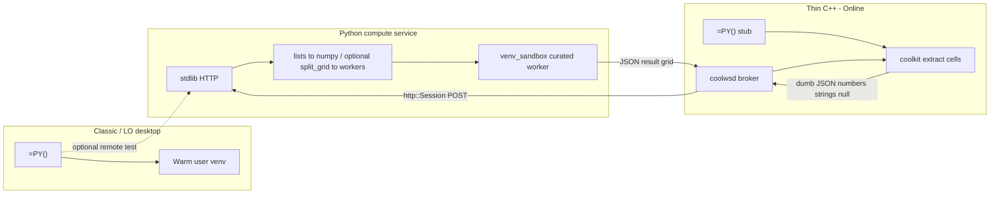

# Collabora Online and jail-safe execution

> **Status: Step A (compute service) + Step B (kit/wsd wire) + Step C (Core Calc AddIn) landed.** Correctness/lifecycle/platform blockers from the 2026-07 review (ranges, typed JSON parse, `pythonexecute` ids, unlock-before-finish, early emitter, Solar/weak lifetimes, kit emit marshal, multi-view/MOBILEAPP) are addressed in tree. **G6a (active pending timeout) landed** — AddIn one-shot `vcl::Timer` clears `#BUSY!` without recalc. **G6c (AddIn.idl identity) landed** — param cache now holds weak refs and never evicts live entries. Still open before Gerrit: request caps, service isolation, UnitWSD CI, commit series — see [Still open before Gerrit](#still-open-before-gerrit). Product follow-ups (not coded): **visible short Python errors ([F6](#f6--visible-short-python-errors))**, **single-cell auto-spill ([F7](#f7--single-cell-auto-spill))** — design notes under [cell markers](#cell-markers--diagnosis-busy-disabled-value) / [matrix spill](#matrix-list-results--auto-spill-not-yet). Product slices: [Future work](#future-work-prototype--hardened-online). Classic remains the warm-venv path. ER: [CollaboraOnline/online#16010](https://github.com/CollaboraOnline/online/issues/16010).

Related architecture comparison (AI chat / kit protocol, not Python compute): [collabora-online-ai-comparison.md](collabora-online-ai-comparison.md).

## Product picture


| Product                                       | UI toolkit                                                 | Python / UNO                                                                                                                                   | Desktop `=PY()` today                                   |
| --------------------------------------------- | ---------------------------------------------------------- | ---------------------------------------------------------------------------------------------------------------------------------------------- | ------------------------------------------------------- |
| **Collabora Office Classic**                  | VCL (LibreOffice-based)                                    | Full PyUNO, extensions, macros — essentially desktop LibreOffice                                                                               | **Feasible as-is** (local warm venv)                    |
| **Collabora Online** (server)                 | Browser canvas                                             | Macros (incl. Python) off by default; admin must set `enable_macros_execution` in `coolwsd.xml`; scripts typically baked into the server image | **Blocked** — kit jail forbids spawn/shell/wide FS      |
| **Collabora Office (new desktop, Nov 2025+)** | Web UI (JS / Canvas / WebGL); same Online codebase lineage | Limited to running existing scripts; no full macro IDE or desktop extension UI                                                                 | **Same blocker as Online** — rewrite would benefit both |


Macros online were further constrained after [CVE-2025-24796](https://www.cve.org/CVERecord?id=CVE-2025-24796) (remote malicious macro execution); defaults keep execution disabled.

## Why the desktop design cannot enter the kit jail

The NumPy strategy ([§1](enabling_numpy_in_libreoffice.md#1-the-problem-abi-and-embedded-python), [§2](enabling_numpy_in_libreoffice.md#2-strategy-decision)) is deliberately a **separate interpreter**:

1. `subprocess.Popen` **of a user venv** — `[PythonWorkerManager](../plugin/scripting/venv_worker.py)` keeps a warm child talking Pickle5 over pipes ([IPC](numpy-serialization.md#worker-protocol)).
2. **Host filesystem** — resolve `scripting.python_venv_path`, put the extension tree on the child’s `sys.path`, and let trusted helpers open DBs/models.
3. **Flatpak escape** — `[wrap_command_for_sandbox](../plugin/scripting/sandbox.py)` can use `flatpak-spawn --host` so the venv runs on the real host. That is the opposite of kit isolation.
4. **Desktop editor** — Monaco via **pywebview/Qt** needs a display and a child window; Online renders in a browser canvas.
5. **Long-lived shared kernel** — optional workbook namespace inside the warm process assumes a desktop process lifecycle, not an ephemeral per-document kit.

Collabora Online’s document work runs in a **jailed** `coolkit` **/ LOKit** child. That jail is not allowed to call arbitrary external programs, use the shell, or reach the wider filesystem. The warm-venv path depends on exactly those privileges.

**Hardening the AST sandbox inside the jail does not fix this.** The sandbox in `[venv_sandbox.py](../plugin/scripting/venv/venv_sandbox.py)` is defense-in-depth for untrusted script *strings*; Online needs **OS-level isolation**, and the kit already provides it by *denying* the operations the desktop design needs for NumPy.

## Approaches that fail or are insufficient


| Approach                                         | Why it fails for Online / new desktop                                                                                                                                                |
| ------------------------------------------------ | ------------------------------------------------------------------------------------------------------------------------------------------------------------------------------------ |
| **Run the warm user-venv worker inside the kit** | Jail forbids fork/exec of arbitrary host Pythons and host venv paths; no `~/.writeragent_venv` story for multi-tenant cells.                                                         |
| `import numpy` **in LOKit’s embedded Python**    | Same [ABI crash risk](enabling_numpy_in_libreoffice.md#1-the-problem-abi-and-embedded-python) as desktop in-process; one bad wheel can take the document kit with it; still no admin-curated scientific stack story. |
| **Only enable** `enable_macros_execution`        | Unlocks Basic/Python *playback* of image-baked scripts — not spawn of a user data-science stack or desktop extension UI.                                                             |
| **Pure-Python / Wasm-only cell runtime**         | Useful for light scripting; not a substitute for NumPy/pandas/scipy C-extension stacks.                                                                                              |
| **Ship pywebview Monaco into Online**            | Desktop windowing does not map onto browser canvas; Online already has a web UI surface for an editor.                                                                               |


**Jail-safe NumPy is not “put the current worker in a smaller box.” It is: do not run the scientific interpreter in the kit at all.**

## Proposed solution: native `=PY()` via thin C++ hooks → Python compute service

Track with Collabora: [online#16010](https://github.com/CollaboraOnline/online/issues/16010). Related AI/kit split (orchestration vs document mutation): [collabora-online-ai-comparison.md](collabora-online-ai-comparison.md).

**Goal:** real Calc **`=PY()`** on Online / new desktop (same formula surface as Classic — [§6](enabling_numpy_in_libreoffice.md#6-the-py-calc-function)):

- **Small C++ hooks** in coolkit + coolwsd that call out to a Python compute service (same outbound-HTTP *shape* as AI chat’s `http::Session`).
- **All NumPy / packing / sandbox** stay in **Python** — C++ never implements [`split_grid`](numpy-serialization.md#strategy-3-split-grid-serialization-detail) or Pickle5.
- **Lightweight service** — **stdlib `http.server`** (or equivalent minimal HTTP) so coolwsd can POST JSON.

### Excel `xl()` compatibility is handled before execution

The Online bridge deliberately accepts the native, explicit-data surface `=PY(code, data…)`; it does not implement Microsoft's runtime `xl()` callback. Excel Python workbooks can instead pass through the bidirectional rewriter in [`plugin/calc/excel_py_convert/`](../plugin/calc/excel_py_convert/) (CLI and **auto-convert on open** — see [ms-py §5.8](ms-py-libreoffice-compatibility.md#58-ooxml--xlfnpy-import)):

```text
pythonScripts.xml:  df = xl(%P2%, headers=True)
worksheet cell:     _xlws.PY(0, 1, A1:C100)

rewritten code:     df = pd.DataFrame(data[1:], columns=data[0])
Calc formula:       =PY("..."; A1:C100)
```

This is important for both correctness and the jail boundary:

1. `A1:C100` becomes a real Calc formula precedent, so normal dirty tracking and DAG order still work.
2. coolkit extracts that already-declared range once and includes it in the request; Python does not synchronously call back through service → wsd → kit for each `xl()` invocation.
3. The compute service remains document-blind: it receives code and plain values, not a capability for arbitrary live worksheet reads.

Excel scripts that share globals across multiple PY cells need two separate guarantees. The rewriter adds the representative prior PY stage as an ordering-only formula argument, making Calc schedule the stages as a DAG chain instead of using Excel co-volatility. The Online compute service must also run those cells in **shared** mode for the same document/session so the prior stage's Python names persist. DAG order without a shared namespace orders the calls but cannot preserve variables; a shared namespace without DAG edges does not guarantee which stage runs first.

The rewriter handles formula-static references: fixed ranges, scalar cells, sheet-qualified table `[#All]` references, and `ANCHORARRAY`/spill anchors (the latter two become fixed A1 snapshots from workbook metadata). It **fails closed** on computed Python references such as `xl(f"A1:A{n}")` or `xl(name)`, and on missing table/anchor snapshots, rather than emitting shifted `data[i]` formulas.



### Split of responsibility

| Layer | Language | Does | Does not |
|-------|----------|------|----------|
| Kit `=PY()` stub | C++ (small) | Register formula; on recalc read ranges via existing LOKit/cell APIs into **plain nested values**; send request up; apply returned scalar/matrix to cells | `split_grid`, Pickle, NumPy, AST sandbox |
| coolwsd | C++ (small) | Feature flag + URL config; `http::Session` POST/response routing (copy Online `AIChatSession` outbound HTTP) | Compute or dense packing logic |
| Compute service | **Python** | Parse dumb JSON → numpy/lists; optional internal [`payload_codec`](../plugin/scripting/payload_codec.py) if talking to a warm worker; run sandboxed code; return JSON result | Live inside kit jail |

**Dumb JSON** means cell values LO already exposes (float / string / empty / error string)—not LibrePy’s binary `split_grid` envelope. Dense optimization happens **inside** the Python service when bridging to workers, if at all. The kit never loads NumPy.

### Python compute service

- Live tree: [`compute_service/`](../compute_service/) (`server.py`, `executor.py`, [`json_egress.py`](../compute_service/json_egress.py)); tests under `tests/compute_service/`.
- Listen with **stdlib** `http.server` / `ThreadingHTTPServer` (no FastAPI).
- `POST /v1/execute` body: `{ "code", "data", "session_id?", "timeout_ms?", "mode?" }` → `{ "status", "result"|"error", "stdout?", "images?" }`.
- **Dumb JSON egress only** toward kit/coolwsd: ndarrays and `split_grid` become nested lists; NaN/Inf → `null`; `json.dumps(..., allow_nan=False)`. Plots go in top-level `images[]` (`format` + `data_b64`), not desktop Pickle envelopes.
- `mode`: `isolated` (default) ignores `session_id`; `shared` needs a session id and serializes executes per session with a lock.
- Reuse desktop sandbox: [`venv_sandbox`](../plugin/scripting/venv/venv_sandbox.py), import whitelist, curated Docker image (pinned numpy/pandas/**Pillow**/…).
- Prefer an **in-process executor in the service** first (fewer hops). Add Pickle5 warm workers later only if the service host needs ABI isolation.

### C++ hooks (deliberately dumb)

Live in the Collabora Online / LibreOffice trees (`collabofficefull`), not writeragent:

1. **Config:** `security.python_compute.enable` (default `false`), `url`, optional `api_key` (Bearer), `timeout_secs` in `coolwsd.xml.in` / `ConfigUtil.cpp`. No HTTP retries (formula POST is not idempotent).
2. **coolwsd:** `ClientSession::handlePythonComputeFromKit` — kit `pythoncompute:` → `http::Session` POST → `pythoncomputeresult:`.
3. **kit:** `PythonComputeEmitter` — spreadsheet-only install; one stable egress owner among live views (no last-wins steal); MOBILEAPP no-op; `handlePythonComputeResult` → `pythoncompute_complete_json` (no product browser echo). Retries `dlsym` until AddIn symbols resolve. Debug kick: `pythonexecute` (`ENABLE_DEBUG` only; rejects `py-*` ids).
4. **Core AddIn (Step C):** [`engine/scaddins/source/pythoncompute/`](file:///home/keithcu/Desktop/collabofficefull/engine/scaddins/source/pythoncompute/) — UNO `org.collaboraoffice.sheet.addin.PythonComputeFunctions`, C++ ns `collaboraoffice::pythoncompute`, `getPy` / `getPython`, `XVolatileResult` interim `"#BUSY!"`, param→volatile weak-ref identity map, `finish` under `SolarMutexGuard`, Any↔dumb JSON (see [JSON note](#anyjson-dumb-json-note)), pending map + timer. List/grid results → `sequence<sequence<…>>` → Core `ScMatrix` (see [matrix / spill](#matrix-list-results--auto-spill-not-yet)). No `FormulaError::Busy`.
5. **Future work:** see [below](#future-work-prototype--hardened-online). Monaco / browser cell editor remains a separate Online UI track (LibrePy uses pywebview; do not port that into the kit).

#### Cell markers / diagnosis (`#BUSY!`, `#DISABLED`, `#VALUE!`)

Volatile / finish values are **not** new Core `FormulaError` enum entries (Excel/Calc’s set stays fixed). Two existing Calc conventions coexist:

1. **True formula errors** — `CreateDoubleError` / void Any → cell `#VALUE!` / `#N/A`; Online `!` help + status bar show only fixed `GetLongErrorString` (e.g. “Error: No value”). Keeps `ISERROR` / `IFERROR`. **There is no free-form message field on `FormulaError`.**
2. **String markers** — plain `OUString` in the cell (same family as interim busy). Readable text, but **not** a formula error (`ISERROR` is false).

**Today (landed):**

| Cell shows | Kind | Meaning | Where |
|------------|------|---------|--------|
| `#BUSY!` | string | Request in flight | AddIn before `complete_json` |
| `#DISABLED` | string | Feature flag off | exact coolwsd error `"Python compute is disabled"` → literal in `jsonResultToAny` |
| `#VALUE!` | `FormulaError::NoValue` | Most `status=error`, bad JSON, missing `result` | opaque — **Python exception text is log-only** |
| `#N/A` | `FormulaError::NotAvailable` (void Any) | No emitter, pending timeout, superseded | Bridge lifecycle |

Service JSON `"error"` is parsed into `rError` and logged (`complete_json: detail=[…]`) then **discarded for the cell**. That is why a SyntaxError looks like every other `#VALUE!`.

**If `=PY()` shows `#DISABLED`:** turn on the flag in the **running** `coolwsd.xml` (or `--o:security.python_compute.enable=true`), restart coolwsd, and **reload the document** — the param→volatile cache can stick the finished disabled result until params change or the kit is fresh. Keep `coolwsd.xml.in` / ConfigUtil defaults **`false`** for git/upstream; local `coolwsd.xml` is the demo override.

Logs: coolwsd → `/tmp/coolwsd.log` (`Python compute: …`); Core AddIn → `export SAL_LOG=+INFO.scaddins.pythoncompute` or `+WARN.scaddins.pythoncompute` before starting coolwsd.

##### Planned: visible short Python errors (not implemented yet)

Authors need to **see** the Python failure cause without inventing a new Core error channel. Pure FormulaError-only cannot carry `SyntaxError: …` into the sheet or Online help (`GetLongErrorString` is fixed per code).

**Agreed direction (implement later in Core AddIn `jsonResultToAny` / bridge):**

| Cause | Cell | `ISERROR` | Notes |
|-------|------|-----------|--------|
| No emitter, pending timeout, superseded | `#N/A` | yes | keep |
| coolwsd infra: timeout / network / empty URL / allowlist | `#N/A` | yes | classify known `replyError` prefixes (today many of these still collapse to `#VALUE!`) |
| `"Python compute is disabled"` | `#DISABLED` | no | keep |
| Service `status=error` with a message (Python exception text, etc.) | **short string** | no | reuse `#DISABLED`-style escape hatch; first line / truncate ~200–256 chars; **no full traceback in the cell** |
| Bad JSON / missing `result` / empty error | `#VALUE!` | yes | no useful message |
| Empty `code` | `Err:502` | yes | already `IllegalArgumentException` |

Full detail (including truncated-away remainder) stays in `SAL_WARN`. Do **not** add new `FormulaError` enum values or custom Online `errorDescription` protocol for v1 of this fix. Track as [F6](#f6--visible-short-python-errors).

#### Matrix / list results / auto-spill (not yet)

JSON lists already convert to `sequence<sequence<double|Any>>` → `ScUnoAddInCall::SetResult` builds `ScMatrix` → interpreter `PushMatrix`. That path is real.

**Single-cell `=PY(...)` does not auto-spill.** If the formula was not entered as a matrix / dynamic-array formula, Core keeps **only the top-left** value and drops the rest:

```text
// engine/sc/source/core/data/formulacell.cxx (~2501–2508)
// If the formula wasn't entered as a matrix formula, live on with
// the upper left corner and let reference counting delete the matrix.
```

`=PY` is also not a Core “matrix function” for UI auto-dynamic-array promotion (`rpnIntendsArrayResult`), so typing `=PY("result = [1,2,3]")` + Enter yields **`1`**, not a spill of three cells and not `#VALUE!`.

| Case | Online AddIn today | LibrePy Classic |
|------|--------------------|-----------------|
| Single-cell → list/2D | Top-left only | `scripting.python_auto_spill` writes neighbors + `#SPILL!` |
| Ctrl+Shift+Enter matrix block | Full `ScMatrix` into declared range | matrix / index / spill paths |

**Future (do not forget — comments/README in tree when touching anyjson):** single-cell auto-spill for Online AddIn `PY` (LibrePy-style UNO write-back, or Core dynamic-array promotion for this AddIn). Not required for Gerrit of the thin tip. Track as [F7](#f7--single-cell-auto-spill). See also Classic docs [Dynamic auto-spill](enabling_numpy_in_libreoffice.md#dynamic-auto-spill).

### Security invariants

1. **Compute is out-of-kit** — kit compromise ≠ host Python; Python compromise ≠ kit filesystem/network (seccomp, no capabilities, no docker.sock).
2. **Admin-baked image** — packages like Online macros today; **not** arbitrary tenant `pip` in multi-tenant Online.
3. **Per-document / per-session isolation** — no shared kernel across tenants; shared kernel only within one document session if enabled.
4. **Default deny** — no outbound network, no host mounts, scratch-only FS, hard CPU/RAM/wall-clock quotas.
5. **Separate feature flag** from `enable_macros_execution`.
6. **Import whitelist** inside the container ([`VENV_AUTHORIZED_IMPORTS`](../plugin/scripting/venv/venv_sandbox.py)) as defense-in-depth; OS isolation is the real boundary.

### Product matrix

| Product | Execution backend | Editor |
|---------|-------------------|--------|
| **Collabora Office Classic** + stock LibreOffice | **Local warm venv** (shipped) | Monaco via pywebview, or native dialog fallback |
| **Collabora Online** + **new web desktop** | **Python Compute Service** via thin coolwsd hooks | Browser Monaco / Online UI (no pywebview) |

Same `=PY(code, data…)` / `result =` semantics; different backends.

### Classic remote testing (optional)

Same HTTP API: a `RemoteComputeBackend` behind [`run_code_in_user_venv`](../plugin/scripting/venv_worker.py) can POST dumb lists (or run local pack and use the service only for execute) so the **service** can be debugged without an Online rebuild.

### Explicit non-goals for the C++ tip

- No C++ port of [`payload_codec.py`](../plugin/scripting/payload_codec.py) / `split_grid`
- No embedding user venvs or NumPy inside the kit jail
- No heavy Python web frameworks for the compute service

### Layout / build order

```
writeragent/
  compute_service/     # NEW — stdlib HTTP + sandbox + Dockerfile
  plugin/scripting/    # optional RemoteComputeBackend for Classic

collabora-online (kit/wsd)/
  kit/                 # =PY stub + dumb JSON extract/apply
  wsd/                 # feature flag + http::Session to python_compute_url
  coolwsd.xml.in       # enable_python_compute, python_compute_url
```

1. Python compute service + Dockerfile + tests against JSON grids.
2. Classic `RemoteComputeBackend` against the service (fast Python-only iteration).
3. C++ hooks: kit stub + coolwsd broker → wire works (`pythoncompute:` / `pythoncomputeresult:`; debug `pythonexecute`). **Landed in tree** — remaining submit gaps in [Still open before Gerrit](#still-open-before-gerrit).
4. Core `=PY()` AddIn + `#BUSY!` volatile + list→`ScMatrix` (single-cell = top-left only). **Landed in tree** (scaddins `pythoncompute` + kit emitter). Rebuild LibreOffice (`libpythoncomputelo.so`) + Online coolkit to pick up.
5. Future work below — UnitWSD CI, NumPy smoke, plots / container hardening / shared kernel, **visible short Python errors (F6)**, **auto-spill (F7)**. Caps / isolation / series still outrank F3–F5 for Collabora review.

Until Collabora ships images with Step C linked **and** the remaining open items below are acceptable for an experimental merge, **Classic** remains the product where full desktop NumPy `=PY()` works end-to-end without a Core rebuild.

---

## Future work (prototype → hardened Online)

AddIn `timeout_ms` emission is **deferred** (wsd defaults 60s; service clamps; pending map 90s). Browser Monaco / Edit-Python-in-cell for Online is **out of this list** (LibrePy pywebview is Classic-only).

### Ordered slices

| # | Slice | Primary tree | Why |
|---|-------|--------------|-----|
| F1 | UnitWSD wire CI | `collabofficefull/test/` | Proves kit↔wsd↔HTTP without waiting on Core rebuilds in CI |
| F2 | Scalar NumPy smoke | writeragent + local coolwsd | Human/demo proof NumPy never enters the kit |
| F3 | `images[]` sheet insert | Core AddIn + kit (+ maybe browser) | Service already emits plots; Online currently stubs a string |
| F4 | Compute container hardening | `compute_service/Dockerfile` + run scripts | Makes the OS boundary real for Collabora admins |
| F5 | Shared workbook kernel | AddIn + kit + service (already half-ready) | LibrePy `mode=shared` parity; tenant-safe session ids |
| F6 | Visible short Python errors | Core `jsonResultToAny` / bridge | Authors can see exception message in-cell (not opaque `#VALUE!`) |
| F7 | Single-cell auto-spill | Core AddIn (+ maybe Calc) | List/2D from single-cell `=PY` fills neighbors; today top-left only |

---

### F1 — UnitWSD wire test (`pythonexecute` → POST → `pythoncomputeresult:`)

**Goal:** CI-enforce the security claim that coolwsd is the only network hop, independent of LibreOffice AddIn mapping.

**Files (Online tree):**

- New: `test/UnitPythonCompute.cpp` (subclass `UnitWSD`, same pattern as `UnitKitChildSession` / `UnitHTTP`).
- Edit: `test/Makefile.am` — `unit_python_compute_la_SOURCES = UnitPythonCompute.cpp` + plugin registration like siblings.
- Reuse: `kit/ChildSession::requestPythonCompute` (`pythonexecute <json>`), `wsd/ClientSession::handlePythonComputeFromKit`, config knobs in `common/ConfigUtil.cpp` / `coolwsd.xml.in`.

**Stub HTTP inside the unit (do not hit writeragent in CI):**

Online units already spin `SocketPoll` and outbound `http::Session`. Mirror how LLM/WOPI tests stand up local endpoints:

1. In `configure()`, force:
   - `security.python_compute.enable` = `true`
   - `security.python_compute.url` = `http://127.0.0.1:<ephemeral>/v1/execute`
2. Bind a tiny accepting socket on that port (Poco `HTTPServer` / existing test HTTP helper if one exists for redirects). Handler must:
   - Accept `POST /v1/execute`
   - Parse JSON body; assert `code` present; echo `id`
   - Reply `200` + `{"id":"…","status":"ok","result":42}`
   - Record that a POST happened (atomic counter)
3. In `invokeWSDTest()`:
   - Load any small `.ods` via the normal unit doc helper (emitter install happens on load; for echo path, load still matters for session wiring).
   - WS send: `pythonexecute {"id":"t1","code":"result=1"}`
   - Wait (poll / callback) until client receives a frame starting with `pythoncomputeresult:`
   - `LOK_ASSERT` body JSON `result == 42` (or status/`id` match)
   - `LOK_ASSERT_EQUAL(1, postCount)`

**Negative case:** same unit (or second method) with `enable=false` — expect `pythoncomputeresult:` with `status=error` / `"Python compute is disabled"` and **zero** POSTs to the stub. (AddIn maps that error string to cell `#DISABLED`; UnitWSD can assert the JSON error text without needing the AddIn.)

**Fallback path note:** `ChildSession::handlePythonComputeResult` echoes to the browser when `pythoncompute_complete_json` is not mapped (`dlsym` miss). That is **desirable** for F1: the unit proves broker HTTP without requiring `libpythoncomputelo.so` in the unit harness. Add a follow-up assert later once the test kit image links the AddIn (then `completeFromJson` returns 1 and the echo may stop).

**Out of scope for F1:** real NumPy, formula evaluation, `KIT_HOST_ALLOWLIST` matrix (cover with a third case only if allowlist is always-on in your install).

**Done when:** `make check` / `unittest` runs `unit_python_compute` green on a stock Online build.

---

### F2 — Scalar NumPy smoke (manual / scripted demo)

**Goal:** One command path a Collabora engineer can run that shows `import numpy` succeeding **only** in the service process.

**Procedure (local):**

1. From writeragent: `python compute_service/server.py` (or `docker build -f compute_service/Dockerfile` + run `-p 8000:8000`). Confirm `GET /health` → `{"status":"healthy"}`.
2. coolwsd config (overrides):
   ```xml
   <python_compute desc="…" enable="true">
     <url desc="…" default="http://127.0.0.1:8000/v1/execute"></url>
   </python_compute>
   ```
   Keep `security.python_compute.enable` **false** in ConfigUtil defaults; only the running `coolwsd.xml` enables it for the demo host.
3. Rebuild / install Online kit that embeds Step C (`libpythoncomputelo.so` on the kit `LD_LIBRARY_PATH` / LO foundation). Without it, `=PY()` finishes immediately with `"Python compute unavailable"`.
4. Open Calc Online, enter:
   ```text
   =PY("import numpy as np; result = float(np.sum([1,2,3]))")
   ```
   Expect interim `#BUSY!`, then `6`.
5. Process proof: `ps` / container logs show numpy import in the **service** PID, never in `coolkit`. Optionally add a temporary log line in `compute_service/executor.py` on successful `import numpy` in the sandbox namespace.

**Wire-only without formula:** browser/devtools WS:
```text
pythonexecute {"id":"smoke1","code":"import numpy as np\nresult = float(np.pi)"}
```
then watch `pythoncomputeresult:` (echo or volatile-complete).

**Keep scripts next to the service:** e.g. `compute_service/smoke_online.md` or a small shell that curls `/v1/execute` first (sanity), then prints the coolwsd XML snippet. Do not bake NumPy into Online's unit harness for F2.

**Done when:** documented smoke path works on a developer machine in <15 minutes without matrix spill expectations.

---

### F3 — Online `images[]` / plot insert

**Today:**

- Service [`json_egress.py`](../compute_service/json_egress.py) promotes viz payloads to top-level `images: [{format, data_b64}]` and may null out `result`.
- Core [`pythoncompute_anyjson.cxx`](file:///home/keithcu/Desktop/collabofficefull/engine/scaddins/source/pythoncompute/pythoncompute_anyjson.cxx) detects `"images"` + null result and finishes the volatile with the placeholder string `"Image generated (plot insert not supported yet)"`.
- Classic LibrePy inserts via [`plugin/scripting/viz.py`](../plugin/scripting/viz.py) / [`insert_image_result_on_sheet`](../plugin/calc/python/image_egress.py) on the UNO main thread — **not** available as-is inside coolkit jail policies.

**Design for Online (stay dumb in C++):**

Prefer **kit-side binary insert via existing LOK document APIs**, not reimplementing LibrePy's PyUNO insert stack.

1. **Wire extension (minimal JSON unchanged):** keep `images[]` as-is from the service. Do not base64-decode in coolwsd.
2. **After `pythoncompute_complete_json`:** when the body has non-empty `images[]`:
   - Decode PNG (v1: only `format=="png"`; reject others with cell error string).
   - Cap size (e.g. 8 MiB decoded) before alloc.
   - Insert graphic near the formula cell:
     - Prefer existing Online/kit paths used for pasted images / `.uno:InsertGraphic` equivalents already exercised by CopyPaste tests.
     - Anchor: formula cell address if available from LOKit; else active cell.
3. **Volatile result text:** if `result` is non-null, finish volatile with the numeric/string result **and** insert plots as side effect. If `result` is null/images-only, finish volatile with `""` or a short success marker — **not** leave `#BUSY!`.
4. **Where the decode lives:**
   - **Preferred:** kit (`ChildSession::handlePythonComputeResult`) after attempting `completeFromJson`, because LOKit document mutation APIs live there. Pass a side channel: either extend the AddIn ABI with `pythoncompute_take_pending_images` (ugly) **or** parse `images[]` in kit independently of the AddIn (duplicate JSON field walk — accept it; C++ tip stays free of NumPy).
   - **Avoid:** decoding megabyte base64 in coolwsd then shoving binary through kit protocol without size limits.
5. **Multi-image:** insert stacked / offset like Classic's multi-figure merge; v1 can take `images[0]` only and log a warning for the rest.
6. **Tests:**
   - Service already has compute_service image tests.
   - Add AddIn/CppUnit for "images + null result → empty/`""` not placeholder" once insert is wired (insert itself may stay UnitWSD / manual: graphic presence is painful in LOKit unit stubs).
   - UnitWSD: stub returns tiny 1×1 PNG base64; assert no hang + cell not `#BUSY!`; optional tile hash change if the unit infrastructure already supports it.

**Security:** treat `data_b64` as untrusted input from the **admin** compute service (same trust as LLM image returns). Still enforce size/format; do not execute anything in the image stream.

**Done when:** `=PY("import matplotlib.pyplot as plt; …; result = None")` with service returning `images[]` drops a PNG on the sheet in Online.

---

### F4 — Compute service container hardening

**Status: Dockerfile hardening + loopback/dual-stack bind configurations landed.**

**Goal:** Make the security invariants in this doc **operational**, not aspirational. The kit jail is only half the story; a compromised compute container must not become host RCE.

**Implemented:**

1. **Configurable / Safe Binding**: `server.py` defaults to binding to `127.0.0.1` (loopback only) instead of wildcard, preventing external exposure by default. It supports configuring the host via the `HOST` environment variable.
2. **Dual-Stack & IPv6**: Server binds using a dual-stack configuration (`DualStackThreadingHTTPServer`), allowing concurrent IPv4 and IPv6 connections on supported systems with graceful fallback.
3. **Multi-stage Dockerfile**: The [`compute_service/Dockerfile`](../compute_service/Dockerfile) uses a multi-stage build where all compiler tools (`build-essential`) are restricted to the builder stage. The runner image copies pre-installed packages, reducing the runtime container's attack surface.
4. **Startup Dependency Check**: The server runs a pre-check to ensure required libraries like `sympy` are importable, failing fast at startup if dependencies are missing.
5. **Runtime flags (recommended for ops):**
   ```bash
   docker run --read-only --tmpfs /tmp:rw,size=64m,mode=1777 \
     --memory=1g --cpus=1 --pids-limit=256 \
     --security-opt no-new-privileges \
     --cap-drop ALL \
     --network <internal-bridge-only> \
     -p 127.0.0.1:8000:8000 \
     …
   ```
   coolwsd on the host reaches `127.0.0.1:8000`; the container has **no** route to the public internet (tenant `urllib` / sockets die). If the sandbox AST already blocks many imports, network isolation is still the real boundary for C-extension sockets.
6. **No docker.sock, no privileged, no host FS mounts** of tenant data. Scratch only under `/tmp`. If models/weights are needed later, bake into the image (admin curates) — never bind-mount `~/.writeragent_venv`.
7. **Auth between coolwsd and service:** coolwsd already has optional `security.python_compute.api_key` → `Authorization: Bearer …` on the POST. Service-side token check + private bind remain ops ([F4](#f4--compute-service-container-hardening) / G5).
8. **Resource quotas already partially exist:** `timeout_ms` / `clamp_timeout_sec` in [`executor.py`](../compute_service/executor.py); add RSS watch or rely on cgroup `--memory`. Document that wall-clock alone does not stop a malloc bomb — cgroup does.
9. **Health / readiness:** keep `/health`; orchestrators use it. Do not expose `/v1/execute` without the allowlist auth once enabled.


---

### F5 — Shared workbook kernel (`mode:shared` + `session_id`)

**Today:**

- Service [`execute_code`](../compute_service/executor.py) already honors `mode=="shared"` + non-empty `session_id`, with a per-id `threading.Lock`.
- Online AddIn [`buildExecuteRequestJson`](file:///home/keithcu/Desktop/collabofficefull/engine/scaddins/source/pythoncompute/pythoncompute_anyjson.cxx) **hard-codes** `"mode": "isolated"` (via `tools::JsonWriter`) and never sends `session_id` / `init_script`.
- LibrePy derives workbook ids via [`session_manager.calc_workbook_base_session_id`](../plugin/scripting/session_manager.py) and seeds init scripts from document properties.

**Online design constraints:**

- **Never** share a kernel across tenants / DocumentBrokers. `session_id` must include something unique to the doc instance coolwsd already trusts (e.g. docKey / jail id / `DocumentBroker::getDocKey()`), **not** a client-supplied string from formula text.
- Kit compromise forging `session_id` is OK only if coolwsd **overwrites** the id on the way out (wsd is the trust boundary for tenancy).

**Implementation sketch:**

1. **Config:** `security.python_compute.session_mode` = `isolated` \| `shared` (default isolated). Separate from macros. Matching LibrePy setting conceptually, but admin-global for Online v1 (per-doc UI later).
2. **coolwsd `handlePythonComputeFromKit`:** after parsing JSON, if shared mode:
   - Set `mode` to `shared`.
   - Set `session_id` to a server-derived string, e.g. `py:` + docKey (+ view id **not** included — workbook-scoped like Classic).
   - Strip any client/kit-provided `session_id` (ignore untrusted).
   - Optionally inject `init_script` once per docKey (cache flag on DocumentBroker) by reading a document property via an existing kit command if available; v1 can skip init and only share namespace across `=PY` cells.
3. **AddIn:** keep emitting isolated always **or** emit `mode` omit and let wsd decide — prefer **wsd owns mode** so a rebuilt AddIn is not required to flip admin policy.
4. **Lifecycle:**
   - On DocumentBroker destroy / last session leave: `POST /v1/session/reset` (new service endpoint) or include `reset:true` on next unused call — implement `reset` in executor by dropping sandboxed globals for that `session_id` (mirror LibrePy `reset_python_session`).
   - TTL: expire idle shared sessions in the service (dict + last-used timestamp) to bound memory.
5. **Recalc semantics:** document Online limitation — without Excel-style co-volatility, shared cells can see stale ordering unless `data` precedents are used (same advisory as LibrePy §6). Do not invent Online co-volatility in v1.
6. **Tests:**
   - Service unit: two sequential executes with same `session_id` share a name; different ids do not.
   - UnitWSD: enable shared; `pythonexecute` twice with `code` setting then reading a global; assert second sees first; second docKey does not.

**Multi-tenant footgun:** if anyone ever points two coolwsd instances at one compute service without unique docKeys globally, kernels can collide — prefix with deployment id / hostname in `session_id`.

**Done when:** admin can flip shared mode and two `=PY` cells in one Online doc share `x = 1` / `result = x + 1` without shipping LibrePy into the jail.

---

### F6 — Visible short Python errors

**Goal:** When `=PY()` fails with a Python/service message, the **cell shows a short readable string** (exception message), not opaque `#VALUE!`. Infra failures stay true formula errors.

**Why FormulaError alone is not enough:** Calc packs errors as `FormulaError` in a NaN (`CreateDoubleError`). Display is fixed short/long strings (`GetErrorString` / `GetLongErrorString`). Online’s `CellFormulaError` help button only re-shows those fixed strings. Free-form Python text **cannot** ride on a formula-error cell. Exception text is already parsed into `rError` and logged, then discarded for the cell today.

**Reuse existing conventions (no new Core UX):**

1. **Infra** (timeout, network, no emitter, allowlist, empty URL) → `FormulaError::NotAvailable` → `#N/A` (`ISERROR` true). Classify known coolwsd `replyError` prefixes in `jsonResultToAny` (several of these still become `#VALUE!` today).
2. **Disabled** → keep `#DISABLED` string.
3. **Service `status=error` with message** → finish volatile with **short `OUString`** (first line / truncate ~200–256 chars; no full traceback). Same escape hatch as `#DISABLED` / `#BUSY!`. **`ISERROR` is false** for these cells — acceptable tradeoff so authors can see the cause.
4. **Parse / missing result / empty error** → keep `#VALUE!` (`NoValue`).
5. Log full detail at `SAL_WARN` (`complete_json: detail=[…]`).

**Files:** `engine/scaddins/source/pythoncompute/pythoncompute_anyjson.cxx` (`jsonResultToAny`), `pythoncompute_bridge.cxx` (log level), README + CppUnit in `engine/scaddins/qa/pythoncompute.cxx`.

**Out of scope for F6:** new `FormulaError` enum values, custom Online `errorDescription` protocol, full stack traces in cells.

**Done when:** `=PY("result = 1/0")` (or service SyntaxError) shows a short message in the cell; timeout still `#N/A`; disabled still `#DISABLED`; CppUnit covers the matrix above.

---

### F7 — Single-cell auto-spill

**Goal:** Single-cell `=PY(...)` returning a list / 2D array fills adjacent cells (Excel / LibrePy parity), with `#SPILL!` when blocked.

**Today:** list→`ScMatrix` works, but non-matrix formulas keep **top-left only** (`formulacell.cxx` ~2501–2508). Matrix formula (Ctrl+Shift+Enter) over a range still works for full grids.

**Options (pick when implementing):**

- LibrePy-style deferred UNO write into neighbors + spill registry (`scripting.python_auto_spill` pattern in Classic), or
- Promote AddIn `PY` into Core dynamic-array eligibility / matrix-function intent so Calc’s native spill path runs.

**Until then:** leave **code comments** near `elemsToAny` / README so this is not forgotten. Do not block Gerrit on F7.

**Done when:** single-cell `=PY("result = [1,2,3]")` spills three cells (or shows `#SPILL!` if blocked), matching Classic auto-spill expectations.

---

### Explicitly deferred (not proto-blocking)

| Item | Why deferred |
|------|----------------|
| AddIn-emitted `timeout_ms` | WSD admin `timeout_secs` (default 60s); service clamps; pending map 90s |
| Browser Monaco / cell editor | Separate Online UI project; LibrePy pywebview is Classic-only |
| C++ `split_grid` / Pickle5 | Violates the dumb-JSON tip on purpose |
| Kit-side NumPy / warm venv | Jail-incompatible by design |
| Visible short Python errors in cell | **Deferred — design agreed, not coded.** See [cell markers](#cell-markers--diagnosis-busy-disabled-value) + [F6](#f6--visible-short-python-errors). Today: detail log-only; cell `#VALUE!` / `#N/A` / `#DISABLED` |
| Single-cell auto-spill | **Deferred — documented only.** See [matrix / spill](#matrix-list-results--auto-spill-not-yet) + [F7](#f7--single-cell-auto-spill). Today: top-left only |
| Per-document cache keying | Process-wide weak-ref identity map (soft cap 256, never evicts live entries); cleared on kit teardown — no per-`ScDocument` map (AddIn has no doc pointer; Core shares one volatile across docs) |

---

## Still open before Gerrit

Pre-submit review (2026-07) against commits that land Steps B/C. Architecture (out-of-kit compute, thin C++ tip, default-off flag, host allowlist) is the right shape. Correctness / multi-view / MOBILEAPP / typed JSON / `pythonexecute` issues from that review are **done in tree** and no longer expanded here.

**Still expect review friction** until the items below are addressed or explicitly scoped as experimental follow-ups in the PR cover letter.

### Open checklist

| # | Topic | Status |
|---|--------|--------|
| G4 | No size / in-flight caps | Deferred for prototype — comments near WSD POST; implement before multi-tenant |
| G5 | Service isolation aspirational | Deferred — bind/auth comments only; see [F4](#f4--compute-service-container-hardening) |
| G6a | Pending timeout is passive | Done — AddIn one-shot `vcl::Timer` expires pending → `#N/A` without recalc |
| G6c | LRU breaks AddIn.idl identity; sticky errors | Done — weak-ref identity map never evicts live entries; sticky retry = change params (documented) |
| G8 | Missing UnitWSD / formula-level CI | Open — see [F1](#f1--unitwsd-wire-test-pythonexecute--post--pythoncomputeresult) |
| G9 | Series / hygiene | Open — split Core vs Online; squash tiny follow-ups; PY naming note |
| G10 | Opaque `#VALUE!` hides Python message | Open / deferred — design in [F6](#f6--visible-short-python-errors); not coded |
| G11 | No single-cell auto-spill | Open / deferred — documented in [F7](#f7--single-cell-auto-spill); top-left only today |

### Any↔JSON (dumb JSON note)

**Landed in tree** as the Core ↔ service dialect (keep for contracts / F3 plots / shared kernel).

- **Emit:** `tools::JsonWriter` in `pythoncompute_anyjson.cxx` — Calc ranges as `Sequence<Sequence<…>>` first, then flatten 1×N / N×1 when useful (Any **and** typed double grids).
- **Parse:** local hand parser in the same file (not `boost::property_tree`, not Boost.JSON, not Poco in Core). Online coolwsd stays on Poco/`JsonUtil`.
- **Scalars:** JSON `"42"` / `"true"` / `"null"` stay strings; bare `42` / `true` / `null` → double / bool / empty string (Classic `None` parity).
- **Grids:** nested lists; rectangular numerics → `sequence<sequence<double>>`; mixed → `sequence<sequence<Any>>`. Single-cell formulas keep **top-left only** until [F7](#f7--single-cell-auto-spill).
- **Envelope:** `id`, `status`, `error`, `result`, optional `images[]` (sheet insert still [F3](#f3--images-sheet-insert); Core shows a placeholder string today).
- **Tests:** `engine/scaddins/qa/pythoncompute.cxx` + writeragent `tests/compute_service/test_online_py_json_contract.py`.

### G4 — No request / response / in-flight resource caps

**Impact:** High / DoS once the feature is on. Prototype leaves this open on purpose.

**Evidence:** `handlePythonComputeFromKit` posts the full kit JSON body with no max size, no max `code` length, no per-session/doc concurrent POST counter. HTTP responses use `response->getBody()` with only the generic http max (~2 GB). Client JSON may carry `timeout_ms` up to ~620 s wall clock. AI chat already enforces payload caps.

**Recommended solution:**

1. Config knobs: `max_request_bytes`, `max_response_bytes`, `max_inflight_per_doc`, admin-owned `timeout_secs`.
2. Hard-reject oversized bodies with `status=error` JSON back to kit.
3. Fail-visible handling for corrupt `pythoncompute:` frames (`replyError`).
4. Cancel in-flight HTTP on disconnect; optionally cap AddIn `g_aPending`.

### G5 — Compute-service isolation claims are not operational

**Status: Partly resolved.** Loopback-only (`127.0.0.1`) host binding and multi-stage Dockerfile hardening (dropping `build-essential`) are complete. coolwsd optional `security.python_compute.api_key` Bearer on POST is landed; **service-side** token verification is still open.

**Recommended solution:** shared secret; complete remainder of [F4](#f4--compute-service-container-hardening) runtime setup; do not claim AST sandbox is the OS boundary; state shipped vs ops docs in the PR letter.

### G6 — Remaining lifecycle gaps

#### G6a — Pending timeout is passive — **done**

AddIn arms a process-wide one-shot `vcl::Timer` to the earliest `g_aPending` deadline (default 90 s, cushion above WSD’s ~60 s HTTP timeout). `Invoke` reuses `expireStale_NoLock` + `finishExpired` under Solar (Unipoll feeds SalTimer into `kitPoll`). Idle sheet + silent service → `#N/A` without another `startCompute` / `complete_json`. CppUnit: `test_pendingTimeoutWithoutRecalc`.

#### G6c — LRU breaks AddIn.idl identity; sticky errors — **done**

`g_aParamCache` is now a process-wide param→volatile map of `unotools::WeakReference`s (same shape as `AccessibleSpreadsheet::m_mapCells`). A still-live entry is **never** evicted, so `getPy` returns the same `XVolatileResult` for the same params even past the soft cap — no duplicate HTTP emit. `kParamCacheSoftCap` (256) only prunes lapsed weaks; the live set may grow past it (like `ScAddInAsync`, bounded by listeners). A weak lapses once no cell holds the volatile **and** the request finished (in-flight `#BUSY!` is pinned by `g_aPending`). Kit teardown calls `pythoncompute_clear_caches` from `clearEmitter` (last session) for memory — not identity. Sticky finished success/error stays v1; retry = change `code`/`data`. CppUnit: `test_paramCacheIdentityUnderPressure`, `test_paramCacheDropsLapsedWeak`.

### G8 — Test coverage gaps

Core CppUnit covers scalars, typed strings, mixed/numeric grids, emitter round-trip, identity cache happy path, identity under cache pressure, weak lapse. Still missing for Gerrit CI:

| Area | Missing today |
|------|----------------|
| UnitWSD | enable/disable, POST happened, `pythoncomputeresult:`, allowlist reject, corrupt frame → error reply |
| Lifecycle | disconnect mid-flight (timeout-without-recalc covered by AddIn CppUnit) |
| Limits | oversize body rejected; inflight cap (when G4 lands) |

Land [F1](#f1--unitwsd-wire-test-pythonexecute--post--pythoncomputeresult) with or before the Online change (stub HTTP in-unit).

### G9 — Commit series, naming, and hygiene

- Split **Core AddIn** vs **Online kit/wsd** (squash tiny id follow-ups into Online).
- Explicit PR/IDL note on display name `PY` vs Excel semantics.
- en-US-only strings / `SAL_DLLPUBLIC_EXPORT` test helpers / IDL comment vs volatile runtime — nits.
- Cover letter: #16010, experimental + default off, non-goals (plots, shared kernel, Monaco), residual risk = G4/G5/G8.

Suggested series:

```text
1) Core: Calc =PY() scaddins pythoncompute AddIn + CppunitTest
2) Online: kit emitter + coolwsd broker + config (+ UnitWSD when ready)
```

### Reviewer-facing cleanup (not blockers alone)

| Item | Recommendation |
|------|----------------|
| `EmitFn` `int` vs `sal_Int32` | Align kit typedef with Core C API |
| Duplicated anyjson writers | Factor when touching that file again |
| IWYU filter | Update `IwyuFilter_scaddins.yaml` if CI enables it |
| en-US-only help | Accept for v0.1 with PR note; follow with `.hrc` |
| Engine subtree README | Keep short; ops detail lives here / issue |

### What already looks good (keep)

- Out-of-kit compute; C++ tip free of NumPy / `split_grid` / Pickle5.
- `security.python_compute.enable` default `false`; optional `api_key` / `timeout_secs`; `HostUtil::isForbiddenKitHost` when allowlist set.
- UNO package `org.collaboraoffice.sheet.addin.*` (not `com.sun.star.sheet.addin` for this AddIn).
- Typed dumb-JSON round-trip; Calc range grids emit; Solar on finish/listener; unlock-before-finish; early spreadsheet emitter; stable multi-view owner; MOBILEAPP compile-out.
- gbuild / `.component` / IDL for the Collabora Office AddIn.

---

## Open before PR

Code / product gaps still relevant for a Collabora-facing PR (overlaps the open checklist above).

| Item | Where | Notes |
|------|--------|--------|
| **Request size / in-flight caps** | `wsd/ClientSession.cpp` | G4 |
| **Pending timeout is passive** | `pythoncompute_bridge.cxx` | G6a — **done** (VCL one-shot timer) |
| **LRU / sticky errors** | param cache in bridge | G6c — **done** (weak-ref identity map) |
| **Display name `PY`** | IDL / release notes | G9 |
| **UnitWSD wire CI** | `test/UnitPythonCompute.cpp` | G8 / [F1](#f1--unitwsd-wire-test-pythonexecute--post--pythoncomputeresult) |
| **Service auth + private bind** | coolwsd ↔ compute | G5 / [F4](#f4--compute-service-container-hardening) — coolwsd `api_key` Bearer landed; service-side verify still ops |
| **Visible short Python errors** | `jsonResultToAny` | G10 / [F6](#f6--visible-short-python-errors) — design agreed, not coded |
| **Single-cell auto-spill** | AddIn / Calc | G11 / [F7](#f7--single-cell-auto-spill) — top-left only today |
| **en-US help only** | AddIn display strings | No `.hrc` yet |
| **IDL vs runtime** | `XPythonComputeFunctions.idl` | Comment may say error string; runtime always returns volatile |
| **`SAL_DLLPUBLIC_EXPORT` on anyjson** | helpers | Prefer C ABI-only exports long-term |
| **Kit `EmitFn` `int` vs `sal_Int32`** | emitter vs Core | Align if reviewers care |
| **anyjson structure** | duplicated writers | Maintainability nit |
