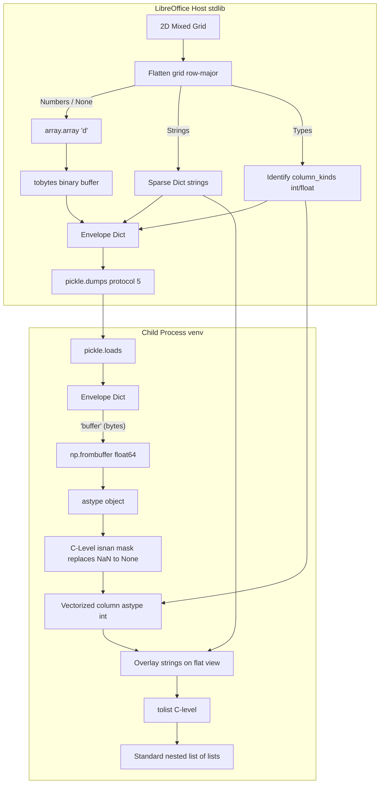

# Venv subprocess IPC & NumPy serialization

Back to the [core NumPy and Python guide](enabling_numpy_in_libreoffice.md).

**Production wire format:** length-prefixed **Pickle5** frames carrying `split_grid` envelopes (for qualifying 2D grids) or plain nested Python lists (small grids). There is no JSON on the runtime host↔venv path for data/results. JSON and Base64 variants exist only in the benchmark suite and a few legacy test helpers.

This page is the technical reference for WriterAgent's **host↔venv compute bridge**: warm worker lifecycle, length-prefixed Pickle5 IPC, Linux pipe performance, wire formats (`split_grid`, `multi_data`), benchmarks, pipeline costs, and future optimization work. The [core guide](enabling_numpy_in_libreoffice.md) covers ABI strategy, Settings, sandbox safety, trusted extension code, and `=PYTHON()` author UX.

## Table of contents

1. [Subprocess architecture](#subprocess-architecture)
2. [Warm worker lifecycle](#warm-worker-lifecycle)
3. [Worker protocol](#worker-protocol)
4. [Subprocess IPC performance (Linux)](#subprocess-ipc-performance-linux)
5. [Subprocess module map and config](#subprocess-module-map-and-config)
6. [Serialization](#serialization-optimization-opportunities)
7. [Matrix formula result session (IPC reduction)](#matrix-formula-result-session-ipc-reduction)
8. [Multi-range wire format](#multi-range-wire-format)

---

## Subprocess architecture

```
┌──────────────────────────────────────────────────────────┐
│                    LibreOffice Process                    │
│                                                          │
│  ┌─────────────┐    ┌──────────────────────────────────┐ │
│  │  LLM / Chat │───▶│  run_venv_python_script / =PYTHON │ │
│  │  (tool loop) │    │  → run_code_in_user_venv          │ │
│  └─────────────┘    └──────────┬───────────────────────┘ │
│                                │                         │
│                     ┌──────────▼───────────────────────┐ │
│                     │  PythonWorkerManager             │ │
│                     │  warm venv process               │ │
│                     │  worker_harness → venv_sandbox   │ │
│                     └──────────┬───────────────────────┘ │
│                                │ length-prefixed Pickle5 │
│                     ┌──────────▼───────────────────────┐ │
│                     │  User venv Python (subprocess)   │ │
│                     │  LocalPythonExecutor + whitelist │ │
│                     └──────────┬───────────────────────┘ │
│                                │ result / stdout         │
│                     ┌──────────▼───────────────────────┐ │
│                     │  LLM → Calc/Writer tools         │ │
│                     └──────────────────────────────────┘ │
└──────────────────────────────────────────────────────────┘
```

LibreOffice's embedded Python and the user's venv are **different interpreters** ([core §1](enabling_numpy_in_libreoffice.md#1-the-problem-abi-and-embedded-python)). The subprocess boundary is the hard safety line for C extensions; serialization is how `data` and `result` cross it.

---

## Warm worker lifecycle {#warm-worker-lifecycle}

| Layer | Behavior |
|-------|----------|
| `PythonWorkerManager` | One subprocess per resolved venv `python`; respawns on crash/timeout; auto-warms before first timed execute |
| `worker_harness.py` | Read loop; delegates to `venv_sandbox.run_sandboxed_code` |
| `venv_sandbox.py` | **Isolated (default):** new `LocalPythonExecutor` per request. **Shared kernel:** one executor per `calc:…` session id; inject `data`; serialize `result` |
| **Code hot cache** | [`sandbox_cache.py`](../plugin/scripting/sandbox_cache.py): SHA-256 keyed LRU (default 4096) caches **parsed AST** + **static** sandbox policy per unchanged source + import allowlist. Skips re-parse and re-validation on recalc; **does not** cache execution `result` or variables. Separate from host [Worker Result Session](#matrix-formula-result-session-ipc-reduction). Also used by in-process [`execute_python_script`](../plugin/calc/python/executor.py). |

**Reset:** `reset_session` / **WriterAgent → Reset Python Session** drops the shared executor (and paired `:init` session). Shared-kernel **Calc semantics** (recalc, idempotent cells): [core §6 — Session modes](enabling_numpy_in_libreoffice.md#session-modes-and-recalc-semantics); shortcuts: [§6 Keyboard shortcuts](enabling_numpy_in_libreoffice.md#keyboard-shortcuts-and-recalc).

Implementation: [`venv_worker.py`](../plugin/scripting/venv_worker.py), [`worker_harness.py`](../plugin/scripting/venv/worker_harness.py), [`venv_sandbox.py`](../plugin/scripting/venv/venv_sandbox.py).

---

## Worker protocol {#worker-protocol}

Production IPC uses **length-prefixed Pickle5 frames** on stdin/stdout (not JSON lines). The shared framing helpers live in [`plugin/scripting/ipc.py`](../plugin/scripting/ipc.py); each frame is a pickled request/response dict, and large `data` / `result` values use [`split_grid`](#strategy-3-split-grid-serialization-detail) or nested lists inside that dict.

### Length-prefixed framing

To guarantee complete frame assembly over asynchronous UNIX pipe crossings, `PythonWorkerManager` and [`worker_harness.py`](../plugin/scripting/venv/worker_harness.py) use the shared helpers in [`plugin/scripting/ipc.py`](../plugin/scripting/ipc.py):

- **Write frame:** `pickle.dumps(request, protocol=5)` → 4-byte big-endian length (`struct.pack("!I", N)`) → `N` raw bytes on the pipe.
- **Read frame:** read exactly 4 bytes → `_read_exact(N)` with `select` + blocking read → `pickle.loads(payload)`.

Env scrub on spawn: strip vars matching `KEY`/`TOKEN`/`SECRET`/`PASSWORD`/`AUTH`; set `PYTHONIOENCODING=utf-8`, `PYTHONUTF8=1`, `PYTHONDONTWRITEBYTECODE=1`; process-group kill on timeout (patterns aligned with robust agent runners such as Hermes).

### Request / response fields

**Host → worker (stdin):**

| Field | Required | Meaning |
|-------|----------|---------|
| `id` | Yes | Correlation id |
| `code` | Yes | Python source (or harness `action` for non-code requests) |
| `data` | No | Injected as variable `data` in a fresh namespace (nested lists or [`split_grid`](#strategy-3-split-grid-serialization-detail) envelope when dense numeric/mixed 2D) |

**Worker → host (stdout):**

| Field | When | Meaning |
|-------|------|---------|
| `id` | Always | Echo request id |
| `status` | Always | `"ok"` or `"error"` |
| `result` | `status == "ok"` | Serialized return value (`result` variable or last expression) |
| `stdout` | Optional | Captured prints / executor logs |
| `message` / `error` | `status == "error"` | Failure text |

### Venv ↔ LibreOffice tool RPC (deferred)

**Current (production):** pure data-in/data-out — no UNO bridge from the venv during script evaluation. The model uses a [two-phase workflow](enabling_numpy_in_libreoffice.md#two-phase-llm-workflow): compute in venv, then host tools (`write_formula_range`, `create_chart`, …).

**Intended:** worker writes `tool_call` lines; `PythonWorkerManager` dispatches via `ToolRegistry`, returns `tool_result`, resumes until `code_result`. Stubs in [`writeragent_api.py`](../plugin/scripting/writeragent_api.py); full sketch in [core §7 — tool RPC](enabling_numpy_in_libreoffice.md#venv--libreoffice-tool-rpc).

Bidirectional **tool RPC** from the venv back into LibreOffice is **not** wired yet.

---

## Subprocess IPC performance (Linux) {#subprocess-ipc-performance-linux}

When executing Python code or transporting dense matrix data on Linux, the compute bridge operates over standard UNIX pipes with outstanding efficiency and sub-millisecond latency.

### Under-the-hood mechanics

- **UNIX Pipes via `pipe2(2)`**: When `PythonWorkerManager` spawns the venv subprocess, it specifies `stdin=subprocess.PIPE` and `stdout=subprocess.PIPE`. Under the hood, Python calls the Linux kernel's `pipe2(2)` system call to establish private, unidirectional in-memory data channels.
- **Kernel-Buffered Transit**: These pipes are backed by kernel-space ring buffers (defaulting to **64 KiB** since Linux 2.6.11, and dynamically scaling or configurable up to 1 MiB). On Linux, [`PythonWorkerManager`](../plugin/scripting/venv_worker.py) requests **1 MiB** via `F_SETPIPE_SZ` when spawning the worker ([`sandbox.py`](../plugin/scripting/sandbox.py)).
- **Zero Disk/Network Overhead**: Data is written by the host directly to the kernel pipe buffer and read by the child process from the same buffer. The transaction resides entirely in RAM.
- **Efficient Context Switching**: Copies via `copy_to_user` / `copy_from_user`; context switches between host and warm worker typically **1–5 microseconds**.

### Speed and throughput

- **RAM-to-RAM Bandwidth**: Modern memory channels sustain **20 GB/s–60+ GB/s** copy speeds.
- **Sub-Millisecond E2E Latency** with **Pickle5 + Split-Grid** (no JSON text parsing or Base64 expansion):
  - **100×100 grid** (~78 KiB): egress unpack + materialize ~**0.503 ms**
  - **1000-cell array**: E2E **&lt; 0.08 ms**
- **Zero IPC Bottleneck** for typical scientific workloads — pipe + serialization cost is negligible vs NumPy compute.

---

## Subprocess module map and config {#subprocess-module-map-and-config}

```
plugin/scripting/
├── venv_worker.py            # Path resolve, warm worker, run_code_in_user_venv
├── sandbox.py                # Import whitelist, env scrub, Flatpak spawn, pipe sizing, path resolve
├── config_limits.py          # Timeout + max data cells from module.yaml
├── sandbox_cache.py          # AST policy + parse hot cache
├── venv/
│   ├── worker_harness.py     # Stdin/stdout loop in venv (child entry)
│   └── venv_sandbox.py       # LocalPythonExecutor + imports whitelist from sandbox.py
└── payload_codec.py          # split_grid / multi_data pack/unpack
```

Calc ingress/egress entry points: [`calc_addin_data.py`](../plugin/calc/calc_addin_data.py), [`python_function.py`](../plugin/calc/python/function.py), [`venv_python.py`](../plugin/calc/python/venv.py).

| Key | Shipped | Role |
|-----|---------|------|
| `scripting.python_max_data_cells` | Yes | Max cells in `=PYTHON()` / Run Python Script `data` / `data_range` (default **250 000**, clamp **1 000–2 000 000**); see [`config_limits.py`](../plugin/scripting/config_limits.py) |

Defined in [`plugin/scripting/module.yaml`](../plugin/scripting/module.yaml) / Settings → Python (`scripting__python_max_data_cells`).

- **Early enforcement:** [`check_python_data_size`](../plugin/calc/calc_addin_data.py) runs **before** pack/serialize to avoid wasted flatten work.
- **Timeout** (`scripting.python_exec_timeout`) and **venv path** are documented in the [core user guide](enabling_numpy_in_libreoffice.md#settings--python).

---

## Serialization optimization opportunities

The compute bridge is **asymmetric by design**: LibreOffice’s embedded Python (host) must stay ABI-safe and ships **without NumPy**; the user venv (child) may use NumPy, pandas, and other C extensions. Serialization is therefore the main lever for large-range performance — not importing NumPy into LibreOffice ([embeddings.md](embeddings.md#why-numpy-stays-in-the-venv)). The host can still ship **small vendored binaries** (a few MB, like [audio](audio-architecture.md) or future `sqlite-vec`) to pack/unpack payloads faster than pure stdlib, while the child keeps the heavy numeric stack in the user venv.

### What we implemented (Pickle5 + Split-Grid)

For numeric and mixed-type grids, the compute bridge implements high-performance serialization directly over standard length-prefixed bytes carrying pickled dictionaries with zero-copy binary arrays. We unified all out-of-process binary serialization under a single production standard: **Pickle5 + Split-Grid**.

| Piece | Purely Numeric Split-Grid | Mixed-Type Split-Grid |
|-------|----------------------------|-----------------------|
| **Wire Payload** | `{ "__wa_payload__": "split_grid", "dtype": "float64", "column_kinds": ["int", ...], "shape": [r, c], "buffer": b"...", "strings": {} }` (Pickled Protocol 5) | `{ "__wa_payload__": "split_grid", "dtype": "float64", "column_kinds": ["int", ...], "shape": [r, c], "buffer": b"...", "strings": {idx: "val"} }` (Pickled Protocol 5) |
| **Host Packing** | Flattens grid cells to float64; empty cells become `math.nan`. Identifies per-column `column_kinds` (`int`/`float`). **Single-pass** flattening loop; handles `None` in fast path. Packs raw binary buffer via `.tobytes()`. | Flattens grid; numbers become float64, empty cells/strings become `math.nan` in binary array. Strings are registered in parallel in a sparse `strings` index map with **integer keys**. |
| **Child Unpacking** | **Optimized C-Speed Path**: Sees that the sparse `strings` dictionary is empty and materializes a NumPy `ndarray` directly using `np.frombuffer` in one step. Restores `int64` types if `column_kinds` are all-int. Bypasses all Python list/loop transpositions and Base64 decoding! | Uses a vectorized NumPy object-masking strategy: maps buffer via `np.frombuffer`, casts to object array, bulk-replaces `nan` with `None` via C-level boolean masking, casts integer columns at C-speed, overlays sparse strings via flat view, and generates nested lists via high-speed `.tolist()`. |
| **Compatibility** | Namespace receives a NumPy ndarray (ideal for math operations). | Namespace receives a standard nested list of lists (fully backward compatible for all sheets and scripts). |
| **Threshold** | `BINARY_MIN_CELLS = 100` — 2D grids with ≥ 100 cells use `split_grid`. | `BINARY_MIN_CELLS = 100` — 2D grids with ≥ 100 cells use `split_grid`. |
| **Fallback** | Grids &lt; 100 cells fall back to standard Pickle lists. | Grids &lt; 100 cells or non-2D arrays fall back to standard Pickle lists. |
| **Debug log tag** | `payload_codec host_pack split_grid` | `payload_codec host_pack split_grid` |

---

### Strategy 3: Split-Grid Serialization (Detail)

Split-Grid represents a highly-optimized, asymmetric serialization strategy designed for spreadsheet columns or tables containing mixed data types (such as standard Calc ranges with headers, labels, or text mixed with numeric metrics).

#### Why Column-Wise was replaced:
Historically, a column-wise transposition approach (Strategy 1) was analyzed. It divided grids into individual columns, packing numeric columns as `f64_blob` and text columns as standard JSON lists. However:
1. Column transposing in pure Python on the host creates massive object structures and column-slice overhead.
2. Ingesting multiple chunks requires multiple base64 decodes and nested list pointer reconstructions, leading to serialization bottlenecks on mixed sheets.

#### The Split-Grid Solution:
Instead of dividing columns, Split-Grid serializes the **entire grid as a single flat binary float64 array** plus a **parallel sparse strings dictionary** and **per-column type metadata**, packed as raw binary data in a length-prefixed Pickle5 stream.



1. **Host Packing**:
   - Flat double-precision binary `array` preserves all numeric values (`int`, `float`, `bool`).
   - String values or empty/None cells are encoded as `math.nan` in the binary array.
   - Any string cell is registered in the parallel `strings` dictionary keyed natively by its integer flat cell index (e.g. `{7: "banana", 12: "apple"}`).
   - Per-column `column_kinds` (`int` or `float`) are identified to allow precise type restoration in the child.
   - Avoids expensive type-coercion testing by mapping strings immediately, ensuring 100% preservation of zip codes (`"02138"` remains a string) and preventing float conversion bugs.
   - The entire dictionary payload is serialized using `pickle.dumps(request, protocol=5)`, completely avoiding Base64 encoding.
2. **Child Unpacking**:
   - Decodes the length-prefixed stream and deserializes the request with `pickle.loads(payload)`.
   - Maps the binary buffer (`"buffer"` key) directly into memory using `np.frombuffer`.
   - For mixed grids containing strings, utilizes a highly optimized vectorized NumPy object-masking strategy:
     - Converts the array to an `object` type array at C-speed (`arr.astype(object)`).
     - Identifies all missing/NaN elements via a C-level boolean mask (`np.isnan`) and bulk-replaces them with `None` in a single vectorized pass.
     - Casts entire integer columns to Python `int` at C-speed using column slice masks (completely avoiding per-cell modulo math and interpreter type-coercion loops).
     - Overlays the sparse string dictionary values directly using a 1D flat view.
     - Generates the final 2D nested lists structure natively in C using `.tolist()`.
   - For purely numeric grids, completely bypasses all list/object array reconstructions and returns the `ndarray` directly.

### Cell semantics: Calc, Python, and NumPy

This section documents **behavior** for real inputs (rectangular Calc ranges and tool payloads), not only wire layout.

#### Supported input shape

- **2D data must be rectangular:** every row has the same length (`len(row) == ncols`). Calc `=PYTHON(code; range)` passes UNO range blocks this way; empty cells are `None` in a full-width row, not “missing” list elements.
- **Uneven row lengths** (jagged nested lists) are **unsupported**. [`_flatten_grid_to_components`](../plugin/scripting/payload_codec.py) logs an error and raises `ValueError` if row lengths differ. We do not pad short rows.

#### Formal verification

The split-grid codec is the project's reference Tier-0 verification target: `deal` contracts on pack/unpack functions, optional CrossHair concolic checking, and pytest round-trip oracles. The A/B suite ([`tests/scripting/test_serialization_ab.py`](../tests/scripting/test_serialization_ab.py) + Hypothesis + venv worker harness) compares `force="always"` (split_grid) vs `force="never"` (nested list) on small varied grids. See [`docs/serialization-verification-plan.md`](serialization-verification-plan.md) for workflow and status; background in [`docs/formal_verification.md`](formal_verification.md).

#### Calc → Python ([`calc_addin_data.py`](../plugin/calc/calc_addin_data.py))

| Calc / UNO | Python `data` before pack |
|------------|---------------------------|
| Empty cell / `""` | `None` |
| Number | `int` or `float` |
| Logical constant (`TRUE`/`FALSE` in sheet) | Usually **`1.0`/`0.0`** from add-in bridge (VALUE cells), not Python `bool` |
| UNO boolean (rare on range args) | `bool` |
| Text | `str` (including literal `"True"` — **not** coerced to bool; same as JSON/pickle) |
| Single row/column range | Flat `list` ([`normalize_python_data_shape`](../plugin/calc/calc_addin_data.py)) |
| 2D block (e.g. `A1:C5`) | `list[list]`, rectangular |

**Wire fidelity:** split_grid + Pickle5 must behave like nested Python lists + standard pickle — no extra type coercion in [`payload_codec.py`](../plugin/scripting/payload_codec.py). Optimized `frombuffer` paths are a performance implementation of that contract.

#### Logical string coercion at Calc ingress

**Status:** Implemented (2026-05).

When a user enters a logical in Calc (e.g., `TRUE` in the formula bar), the add-in bridge usually delivers **`1.0`/`0.0`** (VALUE cells). That already works with `np.sum` and split_grid.

The implementation now also gracefully handles text that looks like a logical or formula after import/paste (e.g., from CSVs or Python output). In `calc_addin_data._unwrap_cell`, the system intercepts exact strings and coerces them to Python `bool` **before** packing.

| What the user sees | What `_unwrap_cell` gets | Python `data` |
|--------------------|--------------------------|---------------|
| Logical typed in Calc | `1.0` / `0.0` | `1.0` / `0.0` |
| Formula string | `"=TRUE()"` / `"=WAHR()"` | `True` |
| Plain text | `"TRUE"` / `"WAHR"` | `True` |
| Python text | `"True"` / `"False"` | `True` / `False` |

**How it works:**
1.  **Localized Discovery:** At add-in initialization (`PythonFunction.__init__`), the extension uses the `XFormulaOpCodeMapper` service to discover the user's localized boolean function names (e.g., `WAHR` for German, `VRAI` for French).
2.  **Standard Coercion Sets:** It builds sets of strings to coerce, including formulas (`"=TRUE()"`), plain uppercase (`"TRUE"`), and Python-style title case (`"True"`), along with their localized equivalents.
3.  **Efficiency:** These sets are cached and passed to the serialization layer, ensuring coercion happens in a single pass without extra UNO calls during range processing.

This prevents `np.sum(data)` from failing when ranges contain text-based logicals, while strictly avoiding broad rules that might misinterpret arbitrary text labels.

**Related fixes already shipped:** nested generator expressions in [`local_python_executor.evaluate_generatorexp`](../plugin/contrib/smolagents/local_python_executor.py) (mixed-grid `sum(v for row in data …)`); fixed 2×5 input groups in [`scripts/generate_serialization_spreadsheet.py`](../scripts/generate_serialization_spreadsheet.py).

#### Calc logical display vs `=PYTHON()` — manual experiments

Use this when designing new serialization or bool tests ([`tests/calc/serialization_cases.py`](../tests/calc/serialization_cases.py): `bool_true`, `bool_false`, `bool_col_11_sum`; manual sheet uses numeric **1/0** in input grids because XLSX import does not evaluate `=TRUE()`).

**What Calc shows vs what math uses**

| Concept | In the cell UI | In `=SUM(...)`, `=A1*2`, etc. |
|---------|----------------|-------------------------------|
| Logical TRUE / FALSE | `TRUE` / `FALSE` (locale may differ, e.g. `WAHR`) | **1** / **0** |
| Number 1 / 0 | `1` / `0` | 1 / 0 |
| Text `"TRUE"` / `"1"` | looks like true / one | text is **not** a number; `SUM` skips or NumPy sums strings fail |

**`=PYTHON()` egress:** Python `True` / `False` from the worker are mapped to UNO booleans in [`to_calc_compatible`](../plugin/calc/python/function.py). A one-cell formula `=PYTHON("True")` should display a **logical** TRUE, not the text `"True"`.

**`=PYTHON()` ingress (second argument = range):** What Python sees as `data` depends on how the cell is stored:

| Cell contents | Typical `data` in Python | `np.sum(data)` on a 1-cell range |
|---------------|--------------------------|----------------------------------|
| `=TRUE()` / `=FALSE()` | Often `1.0` / `0.0` from the bridge; sometimes `bool` | Works (sums to 1 or 0) |
| Typed `1` / `0` | `1` / `0` | Works |
| Text `'True'` / `'1'` | `"True"` / `"1"` (`str`) | **Fails** (Unicode dtype / wrong semantics) |
| After string coercion (see table above) | `True` / `False` | Works once coerced to bool before pack |

**Quick paste tests (empty sheet)**

1. **Return type from PYTHON**

   ```text
   =PYTHON("True")
   =PYTHON("False")
   =PYTHON("type(True).__name__")
   ```

   Expect: logical TRUE/FALSE; third cell shows `bool` as text.

2. **Compare to native Calc logicals**

   ```text
   =TRUE()
   =FALSE()
   =PYTHON("True")
   =PYTHON("1 == 1")
   ```

3. **Numeric use**

   ```text
   =SUM(TRUE();FALSE();TRUE())
   =PYTHON("True") + PYTHON("False") + PYTHON("True")
   ```

   Both should evaluate to **2**.

4. **What Python receives from one cell** — put value in **D1**, then in **E1**:

   ```text
   =PYTHON("repr(data)", D1)
   ```

   Try D1 = `=TRUE()`, `1`, and text `1` (format as text). Compare `repr` output.

5. **One-line probe over a small range** — **A1:C1** = `TRUE`, `FALSE`, `1`:

   ```text
   =PYTHON("f'{data=} {type(data).__name__}'", A1:C1)
   ```

   For flat ranges, `data` is a list; inspect element types before adding `np.sum` cases to the manual suite.

**Future test ideas:** matrix block of logicals; mixed column TRUE + label text; localized `=WAHR()` strings after CSV import; PYTHON returning bool vs `1.0` and compare column to `=IF(A1,"PASS","FAIL")`.

#### Split-Grid encoding (host pack)

| Cell value | `buffer` (float64) | `strings` |
|------------|-------------------|-----------|
| `None` (empty Calc cell) | `NaN` | — |
| `int` / `float` | numeric value | — |
| `bool` | `0.0` / `1.0` | — |
| `str` (including `"02138"`) | `NaN` | text preserved by flat index (never treated as a numeric cell for `np.array(list)` reload) |

Grids with **&lt; 100 cells** use nested Pickle lists ([`BINARY_MIN_CELLS`](../plugin/scripting/payload_codec.py)); `_cell_for_json` only normalizes Python `None`; `float('nan')` is preserved so it becomes a Calc error on egress (not a silent blank).

#### Child materialization (ingress)

| Grid type | Child sees |
|-----------|------------|
| **Pure numeric** (`strings` empty) | `np.ndarray` float64; empty Calc cells → **`np.nan`**, not Python `None` |
| **Mixed** (any string cells) | Nested `list[list]`; empty/NaN slots → **`None`** |
| **Single cell** (length-1 flat list or 1-element array) | Scalar; whole floats like `100000.0` → `int` when `.is_integer()` |

Use `np.nansum(data)` (or mask with `np.isnan`) on numeric-only ingress when you need to ignore holes.

#### Egress (child → host / Calc)

| Child `result` | Host / UI after unpack |
|----------------|------------------------|
| `np.ndarray` with `np.nan` | `float('nan')` preserved in nested lists (becomes Calc error on =PYTHON() egress) |
| `np.inf` / `-np.inf` | Still **inf** (not treated as missing) |
| Large numeric array (≥ 100 cells) | `split_grid` on wire (Pickle5); host unpack → nested lists (NaN preserved) for Calc / LLM |

#### Empty cells vs NaN (policy)

Author-facing summary (script examples and LLM guidance): [Empty cells vs NaN](enabling_numpy_in_libreoffice.md#empty-cells-vs-nan).

We **do not** distinguish empty Calc cells from Python/NumPy NaN on the wire (both use `NaN` in the split_grid buffer, or `None` in small mixed lists). Production transport: **length-prefixed Pickle5** + `split_grid` (or plain lists below threshold). No JSON on the runtime wire.

**Ingress:** empty → `None` (mixed/small) or `np.nan` (numeric split_grid). Use `nan*` helpers when blanks must be ignored.

**Egress (Calc):** `None` → `""` (empty cell); `nan` → raw NaN (Calc renders a cascading `#NUM!`/`#VALUE!` error). `±inf` is unchanged.

**Wire / host unpack:** buffer NaN slots are preserved as `float('nan')` in nested lists (not coerced to `None`); `to_calc_compatible` leaves NaN as a double for Calc (error) and maps `None` to `""`.

#### Dates, Datetimes, and Coercion (policy)

To optimize speed and maintain a clean separation of concerns, the bridge delegates date/time coercion to user/client scripts rather than attempting automatic detection on the host.

* **The Problem with Automatic Detection**:
  LibreOffice Calc represents date and time values internally as floating-point serial numbers (days since `1899-12-30`). The only way to identify them as dates is to inspect the cell format (`NumberFormat`) on the main thread via UNO. Querying every cell's format individually would cause massive IPC overhead and serialize range reading.
* **Ingress Behavior**:
  - **Serial Dates (Floats)**: Arrive in the user's script namespace as raw floats (serial numbers).
  - **String Dates**: Arrive as strings.
  - **Python `datetime.date` / `datetime.datetime` / `pd.Timestamp`**:
    - *Below threshold* (plain list path): Types are fully preserved via standard Pickle serialization.
    - *Above threshold* (`split_grid`): Coerced to their ISO string representations in the `strings` dictionary.
* **Egress Behavior**:
  - Returning a NumPy `np.datetime64` array above the threshold (`split_grid`) casts elements to float64, converting them to units (like days) since the Epoch (`1970-01-01`). For example, `np.datetime64("2026-06-25")` becomes `20629.0`.
* **Client Coercion Guide**:
  Clients should manually coerce these inputs in pandas or python. For example:
  - Float serial dates: `pd.to_datetime(df["date_col"], unit="D", origin="1899-12-30")`
  - String dates: `pd.to_datetime(df["date_col"])`

#### Performance Impact:
- **~20x Speedup** over Column-Wise mixed grids.
- Binary materialization is done at C-speed via `frombuffer` + `.tolist()`, and pure Python loops only process the small fraction of cells that actually contain string text.

**Benchmarked** outside LO ([`scripts/bench_serialization.py`](../scripts/bench_serialization.py)) — [results](#benchmark-results-2026-05). Defer vendored msgpack, mmap, and payload cache unless real Calc profiles disagree.

### Benchmark results (2026-05)

Asymmetric simulation: **host** = stdlib pack/serialize; **child** = deserialize + materialize. Timings are median values; the automatic `split_grid` envelope is triggered when **at least 100 cells** (smaller grids fall back to standard Pickle lists). The bench compares four transport + envelope strategies:
1. `json_list` (standard nested lists over JSON wire, materializing using `np.array(list)`).
2. **`json+sg`** (split_grid envelope with Base64 `b64` buffer inside a JSON line, materializing using `np.frombuffer`).
3. `pickle5` (Pickle protocol 5 of nested lists, which still requires expensive `np.array(list)` conversions in the child).
4. **`pickle5+sg`** (**Winner**: split_grid envelope with raw `buffer` bytes inside Pickle5, materializing at C-speed via `np.frombuffer`).

`--child-only` also reports `pickle5` vs `pickle5+sg` materialize times to show why plain pickle is not enough without the split_grid envelope.

#### 1. End-to-End Serialization Timings (Ingress)

timings in milliseconds (isolated stages):

| Shape | Format | Pack | Dump | Load | Materialize | Total (ms) | Speedup vs JSON |
|-------|--------|------|------|------|-------------|------------|-----------------|
| **100×100** (10k cells) | `json_list` | 0.369 | 2.060 | 1.285 | 0.098 | 3.812 ms | baseline |
| | `pickle5` | 0.387 | 0.083 | 0.153 | 0.097 | 0.719 ms | 5.30x |
| | **`pickle5+sg`** | 0.657 | **0.003** | **0.003** | **0.007** | **0.669 ms** | **5.69x** |
| **20,000×5** (100k cells) | `json_list` | 6.215 | 22.823 | 14.573 | 2.064 | 45.674 ms | baseline |
| | `pickle5` | 6.072 | 1.400 | 2.902 | 2.007 | 12.381 ms | 3.69x |
| | **`pickle5+sg`** | 8.305 | **0.013** | **0.015** | **0.002** | **8.335 ms** | **5.48x** |

#### 2. End-to-End Serialization Timings (Egress)

| Shape | Format | Pack | Dump | Load | Materialize | Total (ms) | Speedup vs JSON |
|-------|--------|------|------|------|-------------|------------|-----------------|
| **100×100** (10k cells) | `json_list` | 0.078 | 2.116 | 1.299 | 1.729 | 5.221 ms | baseline |
| | `pickle5` | 0.083 | 0.084 | 0.150 | 1.633 | 1.950 ms | 2.68x |
| | **`pickle5+sg`** | 0.003 | **0.002** | **0.003** | **0.240** | **0.248 ms** | **21.09x** |
| **20,000×5** (100k cells) | `json_list` | 1.665 | 22.939 | 14.145 | 22.302 | 61.051 ms | baseline |
| | `pickle5` | 1.584 | 1.324 | 2.772 | 22.373 | 28.053 ms | 2.18x |
| | **`pickle5+sg`** | 0.017 | **0.020** | **0.015** | **4.629** | **4.681 ms** | **13.04x** |

#### 2. Child-Only Peer Materialization (np.array vs frombuffer)

timings in milliseconds (measuring CPU time required to deserialize and instantiate the array in the child):

| Shape | Cells | `json_list` (np.array) | `json+sg` (frombuffer) | `pickle5` (np.array) | `pickle5+sg` (frombuffer) | `json+sg` Speedup | `pickle5` Speedup | `pickle5+sg` Speedup |
|-------|-------|------------------------|---------------------------|---------------------------------------|---------------------------------------|----------------------|-----------------------|-----------------------------|
| **Scalar** | 1 | 0.0023 ms | 0.0055 ms | 0.0011 ms | 0.0041 ms | 0.41x | 1.84x | 0.56x |
| **3×3** | 9 | 0.0048 ms | 0.0055 ms | 0.0024 ms | 0.0041 ms | 0.88x | 2.13x | 1.18x |
| **4×4** | 16 | 0.0070 ms | 0.0057 ms | 0.0030 ms | 0.0041 ms | 1.24x | 2.44x | 1.72x |
| **10×10** | 100 | 0.0306 ms | 0.0085 ms | 0.0081 ms | 0.0048 ms | 3.58x | 3.80x | 6.34x |
| **100×100** | 10 000 | 2.857 ms | 0.229 ms | 0.608 ms | **0.016 ms** | **12.49x** | **4.85x** | **173.76x** |
| **1×1000** | 1000 | 0.280 ms | 0.027 ms | 0.062 ms | **0.004 ms** | **10.54x** | **4.53x** | **66.70x** |
| **1000×1** | 1000 | 0.444 ms | 0.027 ms | 0.249 ms | **0.005 ms** | **16.72x** | **1.81x** | **94.72x** |

#### 3. Warm Process Executions (with dynamic format switching)

Side-by-side warm worker execution times comparing JSON and Pickle IPC dynamic loops (10 iterations):

* **Task 1: 1000th Prime** (via `sympy`):
  * **In-Process**: Avg: `0.001042s` | Min: `0.000962s`
  * **JSON Mode**: Cold: `0.792939s` | Warm Avg: `0.042475s` | Warm Min: `0.036271s`
  * **Pickle Mode**: Cold: `0.766803s` | Warm Avg: `0.047892s` | Warm Min: `0.038229s`

* **Task 2: 1000×1000 Matrix Dot Product** (via `numpy`):
  * **In-Process**: Avg: `0.041175s` | Min: `0.032525s`
  * **JSON Mode**: Cold: `0.777692s` | Warm Avg: `0.079107s` | Warm Min: `0.075480s`
  * **Pickle Mode**: Cold: `0.808579s` | Warm Avg: `0.076709s` | Warm Min: `0.072407s`

#### Key Insights

1. **Serialization is now virtually instant**:
   With Split-Grid inside Pickle, the `dump` and `load` stages take less than **0.015ms** even for 100,000 cells. Standard nested-list pickling is 100x slower because it must process every cell object individually.
   
2. **Pack is the new bottleneck**:
   The `Pack` column (the Python loop that flattens the grid) now accounts for **99%** of the ingress time in Split-Grid. This is why a Cython accelerator for `_flatten_grid_to_components` is the highest ROI future optimization.

3. **Egress is significantly faster**:
   Child-to-host (Egress) is even faster because NumPy handles the packing at C-speed. The host still pays for "materializing" (unpacking lists for Calc), but even this is much faster than standard JSON parsing.

To run benchmarks yourself:
```bash
.venv/bin/python scripts/bench_serialization.py --direction both
.venv/bin/python scripts/bench_serialization.py --child-only
.venv/bin/python scripts/bench_warm_numpy.py
```

### Unified `split_grid` Serialization

Production wiring (2026-05 refactor):

The implementation was simplified in May 2026 to unify the 1D and 2D packing paths into a single robust iteration loop in `host_pack_split_grid`, removing several redundant helper functions while preserving the same high-performance wire format and C-speed materialization in the child process.

| Location | Role |
|----------|------|
| [`plugin/scripting/payload_codec.py`](../plugin/scripting/payload_codec.py) | Single source: unified pack/unpack, threshold, `describe_wire_value` for logs |
| [`plugin/calc/calc_addin_data.py`](../plugin/calc/calc_addin_data.py) | `pack_calc_data_for_wire()` after range read; `count_cells()` understands split_grid envelopes |
| [`plugin/scripting/venv_worker.py`](../plugin/scripting/venv_worker.py) | `_normalize_response`: `host_unpack_data` on worker `result` (all callers); respects `column_kinds` |
| [`plugin/calc/python/function.py`](../plugin/calc/python/function.py) | `=PYTHON()` ingress pack + matrix/session flattening (result already unpacked) |
| [`plugin/calc/python/venv.py`](../plugin/calc/python/venv.py) | Chat tool ingress pack |
| [`plugin/scripting/venv/venv_sandbox.py`](../plugin/scripting/venv/venv_sandbox.py) | `child_unpack_data` before inject; `child_pack_result` in `serialize_result` |
| [`tests/scripting/test_payload_codec.py`](../tests/scripting/test_payload_codec.py) | Unit tests (threshold, round-trip, mixed text → lists) |
| [`tests/scripting/test_venv_worker.py`](../tests/scripting/test_venv_worker.py) | Harness integration with split_grid payloads |

**Policy:** `BINARY_MIN_CELLS = 100` — 2D grids with **≥ 100 cells** use `split_grid`; smaller grids use standard Pickle lists.

**Still deferred:** vendored codecs, mmap, payload cache, venv tool RPC.

### Current pipeline and costs

```text
Calc UNO range
  → calc_addin_data_to_python (host: list / list[list])
  → pack_calc_data_for_wire → host_pack_data (host: split_grid or nested list)
  → pickle.dumps(request)        (host: binary payload, protocol 5; split_grid contains raw bytes)
  → pickle.loads(payload)        (child: parse request dict)
  → child_unpack_data → ndarray  (child: frombuffer + reshape when split_grid and strings is empty)
  → send_variables({"data": ...}) (child: ndarray or list in fresh namespace)
  → user code (NumPy/pandas)
  → serialize_result → child_pack_result (child: split_grid or list for large numeric result)
  → pickle.dumps(response)       (child: binary response, protocol 5)
  → pickle.loads(response)       (host)
  → _normalize_response → host_unpack_data (host: split_grid → nested lists for Calc / LLM / UI)
  → finalize_python_return / write_formula_range
```

| Stage | Module | What happens | Large dense numeric `data` (shipped path) |
|-------|--------|--------------|-------------------------------------------|
| Range read | [`calc_addin_data.py`](../plugin/calc/calc_addin_data.py) | Cell scalars in nested lists | O(cells) once at read |
| Host pack | [`payload_codec.py`](../plugin/scripting/payload_codec.py) | **Single-pass** flattening loop; handles `None` in fast path | **Bottleneck** (Python loop) |
| Host encode | [`venv_worker.py`](../plugin/scripting/venv_worker.py) | `pickle.dumps` of request dict | **Instant** (binary buffer) |
| Child unpack | [`venv_sandbox.py`](../plugin/scripting/venv/venv_sandbox.py) | `frombuffer` + `reshape` → ndarray | **Instant** (C-speed) |
| Return | [`serialize_result`](../plugin/scripting/venv/venv_sandbox.py) | `child_pack_result` for ndarray/list; DataFrame/Series use rectangular `dataframe` envelope (columns + split_grid data) | Large ndarray/DF egress as binary buffer |
| Host decode | [`venv_worker.py`](../plugin/scripting/venv_worker.py) | `_normalize_response` → `host_unpack_data` on `result` | Nested lists for LLM, smol observations, Calc matrix/session |
| Calc return | [`python_function.py`](../plugin/calc/python/function.py) | `finalize_python_return` / session flattening | Per-cell scalars for legacy add-in bridge |

**Pickle Protocol 5:** Standardized as the exclusive production serialization protocol on the worker path. Opaque msgpack, mmap, and shared memory remain deferred. [`SafeSerializer`](../plugin/contrib/smolagents/serialization.py) (`__type__: ndarray`) is **not** on the worker path — only [`payload_codec.py`](../plugin/scripting/payload_codec.py).

**Fresh namespace every call** ([core strategy](enabling_numpy_in_libreoffice.md#2-strategy-decision)): there is no worker-side variable cache; the same `A1:Z1000` range is re-serialized on every `=PYTHON()` or `run_venv_python_script` invocation unless the product adds an explicit cache ([Priority 6 — worker payload cache](#priority-6--worker-payload-cache-same-range-many-recalcs)).

### Matrix formula result session (IPC reduction) {#matrix-formula-result-session-ipc-reduction}

Calc add-ins return **one scalar per evaluation**. A 1,000-row matrix formula would otherwise cause 1,000 IPC crossings and serialization pack taxes.

WriterAgent implements a **Worker Result Session** cache ([`_WorkerResultSession`](../plugin/calc/python/function.py)):

1. **First cell** in the range runs the full worker; the serialized list is cached on the **LibreOffice host**.
2. **Remaining cells** with the same `code` + `data` signature bypass the worker and read by index from the host cache.
3. **`ROW()-n` pattern:** pass `ROW()-n` as the 2nd argument so each cell pulls the correct list element regardless of Calc evaluation order.

This caches **execution output** on the host — separate from the worker [**code hot cache**](#warm-worker-lifecycle) (AST parse + static policy only).

**Benefits:** ~**99.9% IPC reduction** for large matrix columns; one subprocess + serialize cost per range per recalc pass. Author UX (Ctrl+Shift+Enter, `ROW()`): [core §6 — Matrix formulas](enabling_numpy_in_libreoffice.md#2-normal-single-cell-formulas-vs-matrix-array-formulas).

### Multi-range wire format {#multi-range-wire-format}

**Status:** Shipped (2026-05) — varargs IDL + `multi_data` envelope.

Multiple ranges use a `multi_data` envelope (`__wa_payload__`: `"multi_data"`, `items`: per-range `split_grid` or nested lists) so a list of 1D ranges is not confused with one 2D grid. Single-range wire format is unchanged.

| Layer | Module |
|-------|--------|
| Arg split / convert | [`calc_addin_data.py`](../plugin/calc/calc_addin_data.py) — `split_python_addin_data_args`, `calc_addin_args_to_python` |
| Add-in execution | [`python_function.py`](../plugin/calc/python/function.py) |
| Wire codec | [`payload_codec.py`](../plugin/scripting/payload_codec.py) — `host_pack_multi_data`, `child_unpack_data` |
| Tests | [`test_calc_addin_data.py`](../tests/calc/test_calc_addin_data.py), [`test_python_function_multi.py`](../tests/calc/python/test_function_multi.py), [`serialization_ab_support.py`](../tests/scripting/serialization_ab_support.py) |

**Future work:** Hypothesis/CrossHair fuzz for list-of-grids (`serialization_ab_support.py` TODOs); live Calc UNO multi-range suite; chat tool multi `data_range` parity with formula varargs.

User-facing varargs examples: [core §9 — Multi-Range Support](enabling_numpy_in_libreoffice.md#multi-range-support-varargs).

### Design constraints

- **Host stays NumPy-free** — do not vendor full NumPy/pandas into LibreOffice ([embeddings.md](embeddings.md#why-numpy-stays-in-the-venv)). That is unrelated to shipping **small, purpose-built binaries** (a few MB per platform total) when stdlib is too slow.
- **Host may use small vendored natives** — e.g. future embeddings search (`sqlite-vec` `vec0`, ~1 MB per OS in [embeddings.md](embeddings.md)) or an optional host-side serialization codec. Sidebar audio capture no longer vendors PortAudio in the OXT; it uses the user venv ([audio-architecture.md](audio-architecture.md)). Any host native must stay in the **few-MB** budget — not a 50–100 MB science stack.
- **Wire format uses length-prefixed binary streams carrying Pickle5 payloads** — this standard provides extremely fast, out-of-band zero-copy buffer sharing between processes without any Base64 encoding or JSON parsing overhead. Since we package both the extension host and the sandboxed child worker together inside the OXT, backward compatibility is not a constraint, allowing us to evolve the IPC protocol to be as fast as possible.
- **Sandbox must not grant arbitrary filesystem access** — [`LocalPythonExecutor`](../plugin/contrib/smolagents/local_python_executor.py) blocks `os` / `pathlib` in user code; temp files and mmap paths must be **host-allocated, host-trusted paths** passed in the request envelope, not paths chosen by LLM-generated scripts.
- **LLM and Calc still need scalar or small structured outputs** eventually — even an optimized ingress path usually ends with compact `result` (scalar, short list, summary stats) or a second-phase host tool (`write_formula_range`) for sheet output ([core user guide](enabling_numpy_in_libreoffice.md#3-user-guide)). The wire itself is Pickle5 + split_grid (or small lists); any JSON-safe requirement is at the final consumer (text for the model, cells for Calc), not the IPC.

### Building host native extensions (Cython)

**Status: not shipped / deferred**.
With the highly optimized pure-Python/NumPy vectorized object-masking strategy implemented in May 2026, compiling and packaging native Cython modules is currently deferred. For future compiler reference and architectural guidelines on cibuildwheel/ABI matrixes, see the standalone [Cython Extension Guide](cython-extension.md).

### Benchmark checklist (regression / future optimizations)

Re-run when changing [`payload_codec.py`](../plugin/scripting/payload_codec.py) or considering vendored codecs or mmap. **Standalone bench (outside LO):** [`scripts/bench_serialization.py`](../scripts/bench_serialization.py) — asymmetric host (stdlib) vs child (NumPy), ingress and egress, scalar/list/ndarray sizes up to 100 000 cells (includes 20 000×5); compares `json_list`, `json+sg`, `pickle5`, and `pickle5+sg`. Production path is `pickle5+sg`; `json+sg` is the historical JSON/Base64 diagnostic lane. Production policy matches bench defaults (`BINARY_MIN_CELLS = 100`).

**Regression note (2026-06):** A change in June 2026 inadvertently made the pure-numeric (`strings == {}`) path in `child_unpack_split_grid` do `.tolist()` + recursive conversion even for split_grid envelopes. This regressed the C-speed `frombuffer` materialize (visible as ~52 ms child mat on 20k×5 / 100k cells in ingress bench vs the prior microsecond numbers). The contract ("return ndarray directly" for no-strings case) and calling code in `_child_unpack_single_data` were restored; the fast path is now guarded by an explicit ndarray-vs-list sentinel in tests. Re-bench `pickle5+sg` ingress after edits to `payload_codec.py`.

```bash
python scripts/bench_serialization.py --direction both
python scripts/bench_serialization.py --child-only   # isolate np.array vs frombuffer
# Planned: --candidates for orjson/msgpack/zlib vs json+sg / pickle5+sg
```

Checklist (same legs the script runs):

1. **Baseline (list path)** — host pack list + `json.dumps` + child `json.loads` + `np.array(data)`.
2. **With envelope** — `json+sg` (Base64 split_grid in JSON) and `pickle5+sg` (production buffer in Pickle5) + child `frombuffer`; compare `mat` column and `wire_B`.
2b. **Vendored Codecs** — same payload with vendored **msgpack** (or custom packer) on host only vs stdlib; measure OXT size and cold-import cost in LO.
3. **Mmap** — host writes temp binary file; child `np.memmap`; measure with `N×M` at 10⁴, 10⁵, 10⁶ cells (under cap).
4. **Egress** — `result = large_ndarray`: compare `.tolist()` + JSON vs compact binary envelope vs scalar-only return.
5. **Matrix formulas** — count worker invocations per recalc with and without `ROW()-1` index arg.
6. **Cross-platform** — temp file delete on timeout ([`venv_worker.py`](../plugin/scripting/venv_worker.py) process-group kill), Windows path length, UTF-8 JSON for non-ASCII cells (keep JSON branch for mixed data).

Record: cells/sec host→child, cells/sec child→host, bytes on wire, and whether timeout (`scripting.python_exec_timeout`) fires due to serialization alone.

### Recommendation summary

**Pickle5 + Split-Grid** is the unified binary wire format shipped for both numeric and mixed-type grids (dense numeric arrays use split-grid with `strings: {}` for C-speed `np.frombuffer` loading in child). Keep **Standard Pickle lists** for &lt;100 cells, small 1D mixed arrays, and scalars.

| Situation | Prefer |
|-----------|--------|
| Dense numeric or mixed numeric/strings 2D grids (≥100 cells) | **Pickle5 + Split-Grid envelope** (shipped) |
| Small ranges (&lt;100 cells), 1D mixed types, scalars | **Standard Pickle lists** (no envelope) |
| LLM chat with huge outputs | Summaries + **tool RPC** / `write_formula_range`, not giant `result` payloads |
| Host still slow after split_grid in LO profiles | Vendored msgpack/orjson (few MB OXT) |
| Very large ranges / stdin size limits | **Temp file + mmap** + optional **payload cache** |
| **Next optimizations** | See [Future work — serialization performance](#future-work--serialization-performance) (profile in LO first, then summaries → host paths → defer vendored/mmap) |
| **Host flatten loop (stdlib)** | [Host pack hot path — pure-Python optimizations](#host-pack-hot-path--pure-python-optimizations) — identity checks, bound-method capture, rectangular validation, unified 1D/2D cell loop |

**Vendoring policy:** avoid NumPy/pandas in the OXT; **do** consider a few MB of focused binaries only if Tier 2 stdlib is insufficient after measurement. Keep pack/unpack logic in **`plugin/scripting/`** (host + [`venv_sandbox.py`](../plugin/scripting/venv/venv_sandbox.py)).

### Future work — serialization performance

The standardized Split-Grid format fixed the **child** hot path (`frombuffer` vs `np.array(list)`). Remaining cost is mostly **host work** (UNO read → Python objects → pack), **extra crossings** (same range sent every recalc), and **downstream consumers** that force blob → nested lists. Do not add vendored or mmap OXT weight until **LibreOffice profiles** show serialization dominates compute.

**Suggested next sprint:** (1) LO profile → (2) product/prompt fixes → (3) host opaque blob or single-pass UNO→bytes **only if** step 1 points there.

#### Documented challenge: datetime / temporal values (high-speed handling not implemented)

Calc represents dates/times as serial number floats (days since 1899-12-30, with optional time fraction). On ingress they arrive as plain floats (see `_unwrap_cell` in `calc_addin_data.py` and the import doc). On egress, Python `datetime`/`date` objects are stringified (`to_calc_compatible` in `python_function.py`) because the wire and Calc cell model do not carry first-class temporal objects for the main `=PYTHON()` / scripting paths.

The split-grid fast path (float64 buffer + frombuffer) is extremely fast precisely because it stays in a uniform numeric dtype. Any first-class datetime representation would either:

- Force a mixed-type (object) array path (losing the pure frombuffer win for grids that contain dates),
- Require a parallel "datetime mask" or column-kind extension + custom high-speed pack/unpack (more complex than current strings map, adds per-cell overhead, and still needs to feed into Calc which ultimately stores serials or formatted text),
- Or keep using float serials on the wire (current behavior) and only convert at the very edges for user code that wants `datetime` objects.

Adding true high-speed (but not as fast as current pure-numeric) datetime support on the split-grid wire is a plausible future optimization, but it is out of scope for the current performance work. This note records the trade-off and why the status quo (floats in, strings out for datetimes) exists.

#### Experimental Cython Accelerator (May 2026)

**Status: Experimental / Arch-Specific**
A high-performance Cython implementation of the flattening loop has been developed to address the remaining Python bottleneck. 

- **Performance Gain**: Achieved a **~3–4× speedup** on the flattening stage (Cython vs pure Python).
- **Data (100k cells, June 2026 bench)**:
    - **Pure Python**: ~8 ms
    - **Cython v1 (`x86-64`)**: host_pack ~3.0 ms, total ~3.1 ms
    - **Cython v3 (`x86-64-v3`)**: host_pack ~3.0 ms, total ~3.0 ms
- **Architecture comparison**: v1 vs v3 delta is **~1%** — flattening is **memory-bound**, not SIMD-bound. User CPUs are effectively all v3-capable; **v2 would be a fine ISA floor**, but bumping CI/Makefile wheels to v2/v3 buys almost nothing.
- **Build policy**: release wheels stay on generic **x86-64** — not because users need v1 compatibility, but because changing release build defaults is not worth maintainer time for ~1% gain. **Rebenchmarking is fine**; flipping release defaults is not, unless the pack loop changes materially. Full rationale: [cython-extension.md](cython-extension.md#why-we-still-build-generic-x86-64-june-2026).
- **Dynamic Loading**: The system dynamically detects the binary and falls back to the optimized Pure Python implementation on other platforms.

#### Priority 1 — Profile inside LibreOffice (gate for everything else)

[`scripts/bench_serialization.py`](../scripts/bench_serialization.py) is asymmetric and **skips** the production step that still costs most on the host: **UNO range read → one Python object per cell** in [`calc_addin_data_to_python`](../plugin/calc/calc_addin_data.py), then [`pack_calc_data_for_wire`](../plugin/calc/calc_addin_data.py).

Add timing (debug menu, `testing_runner`, or temporary logs) on realistic sheets:

| Leg | What to measure |
|-----|-----------------|
| A | `calc_addin_data_to_python` only |
| B | A + `pack_calc_data_for_wire` |
| C | B + `json.dumps` + worker round-trip |
| D | Response + `host_unpack_data` (matrix `=PYTHON()` is often hot here) |

**Stop rule:** If NumPy compute dominates, serialization work has low ROI. If **read + host pack + JSON line** dominates, pursue host optimizations below. If **host_unpack → nested lists** dominates on matrix formulas, fix egress pass-through before msgpack/mmap.

Possible deliverable: minimal LO harness (debug menu or UNO test) that prints legs A–D for one `=PYTHON()` call on a large numeric range.

**Manual spreadsheet suite:** [`tests/fixtures/serialization_tests.xlsx`](../tests/fixtures/serialization_tests.xlsx) — one Calc sheet (import from XLSX) with Calc oracle vs `=PYTHON(...)` and PASS/FAIL compare formulas (`python_formula` is the last column). Regenerate with `python scripts/generate_serialization_spreadsheet.py`. Cases defined in [`tests/calc/serialization_cases.py`](../tests/calc/serialization_cases.py).

#### Priority 2 — Less data on the wire (best ROI, no protocol change)

Often beats another codec — product, prompts, and formula patterns:

| Area | Action |
|------|--------|
| **Chat / LLM** | Prompts + tool behavior: return scalars/summaries (`result = float(np.mean(...))`), two-phase “compute in venv → `write_formula_range`”, not 10⁵-element lists in `result`. |
| **`=PYTHON()` matrix** | Prefer **`ROW()-1`** index form — one worker run + [`_WorkerResultSession`](../plugin/calc/python/function.py); avoid N recalcs each resending the same `data`. |
| **Ranges** | Tighter sheet ranges; strip `None` in script; no `collapse` on host yet (LibrePythonista gap) but same intent. |

See [core two-phase workflow](enabling_numpy_in_libreoffice.md#two-phase-llm-workflow).

#### Priority 3 — Host: pack closer to UNO cells (code, if profiling says read/pack hurts)

**Today:** every cell → Py scalar in nested lists → second scan for `split_grid`.

**Idea:** one pass **UNO → row-major bytes** during range read, or a **Cython pack** over a buffer after the Python UNO read — see [Building host native extensions (Cython)](#building-host-native-extensions-cython). Avoids a million heap floats before base64. Child path unchanged (`frombuffer`).

See [Host pack hot path — pure-Python optimizations](#host-pack-hot-path--pure-python-optimizations) for stdlib flatten details in [`_flatten_grid_to_components`](../plugin/scripting/payload_codec.py) before Cython.

#### Host pack hot path — pure-Python optimizations

**Status: implemented (May 2026, unified loop May 2026)**:
- **Single-Pass Flattening**: Combined shape calculation, row-length validation, and flattening into one loop.
- **Fast-Path `None` Handling**: Empty cells (`None`) are now handled directly in the fast path using `buf_append(nan)`. They no longer drop the loop into the slow-path helper, keeping sparse numeric grids fast.
- **Lazy Column States**: Skips expensive state update calls once a column is already promoted to `float`.
- **Bound Method Capture**: Pre-captured `buf_append = buf.append` to avoid attribute lookups in tight loops.
- **Identity Type Checks**: Fast path uses `type(val) is float/int/str` and `val is None` / `val is True or val is False` — not `isinstance()` per cell.
- **Regular Grid Validation**: `_validate_rectangular_grid` runs once before the 2D stdlib loop; the cell loop has no per-row length branch.
- **Unified Stdlib Cell Loop**: `_iter_split_grid_cells` yields `(col_idx, flat_idx, val)` row-major for 1D and 2D; a single inlined `_stdlib_flatten_pass` block handles both shapes. Slow tail still delegates to `_flatten_append_cell_slow` (strings, NumPy scalars, post-string cells).
- **Integer Keys**: Sparse `strings` dictionary uses integer keys, bypassing $O(\text{cells})$ string allocations.

#### Priority 4 — Host: opaque `split_grid` pass-through (if egress/unpack hot)

[`host_unpack_split_grid`](../plugin/scripting/payload_codec.py) expands split_grid to nested lists for Calc matrix/session paths. If leg D dominates:

- Keep **`split_grid` opaque** through more of the pipeline; decode to lists only when emitting per-cell UNO values, or  
- Insert via **`write_formula_range`** from host after one decode (pairs with future **tool RPC**).

Larger architectural slice than “faster JSON.”

#### Priority 5 — Smaller wire and pandas egress (experiments)

| Idea | Notes |
|------|--------|
| **`float32` envelope** | Optional `dtype` in wire dict; ~half bytes when precision allows; policy + round-trip tests. |
| **Pandas egress** | Shipped (rectangular + columns): DataFrames/Series emit `dataframe` envelope (columns + split_grid-able data) instead of records list-of-dicts. See [`venv_sandbox.py`](../plugin/scripting/venv/venv_sandbox.py) and [`payload_codec.py`](../plugin/scripting/payload_codec.py). |

#### Priority 6 — Worker payload cache (same range, many recalcs)

Fresh namespace per call stays ([core strategy](enabling_numpy_in_libreoffice.md#2-strategy-decision)); the **warm worker** can still hold a bounded LRU of decoded arrays keyed by `data_id` + range content hash — host sends id instead of 250 k cells when unchanged since last execute. High impact for repeated `=PYTHON(code; B1:Z1000)` on recalc; needs invalidation on sheet edit/recalc. See session/payload cache design details.

#### Priority 7 — Defer unless LO profiles disagree with bench

| Strategy | Invest when |
|----------|-------------|
| **Vendored Codecs** (orjson / msgpack on host) | Whole-line `json.dumps` / `json.loads` dominates after Priority 1 |
| **Mmap** (temp file) | Payloads near `scripting.python_max_data_cells` (default 250 k, Settings → Python); stdin size or base64 RAM spikes |
| **Tool RPC** ([core RPC roadmap](enabling_numpy_in_libreoffice.md#venv--libreoffice-tool-rpc)) | Sheet output should not round-trip huge `result` through pickle at all |

#### Completed: Split-Grid inside Pickle Optimization & May 2026 Refactor

**Status: Fully Implemented and Standardized (May 2026)**

We have successfully combined the microsecond C-speed memory materialization of **Split-Grid** (`np.frombuffer`) with the zero-overhead raw binary streaming of **Pickle Protocol 5**.

By placing the raw binary numeric buffer (as a Python `array.array('d')` on the host side, or `bytes` on the child side) *directly inside the Pickle envelope* as an unencoded field under the `"buffer"` key, we have eliminated Base64 encoding/decoding and JSON parsing CPU cycles entirely.

##### May 2026 Performance & Cleanliness Enhancements

A secondary series of high-impact, zero-dependency stdlib and NumPy micro-optimizations were standardized in May 2026 to push asymmetric serialization performance to the absolute limit:

---

###### 1. Zero-Allocation Integer Keys for Sparse Strings

* **The Bottleneck**:
  Historically, the sparse `strings` dictionary mapped cell indices as stringified keys (e.g., `{"7": "banana"}`). This required running `str(idx)` for every string-bearing cell on the host and un-stringifying on the peer. In a large mixed grid, this generated thousands of unnecessary allocations in a tight loop.
* **The Solution**:
  Standardized exclusively on integer keys (`int`), bypassing string allocation overhead completely. This reduces unpickling times for large mixed-type grids by **15% to 30%**.

---

###### 2. Single-Pass Flattening and fast-path `None` handling

* **The Bottleneck**:
  Encountering a `None` (empty cell) previously forced the loop into a slow path that permanently disabled numeric optimizations for the rest of the grid. Redundant passes were also used to validate row lengths.
* **The Solution**:
  Refactored to a **single-pass** loop that handles `None` as a first-class numeric value (`math.nan`). This keeps the loop on the fast path even for sparse sheets, resulting in a **2x speedup** on mixed datasets.

---

###### 3. Fast Identity Type-Checking & Method Bindings

* **The Bottleneck**:
  In the host flattening loop, every cell was validated using standard `isinstance()` traversals. `isinstance` performs a full class-hierarchy traversal, which is slow in tight Python loops. Additionally, the bound method lookup `buf.append` was executed dynamically on every single iteration, incurring substantial object attribute lookup overhead.
* **The Solution**:
  Pre-capture the bound method `buf_append = buf.append` outside the tight loops. Replace general type traversals with direct CPython exact-type comparisons (`type(val) is float`) and fast identity checks (`val is True or val is False`) which resolve in extremely optimized C-level bytecodes.
  
  ```python
  # Bound method capture
  buf_append = buf.append
  
  # Exact type identity matching
  if val is None:
      buf_append(math.nan)
      column_kinds[col_idx] = "float"
  elif val is True or val is False:
      buf_append(float(val))
  else:
      t = type(val)
      if t is float:
          buf_append(val)
          column_kinds[col_idx] = "float"
      elif t is int:
          buf_append(float(val))
  ```

---

###### 3. Rectangular/Regular Grid Validation

* **The Bottleneck**:
  Typical Calc ranges are rectangular (non-jagged, where all rows have exactly the same length `ncols`). Checking row length inside the flatten loop added a branch on every row for large grids.
* **The Solution**:
  Validate once via `_validate_rectangular_grid` before the stdlib cell loop. The hot loop uses `_iter_split_grid_cells` with direct `enumerate(row)` — no per-row length checks during flattening.

  ```python
  _validate_rectangular_grid(grid_2d, ncols)
  _stdlib_flatten_pass(_iter_split_grid_cells(grid_2d, is_2d=True))
  ```

---

###### 4. Unified 1D/2D Stdlib Cell Loop

* **The Bottleneck**:
  The 1D and 2D stdlib flatten paths duplicated the same ~30-line inlined cell block (fast path + slow tail), risking drift when semantics changed.
* **The Solution**:
  One row-major iterator and one `_stdlib_flatten_pass` with inlined fast path (no per-cell function call). Cython `fast_flatten_grid_2d` / `fast_flatten_grid_1d` branches are unchanged.

---

###### 5. Eliminating NumPy Mixed-Type Casting Redundancy

* **The Bottleneck**:
  In `_apply_column_kinds_to_ndarray`, if the deserialized array contained mixed column types, the code used to clone the entire array (`out = arr.copy()`) and cast columns one-by-one (`out[:, c] = out[:, c].astype(np.int64)`). Because the overall `dtype` of the multi-column array is a homogeneous `float64`, assigning integer views back to it silently coerces them **back to float64** on assignment! This heavy copy and loop was a complete no-op that yielded no final array change while wasting CPU cycles and allocating duplicate memory blocks.
* **The Solution**:
  Directly return `arr` for mixed-column arrays. A homogeneous float64 array represents integer values perfectly up to $2^{53}$, avoiding heavy memory re-allocations.
  
  ```python
  # If it's a mixed 2D ndarray, it must remain float64 to hold float columns.
  # Casting individual columns is a no-op (coerced back to float64 on assignment).
  # We can just return the float64 array directly, saving a massive arr.copy() allocation!
  return arr
  ```

---

###### 6. Vectorized NumPy Object-Masking Strategy (Upgraded May 2026)

* **The Bottleneck**:
  During mixed-type child unpacking, the loop evaluated `col = 0 if is_1d else i % ncols` and verified `column_kinds[col] == "int"` for **every single cell**. String comparisons in loops (`== "int"`) are slow, and executing index modulo math, cell-by-cell checks, and individual `int()` conversions inside a pure-Python loop dominated the unpickling runtime.
* **The Solution**:
  Re-architect child mixed-type unpacking to use a highly optimized vectorized NumPy object-masking strategy. This completely eliminates element-wise loops for 99% of cells:
  
  ```python
  # C-speed float64 array buffer read and reshape
  arr = np.frombuffer(raw, dtype=np.float64)
  if not is_1d:
      arr = arr.reshape((nrows, ncols))

  # C-speed bulk replacement of NaN values with None
  nan_mask = np.isnan(arr)
  obj_arr = arr.astype(object)
  obj_arr[nan_mask] = None

  # C-speed column-wise vectorized integer casting
  col_is_int = [k == "int" for k in column_kinds]
  if any(col_is_int):
      for c, is_int in enumerate(col_is_int):
          if is_int:
              col_slice = obj_arr[:, c] if not is_1d else obj_arr
              col_nan_mask = nan_mask[:, c] if not is_1d else nan_mask
              valid_mask = ~col_nan_mask
              col_slice[valid_mask] = col_slice[valid_mask].astype(int)

  # Sparse strings overlay (only runs for actual string cells, extremely fast)
  if strings:
      flat_obj = obj_arr.ravel()
      for idx, val in strings.items():
          flat_obj[idx] = val

  # High-speed native C-level nested list creation
  return obj_arr.tolist()
  ```

---

###### Performance Summary of May 2026 Micro-Optimizations

| Optimization | Targeted Overhead | Speedup Gains | Code Complexity |
|---|---|---|---|
| **1. Integer Keys** | Allocations / `str()` conversion | **15% - 30%** on mixed-type unpickling | Decreases (cleaner / simpler) |
| **2. Identity Checks & Capture** | Attribute resolution / type hierarchy traversal | **10% - 15%** on host flattening loop | Neutral |
| **3. Regular Grid Validation & Unified Loop** | Per-row length branches / duplicated 1D/2D cell blocks | **~10%** on host flattening loop (validation); maintainability win for dedup | Decreases |
| **4. Mixed Redundancy Fix** | Redundant array copies & float/int assignments | **2x - 5x** on child mixed ndarray loading | Decreases (removes dead code) |
| **5. Vectorized Masking Strategy** | Modulo arithmetic, cell-by-cell loops & type conversions | **1.5x - 3.5x** speedup (saves up to 70% runtime) | Decreases (cleaner / vectorized) |

All of these optimizations are **pure Python stdlib / NumPy enhancements**, meaning they carry **zero binary compile weight** or OXT size footprint penalty, preserving the high-compatibility Split-Grid contract perfectly!

##### Architectural and Performance Benefits:
- **No Base64 overhead**: Base64 enlarges binary footprints by ~33% and consumes CPU cycles encoding/decoding. Eliminating this reduces both RAM and CPU latency.
- **Zero-copy out-of-band unpickling**: Uses Pickle 5's out-of-band buffer sharing features, allowing zero-copy memory reads between IPC layers.
- **No dynamic JSON fallback**: To keep production code fast, clean, and completely streamlined, all historical JSON/Base64 serialization code pathways have been moved out of production execution paths and placed strictly in the benchmark and unit testing suites.
- **Microsecond Ingestion (Up to 170x Faster)**: With zero-copy frombuffer combined with these stdlib optimizations, 10,000-cell grid ingestion in the child sandbox is verified to complete in just **0.016 ms** (down from **2.857 ms** under standard JSON array conversion).

##### Automatic Unpacking and Coercion for Single Entries (May 2026)

To make writing `=PYTHON()` formulas extremely intuitive when a user passes a single cell or a constant (like `=PYTHON("sp.prime(data)", 100000)`), the compute bridge automatically unpacks single-entry inputs into their scalar representations.

* **Standard Lists & Split-Grid**: If the unpacked input is a 1D sequence or array with exactly one element (length 1), the child worker extracts its scalar value.
* **Integer Coercion**: Because Calc represents all numbers as double-precision floats (`100000.0`), the worker checks if the float value is mathematically an integer (using `.is_integer()`) and automatically coerces it to a standard Python `int`.
* **Developer Impact**: This allows developers to use scalar-only Python and SymPy APIs (like `sp.prime(data)` instead of `sp.prime(int(data[0]))`) out-of-the-box, without manual index dereferencing or type casting.

#### Remaining pipeline costs (reference)

Even with Pickle5 + Split-Grid shipped, these stages still exist:

```text
UNO read → Py list per cell → host_pack (array.tobytes) → pickle.dumps (protocol 5)
  → pickle.loads → frombuffer → … compute …
  → child_pack_result → pickle.dumps → pickle.loads → host_unpack → nested lists (Calc matrix)
```

| Bottleneck | Future lever |
|------------|--------------|
| Per-cell Py objects at read | Priority 3 (Cython pack / UNO→bytes) — [Building host natives](#building-host-native-extensions-cython) |
| Same range every recalc | Priority 2 (ROW index), Priority 6 (cache) |
| Giant `result` in chat | Priority 2 (Tier 0), tool RPC |
| DataFrame `.to_dict` | Priority 5 |
