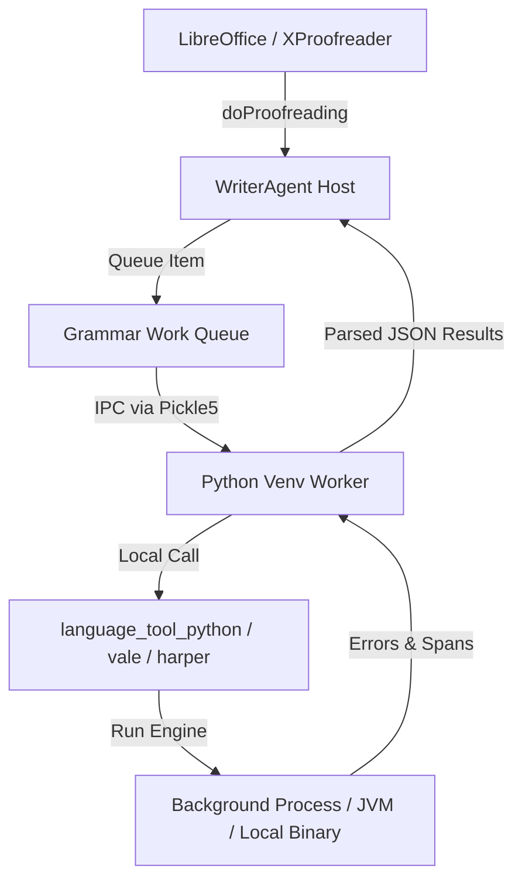

# Technical Evaluation: Offline, Cross-Process & Pip-Installable Grammar Checkers

This document provides a detailed evaluation of offline, non-LLM grammar and style checking solutions. It outlines their capabilities, language support, installation footprints (with a preference for `pip` packages), and integration designs within the WriterAgent architecture.

---

## Executive Summary & Comparison

| Tool / Engine | Primary Installation | Multilingual Support | Key Strength | Ideal Audience / Use Case |
| :--- | :--- | :--- | :--- | :--- |
| **LanguageTool (`language-tool-python`)** | `pip install language-tool-python` (with local Java runtime) | **Very High** (30+ languages: EN, DE, FR, ES, PT, PL, RU, etc.) | Industry standard, massive rule set, correction suggestions | Users needing robust, multilingual grammar and spelling checks offline. |
| **Vale** | System package manager (or binary download) + `vale sync` | **Language-Agnostic** (Core engine is regex-based; styles are mostly EN) | Enforces style guides, highly customizable, markup-aware | Teams matching strict editorial guides (Microsoft, Google) in prose. |
| **Harper** | `cargo install` or precompiled binaries | **Low** (English only: US, UK, CA, AU, IN dialects) | High performance, lightweight Rust codebase, privacy-first | Users wanting a lightweight, local English-only checker. |
| **Proselint** | `pip install proselint` | **Low** (English only) | Zero-dependency, pure Python, fast stylistic checks | Users wanting a quick, style-focused pre-pass with zero environment setup. |

---

## 1. LanguageTool via `language-tool-python`

This wrapper manages a local instance of the Java-based LanguageTool engine, allowing full offline checks via standard Python calls.

### Technical Details & Installation
*   **Command:** `pip install language-tool-python`
*   **Initialization (Python):**
    ```python
    import language_tool_python
    # Starts the local background Java server (auto-downloads JARs on first run)
    tool = language_tool_python.LanguageTool('de-DE') 
    matches = tool.check("Es gibt ein Fehler hier.")
    ```
*   **Language Support:** **Excellent (Native Multilingual)**. Fully supports English, Spanish, French, German, Polish, Portuguese, Russian, and 20+ other languages natively out-of-the-box.
*   **Licensing & Hosting:** Local server JARs are loaded into the user's home directory. Data remains 100% local.

### PM & Dev Considerations
*   > [!IMPORTANT]
    > **Dependency:** Requires a Java Runtime Environment (JRE) installed on the system. Since LibreOffice often depends on Java for certain features (e.g., Base database, specific macro features), many users already have JRE installed.
*   **Memory Footprint:** Starts a JVM process. Warmed-up memory usage can be 200MB-500MB, but response latency is low (usually sub-50ms per sentence).

---

## 2. Vale (Prose Linter with Pre-made Styles)

Vale is a Go-based command-line tool. Rather than doing classical NLP-based grammar parsing, it acts as a **style linter** that parses files (HTML, Markdown, XML) and applies regex-based rules.

### Pre-Made Style Guides (Ready-to-use)
You do not have to write rules from scratch. Vale officially maintains packaged style guides:
*   **Microsoft:** Rules from the *Microsoft Writing Style Guide* (acronyms, capitalization, word choice).
*   **Google:** Rules from the *Google Developer Documentation Style Guide*.
*   **write-good:** Enforces the common prose checks (cliches, passive voice, wordiness) from the popular `write-good` linter.
*   **proselint / alex:** Packages carrying rules from `proselint` and `alex` (non-inclusive language).

### Integration & Usage
1.  **Configuration (`.vale.ini`):**
    ```ini
    StylesPath = styles
    MinAlertLevel = suggestion

    Packages = Microsoft, Google, write-good

    [*]
    BasedOnStyles = Microsoft, Google, write-good
    ```
2.  **Download styles:** Run `vale sync` to automatically download the styles.
3.  **Language Support:** **Language-agnostic engine**, but pre-made packages are almost exclusively English. Writing rules for other languages requires custom regex sets.

### PM & Dev Considerations
*   **Installation (Python Package Wrapper):** Although Vale is a compiled Go binary, it can be seamlessly installed using the `vale` package on PyPI (`pip install vale`). During installation, the Python package automatically detects the host architecture and downloads the correct precompiled native binary directly into the virtual environment's `bin/` directory. This bypasses any system package manager requirements.
*   **Pro:** Extremely fast execution, processes markup (like HTML/Markdown) natively without complaining about inline code blocks, and has an incredibly low memory footprint (a few megabytes).

### Style Guide Deep-Dive: Microsoft vs. Google
When choosing which ruleset to enable, teams generally compare the **Microsoft Writing Style Guide** and the **Google Developer Documentation Style Guide**:

#### Microsoft Writing Style Guide
*   **Philosophy & Brand Voice:** Focuses on being "simple, human, and friendly." It leans heavily into a warm, conversational, and user-centric tone.
*   **Coverage:** Evolved from the long-standing *Microsoft Manual of Style*, making it highly comprehensive for broad software help, error messages, user interface (UI/UX) text, and general IT documentation.
*   **Target Audience:** Ideal for end-users, consumers, and general software administrators.

#### Google Developer Documentation Style Guide
*   **Philosophy & Brand Voice:** Focuses on being "informative, direct, and scannable." It values absolute clarity and structure.
*   **Coverage:** Tailored specifically for engineers and developer portals. It excels at explaining technical APIs, code snippet formatting, command-line arguments, and mathematical notations.
*   **Target Audience:** Ideal for developers, API users, and open-source contributors.

#### What Humans Think is Better
*   **For General Writing:** Humans generally prefer **Microsoft's** guidelines because the tone recommendations help prevent prose from feeling cold, robotic, or overly dry.
*   **For Technical References:** Developers and technical writers prefer **Google's** guide because it is highly modular, easy to scan, and provides specific rules on code-level formatting (e.g., punctuation inside code tags).

---


## 3. Harper (Rust-backed Grammar Engine)

Harper is a fast, memory-safe, offline-first grammar checker written in Rust.

### Technical Details & Integration
*   **Command:** Automatically resolved by the worker. Uses a precompiled static binary fetched directly from the official releases page.
*   **Language Support:** **English Only** (supports US, UK, Canadian, Australian, and Indian dialects). 
*   **Performance:** Built specifically to be faster and consume less memory than JVM-based alternatives (sub-millisecond execution times).

### PM & Dev Considerations
*   **Zero-Setup Auto-Download:** Rather than requiring a `cargo install`, the worker dynamically detects the host OS/architecture and downloads the correct precompiled `harper-cli` binary from GitHub releases into the profile directory.
*   **Global PATH Fallback:** Prioritizes system-wide installations (using `shutil.which`) if the user already has `harper-cli` installed on their PATH.

---


## 4. Proselint (Pure Python Style Linter)

Proselint is a pure-Python library designed to lint prose for writing quality, cliches, and stylistic issues.

### Technical Details & Installation
*   **Command:** `pip install proselint`
*   **Usage:**
    ```python
    import proselint
    errors = proselint.tools.lint("This is a very unique sentence.")
    ```
*   **Language Support:** **English Only**.

### PM & Dev Considerations
*   **Pro:** Simplest path for Python developers. Installing in the venv requires zero system dependencies (no Java, Go, or Rust compilers needed).
*   **Con:** Checks are limited to stylistic guidelines and common word-choice traps; it lacks a robust syntactic grammar rules database or spelling checker.

---

## Architecture Design for WriterAgent Integration

If integrating one of these local checkers as an alternative to the LLM path, the following architecture is recommended:



---

## 5. Integrated Solutions in WriterAgent

As of June 2026, WriterAgent supports three offline, local linting engines as alternatives to the LLM-based checking provider:

### 1. LanguageTool (Local)
*   **Wrapper:** `language-tool-python` (JVM background server).
*   **Key Strengths:** Multilingual support (30+ languages).
*   **Setup:** Downloads JRE/LanguageTool JAR files (~250MB) on first run.

### 2. Vale Style Linter (WIP)
*   **Wrapper:** Compiled Go binary (`vale` PyPI package wrapper).
*   **Key Strengths:** Enforces professional developer/consumer editorial style guides (Google, Microsoft, write-good).
*   **Setup:** Downloads package files and runs `vale sync` to fetch style packages.

### 3. Harper Rust Linter (Local)
*   **Wrapper:** Compiled Rust binary (`harper-cli`).
*   **Key Strengths:** Sub-millisecond execution times, minimal memory consumption, zero dependencies (no Java or external runtime engines).
*   **Setup:** Auto-downloads the native platform binary from GitHub releases.


