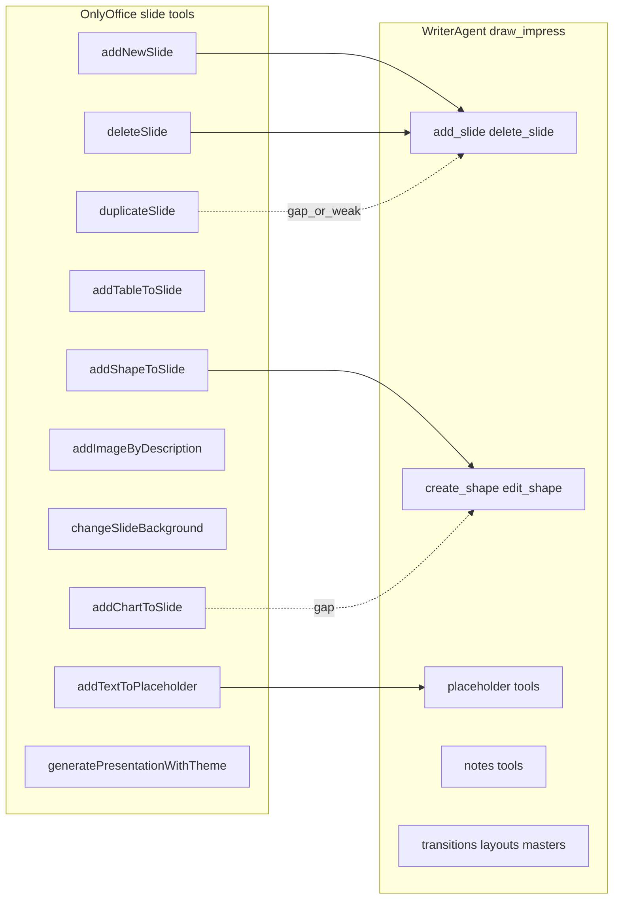

# OnlyOfficeAI vs WriterAgent — analysis (merged)

## 1. History

This note is **a point-in-time comparison** between the upstream **OnlyOfficeAI** JavaScript plugin and **WriterAgent** (LibreOffice Python/UNO). The OnlyOffice codebase and `RegisteredFunction` catalog **change upstream**; line numbers and tool names drift. Expect to **re-diff** periodically (see [§13 How to refresh this document](#13-how-to-refresh-this-document)).

**Provenance (how this doc was assembled):**

- Earlier **architecture + Word-oriented** takeaways and the `RegisteredFunction` survey lived in a single file that became the base for this merge.
- A separate **Calc + Impress crosswalk** (`onlyoffice_calc_impressplan.md` in this repo) compared `helpers.js` regions `HELPERS.cell` and `HELPERS.slide` to WriterAgent’s [`plugin/calc/`](plugin/calc/) and [`plugin/draw/`](plugin/draw/). That material is **folded in below** so one file holds the full picture.
- **Snapshot age:** the underlying OnlyOffice review was done roughly **~1 month before** this merge; treat tool lists and `helpers.js` anchors as **indicative**, not contractual.

**Why we care about OnlyOffice at all:** their `RegisteredFunction` blocks are a useful **schema and UX catalog** (enums, examples, validation errors). Portable **document logic** rarely copies cleanly to LibreOffice; WriterAgent should keep **explicit UNO tools** and mine OO for **prompts, parameter shapes, and edge-case messaging**—not for verbatim JS.

---

## 2. What’s next

This section is the **forward-looking backlog** implied by the comparison. Items are grouped by area; within each group, **higher impact** tends to come first. None of this is a commitment—only a structured “if we want parity or polish” list.

### 2.1 Calc — features and quality

| Priority | Item | Rationale |
|----------|------|-----------|
| High | **`set_auto_filter` (or equivalent)** — filter criteria / AutoFilter-style API via UNO (`XSheetFilterDescriptor` or dispatch) | OnlyOffice exposes rich `setAutoFilter` operators; WriterAgent had **no surfaced** auto-filter tool in the earlier grep pass. High user value for spreadsheet agents. |
| High | **`summarizeData`-style thin tool** (optional) | Pattern: export range → LLM narrative → write text to a **named adjacent cell**. Today: `read_cell_range` + chat + manual write, or scripts. A single tool improves agent reliability and placement UX. |
| Medium | **Deterministic `highlightDuplicates` / anomaly helpers** | OO often uses **LLM** to decide duplicates/outliers; for correctness, prefer **Python/UNO** detection + one pass of `set_style` or conditional formatting; use OO only for **validation messages** and highlight application ideas. |
| Medium | **Pivot: NL-only layout and pivot charts** | WriterAgent already has DataPilot tools in [`plugin/calc/pivot.py`](plugin/calc/pivot.py). OO’s `insertPivotTable` is still useful for **natural-language → field indices** prompts and error copy. **Pivot charts** and layout without explicit headers are **not** implemented (see [`AGENTS.md`](AGENTS.md) §5 and header of `pivot.py`). |
| Medium | **Expand `create_chart` type enum** using OO’s long `chartType` list | Reduces model hallucination; must still match what UNO actually supports in [`plugin/calc/charts.py`](plugin/calc/charts.py). |
| Lower / research | **Conditional-formatting preset parity** (`addDataBars`, `addIconSet`, `addColorScale`, top-10, etc.) | WriterAgent’s [`add_conditional_format`](plugin/calc/conditional.py) is **classic** operator + cell style. Excel-style presets need **LibreOffice UNO** research, not JS porting. Use OO enums as a **checklist** only. |
| Lower | **`formatTable`-style “format as table”** | Only partial overlap with [`set_style`](plugin/calc/cells.py) and structure tools; add only if product definition matches. |
| Avoid | **`writeMacro` / arbitrary JS** | Same as Word: **not** a WriterAgent direction—security and portability. |

### 2.2 Impress / Draw — features

| Priority | Item | Rationale |
|----------|------|-----------|
| High | **`duplicate_slide` as a real, safe tool** | [`DrawBridge.duplicate_slide`](plugin/draw/bridge.py) exists but was **not** registered; implementation risk: `new_page.add(shape)` can **move** shapes instead of cloning. Need proper UNO clone/copy before parity with OO `duplicateSlide`. |
| High | **Slide-embedded ** **`addChartToSlide`** | OO builds charts with in-memory series; WriterAgent [`create_chart`](plugin/calc/charts.py) is **SpreadsheetDocument-only**. Presentations need a dedicated path or a documented workflow. |
| Medium | **`addTableToSlide`** | Verify whether [`create_shape`](plugin/draw/shapes.py) can target table services; otherwise add a thin wrapper. |
| Medium | **`changeSlideBackground` / slide fill** | May need a dedicated tool beyond [`set_slide_transition`](plugin/draw/transitions.py) / layout APIs. |
| Lower | **`generatePresentationWithTheme`** | No WriterAgent twin; if ever built, mine OO for **decomposition prompts** only. |

**Agent-facing detail:** OO examples often use **1-based** slide indices; WriterAgent schemas use **0-based** indices—keep that explicit in tool descriptions.

### 2.3 Writer / cross-cutting — product and engineering

| Priority | Item | Rationale |
|----------|------|-----------|
| Medium | **Tool definitions: `examples` / few-shot in schema** | OO embeds example prompts + arguments in `RegisteredFunction`; improves grounding for complex tools. |
| Medium | **Streaming cancellation** | OO uses `AbortController` + reader cancel; WriterAgent could mirror with explicit cancel tokens on HTTP/stream paths where safe. |
| Medium | **Undo grouping audit** | OO `GroupActions` / `StartAction`–`EndAction`: map to LibreOffice `XUndoManager.enterUndoContext` / `leaveUndoContext` for **whole** tool batches where not already wrapped. |
| Medium | **`rewriteText`-style tool** | Sidebar has Extend/Edit; a **named tool** improves discoverability for tool-calling agents. |
| Lower | **`checkSpelling` / paragraph proofread tool** | Overlaps native grammar / linguistic work; useful if you want OO-style “fix this paragraph” as a first-class tool. |
| Lower | **Char-level `changeTextStyle` clarity** | If models struggle vs paragraph styles, expose clearer Writer char-style tools or docs. |
| Lower | **Sidebar UX: incremental markdown rendering** | OnlyOffice updates DOM incrementally; consider if large chat histories become hot. |

### 2.4 Maintaining this document

- Re-enumerate `RegisteredFunction` names in `onlyofficeai/scripts/helpers/helpers.js` after OnlyOffice upgrades.
- Re-grep WriterAgent for new tools (`plugin/calc/`, `plugin/draw/`, `plugin/writer/`) and update matrices.
- Bump the **snapshot note** in §1 when you refresh.

---

## 3. Overview

OnlyOfficeAI is a **JavaScript** plugin: chat, providers, and document actions via `Asc.Editor.callCommand` / `callMethod` and a large tool catalog in `scripts/helpers/helpers.js`. WriterAgent is **Python + UNO** with auto-discovered `ToolBase` classes and [`LlmClient`](plugin/framework/client/llm_client.py).

### 3.1 OnlyOfficeAI directory layout (reference)

```text
onlyofficeai/
├── config.json
├── index.html
├── chat.html
├── scripts/
│   ├── engine/          # AI engine and providers
│   ├── helpers/         # helpers.js — RegisteredFunction tools
│   ├── utils/
│   └── *.js
├── components/
├── resources/
└── vendor/
```

---

## 4. Patterns worth studying (general)

### 4.1 Document integration (`Asc.Editor` + `Asc.scope`)

OnlyOffice runs macros in document context via `Asc.Editor.callCommand` / `callMethod`, passing data through **`Asc.scope`**. WriterAgent uses **main-thread UNO** execution (`execute_on_main_thread` and tool execution rules); the analogy is **marshalling opaque parameters across a boundary**—OO’s explicit scope object is a clean mental model for “what crosses the fence.”

### 4.2 Multi-provider engine (`scripts/engine/providers/`)

- **Capability bitmasks** (e.g. tools / chat / image flags).
- **Proxy vs direct** (`isUseProxy`) for CORS/network—relevant for enterprise LibreOffice deployments with odd HTTP paths.

WriterAgent aligns on capabilities via [`ModelCapability`](plugin/framework/constants.py) (`IntFlag`) and provider logic in [`plugin/framework/client/auth.py`](plugin/framework/client/auth.py) / [`LlmClient`](plugin/framework/client/llm_client.py).

### 4.3 Tool registration (`RegisteredFunction` → OpenAI-shaped `tools`)

Tools define `name`, `description`, JSON Schema `parameters`, sometimes **`examples`** and **`returns`**. `provider.js` maps them to `type: "function"` entries for chat completions.

**Takeaways for WriterAgent:**

- **Examples inside tool schema** reduce argument drift.
- **Strict validation** before execute (OO raises `ToolError`)—mirror with structured tool errors on the Python side.
- **Rich `enum`s** (e.g. many chart types) help models pick legal values—align enums with UNO reality.

---

## 5. Already adopted or strongly aligned in WriterAgent

### 5.1 Forms (OnlyOffice `generateForm`)

OnlyOffice prompts the model for **HTML** plus **`{FIELD:…}`** hooks. WriterAgent implements the same pattern in [`plugin/writer/forms.py`](plugin/writer/forms.py):

- `create_form_control`, `create_form` (batch `fields`),
- `generate_form` (`_process_form_content` → `insert_html_at_cursor` + `CreateFormControl`),
- `list_form_controls`, `edit_form_control`, `delete_form_control`.

**Not portable:** OnlyOffice `generateDocx` (binary OOXML generation) has no LibreOffice twin; export stories stay different.

### 5.2 Model capabilities

[`ModelCapability`](plugin/framework/constants.py) uses bitflags for chat / vision / tools / etc., similar in spirit to OO’s capability UI flags.

### 5.3 Native provider shims and wire-level streaming

[`LlmClient`](plugin/framework/client/llm_client.py) includes Anthropic and Gemini-specific request/response handling. For **streaming line shapes**, [`plugin/framework/client/stream_normalizer.py`](plugin/framework/client/stream_normalizer.py) `iterate_sse` accepts both `data: …` SSE lines and **raw `{…}` JSON lines** (e.g. some Gemini streams); `_normalize_delta` patches common provider quirks before accumulation.

### 5.4 Images

OnlyOffice Word `addImage`: generate → insert/replace inside grouped actions. WriterAgent: [`generate_image`](../plugin/writer/image_utils.py) + [`plugin/writer/image_tools.py`](../plugin/writer/image_tools.py) (`insert_image`, `replace_image_in_place`, etc.).

---

## 6. Chat UI and execution grouping (candidates, not fully mirrored)

OnlyOffice uses **`StartAction` / `EndAction`** and **`GroupActions`** so multi-step tool runs do not flood undo or flicker. LibreOffice’s **`XUndoManager.enterUndoContext` / `leaveUndoContext`** is the conceptual match; worth auditing tool batches for consistent grouping (see §2.3).

**Other UI ideas:** stream **abort** (`AbortController`); incremental markdown DOM updates for huge histories.

---

## 7. Calc: OnlyOffice `HELPERS.cell` vs WriterAgent

**Sources:** `onlyofficeai/scripts/helpers/helpers.js` — `HELPERS.cell` ~line 4215 (indices drift). WriterAgent: [`plugin/calc/`](plugin/calc/).

### 7.1 Strong overlap (intent already covered)

| OnlyOffice (`HELPERS.cell`) | What OO does (brief) | WriterAgent |
|-----------------------------|----------------------|-------------|
| `addChart` | Chart from range, rich `chartType` enum | [`create_chart`](plugin/calc/charts.py) — smaller `chart_type` enum; list/edit/delete + `get_chart_info` |
| `setSort` / `setMultiSort` | Range sort | [`sort_range`](plugin/calc/cells.py) |
| `addConditionalFormatting` / granular rules | Many presets | [`add_conditional_format`](plugin/calc/conditional.py), [`list_conditional_formats`](plugin/calc/conditional.py), [`remove_conditional_formats`](plugin/calc/conditional.py) |
| `clearConditionalFormatting` | Clear CF | `remove_conditional_formats` |
| `explainFormula` | LLM explains formula | [`detect_and_explain_errors`](plugin/calc/formulas.py) + [`error_detector.py`](plugin/calc/error_detector.py) / [`inspector.py`](plugin/calc/inspector.py) |
| `formatTable` | Table-like formatting | Partial: [`set_style`](plugin/calc/cells.py), merge/sort/delete structure |
| `changeTextStyle` (cell) | Char/cell styling | [`set_style`](plugin/calc/cells.py) |
| `addImage` (cell) | Image on sheet | Shared image pipeline; draw page insert via [`plugin/writer/image_tools.py`](../plugin/writer/image_tools.py) (`_insert_image_to_drawpage`); specialized Calc images via [`ToolCalcImageBase`](plugin/calc/base.py) |

### 7.2 Partial overlap — OO is “AI-first”; WriterAgent is “UNO + optional LLM”

| OnlyOffice | Behavior worth noting | WriterAgent gap / bridge |
|------------|------------------------|---------------------------|
| `highlightDuplicates` | Range → **LLM** → highlight | No dedicated tool; prefer **deterministic** duplicate detection + style/CF |
| `highlightAnomalies` | AI outliers → highlight | Same; or stats via [`execute_python_script`](plugin/calc/python_executor.py) when enabled |
| `summarizeData` | CSV-ish export → LLM prose → adjacent cell | Composable today; thin tool candidate (§2.1) |
| `insertPivotTable` | Api + LLM parses NL → field indices | WriterAgent: [`plugin/calc/pivot.py`](plugin/calc/pivot.py) (`DataPilot`); OO useful for **prompts/errors** only |
| `setAutoFilter` | Rich Excel-like criteria | **Gap** — major candidate (§2.1) |
| `fillMissingData` / `fixFormula` | LLM + writes | Partial: `write_formula_range`, `detect_and_explain_errors` |

### 7.3 OO-only granular conditional presets

Separate `RegisteredFunction` names: `addDataBars`, `addIconSet`, `addColorScale`, `addTop10Condition`, `addUniqueValues`, `addAboveAverage`, `addCellValueCondition`. WriterAgent’s generic CF path does **not** automatically equal Excel-style data bars/icon sets—needs UNO capability research (§2.1).

### 7.4 WriterAgent Calc surface OO does not mirror

[`list_sheets`](plugin/calc/sheets.py), [`switch_sheet`](plugin/calc/sheets.py), [`create_sheet`](plugin/calc/sheets.py), [`get_sheet_summary`](plugin/calc/sheets.py); [`read_cell_range`](plugin/calc/cells.py), [`write_formula_range`](plugin/calc/cells.py), [`merge_cells`](plugin/calc/cells.py), [`delete_structure`](plugin/calc/cells.py); [`list_named_ranges`](plugin/calc/navigation.py), [`search_in_spreadsheet`](plugin/calc/search.py), [`replace_in_spreadsheet`](plugin/calc/search.py); comments in [`plugin/calc/comments.py`](plugin/calc/comments.py); [`delegate_to_specialized_calc_toolset`](plugin/calc/specialized.py).

### 7.5 Where to mine OnlyOffice Calc code

1. **`insertPivotTable`** — NL → indices prompt; missing sheet/range errors; unique sheet naming. Implement in WriterAgent stays UNO/`pivot.py`.
2. **`summarizeData`** — serialization + “write beside range” UX.
3. **`highlightDuplicates`** — strict validation (e.g. hex colors); detection logic preferably not LLM.
4. **`setAutoFilter`** — operator enum list for **JSON schema docs**; implementation = UNO filtering.
5. **`addChart`** — enum list for anti-hallucination.
6. **Avoid** `writeMacro`.

---

## 8. Impress / slide: OnlyOffice `HELPERS.slide` vs WriterAgent

**Sources:** `helpers.js` — `HELPERS.slide` ~line 1214 (drifts).

### 8.1 Representative OO slide tools

`addChartToSlide`, `addNewSlide`, `addShapeToSlide`, `addTableToSlide`, `addTextToPlaceholder`, `addImageByDescription`, `changeSlideBackground`, `deleteSlide`, `duplicateSlide`, `generatePresentationWithTheme`.

### 8.2 WriterAgent Draw/Impress tools

| Area | Tools (files) |
|------|----------------|
| Slides | [`add_slide`](plugin/draw/pages.py), [`delete_slide`](plugin/draw/pages.py), [`read_slide_text`](plugin/draw/pages.py), [`get_presentation_info`](plugin/draw/pages.py) |
| Shapes | [`create_shape`](plugin/draw/shapes.py), [`edit_shape`](plugin/draw/shapes.py), [`delete_shape`](plugin/draw/shapes.py), [`shapes_connect`](plugin/draw/shapes.py), [`shapes_group`](plugin/draw/shapes.py), [`list_pages`](plugin/draw/shapes.py), [`get_draw_summary`](plugin/draw/shapes.py) |
| Placeholders / notes | [`plugin/draw/placeholders.py`](plugin/draw/placeholders.py), [`plugin/draw/notes.py`](plugin/draw/notes.py) |
| Masters / transitions | [`plugin/draw/masters.py`](plugin/draw/masters.py), [`plugin/draw/transitions.py`](plugin/draw/transitions.py) |
| Tree | [`get_draw_tree`](plugin/draw/tree.py) |
| Delegate | [`delegate_to_specialized_draw_toolset`](plugin/draw/specialized.py) |

### 8.3 Overlap diagram



### 8.4 Gap notes

- **`addNewSlide` / `deleteSlide`:** covered by `add_slide` / `delete_slide`; mind **0-based** vs OO **1-based** examples.
- **`duplicateSlide`:** safe duplicate + tool exposure — §2.2.
- **`addChartToSlide`:** spreadsheet `create_chart` does not cover embedded presentation charts — §2.2.
- **`addTableToSlide`:** verify `create_shape` table path — §2.2.
- **`addTextToPlaceholder`:** [`set_placeholder_text`](plugin/draw/placeholders.py).
- **`addImageByDescription`:** `generate_image` + draw-page insert.
- **`changeSlideBackground`:** possible dedicated tool — §2.2.
- **`generatePresentationWithTheme`:** prompt-only borrow if ever implemented.

---

## 9. Other Word-area `RegisteredFunction` tools (survey)

Derived from `helpers.js` unique `name` values (re-verify when refreshing). “Candidate” means **worth evaluating**, not “must build.”

| OnlyOffice tool | Role | WriterAgent note |
|-----------------|------|------------------|
| `addImage` | Text-to-image + insert/replace | `generate_image` + `image_tools` |
| `generateForm` | LLM + field markup | **Ported** — `forms.py` |
| `checkSpelling` | LLM fixes paragraph | Candidate — proofread/grammar tool |
| `rewriteText` | LLM rewrite selection | Candidate — explicit tool vs Extend/Edit |
| `commentText` | LLM + comment | Partial — comments / tracking tools |
| `changeParagraphStyle` | Style by name | `styles_apply` / styles tools |
| `changeTextStyle` | Char styling | Candidate if model UX is weak |
| `insertPage` | New page | `insert_page_break` / page tools |
| `writeMacro` | Run JS | **Not recommended** |
| `addChart`, conditional, sort, pivot, … | Calc | See §7 |
| `addChartToSlide`, `addNewSlide`, … | Impress | See §8 |

---

## 10. Implemented WriterAgent improvements (inspired by OnlyOffice-style thinking)

1. **`ModelCapability`** — [`plugin/framework/constants.py`](plugin/framework/constants.py).
2. **Native shims** — Anthropic `/v1/messages`, Gemini `v1beta`, stream quirks; legacy Bearer fallback — [`plugin/framework/client/llm_client.py`](plugin/framework/client/llm_client.py), [`plugin/framework/client/auth.py`](plugin/framework/client/auth.py).
3. **Stream line handling** — `iterate_sse` + delta patches — [`plugin/framework/client/stream_normalizer.py`](plugin/framework/client/stream_normalizer.py).
4. **Form tools** — [`plugin/writer/forms.py`](plugin/writer/forms.py).

---

## 11. Non-goals (explicit)

- **Arbitrary macro execution** (`writeMacro` or user JS) in WriterAgent.
- **Treat OnlyOffice helpers as callable libraries** — they are **design references** for schemas and workflows; LibreOffice semantics differ.

---

## 12. Source map

| Artifact | Role |
|---------|------|
| This file | Canonical merged analysis for the repo |
| Historical split: `onlyoffice_calc_impressplan.md` | Calc/Impress matrix source (now inlined in §7–§8); keep file if you still want Cursor-plan YAML there, or delete/stub if you prefer a single doc |
| Upstream: `onlyofficeai/scripts/helpers/helpers.js` | `RegisteredFunction` catalog — **re-diff on upgrade** |
| Upstream: `onlyofficeai/scripts/engine/providers/provider.js` | Tool payload mapping |

---

## 13. How to refresh this document

1. Pull current OnlyOfficeAI and locate `HELPERS.cell` / `HELPERS.slide` / Word blocks in `helpers.js`.
2. Search `new RegisteredFunction` / `"name":` to regenerate tool name inventories.
3. Grep WriterAgent `plugin/{calc,draw,writer}/` for new tool classes or renamed files.
4. Update §**1 History** snapshot sentence and §**2 What’s next** rows when gaps close or new OO tools appear.
