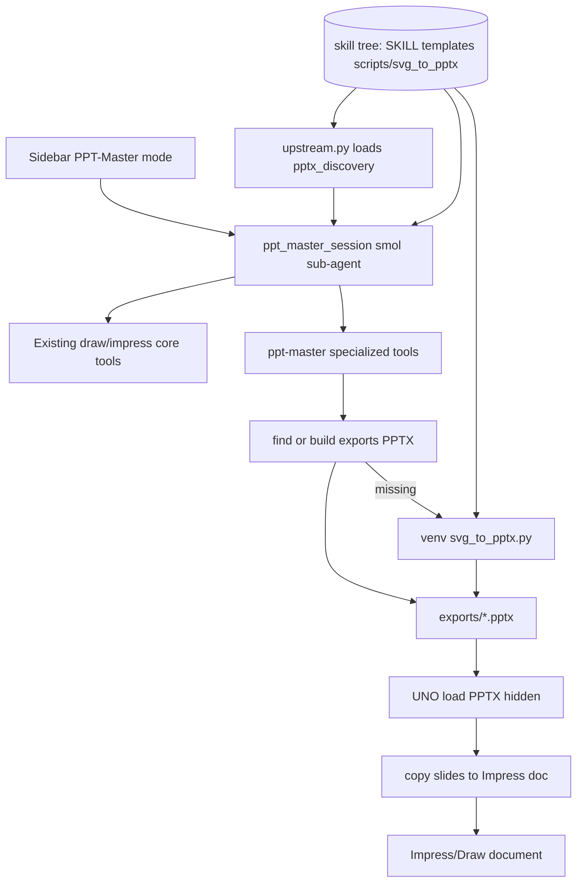

# Integration Plan: PPT-Master in WriterAgent (Adapter Layer)

This document describes how [ppt-master](https://github.com/hugohe3/ppt-master) integrates with WriterAgent: a **UNO adapter layer**, **sidebar PPT-Master mode** (Impress/Draw only), and **upstream assets from a cloned skill tree** (not vendored in the OXT).

## Status (implementation summary)

| Decision | Choice |
|----------|--------|
| Upstream `svg_to_pptx` | **Not** copied into `plugin/contrib/` — loaded from skill tree `scripts/svg_to_pptx/` |
| WriterAgent-only code | Four modules under [`plugin/contrib/ppt_master/`](../plugin/contrib/ppt_master/) |
| Host / UNO | [`plugin/ppt_master/`](../plugin/ppt_master/) (client, paths, tools, adapters) |
| Sidebar UX | Smol sub-agent via [`plugin/chatbot/ppt_master.py`](../plugin/chatbot/ppt_master.py) — hidden from main chat (like Brainstorming) |
| Dev reference clone | Optional repo root `ppt-master/` (not shipped) |

**Removed during cleanup (no longer in tree):**

- `plugin/contrib/ppt_master/bundled/svg_to_pptx/` — byte-identical upstream copy (~18 files); deleted in favor of external skill tree
- `plugin/contrib/ppt_master/backends/` — unused protocol stubs
- `plugin/ppt_master/diagnostics.py` — install hint moved to `paths.PPT_MASTER_INSTALL_CMD`
- `plugin/ppt_master/venv/` — dead worker stub removed; export is host-side PPTX import
- `plugin/contrib/ppt_master/svg_convert.py`, `shape_ops.py`, `svg_preprocess.py`, `plugin/ppt_master/adapter/uno_apply.py`, `uno_svg_import.py`, `uno_svg_deck.py` — removed; replaced by PPTX build + LO PPTX import

## Overview

ppt-master is an agentic workflow (SKILL.md + project artifacts + SVG → native shapes). WriterAgent:

1. Ships **adapter modules** under [`plugin/contrib/ppt_master/`](../plugin/contrib/ppt_master/) — see [`README.md`](../plugin/contrib/ppt_master/README.md)
2. Loads **unmodified upstream** Python and assets from the configured skill tree (`PPT_MASTER_DATA_ROOT`)
3. Hosts **UNO adapters** under [`plugin/ppt_master/`](../plugin/ppt_master/)
4. Exposes **PPT-Master** in the sidebar mode dropdown for **Impress and Draw only**
5. Runs a **smol sub-agent** when that mode is selected — tools use `specialized_domain="ppt-master"` and are excluded from the main agent / `delegate_to_specialized_draw_toolset`

## Packaging

Upstream [ppt-master](https://github.com/hugohe3/ppt-master) is a **skill/workflow repo**, not a pip package (no `pyproject.toml`). Install by cloning and pointing Settings at the skill directory:

```bash
git clone https://github.com/hugohe3/ppt-master.git
```

Then **Settings → Python** → **PPT-Master data path** → `.../ppt-master/skills/ppt-master` (must contain `SKILL.md`, `templates/`, `scripts/svg_to_pptx/`).

**Dev without manual path:** clone upstream beside the repo as `ppt-master/`; `paths._dev_clone_data_root()` finds `ppt-master/skills/ppt-master` automatically.

| Layer | In OXT? | Location |
|-------|---------|----------|
| UNO adapter (`coords`, `upstream`, `config`) | Yes | `plugin/contrib/ppt_master/` |
| Upstream `scripts/svg_to_pptx`, templates, references, `SKILL.md` | **No** — user clone / path | Resolved to `PPT_MASTER_DATA_ROOT` |
| UNO apply, client, tools | Yes | `plugin/ppt_master/` |
| Sidebar session | Yes | `plugin/chatbot/ppt_master.py` |

## Settings

On **Settings → Python** (bottom of tab):

| Control | Config key | Notes |
|---------|------------|-------|
| PPT-Master data path | `scripting.ppt_master_data_path` | Directory picker row (own line, below Python options) |
| Test | — | Probes `SKILL.md`, `templates/`, `scripts/svg_to_pptx/` via `data_root_status` |

Python venv path is separate; PPT-Master does **not** require a pip install of upstream.

## Architecture



### Data root resolution (`plugin/ppt_master/paths.py`)

1. `scripting.ppt_master_data_path` (Settings → Python)
2. `PPT_MASTER_DATA_ROOT` env (set by `apply_data_root_env`)
3. User venv `site-packages` scan (optional fallback)
4. Dev clone `ppt-master/skills/ppt-master`

`data_root_status()` requires templates/references/SKILL.md **and** `scripts/` (with `svg_to_pptx/`).

### Upstream import policy (`plugin/contrib/ppt_master/upstream.py`)

- Load `pptx_discovery.py` **by file path** so `svg_to_pptx/__init__.py` is not executed on the LO host (that import chain requires `python-pptx`).
- Full `svg_to_pptx` stack runs in the **user venv** when ppt-master workflow scripts need PPTX output.

### Main export path (UNO)

`export_presentation_project` → [`uno_pptx_deck.export_project_to_doc`](../plugin/ppt_master/adapter/uno_pptx_deck.py) → [`uno_pptx_import.py`](../plugin/ppt_master/adapter/uno_pptx_import.py):

```text
svg_final/ or svg_output/  (required for auto-build)
  → find exports/*.pptx OR venv: svg_to_pptx.py -q
  → UNO loadComponentFromURL(pptx) hidden Impress doc
  → copy shapes per slide to active document (no SVG Break/postprocess)
  → optional mirror ODP: exports/{pptx_stem}.odp
```

**Why PPTX not SVG:** upstream `svg_to_pptx` already produces native DrawingML; LibreOffice’s PPTX filter preserves layout far better than the removed SVG `draw_svg_import` + Break path (~8–26% PDF diff on real decks).

### Import fidelity tooling (agents)

Compare **reference** vs **imported** output per slide using PDF as the interchange format:

| Step | Reference | Imported |
|------|-----------|----------|
| Source | Project `exports/*.pptx` (page N) | `import_pptx_slide_to_odp` → one-slide ODP |
| PDF | `soffice --headless --convert-to pdf` on PPTX | same on ODP |
| Compare | Rasterize both (`pdftoppm` or ImageMagick) → pixel diff + `diff.png` | |

**CLI:**

```bash
# Full project (writes <project>/.import_fidelity/report.json + SUMMARY.md)
python scripts/ppt_master_import_fidelity.py ppt-master/examples/ppt169_attention_is_all_you_need

# One slide while iterating
python scripts/ppt_master_import_fidelity.py path/to/project --slides 01_cover

# Structural only (shape/text counts; no pdftoppm)
python scripts/ppt_master_import_fidelity.py path/to/project --structural-only

# Stricter pass threshold (default diff_fraction 0.12)
python scripts/ppt_master_import_fidelity.py path/to/project --threshold 0.08
```

**Requires:** LibreOffice (`soffice`, UNO Python), **`pdftoppm`** (poppler) or ImageMagick for visual mode.

**Library:** [`plugin/ppt_master/fidelity.py`](../plugin/ppt_master/fidelity.py) — unit-tested in [`test_ppt_master_fidelity.py`](../tests/ppt_master/test_ppt_master_fidelity.py).

**Agent loop:**

1. Run fidelity script on a real project (e.g. `ppt169_attention_is_all_you_need`).
2. Open worst `slide_NN_*/diff.png` and side-by-side PDFs (`reference.pdf`, `imported.pdf`).
3. If diff is high, inspect LO PPTX import or upstream PPTX build — not SVG preprocess.
4. Re-run until `diff_fraction` ≤ threshold; check mirror `exports/*.odp` for manual spot-check.

**Manual export (full deck):**

```bash
# From repo root, UNO Python — or use export_presentation_project in Impress sidebar
python -c "
import officehelper, uno
from pathlib import Path
from plugin.ppt_master.adapter.uno_pptx_deck import export_project_to_doc
p = Path('ppt-master/examples/ppt169_attention_is_all_you_need')
ctx = officehelper.bootstrap()
d = ctx.ServiceManager.createInstanceWithContext('com.sun.star.frame.Desktop', ctx)
h = uno.createUnoStruct('com.sun.star.beans.PropertyValue', Name='Hidden', Value=True)
doc = d.loadComponentFromURL('private:factory/simpress', '_blank', 0, (h,))
export_project_to_doc(doc, p, ctx=ctx)
doc.storeToURL((p / 'exports' / 'deck.odp').resolve().as_uri(), ())
doc.close(True)
"
```

Reference PDF is LO’s render of the **PPTX slide**. Imported PDF is the same slide after **PPTX → ODP** import. Expect near-zero diff when LO’s PPTX filter matches PowerPoint layout.

## Routes

| Route | Implementation | Notes |
|-------|----------------|-------|
| Main export | `export_presentation_project` → `uno_pptx_import` | PPTX → ODP via LO (default) |
| template-fill | `apply_ppt_master_template_fill` → `uno_template_fill` | Incremental stub |
| native-enhance | `apply_ppt_master_native_enhance` → `uno_enhance` | `enhancement_plan.json` |
| beautify | venv `pptx_to_svg` + re-import | Not wired end-to-end yet |

## Key modules

| Module | Role |
|--------|------|
| [`plugin/chatbot/ppt_master.py`](../plugin/chatbot/ppt_master.py) | `ppt_master_session`, `collect_ppt_master_tools`, `ppt_master_finished` |
| [`plugin/chatbot/chat_sidebar_mode.py`](../plugin/chatbot/chat_sidebar_mode.py) | `CHAT_MODE_PPT_MASTER`, `sidebar_mode_flags_for_doc_type` |
| [`plugin/ppt_master/tools.py`](../plugin/ppt_master/tools.py) | Specialized tools (`ToolDrawPptMasterBase`) |
| [`plugin/ppt_master/pptx_build.py`](../plugin/ppt_master/pptx_build.py) | Find/build `exports/*.pptx` via user venv |
| [`plugin/ppt_master/adapter/uno_pptx_import.py`](../plugin/ppt_master/adapter/uno_pptx_import.py) | UNO PPTX load → copy slides to Impress |
| [`plugin/ppt_master/adapter/uno_pptx_deck.py`](../plugin/ppt_master/adapter/uno_pptx_deck.py) | Project orchestrator (build + import + mirror ODP) |
| [`plugin/ppt_master/adapter/uno_shape_postprocess.py`](../plugin/ppt_master/adapter/uno_shape_postprocess.py) | Shape clone helpers for slide copy |
| [`plugin/ppt_master/project_notes.py`](../plugin/ppt_master/project_notes.py) | Speaker notes discovery by slide index |
| [`plugin/ppt_master/fidelity.py`](../plugin/ppt_master/fidelity.py) | PDF/PNG diff: PPTX reference vs ODP import |
| [`scripts/ppt_master_import_fidelity.py`](../scripts/ppt_master_import_fidelity.py) | CLI fidelity loop for agents |
| [`plugin/framework/constants.py`](../plugin/framework/constants.py) | `IMPRESS_DRAW_SIDEBAR_ONLY_DOMAINS`, sub-agent instructions |

## Contrib merge policy

Only add files under `plugin/contrib/ppt_master/` when WriterAgent must **change** behavior. Do not re-vendor `svg_to_pptx/`. Upstream is **MIT** (Hugo He); WriterAgent adapters are **GPL-3.0-or-later** — see [`plugin/contrib/ppt_master/README.md`](../plugin/contrib/ppt_master/README.md) for the full MIT notice, upstream pin, and symbol map.

**Python files:** shipped adapters are WriterAgent-original; keep upstream attribution in README only (not in `.py` headers). When **vendoring** upstream lines, comment out replaced code with `'''` blocks in that file only (see [`plugin/contrib/nbformat/README.md`](../plugin/contrib/nbformat/README.md)).

---

## Roadmap

Backlog for PPT-Master integration work. **Priority order matters** — validate the main export path on real decks before secondary routes or large refactors.

### Agent quick start

1. Confirm dev setup: clone upstream beside repo as `ppt-master/` **or** set **Settings → Python → PPT-Master data path** to `.../ppt-master/skills/ppt-master`. Run **Test** in Settings.
2. Read [`plugin/contrib/ppt_master/README.md`](../plugin/contrib/ppt_master/README.md) symbol map (WriterAgent module ↔ upstream equivalent).
3. Trace the happy path: `export_presentation_project` → [`client.py`](../plugin/ppt_master/client.py) → [`uno_pptx_deck.py`](../plugin/ppt_master/adapter/uno_pptx_deck.py) → [`uno_pptx_import.py`](../plugin/ppt_master/adapter/uno_pptx_import.py).
4. Run tests: `pytest tests/ppt_master/`; UNO: `python -m plugin.testing_runner test_ppt_master_pptx_import_uno`; fidelity: `python scripts/ppt_master_import_fidelity.py <project>`.
5. Pick the next roadmap item below; run fidelity script before/after changes.
6. Add tests in the matching `test_*` file per [AGENTS.md](../AGENTS.md).

### What is done (v1 baseline)

| Area | Status | Notes |
|------|--------|-------|
| Settings data path + Test probe | Shipped | [`paths.py`](../plugin/ppt_master/paths.py), [`test_ppt_master_data_test_listener.py`](../tests/chatbot/test_ppt_master_data_test_listener.py) |
| Sidebar PPT-Master mode (Impress/Draw) | Shipped | [`chat_sidebar_mode.py`](../plugin/chatbot/chat_sidebar_mode.py) |
| Smol sub-agent session | Shipped | [`ppt_master.py`](../plugin/chatbot/ppt_master.py), instructions in [`constants.py`](../plugin/framework/constants.py) `PPT_MASTER_SUB_AGENT_INSTRUCTIONS` |
| Specialized tools | Shipped | [`tools.py`](../plugin/ppt_master/tools.py) — export, validate, template-fill, native-enhance, skill path |
| Main PPTX → ODP export | Shipped | [`uno_pptx_deck.py`](../plugin/ppt_master/adapter/uno_pptx_deck.py) + [`pptx_build.py`](../plugin/ppt_master/pptx_build.py) |
| PPTX auto-build from SVG | Shipped | User venv runs upstream `svg_to_pptx.py` when `exports/*.pptx` missing |
| Shape copy on import | Shipped | [`uno_shape_postprocess.py`](../plugin/ppt_master/adapter/uno_shape_postprocess.py) — clone + text props |
| Impress page size on import | Shipped | Target slide set to 25400×14288 hmm in `uno_pptx_import._ensure_target_page` |
| Multi-slide UNO tests | Shipped | [`test_ppt_master_pptx_import_uno.py`](../tests/uno/test_ppt_master_pptx_import_uno.py) — 3-slide fixture |
| Import fidelity script | Shipped | PPTX vs ODP PDF diff per slide |
| Real-project smoke | Validated | `ppt169_attention_is_all_you_need` via existing `exports/*.pptx` |
| Speaker notes matching | Partial | [`project_notes.py`](../plugin/ppt_master/project_notes.py); PPTX import copies notes from source slides |

### What is not done (gaps)

| Area | Status | Impact |
|------|--------|--------|
| LO PPTX import fidelity | **Good** | PPTX→ODP via native filter; fidelity script compares PDF pages |
| Speaker notes from project `notes/` on build | **Partial** | Notes in PPTX export when upstream `svg_to_pptx` runs; import copies from PPTX slides |
| SKILL.md auto-injection | **Manual** | Agent must call `get_ppt_master_skill_path`; workflow not pre-loaded |
| template-fill route | **Stub** | Creates slides; does not call `set_placeholder_text` |
| beautify route | **Not wired** | `pptx_to_svg` → SVG pipeline absent |
| Browser-grade SVG reference | **Optional** | Upstream [`visual_review.py`](../ppt-master/skills/ppt-master/scripts/visual_review.py) (Playwright); not wired to fidelity script |
| `make test` typecheck | **Known issue** | `SendHandlerHost._in_ppt_master_mode` unresolved in [`send_handlers.py`](../plugin/chatbot/send_handlers.py) |

### Architecture decision log (do not re-litigate without cause)

| Decision | Choice | Rationale |
|----------|--------|-----------|
| Upstream Python in OXT | **No** — external skill tree | Avoid `python-pptx` on LO host; keep OXT small |
| `svg_convert.py` / `uno_apply.py` / `uno_svg_import` / `svg_preprocess` | **Removed** | Replaced by PPTX build + LO PPTX import |
| `bundled/svg_to_pptx/` | **Removed** | Was byte-identical copy; use user clone |
| Upstream attribution | **README only** | Shipped `.py` files are WriterAgent-original ([`contrib README`](../plugin/contrib/ppt_master/README.md)) |
| Fork upstream for clarity | **Rejected for now** | Reference-only; expand rewrites or host-safe delegation instead |

**WriterAgent export path:**

```text
SVG (project) → venv svg_to_pptx → exports/*.pptx → LO PPTX import → Impress document (+ mirror ODP)
```

### Fidelity (PPTX → ODP)

Run [`scripts/ppt_master_import_fidelity.py`](../scripts/ppt_master_import_fidelity.py). Compares LO PDF render of each PPTX slide vs the same slide after `import_pptx_slide_to_odp`. Expect low `diff_fraction` when LO’s PPTX filter matches the source deck.

Primary files: [`uno_pptx_import.py`](../plugin/ppt_master/adapter/uno_pptx_import.py), [`fidelity.py`](../plugin/ppt_master/fidelity.py), [`pptx_build.py`](../plugin/ppt_master/pptx_build.py).

### Prioritized backlog

#### P0 — Validate end-to-end on a real project

**Status:** Done for [`ppt169_attention_is_all_you_need`](../ppt-master/examples/ppt169_attention_is_all_you_need) (16 slides). Repeat for additional upstream examples as regressions.

**Goal:** Confirm the main pipeline works on artifacts from upstream's normal workflow, not just unit-test SVGs.

**PM acceptance criteria:**

- User with skill tree configured can export a project folder containing `svg_final/` into an open Impress doc via PPT-Master sidebar mode.
- Slide count matches SVG count; at least one shape visible per slide.
- Document failure modes (missing path, empty folder, wrong data root) with clear tool errors.

**Dev steps:**

1. Manual test checklist (see [Manual E2E checklist](#manual-e2e-checklist-qa--pm)).
2. Run fidelity script; capture `report.json` for the example project.
3. Fixtures: [`tests/fixtures/ppt_master_minimal/`](../tests/fixtures/ppt_master_minimal/) (3 slides); add realistic snippets from failing real SVGs as needed.

**Files:** [`uno_pptx_deck.py`](../plugin/ppt_master/adapter/uno_pptx_deck.py), [`client.py`](../plugin/ppt_master/client.py), [`fidelity.py`](../plugin/ppt_master/fidelity.py).

---

#### P1 — PPTX → ODP fidelity

**Goal:** Keep PDF `diff_fraction` low on real projects (PPTX reference vs imported ODP).

**Dev strategy:** Run fidelity script on `ppt169_attention_is_all_you_need`; triage in [`uno_pptx_import.py`](../plugin/ppt_master/adapter/uno_pptx_import.py) or upstream PPTX build if reference/import diverge.

**Tests:** [`test_ppt_master_fidelity.py`](../tests/ppt_master/test_ppt_master_fidelity.py), [`test_ppt_master_pptx_import_uno.py`](../tests/uno/test_ppt_master_pptx_import_uno.py), [`test_ppt_master_pptx_build.py`](../tests/ppt_master/test_ppt_master_pptx_build.py).

---

#### P2 — Speaker notes matching

**Status:** Partial — [`project_notes.py`](../plugin/ppt_master/project_notes.py) maps project `notes/`; PPTX import copies notes from source slides.

**Goal:** Notes from project `notes/` land on the correct slides when skill tree absent or naming edge cases fail.

**Remaining:**

1. Broader fallback patterns when skill tree absent.
2. Tests: fixture project with mixed note naming; assert notes on imported slides via UNO.

---

#### P3 — Agent UX: SKILL + workflow context

**Goal:** Sub-agent follows ppt-master workflow without user re-pasting SKILL.md.

**Today:** [`PPT_MASTER_SUB_AGENT_INSTRUCTIONS`](../plugin/framework/constants.py) tells agent to call `get_ppt_master_skill_path`; no automatic injection.

**Dev steps:**

1. On session start in [`ppt_master.py`](../plugin/chatbot/ppt_master.py) `_run_ppt_master_agent`, after `apply_data_root_env`:
   - Read first N KB of `SKILL.md` from data root (or summaries from `references/`).
   - Append to instructions block (cap token size).
2. Optionally add tool `read_ppt_master_workflow_file` (relative path under data root) for on-demand reads.
3. Document route boundaries (main SVG vs template-fill vs beautify) in injected text — mirror upstream `workflows/routing.md` summary.

**Tests:** mock data root with fake `SKILL.md`; assert instructions contain expected substring (unit test on helper, not full smol run).

---

#### P4 — Secondary routes (defer until P0–P1 acceptable)

| Route | Tool | Adapter | Work |
|-------|------|---------|------|
| template-fill | `apply_ppt_master_template_fill` | [`uno_template_fill.py`](../plugin/ppt_master/adapter/uno_template_fill.py) | Wire `set_placeholder_text` via DrawBridge / existing draw tools; parse `fill_plan.json` |
| native-enhance | `apply_ppt_master_native_enhance` | [`uno_enhance.py`](../plugin/ppt_master/adapter/uno_enhance.py) | Extend when using `enhancement_plan.json` in practice |
| beautify | (none) | — | Design: venv `pptx_to_svg` → existing SVG pipeline; not started |

**PM note:** Do not prioritize beautify/template-fill until main SVG export looks good on real decks.

---

#### P5 — Tests and CI hygiene

| Task | File(s) | Done when |
|------|---------|-----------|
| Multi-slide UNO export | [`test_ppt_master_pptx_import_uno.py`](../tests/uno/test_ppt_master_pptx_import_uno.py) | ✅ 3 slides, shape checks |
| Import fidelity CLI | [`scripts/ppt_master_import_fidelity.py`](../scripts/ppt_master_import_fidelity.py) | ✅ PDF diff + `report.json` |
| Fix `ty` on PPT-Master send path | [`send_handlers.py`](../plugin/chatbot/send_handlers.py) | Declare `_in_ppt_master_mode: bool` on host class; `make test` typecheck passes |
| Regression fixtures | `tests/fixtures/ppt_master_*` | Minimal shipped; add realistic SVGs from failing slides |
| Example project baseline | `ppt169_attention_is_all_you_need` | Cover ~0.086 @ 300 dpi; slide 2 ~0.094 @ 150 dpi; slide 6 ~0.094 @ 150 dpi (from ~0.258 pre-fix) |

Run: `pytest tests/ppt_master/`; full matrix: `make test`.

### What not to do (unless requirements change)

- **Re-vendor `plugin/contrib/ppt_master/bundled/svg_to_pptx/`** — external skill tree is intentional.
- **Fork upstream Python only for attribution** — symbol map lives in contrib README.
- **Import `svg_to_pptx` package on LO host** — triggers `python-pptx` dependency ([`upstream.py`](../plugin/contrib/ppt_master/upstream.py) policy).
- **Spread effort across beautify + template-fill + fidelity in parallel** — finish P0/P1 first.

### Manual E2E checklist (QA / PM)

```text
[ ] git clone https://github.com/hugohe3/ppt-master.git
[ ] Settings → Python → PPT-Master data path → .../ppt-master/skills/ppt-master
[ ] Settings → Test → SKILL.md, templates/, scripts/svg_to_pptx/ all yes
[ ] Open LibreOffice Impress (make deploy impress)
[ ] Sidebar → mode PPT-Master
[ ] Project with svg_final/ (from upstream workflow or examples/)
[ ] Agent or tool: export_presentation_project(project_path=...)
[ ] Optional: python scripts/ppt_master_import_fidelity.py <project> — review .import_fidelity/SUMMARY.md
[ ] Verify: slide count, shapes visible, notes if present, PDF page sizes match in report.json
[ ] Note failures: element type, SVG file name, diff.png screenshot
```

### Roadmap summary (one line)

**Run fidelity script on real projects → PPTX→ODP import quality → notes matching → SKILL context → secondary routes → CI.**

---

## Tests

| File | Coverage |
|------|----------|
| `tests/ppt_master/test_ppt_master_sidebar.py` | sidebar flags, tool tier exclusion |
| `tests/ppt_master/test_ppt_master_paths.py` | config path, dev clone, upstream `pptx_discovery` |
| `tests/chatbot/test_ppt_master_data_test_listener.py` | Settings Test button probe |
| `tests/ppt_master/test_ppt_master_project.py` | Project fixture, collect_svg_files, notes |
| `tests/ppt_master/test_ppt_master_pptx_build.py` | PPTX discovery + venv build |
| `tests/ppt_master/test_ppt_master_fidelity.py` | PNG diff math, summary writer |
| `tests/uno/test_ppt_master_pptx_import_uno.py` | LO PPTX import, multi-slide fixture |

**Import fidelity (agents):** [`scripts/ppt_master_import_fidelity.py`](../scripts/ppt_master_import_fidelity.py) — see [Import fidelity tooling](#import-fidelity-tooling-agents) above.

Run: `pytest tests/ppt_master/`; UNO: `python -m plugin.testing_runner test_ppt_master_pptx_import_uno`; full matrix: `make test`.
