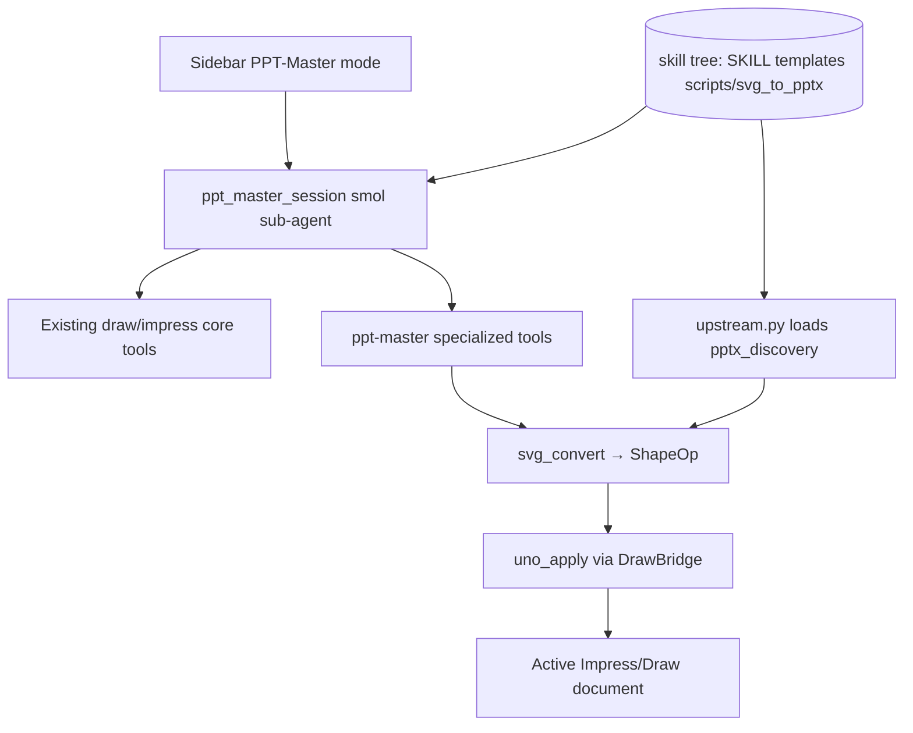

# Integration Plan: PPT-Master in WriterAgent (Adapter Layer)

This document describes how [ppt-master](https://github.com/hugohe3/ppt-master) integrates with WriterAgent: a **UNO adapter layer**, **sidebar PPT-Master mode** (Impress/Draw only), and **upstream assets from a cloned skill tree** (not vendored in the OXT).

## Status (implementation summary)

| Decision | Choice |
|----------|--------|
| Upstream `svg_to_pptx` | **Not** copied into `plugin/contrib/` — loaded from skill tree `scripts/svg_to_pptx/` |
| WriterAgent-only code | Six modules under [`plugin/contrib/ppt_master/`](../plugin/contrib/ppt_master/) |
| Host / UNO | [`plugin/ppt_master/`](../plugin/ppt_master/) (client, paths, tools, adapters) |
| Sidebar UX | Smol sub-agent via [`plugin/chatbot/ppt_master.py`](../plugin/chatbot/ppt_master.py) — hidden from main chat (like Brainstorming) |
| Dev reference clone | Optional repo root `ppt-master/` (not shipped) |

**Removed during cleanup (no longer in tree):**

- `plugin/contrib/ppt_master/bundled/svg_to_pptx/` — byte-identical upstream copy (~18 files); deleted in favor of external skill tree
- `plugin/contrib/ppt_master/backends/` — unused protocol stubs
- `plugin/ppt_master/diagnostics.py` — install hint moved to `paths.PPT_MASTER_INSTALL_CMD`
- `plugin/ppt_master/client.py` dead `export_plans_from_venv` / `venv/export.py` stub — export runs host-side `svg_convert` → `uno_apply`

## Overview

ppt-master is an agentic workflow (SKILL.md + project artifacts + SVG → native shapes). WriterAgent:

1. Ships **adapter modules** under [`plugin/contrib/ppt_master/`](../plugin/contrib/ppt_master/) — see [`README.md`](../plugin/contrib/ppt_master/README.md)
2. Loads **unmodified upstream** Python and assets from the configured skill tree (`PPT_MASTER_DATA_ROOT`)
3. Hosts **UNO adapters** under [`plugin/ppt_master/`](../plugin/ppt_master/)
4. Exposes **PPT-Master** in the sidebar mode dropdown for **Impress and Draw only**
5. Runs a **smol sub-agent** when that mode is selected — tools use `specialized_domain="ppt-master"` and are excluded from the main agent / `delegate_to_specialized_draw_toolset`

## Packaging

Upstream [ppt-master](https://github.com/hugohe3/ppt-master) is a **skill/workflow repo**, not a pip package (no `pyproject.toml`). Install by cloning and pointing Settings at the skill directory:

```bash
git clone https://github.com/hugohe3/ppt-master.git
```

Then **Settings → Python** → **PPT-Master data path** → `.../ppt-master/skills/ppt-master` (must contain `SKILL.md`, `templates/`, `scripts/svg_to_pptx/`).

**Dev without manual path:** clone upstream beside the repo as `ppt-master/`; `paths._dev_clone_data_root()` finds `ppt-master/skills/ppt-master` automatically.

| Layer | In OXT? | Location |
|-------|---------|----------|
| UNO adapter (`shape_ops`, `coords`, `svg_convert`, `upstream`, `config`) | Yes | `plugin/contrib/ppt_master/` |
| Upstream `scripts/svg_to_pptx`, templates, references, `SKILL.md` | **No** — user clone / path | Resolved to `PPT_MASTER_DATA_ROOT` |
| UNO apply, client, tools | Yes | `plugin/ppt_master/` |
| Sidebar session | Yes | `plugin/chatbot/ppt_master.py` |

## Settings

On **Settings → Python** (bottom of tab):

| Control | Config key | Notes |
|---------|------------|-------|
| PPT-Master data path | `scripting.ppt_master_data_path` | Directory picker row (own line, below Python options) |
| Test | — | Probes `SKILL.md`, `templates/`, `scripts/svg_to_pptx/` via `data_root_status` |

Python venv path is separate; PPT-Master does **not** require a pip install of upstream.

## Architecture



### Data root resolution (`plugin/ppt_master/paths.py`)

1. `scripting.ppt_master_data_path` (Settings → Python)
2. `PPT_MASTER_DATA_ROOT` env (set by `apply_data_root_env`)
3. User venv `site-packages` scan (optional fallback)
4. Dev clone `ppt-master/skills/ppt-master`

`data_root_status()` requires templates/references/SKILL.md **and** `scripts/` (with `svg_to_pptx/`).

### Upstream import policy (`plugin/contrib/ppt_master/upstream.py`)

- Load `pptx_discovery.py` **by file path** so `svg_to_pptx/__init__.py` is not executed on the LO host (that import chain requires `python-pptx`).
- Full `svg_to_pptx` stack runs in the **user venv** when ppt-master workflow scripts need PPTX output.

### Main export path (UNO)

`export_presentation_project` → `uno_svg_deck.build_plans_from_project` → `collect_svg_files` (upstream `find_svg_files` when skill tree present, else minimal fallback) → `svg_to_slide_plan` → `uno_apply.apply_slide_plans`.

## Routes

| Route | Implementation | Notes |
|-------|----------------|-------|
| Main SVG pipeline | `export_presentation_project` → `svg_convert` → `uno_apply` | Default Impress/Draw path |
| template-fill | `apply_ppt_master_template_fill` → `uno_template_fill` | Incremental stub |
| native-enhance | `apply_ppt_master_native_enhance` → `uno_enhance` | `enhancement_plan.json` |
| beautify | venv `pptx_to_svg` + SVG pipeline | Not wired end-to-end yet |

## Key modules

| Module | Role |
|--------|------|
| [`plugin/chatbot/ppt_master.py`](../plugin/chatbot/ppt_master.py) | `ppt_master_session`, `collect_ppt_master_tools`, `ppt_master_finished` |
| [`plugin/chatbot/chat_sidebar_mode.py`](../plugin/chatbot/chat_sidebar_mode.py) | `CHAT_MODE_PPT_MASTER`, `sidebar_mode_flags_for_doc_type` |
| [`plugin/ppt_master/tools.py`](../plugin/ppt_master/tools.py) | Specialized tools (`ToolDrawPptMasterBase`) |
| [`plugin/contrib/ppt_master/svg_convert.py`](../plugin/contrib/ppt_master/svg_convert.py) | Minimal SVG → `SlideBuildPlan` |
| [`plugin/ppt_master/adapter/uno_apply.py`](../plugin/ppt_master/adapter/uno_apply.py) | `ShapeOp` → UNO shapes |
| [`plugin/framework/constants.py`](../plugin/framework/constants.py) | `IMPRESS_DRAW_SIDEBAR_ONLY_DOMAINS`, sub-agent instructions |

## Contrib merge policy

Only add files under `plugin/contrib/ppt_master/` when WriterAgent must **change** behavior. Do not re-vendor `svg_to_pptx/`. When forking upstream lines, **comment out** old code rather than deleting (see `plugin/contrib/nbformat/README.md`).

## Future work

- **SVG fidelity:** expand [`plugin/contrib/ppt_master/svg_convert.py`](../plugin/contrib/ppt_master/svg_convert.py) or delegate more to upstream `drawingml_converter` where host-safe
- **SKILL.md access:** sub-agent instructions reference `get_ppt_master_skill_path`; consider reading workflow files into context automatically
- **Routes still stubbed:** `apply_ppt_master_template_fill` / beautify (`pptx_to_svg` → SVG pipeline) — wire end-to-end
- **UNO coverage:** broaden `uno_apply` shape types; UNO tests for multi-slide export

## Tests

| File | Coverage |
|------|----------|
| `tests/ppt_master/test_ppt_master_coords.py` | coords, shape_ops, svg_convert |
| `tests/ppt_master/test_ppt_master_sidebar.py` | sidebar flags, tool tier exclusion |
| `tests/ppt_master/test_ppt_master_paths.py` | config path, dev clone, upstream `pptx_discovery` |
| `tests/chatbot/test_ppt_master_data_test_listener.py` | Settings Test button probe |
| `tests/uno/test_ppt_master_adapter_uno.py` | SVG rect → Impress slide (requires `soffice`) |

Run: `pytest tests/ppt_master/` (and `make test` for full matrix).
