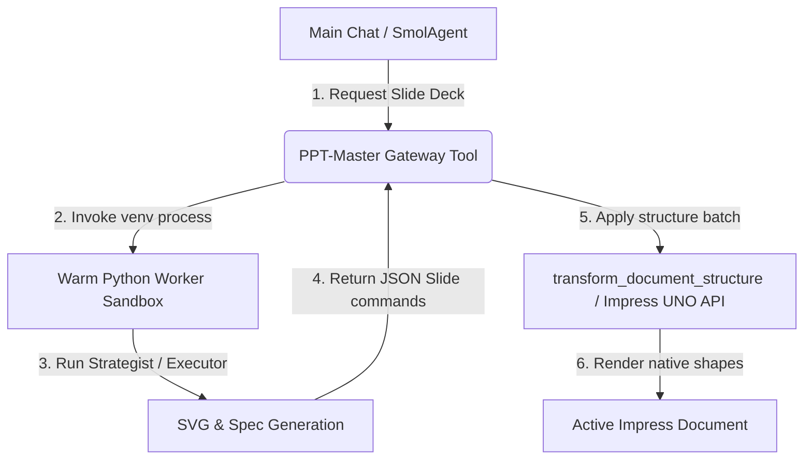
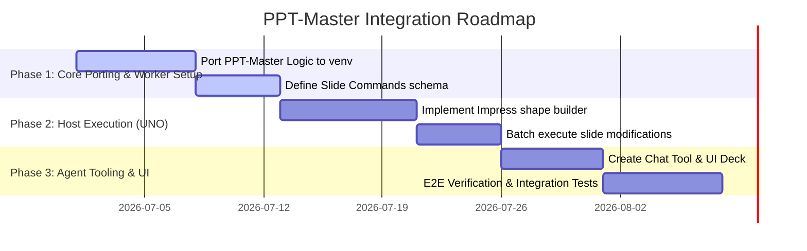

# Integration Plan: Integrating `ppt-master` into WriterAgent

This document presents a comprehensive design and execution plan for integrating the core capabilities of [ppt-master](https://github.com/hugohe3/ppt-master) into the **WriterAgent** LibreOffice extension.

---

## 1. Executive Summary & Value Proposition (PM Focus)

### Background
`ppt-master` is an agentic workflow that generates natively editable `.pptx` presentations from arbitrary source documents (PDFs, DOCX, Markdown, URLs) by first generating intermediate slide layouts (SVGs/Design Specs) and then executing them into PowerPoint structures (DrawingML/native shapes). 

Currently, **WriterAgent** supports basic Impress/Draw editing (creating individual shapes, text boxes, and slides via UNO). However, it lacks a unified, high-quality, document-to-presentation pipeline.

### The Opportunity
By integrating `ppt-master`'s strategy, layout generation, and slide consistency concepts into WriterAgent, we can enable users to:
1. **Auto-Generate Decks:** Convert active documents (e.g., a long text document in Writer or raw data in Calc) into fully styled, cohesive presentations in Impress with a single chat command.
2. **Ensure Visual Consistency:** Retain design constraints (font families, layout rhythms, color palettes, templates) across all slides using a structured design contract (`design_spec.md` / `spec_lock.md` equivalents).
3. **Natively Editable Slides:** Keep all generated slides fully editable as native LibreOffice Impress shapes rather than static flat images.

### Key Benefits
* **High-Fidelity AI Presentations:** Offers slide designs comparable to commercial tools (like Gamma or Tome) but directly inside the open-source LibreOffice ecosystem.
* **Low Code Complexity:** Leverages WriterAgent's existing Python sandbox/venv worker infrastructure and UNO shape tools to execute slide layouts without introducing external binary dependencies.

---

## 2. Architecture & Design Alignment (Senior Dev Focus)

### Existing WriterAgent Architecture Alignment
WriterAgent runs advanced Python workloads (like NumPy, pandas, or Docling) within a sandboxed virtual environment (venv) using a persistent background worker (`PythonWorkerManager` / `venv_worker.py`). 

To avoid ABI and dependency conflicts inside LibreOffice's main thread, the integration will split `ppt-master`'s logic into two layers:

### Core Design Elements

1. **The Slide Generator Worker (Sandbox Layer):**
   * **Role:** Analyzes source text and outputs slide content schemas, layouts, and SVG previews using standard template engines or LLM-driven generation.
   * **Input:** Raw text, selected document paragraphs, templates, or style rules.
   * **Output:** A serialized sequence of page descriptors (e.g., text blocks, shape types, coordinate placements, colors, and styling properties).

2. **The Impress UNO Executor (Host Layer):**
   * **Role:** Translates the serialized page descriptors returned from the worker into native LibreOffice Impress API calls.
   * **Implementation:** Standardizes on the existing `transform_document_structure` tool (or extends `DrawBridge`) to batch create pages, slide layouts, shape paths, text frames, and styles.

3. **Design Consistency (The `spec_lock` Pattern):**
   * Before generating individual slides, the worker creates a `design_spec.json` representing color palette, typography choices, and layout constraints.
   * Subsequent slide-generation steps read this specification to avoid style drift between slides 1 and 10.

---

## 3. Phased Implementation Roadmap

### Phase 1: Porting Core Logic & Sandbox Harness (Venv Layer)
* Extract the generation rules, strategist logic, and consistency checker from `ppt-master` into a package under `plugin/scripting/ppt/`.
* Update `import_policy.py` to whitelist the new `plugin.scripting.ppt` package so the isolated AST sandbox worker can load and execute the layout engine without import blocks. (Since the codebase is porting to standard Python libraries, no external pip package installations are required).
* Create a worker command `generate_deck_spec(text, template_name)` that outputs slide structural JSON.

### Phase 2: Native Impress Generator (UNO Host Layer)
* Map the output layout schemas directly to UNO operations in `plugin/draw/bridge.py` or a dedicated `plugin/draw/ppt_bridge.py`.
* Ensure coordinates are properly converted from SVG viewBox values (e.g., standard layout bounds) to LibreOffice 100th-millimeter (1/100 mm) coordinates.
* Implement native shapes creation: `com.sun.star.drawing.RectangleShape`, `com.sun.star.drawing.TextShape`, and group hierarchies.

### Phase 3: Agent Tool & User Experience (Chat Integration)
* Create `create_presentation_from_text` tool, registering it under `uno_services=["PresentationDocument"]`.
* Let the agent suggest slide design summaries in the chat sidebar, allowing the user to review slide designs before execution.

---

## 4. User Stories & Acceptance Criteria

### User Story 1: Document to Slides
* **As a** WriterAgent user drafting a project proposal in LibreOffice Writer,
* **I want to** select my text and ask the chat sidebar: *"Generate a 5-slide summary presentation from this outline"*,
* **So that** I don't have to manually copy and paste details to create a summary deck.
* **Acceptance Criteria:**
  * The tool automatically opens or updates a presentation file.
  * Slide 1 is a Title slide; subsequent slides are content slides.
  * Colors, fonts, and headers align with a single cohesive layout choice.
  * All text is natively editable (not flat screenshots).

### User Story 2: Preserving Layout Constraints
* **As a** Senior Designer,
* **I want** the generated slides to strictly follow predefined style coordinates (like a specific color scheme),
* **So that** the AI doesn't mix different layout frameworks or fonts between pages.
* **Acceptance Criteria:**
  * A `design_spec.json` is generated first and passed into all slide generator calls.
  * Font sizes are scaled proportionally based on content length to avoid overlapping boxes.

---

## 5. Dependency Analysis & Vendoring Strategy

The original `ppt-master` codebase specifies several dependencies in its `requirements.txt`:
* **`python-pptx`** (Creates PowerPoint files)
* **`pymupdf` (imported as `fitz`)** (Parses input PDFs)
* **`curl_cffi`** (Advanced web scraper wrapper)
* **`edge-tts`** (TTS audio generation)
* **`svglib`** (SVG layout processing)

### The Vendor & Compatibility Challenge
Both `pymupdf` and `curl_cffi` compile platform-specific binary C/C++ extensions. Vendoring binary wheels directly inside a cross-platform LibreOffice extension (`.oxt` zip file) is highly complex, as it requires shipping pre-compiled binaries for Windows, macOS (Intel + Apple Silicon), and multiple Linux architectures.

### The UNO Solution: Bypassing Binaries
Because WriterAgent runs directly inside LibreOffice, we can bypass the heavy binary dependencies entirely by replacing them with native LibreOffice APIs:

1. **Bypassing `pymupdf`:** Instead of parsing external PDF files, WriterAgent reads the source text directly from the open, active document context (e.g., a Writer draft or Calc sheet) via UNO APIs.
2. **Bypassing `python-pptx`:** Instead of writing slide formats to a `.pptx` file structure on disk, WriterAgent generates slides, coordinates, text boxes, and shapes directly inside the open Impress document using the `com.sun.star.drawing` UNO API.
3. **Bypassing `curl_cffi`:** Advanced scraping functions are replaced by WriterAgent's existing web-search and document resolution tools.

### What is Vendored
By decoupling the layout planner from file creation, we can vendor `ppt-master`'s core strategizing logic as a **pure-Python package** (no compiled dependencies) in `plugin/scripting/ppt/`. This package will handle:
* LLM visual strategist/planner prompting.
* Slide page hierarchy splitting.
* Structured layout schema generation (`design_spec.json`).

| Component / Risk | Impact | Mitigation Strategy |
|------|--------|---------------------|
| **Dependency Heavy:** Original `ppt-master` relies on custom binary/cffi libraries. | High | **Bypass and vendor pure Python:** Strip `python-pptx`, `pymupdf`, and `curl_cffi`. Delegate all document read/write rendering directly to LibreOffice UNO APIs. |
| **Performance Overhead:** Iteratively querying LLMs for each slide can be slow. | Medium | Use a single structural prompt to plan the presentation, and parallelize or optimize single-pass layout generation. |
| **Sandbox Violations:** Importing whitelisted user-scripts or modules not registered in the trusted import list. | High | Add the new vendored `plugin.scripting.ppt.*` modules to the trusted package whitelists in `import_policy.py`. |
| **Coordinate Discrepancies:** Layout engines targeting standard pixels/viewports may mismatch LibreOffice's `1/100 mm` units. | Medium | Write a robust mathematical coordinate converter in `plugin/draw/bridge.py`. |

---

## 6. Verification & Test Plan

### Automated Verification
1. **Unit Tests (`tests/test_ppt_generator.py`):**
   * Mock LLM returns for layout strategy.
   * Verify that `design_spec.json` conforms to style contracts.
   * Test coordinate transformation logic under variable aspect ratios (16:9 vs 4:3).
2. **UNO Verification (`tests/uno/test_ppt_bridge_uno.py`):**
   * Run via `testing_runner.py`.
   * Create an Impress deck, insert shapes, and assert text fields match expectations.

### Manual Verification
1. Open a multi-page document in Writer.
2. Select a subset of paragraphs.
3. Run: `"Generate presentation from selected text"`.
4. Inspect the resulting Impress presentation slides: check font uniformity, overlap boundaries, and color schemes.
