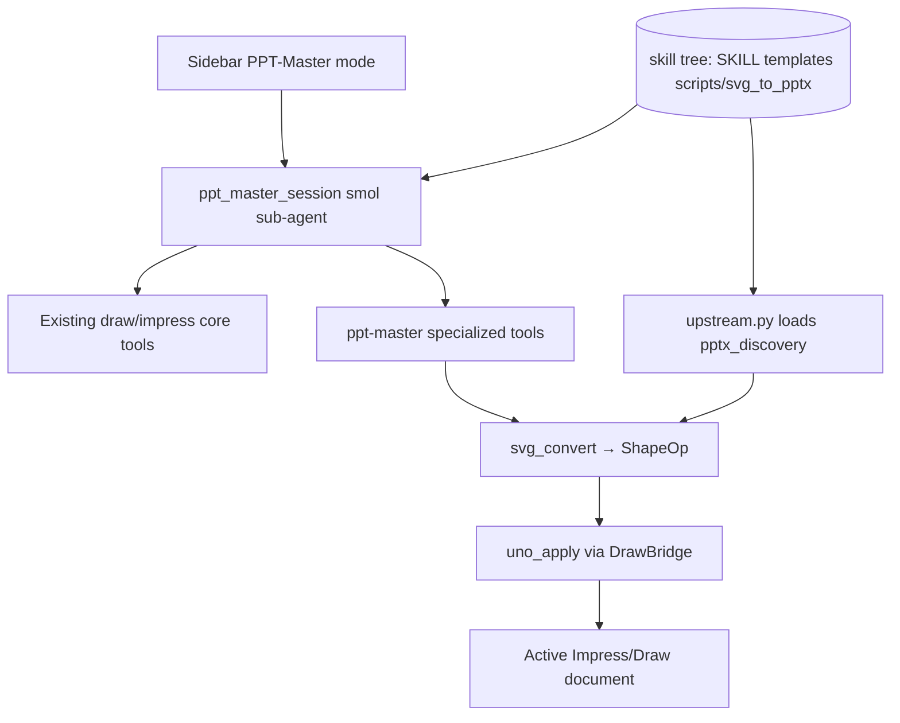

# Integration Plan: PPT-Master in WriterAgent (Adapter Layer)

This document describes how [ppt-master](https://github.com/hugohe3/ppt-master) integrates with WriterAgent: a **UNO adapter layer**, **sidebar PPT-Master mode** (Impress/Draw only), and **upstream assets from a cloned skill tree** (not vendored in the OXT).

## Status (implementation summary)

| Decision | Choice |
|----------|--------|
| Upstream `svg_to_pptx` | **Not** copied into `plugin/contrib/` — loaded from skill tree `scripts/svg_to_pptx/` |
| WriterAgent-only code | Six modules under [`plugin/contrib/ppt_master/`](../plugin/contrib/ppt_master/) |
| Host / UNO | [`plugin/ppt_master/`](../plugin/ppt_master/) (client, paths, tools, adapters) |
| Sidebar UX | Smol sub-agent via [`plugin/chatbot/ppt_master.py`](../plugin/chatbot/ppt_master.py) — hidden from main chat (like Brainstorming) |
| Dev reference clone | Optional repo root `ppt-master/` (not shipped) |

**Removed during cleanup (no longer in tree):**

- `plugin/contrib/ppt_master/bundled/svg_to_pptx/` — byte-identical upstream copy (~18 files); deleted in favor of external skill tree
- `plugin/contrib/ppt_master/backends/` — unused protocol stubs
- `plugin/ppt_master/diagnostics.py` — install hint moved to `paths.PPT_MASTER_INSTALL_CMD`
- `plugin/ppt_master/client.py` dead `export_plans_from_venv` / `venv/export.py` stub — export runs host-side `svg_convert` → `uno_apply`

## Overview

ppt-master is an agentic workflow (SKILL.md + project artifacts + SVG → native shapes). WriterAgent:

1. Ships **adapter modules** under [`plugin/contrib/ppt_master/`](../plugin/contrib/ppt_master/) — see [`README.md`](../plugin/contrib/ppt_master/README.md)
2. Loads **unmodified upstream** Python and assets from the configured skill tree (`PPT_MASTER_DATA_ROOT`)
3. Hosts **UNO adapters** under [`plugin/ppt_master/`](../plugin/ppt_master/)
4. Exposes **PPT-Master** in the sidebar mode dropdown for **Impress and Draw only**
5. Runs a **smol sub-agent** when that mode is selected — tools use `specialized_domain="ppt-master"` and are excluded from the main agent / `delegate_to_specialized_draw_toolset`

## Packaging

Upstream [ppt-master](https://github.com/hugohe3/ppt-master) is a **skill/workflow repo**, not a pip package (no `pyproject.toml`). Install by cloning and pointing Settings at the skill directory:

```bash
git clone https://github.com/hugohe3/ppt-master.git
```

Then **Settings → Python** → **PPT-Master data path** → `.../ppt-master/skills/ppt-master` (must contain `SKILL.md`, `templates/`, `scripts/svg_to_pptx/`).

**Dev without manual path:** clone upstream beside the repo as `ppt-master/`; `paths._dev_clone_data_root()` finds `ppt-master/skills/ppt-master` automatically.

| Layer | In OXT? | Location |
|-------|---------|----------|
| UNO adapter (`shape_ops`, `coords`, `svg_convert`, `upstream`, `config`) | Yes | `plugin/contrib/ppt_master/` |
| Upstream `scripts/svg_to_pptx`, templates, references, `SKILL.md` | **No** — user clone / path | Resolved to `PPT_MASTER_DATA_ROOT` |
| UNO apply, client, tools | Yes | `plugin/ppt_master/` |
| Sidebar session | Yes | `plugin/chatbot/ppt_master.py` |

## Settings

On **Settings → Python** (bottom of tab):

| Control | Config key | Notes |
|---------|------------|-------|
| PPT-Master data path | `scripting.ppt_master_data_path` | Directory picker row (own line, below Python options) |
| Test | — | Probes `SKILL.md`, `templates/`, `scripts/svg_to_pptx/` via `data_root_status` |

Python venv path is separate; PPT-Master does **not** require a pip install of upstream.

## Architecture



### Data root resolution (`plugin/ppt_master/paths.py`)

1. `scripting.ppt_master_data_path` (Settings → Python)
2. `PPT_MASTER_DATA_ROOT` env (set by `apply_data_root_env`)
3. User venv `site-packages` scan (optional fallback)
4. Dev clone `ppt-master/skills/ppt-master`

`data_root_status()` requires templates/references/SKILL.md **and** `scripts/` (with `svg_to_pptx/`).

### Upstream import policy (`plugin/contrib/ppt_master/upstream.py`)

- Load `pptx_discovery.py` **by file path** so `svg_to_pptx/__init__.py` is not executed on the LO host (that import chain requires `python-pptx`).
- Full `svg_to_pptx` stack runs in the **user venv** when ppt-master workflow scripts need PPTX output.

### Main export path (UNO)

`export_presentation_project` → `uno_svg_deck.build_plans_from_project` → `collect_svg_files` (upstream `find_svg_files` when skill tree present, else minimal fallback) → `svg_to_slide_plan` → `uno_apply.apply_slide_plans`.

## Routes

| Route | Implementation | Notes |
|-------|----------------|-------|
| Main SVG pipeline | `export_presentation_project` → `svg_convert` → `uno_apply` | Default Impress/Draw path |
| template-fill | `apply_ppt_master_template_fill` → `uno_template_fill` | Incremental stub |
| native-enhance | `apply_ppt_master_native_enhance` → `uno_enhance` | `enhancement_plan.json` |
| beautify | venv `pptx_to_svg` + SVG pipeline | Not wired end-to-end yet |

## Key modules

| Module | Role |
|--------|------|
| [`plugin/chatbot/ppt_master.py`](../plugin/chatbot/ppt_master.py) | `ppt_master_session`, `collect_ppt_master_tools`, `ppt_master_finished` |
| [`plugin/chatbot/chat_sidebar_mode.py`](../plugin/chatbot/chat_sidebar_mode.py) | `CHAT_MODE_PPT_MASTER`, `sidebar_mode_flags_for_doc_type` |
| [`plugin/ppt_master/tools.py`](../plugin/ppt_master/tools.py) | Specialized tools (`ToolDrawPptMasterBase`) |
| [`plugin/contrib/ppt_master/svg_convert.py`](../plugin/contrib/ppt_master/svg_convert.py) | Minimal SVG → `SlideBuildPlan` |
| [`plugin/ppt_master/adapter/uno_apply.py`](../plugin/ppt_master/adapter/uno_apply.py) | `ShapeOp` → UNO shapes |
| [`plugin/framework/constants.py`](../plugin/framework/constants.py) | `IMPRESS_DRAW_SIDEBAR_ONLY_DOMAINS`, sub-agent instructions |

## Contrib merge policy

Only add files under `plugin/contrib/ppt_master/` when WriterAgent must **change** behavior. Do not re-vendor `svg_to_pptx/`. Upstream is **MIT** (Hugo He); WriterAgent adapters are **GPL-3.0-or-later** — see [`plugin/contrib/ppt_master/README.md`](../plugin/contrib/ppt_master/README.md) for the full MIT notice, upstream pin, and symbol map.

**Python files:** shipped adapters are WriterAgent-original; keep upstream attribution in README only (not in `.py` headers). When **vendoring** upstream lines, comment out replaced code with `'''` blocks in that file only (see [`plugin/contrib/nbformat/README.md`](../plugin/contrib/nbformat/README.md)).

---

## Roadmap

Backlog for PPT-Master integration work. **Priority order matters** — validate the main export path on real decks before secondary routes or large refactors.

### Agent quick start

1. Confirm dev setup: clone upstream beside repo as `ppt-master/` **or** set **Settings → Python → PPT-Master data path** to `.../ppt-master/skills/ppt-master`. Run **Test** in Settings.
2. Read [`plugin/contrib/ppt_master/README.md`](../plugin/contrib/ppt_master/README.md) symbol map (WriterAgent module ↔ upstream equivalent).
3. Trace the happy path: `export_presentation_project` → [`client.py`](../plugin/ppt_master/client.py) → [`uno_svg_deck.py`](../plugin/ppt_master/adapter/uno_svg_deck.py) → [`svg_convert.py`](../plugin/contrib/ppt_master/svg_convert.py) → [`uno_apply.py`](../plugin/ppt_master/adapter/uno_apply.py).
4. Run tests: `pytest tests/ppt_master/`; UNO: `make test` (needs `soffice`) includes [`tests/uno/test_ppt_master_adapter_uno.py`](../tests/uno/test_ppt_master_adapter_uno.py).
5. Pick the next roadmap item below; add tests in the matching `test_*` file per [AGENTS.md](../AGENTS.md).

### What is done (v1 baseline)

| Area | Status | Notes |
|------|--------|-------|
| Settings data path + Test probe | Shipped | [`paths.py`](../plugin/ppt_master/paths.py), [`test_ppt_master_data_test_listener.py`](../tests/chatbot/test_ppt_master_data_test_listener.py) |
| Sidebar PPT-Master mode (Impress/Draw) | Shipped | [`chat_sidebar_mode.py`](../plugin/chatbot/chat_sidebar_mode.py) |
| Smol sub-agent session | Shipped | [`ppt_master.py`](../plugin/chatbot/ppt_master.py), instructions in [`constants.py`](../plugin/framework/constants.py) `PPT_MASTER_SUB_AGENT_INSTRUCTIONS` |
| Specialized tools | Shipped | [`tools.py`](../plugin/ppt_master/tools.py) — export, validate, template-fill, native-enhance, skill path |
| Main SVG → UNO export | Shipped (minimal fidelity) | Host-side only; no venv required for export |
| Runtime load of `pptx_discovery` | Shipped | [`upstream.py`](../plugin/contrib/ppt_master/upstream.py) — file-path import, no `python-pptx` on LO host |
| Unit tests | Shipped | `tests/ppt_master/*` |
| UNO test | Partial | Single-slide rect + text only |

### What is not done (gaps)

| Area | Status | Impact |
|------|--------|--------|
| SVG fidelity vs upstream `drawingml_converter` | **Large gap** | Real ppt-master decks may look wrong (paths, transforms, text, styles) |
| `uno_apply` path geometry | **Stub** | `path` kind maps to `LineShape`, not Bezier/CustomShape |
| Speaker notes matching | **Partial** | Only `notes/slide_NN.md`; upstream supports filename + index matching |
| SKILL.md auto-injection | **Manual** | Agent must call `get_ppt_master_skill_path`; workflow not pre-loaded |
| template-fill route | **Stub** | Creates slides; does not call `set_placeholder_text` |
| beautify route | **Not wired** | `pptx_to_svg` → SVG pipeline absent |
| Multi-slide UNO tests | **Missing** | Only one slide tested under `soffice` |
| `make test` typecheck | **Known issue** | `SendHandlerHost._in_ppt_master_mode` unresolved in [`send_handlers.py`](../plugin/chatbot/send_handlers.py) |

### Architecture decision log (do not re-litigate without cause)

| Decision | Choice | Rationale |
|----------|--------|-----------|
| Upstream Python in OXT | **No** — external skill tree | Avoid `python-pptx` on LO host; keep OXT small |
| `svg_convert.py` | **Parallel rewrite**, not fork of `drawingml_converter.py` | UNO output is `ShapeOp`/hmm, not DrawingML XML |
| `bundled/svg_to_pptx/` | **Removed** | Was byte-identical copy; use user clone |
| Upstream attribution | **README only** | Shipped `.py` files are WriterAgent-original ([`contrib README`](../plugin/contrib/ppt_master/README.md)) |
| Fork upstream for clarity | **Rejected for now** | Reference-only; expand rewrites or host-safe delegation instead |

**Two export paths (only first is WriterAgent's job today):**

```text
WriterAgent (Impress/Draw):  SVG → svg_convert → ShapeOp → uno_apply → UNO document
Upstream (PPTX):             SVG → drawingml_converter → DrawingML → python-pptx → .pptx
```

### Known fidelity gaps (svg_convert + uno_apply)

Use this table when triaging visual bugs from real projects.

| SVG / feature | WriterAgent today | Upstream reference (skill tree, not vendored) |
|---------------|-------------------|-----------------------------------------------|
| `<rect>`, `<circle>`, `<ellipse>`, `<line>` | Basic hmm mapping | `drawingml_elements.py` |
| `<path>` | Bounding box + fake line | Full path commands in `drawingml_paths.py` |
| `<text>` / `<tspan>` | Rough size estimate | `tspan_flattener.py`, font/anchor logic |
| `<g>` + `transform` | Walk children only | Matrix stack in `drawingml_converter.py` |
| Gradients, opacity, dash | Mostly ignored | `drawingml_styles.py` |
| `<image>` | File href resolve | Media + sizing in upstream |
| Groups | Flatten to children | Native group XML in PPTX path |

Primary files to change for fidelity: [`svg_convert.py`](../plugin/contrib/ppt_master/svg_convert.py), [`uno_apply.py`](../plugin/ppt_master/adapter/uno_apply.py), [`coords.py`](../plugin/contrib/ppt_master/coords.py).

### Prioritized backlog

#### P0 — Validate end-to-end on a real project

**Goal:** Confirm the main pipeline works on artifacts from upstream's normal workflow, not just unit-test SVGs.

**PM acceptance criteria:**

- User with skill tree configured can export a project folder containing `svg_final/` into an open Impress doc via PPT-Master sidebar mode.
- Slide count matches SVG count; at least one shape visible per slide.
- Document failure modes (missing path, empty folder, wrong data root) with clear tool errors.

**Dev steps:**

1. Manual test checklist:
   - Clone `ppt-master`, set data path, **Test** → all green.
   - Open Impress, sidebar mode **PPT-Master**, describe project path or run through agent export.
   - Call tool `export_presentation_project` with path to a project that has `svg_final/*.svg`.
2. Add fixture under `tests/fixtures/` (minimal project: 2–3 SVGs, optional `notes/`) and pytest in `tests/ppt_master/test_ppt_master_coords.py` or new `test_ppt_master_project.py`:
   - `collect_svg_files` returns expected count.
   - `build_plans_from_project` returns one plan per SVG.

**Files:** [`uno_svg_deck.py`](../plugin/ppt_master/adapter/uno_svg_deck.py), [`client.py`](../plugin/ppt_master/client.py), new fixture + test.

---

#### P1 — SVG → UNO fidelity (highest technical ROI)

**Goal:** Real ppt-master slides render acceptably in Impress (text, paths, images first).

**PM acceptance criteria:**

- Pick 3–5 failing cases from a real `svg_final/` deck; each fixed case has a pytest (SVG snippet → `ShapeOp` assertions) and/or UNO test.
- Paths render as visible geometry (not empty or single diagonal line).

**Dev strategy (pick one per task; prefer A until insufficient):**

- **A. Incremental expand** [`svg_convert.py`](../plugin/contrib/ppt_master/svg_convert.py) + [`uno_apply.py`](../plugin/ppt_master/adapter/uno_apply.py) — smallest diff, match AGENTS.md least-complexity rule.
- **B. Host-safe upstream delegation** — load pure-Python pieces from skill tree via [`upstream.py`](../plugin/contrib/ppt_master/upstream.py) pattern (by file path, no package `__init__`), map output to `ShapeOp`. More fidelity, more design work.

**Suggested sub-tasks (in order):**

1. **Path shapes:** parse `d` into point lists; apply via `CustomShape` or polylines in `uno_apply` (replace LineShape placeholder).
2. **Text:** improve font size, anchor, multi-line/tspan in `svg_convert`; verify `TextShape` sizing in `uno_apply`.
3. **Images:** verify `GraphicURL` paths from project `images/` folder.
4. **Transforms:** accumulate `transform` on `<g>` in `_convert_element` before hmm mapping.

**Tests:** extend [`test_ppt_master_coords.py`](../tests/ppt_master/test_ppt_master_coords.py); add UNO cases in [`test_ppt_master_adapter_uno.py`](../tests/uno/test_ppt_master_adapter_uno.py).

---

#### P2 — Speaker notes matching

**Goal:** Notes from project `notes/` land on the correct slides.

**Today:** [`uno_svg_deck._read_notes_for_slide`](../plugin/ppt_master/adapter/uno_svg_deck.py) only reads `notes/slide_{NN}.md`.

**Upstream:** `pptx_discovery.find_notes_files` — filename match (`01_cover.md` ↔ `01_cover.svg`) and index match (`slide01.md`).

**Dev steps:**

1. Extend [`upstream.py`](../plugin/contrib/ppt_master/upstream.py) to load and call `find_notes_files` (same file-path pattern as `collect_svg_files_upstream`).
2. In `build_plans_from_project`, map notes dict to each `svg_to_slide_plan(..., notes_text=...)`.
3. Fallback to current `slide_NN.md` logic when skill tree absent.

**Tests:** fixture project with mixed note naming; assert `notes_text` on plans.

---

#### P3 — Agent UX: SKILL + workflow context

**Goal:** Sub-agent follows ppt-master workflow without user re-pasting SKILL.md.

**Today:** [`PPT_MASTER_SUB_AGENT_INSTRUCTIONS`](../plugin/framework/constants.py) tells agent to call `get_ppt_master_skill_path`; no automatic injection.

**Dev steps:**

1. On session start in [`ppt_master.py`](../plugin/chatbot/ppt_master.py) `_run_ppt_master_agent`, after `apply_data_root_env`:
   - Read first N KB of `SKILL.md` from data root (or summaries from `references/`).
   - Append to instructions block (cap token size).
2. Optionally add tool `read_ppt_master_workflow_file` (relative path under data root) for on-demand reads.
3. Document route boundaries (main SVG vs template-fill vs beautify) in injected text — mirror upstream `workflows/routing.md` summary.

**Tests:** mock data root with fake `SKILL.md`; assert instructions contain expected substring (unit test on helper, not full smol run).

---

#### P4 — Secondary routes (defer until P0–P1 acceptable)

| Route | Tool | Adapter | Work |
|-------|------|---------|------|
| template-fill | `apply_ppt_master_template_fill` | [`uno_template_fill.py`](../plugin/ppt_master/adapter/uno_template_fill.py) | Wire `set_placeholder_text` via DrawBridge / existing draw tools; parse `fill_plan.json` |
| native-enhance | `apply_ppt_master_native_enhance` | [`uno_enhance.py`](../plugin/ppt_master/adapter/uno_enhance.py) | Extend when using `enhancement_plan.json` in practice |
| beautify | (none) | — | Design: venv `pptx_to_svg` → existing SVG pipeline; not started |

**PM note:** Do not prioritize beautify/template-fill until main SVG export looks good on real decks.

---

#### P5 — Tests and CI hygiene

| Task | File(s) | Done when |
|------|---------|-----------|
| Multi-slide UNO export | [`test_ppt_master_adapter_uno.py`](../tests/uno/test_ppt_master_adapter_uno.py) | 3 slides, assert page count + shape count |
| Fix `ty` on PPT-Master send path | [`send_handlers.py`](../plugin/chatbot/send_handlers.py) | Declare `_in_ppt_master_mode: bool` on host class; `make test` typecheck passes |
| Review venv export stub | [`plugin/ppt_master/venv/export.py`](../plugin/ppt_master/venv/export.py) | Either wire to worker IPC or remove if host-side export is permanent |
| Regression fixtures | `tests/fixtures/ppt_master_*` | At least one minimal + one “realistic” SVG from upstream examples |

Run: `pytest tests/ppt_master/`; full matrix: `make test`.

### What not to do (unless requirements change)

- **Re-vendor `plugin/contrib/ppt_master/bundled/svg_to_pptx/`** — external skill tree is intentional.
- **Fork upstream Python only for attribution** — symbol map lives in contrib README.
- **Import `svg_to_pptx` package on LO host** — triggers `python-pptx` dependency ([`upstream.py`](../plugin/contrib/ppt_master/upstream.py) policy).
- **Spread effort across beautify + template-fill + fidelity in parallel** — finish P0/P1 first.

### Manual E2E checklist (QA / PM)

```text
[ ] git clone https://github.com/hugohe3/ppt-master.git
[ ] Settings → Python → PPT-Master data path → .../ppt-master/skills/ppt-master
[ ] Settings → Test → SKILL.md, templates/, scripts/svg_to_pptx/ all yes
[ ] Open LibreOffice Impress (make deploy impress)
[ ] Sidebar → mode PPT-Master
[ ] Project with svg_final/ (from upstream workflow or examples/)
[ ] Agent or tool: export_presentation_project(project_path=...)
[ ] Verify: slide count, shapes visible, notes if present
[ ] Note failures: element type, SVG file name, screenshot
```

### Roadmap summary (one line)

**Run a real project through Impress export → fix top visual gaps in `svg_convert`/`uno_apply` → notes matching → SKILL context → secondary routes → tests/CI.**

---

## Tests

| File | Coverage |
|------|----------|
| `tests/ppt_master/test_ppt_master_coords.py` | coords, shape_ops, svg_convert |
| `tests/ppt_master/test_ppt_master_sidebar.py` | sidebar flags, tool tier exclusion |
| `tests/ppt_master/test_ppt_master_paths.py` | config path, dev clone, upstream `pptx_discovery` |
| `tests/chatbot/test_ppt_master_data_test_listener.py` | Settings Test button probe |
| `tests/uno/test_ppt_master_adapter_uno.py` | SVG rect → Impress slide (requires `soffice`) |

Run: `pytest tests/ppt_master/` (and `make test` for full matrix).
