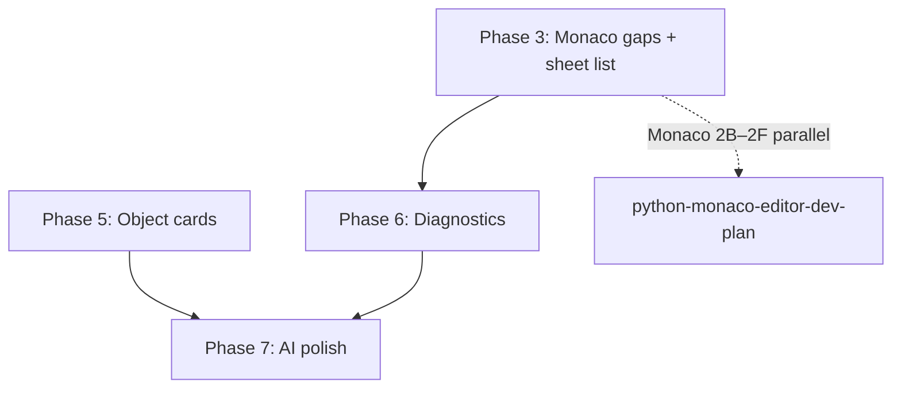

# Python-in-Calc: Future Work

**Shipped baseline:** [enabling_numpy_in_libreoffice.md](enabling_numpy_in_libreoffice.md) (user guide, shared-kernel semantics, Monaco summary, [§8 status](enabling_numpy_in_libreoffice.md#8-implementation-status)). **Monaco IPC / 2B–2F:** [python-monaco-editor-dev-plan.md](python-monaco-editor-dev-plan.md).

**Done (Phases 1, 2, 4):** Shared kernel + reset, matplotlib/Viz image egress, Calc init scripts, **dynamic auto-spill** (`#SPILL!` + document spill registry). No further phase work unless noted below.

---

## Key concepts (how it works)

Authoritative detail: [enabling_numpy §6 — Session modes and recalc semantics](enabling_numpy_in_libreoffice.md#session-modes-and-recalc-semantics).

| Concept | Summary |
|---------|---------|
| **Isolated vs Shared** | Default **Isolated** = fresh namespace per cell (init script still seeds imports). **Shared kernel** = one global namespace per workbook until Reset Python Session. |
| **Co-volatility vs DAG** | Excel re-runs all `=PY` cells in row-major order. WriterAgent uses Calc's DAG — pass upstream cells as **`data`** to declare order without co-volatility. |
| **`data` as dependency edge** | `=PYTHON("result = f(x)"; A1)` makes Calc run `A1` before the current cell, even when reading a global — not only for passing range values. |
| **Idempotent cells** | Any cell may recalc many times; avoid `+=` / `append` side effects unless intentional. Prefer `result = …` from `data`. |
| **Init script orthogonality** | Init runs once in `calc:…:init` regardless of session mode; Shared kernel adds cross-cell variable persistence on top. |
| **Matrix cache ≠ shared globals** | `WorkerResultSession` caches list results within one recalc pass for matrix formulas — separate from shared-kernel state. |
| **`result` vs `print()`** | Cell egress uses **`result = …`**; stdout is not shown in the cell until diagnostics ship — [§6](enabling_numpy_in_libreoffice.md#result-vs-print-egress-model). |
| **Recalc vs reset** | **F9** / **Ctrl+Shift+F9** recalc formulas; **Reset Python Session** clears kernel (Excel: **Ctrl+Alt+Shift+F9**) — [§6 shortcuts](enabling_numpy_in_libreoffice.md#keyboard-shortcuts-and-recalc). |
| **Explicit `data` + `result`** | Deliberate design vs Excel `xl()` string parsing — see [Microsoft vs WriterAgent](enabling_numpy_in_libreoffice.md#microsoft-python-in-excel-vs-writeragent). |

---

## Open phases

### Phase 3: Monaco & Calc editor UX (in progress)

**Shipped spine:** Edit Python in Cell…, Run Python Script… Monaco, dual save, data-binding textbox, context menu — see [enabling_numpy §3 Monaco](enabling_numpy_in_libreoffice.md#monaco-editor--run-python-script).

**Also shipped (LibrePy sidebar):** active-sheet Python cell list + click-to-navigate in the Calc **LibrePy → Python** deck ([`plugin/calc/python/cell_discovery.py`](../plugin/calc/python/cell_discovery.py), [`plugin/librepy/python_sidebar.py`](../plugin/librepy/python_sidebar.py)). Monaco IPC `list_python_cells` remains optional polish.

**Remaining in this phase:**

| Item | Detail | Touch |
|------|--------|-------|
| **Formula bar / toolbar polish** | Optional Calc input-line button; double-click cell → editor (if not already sufficient via menu) | [`python_editor.py`](../plugin/calc/python/editor.py), [`Addons.xcu`](../extension/Addons.xcu) |

**Delegated to [Monaco dev plan](python-monaco-editor-dev-plan.md#8-next-development-plan-detailed):** 2B syntax validate, 2C range picker, 2D Jedi, 2E theme sync, 2F Flatpak spawn — do not duplicate here.

**Phase 2 polish (optional, low priority):** plot anchor/z-order, replace-existing-chart, UNO e2e for `=PYTHON()` image insert — see [Visualization](numpy-domains.md#visualization).

---

### Phase 5: Python Object cards

**Goal:** Complex returns (DataFrame, dict, class) show a compact cell label (e.g. `[DataFrame 150×4]`) and an inspect dialog — not `#VALUE!`.

**Build:**

- Object **references** in shared-kernel session (`__pyobj_N__` key; object stays in worker namespace)
- Worker `inspect_object` → shape, dtypes, `head(5)`
- XDL preview dialog ([`dialogs.py`](../plugin/chatbot/dialogs.py) patterns)
- Optional **Spill to Grid** UI on top of existing matrix formulas

**Depends on:** Phase 1 (shipped).

**Touch:** [`venv_sandbox.py`](../plugin/scripting/venv_sandbox.py), [`worker_harness.py`](../plugin/scripting/worker_harness.py), [`python_function.py`](../plugin/calc/python/function.py); new `plugin/calc/python_object_inspector.py`.

---

### Phase 6: Diagnostics pane (shipped — LibrePy sidebar)

**Goal:** Structured traceback + cell navigation when `=PY()` / `=PYTHON()` fails (Excel `#PYTHON!` → editor analogue).

**Shipped in LibrePy.oxt:**

- Bounded per-workbook log ([`plugin/calc/python/diagnostics.py`](../plugin/calc/python/diagnostics.py)) fed from [`function.py`](../plugin/calc/python/function.py) (errors + non-empty stdout only)
- **LibrePy → Python** sidebar: filters (All / Errors / Output), detail pane, click-to-navigate
- Active-sheet Python cell list with **Edit Cell** / **Run Script** / **Edit Init** / **Reset** / **Settings**

**Touch:** [`function.py`](../plugin/calc/python/function.py), [`diagnostics.py`](../plugin/calc/python/diagnostics.py), [`cell_discovery.py`](../plugin/calc/python/cell_discovery.py), [`plugin/librepy/panel_factory.py`](../plugin/librepy/panel_factory.py), [`python_sidebar.py`](../plugin/librepy/python_sidebar.py), [`extension-core/registry/.../Sidebar.xcu`](../extension-core/registry/org/openoffice/Office/UI/Sidebar.xcu).

**Still optional:** truncate worker traceback into the cell error string for glanceable grid feedback.

---

### Phase 7: AI code synthesis

**Goal:** Copilot-style helpers on top of existing chat + `=PROMPT()`.

**Build:**

- **Context-aware `=PYTHON()` generation:** inject nearby ranges/headers when chat builds formulas
- **`=PROMPT()` Python mode:** formalize NL → pasteable `=PYTHON("…")` template
- **Python domain prompts:** stronger multi-step analysis (clean → stats → chart) — tool loop already retries on error

**Touch:** [`venv_python.py`](../plugin/calc/python/venv.py), [`prompt_function.py`](../plugin/calc/prompt_function.py).

---

## Unphased backlog

Tracked with more context in [enabling_numpy §7](enabling_numpy_in_libreoffice.md#calc-ux-and-output-enhancements) and [Microsoft vs WriterAgent](enabling_numpy_in_libreoffice.md#microsoft-python-in-excel-vs-writeragent).

| Item | Suggested owner |
|------|-----------------|
| **DataFrame → rich Calc table** (headers, formats, filters) | Phase 5 extension or **5b** |
| **JSON `result` envelope** (multi-cell agent updates) | `payload_codec` + host apply |
| **Inline result preview** (stdout/thumbnail under cell) | Phase 3 or 6 |
| **Formula-bar Jedi** | [Monaco 2D](python-monaco-editor-dev-plan.md#phase-2d--jedi-autocompletion-child-only-performance-sensitive) + Calc formula bar |
| **Named ranges / structured tables / `headers` in `data`** | `calc_addin_data.py` (**Phase 8** candidate) |
| **Shared-kernel soft timeout / invalidation** | [`session_manager.py`](../plugin/scripting/session_manager.py), [`venv_worker.py`](../plugin/scripting/venv_worker.py) — [landscape backlog](enabling_numpy_in_libreoffice.md#calc-backlog-from-landscape-survey) |
| **Keyboard shortcuts (Excel parity)** | **Ctrl+Alt+Shift+F9** → Reset Python Session; editor/range-picker chords — [§6 shortcuts](enabling_numpy_in_libreoffice.md#keyboard-shortcuts-and-recalc), [`Accelerators.xcu`](../extension/Accelerators.xcu) |
| **Venv ↔ LO tool RPC** | [enabling_numpy §7](enabling_numpy_in_libreoffice.md#venv--libreoffice-tool-rpc) |

---

## Suggested order

1. Finish **Phase 3** Monaco 2B–2C (highest editor UX value); sheet list lives in LibrePy sidebar.
2. **Phase 6** (diagnostics) — **done** (LibrePy Python sidebar).
3. **Phase 5** (object cards) — needs shared kernel (done).
4. **Phase 7** — prompt/polish after core UX is stable.
5. **Unphased** items (named ranges, RPC) as separate PRs when prioritized.

---

## Out of scope (extension level)

- Cloud containers / compute tiers — local venv is the product ([enabling_numpy §7](enabling_numpy_in_libreoffice.md#microsoft-python-in-excel-vs-writeragent))
- Custom venv `xl()` proxy — `data` injection suffices for now
- True Calc-core DAG changes for Python globals — use **`data` refs** + shared kernel instead
