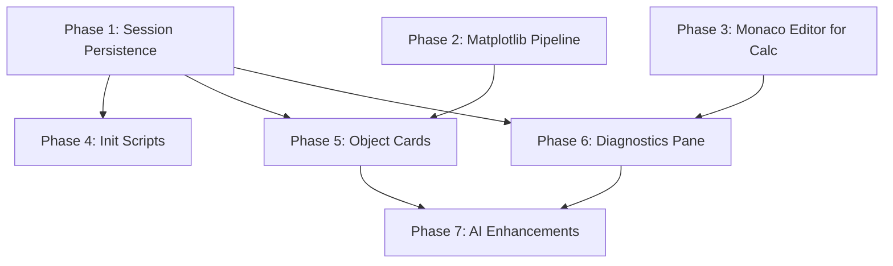

# Incremental Dev Plan: Python-in-Calc Feature Parity

## What Already Exists

WriterAgent already ships a substantial subset of the Python-in-Excel vision. Before planning new work, here is what maps directly:

| Excel Feature | WriterAgent Equivalent | Status |
|---|---|---|
| `=PY(code, return_type)` | `=PYTHON(code, data?)` | **Shipped** - [plugin/calc/python_function.py](plugin/calc/python_function.py) |
| `xl()` data bridge | `data` variable injection | **Shipped** - [plugin/calc/calc_addin_data.py](plugin/calc/calc_addin_data.py) |
| Multi-range references | Varargs IDL + `multi_data` envelope | **Shipped** - [plugin/calc/calc_addin_data.py](plugin/calc/calc_addin_data.py) |
| Anaconda package ecosystem | User-provided venv (numpy, pandas, scipy, etc.) | **Shipped** - local, no cloud dependency |
| Cloud sandbox execution | Venv subprocess + AST sandbox | **Shipped** - [plugin/scripting/](plugin/scripting/) |
| Monaco code editor | Webview-based Monaco child process | **Shipped** - [plugin/scripting/editor_bridge.py](plugin/scripting/editor_bridge.py) |
| AI code generation | `=PROMPT()` + `run_venv_python_script` chat tool | **Shipped** |
| High-perf serialization | Pickle5 + Split-Grid (20x faster than JSON) | **Shipped** - [plugin/scripting/payload_codec.py](plugin/scripting/payload_codec.py) |
| Matrix formula (spill) | Ctrl+Shift+Enter + ROW() indexing + session cache | **Shipped** |
| Error coercion (int->float, NaN->empty) | `to_calc_compatible` pipeline | **Shipped** |

**Key architectural advantage over Microsoft:** WriterAgent runs **locally** (user venv subprocess), not in a cloud container. This means zero network latency, offline support, and no compute tier restrictions -- the exact "competitive enhancements" that Section 9 of the spec calls out.

## Current Status (Updated 2026)

**This document was refreshed** because real implementation work has significantly outpaced the original plan.

Significant progress has occurred beyond this original plan. The document has been refreshed to reflect reality rather than remaining aspirational.

**Notable completed / substantially advanced work:**
- **Phase 2 (Matplotlib / Visualization)**: Largely complete in practice.
  - Worker-side figure detection + PNG serialization (`_figure_to_image_payload`, implicit `plt.show()` capture, Agg backend) in `venv_sandbox.py`.
  - Image payload envelope support in `payload_codec.py`.
  - `=PYTHON()` return path inserts images as `GraphicObjectShape` on the sheet (`python_function.py`).
  - Chat-side Python tool (`run_venv_python_script`) also handles image results and returns `image_path` for insertion via existing tools (`calc/venv_python.py`).
  - Not 100% Excel-compatible (no automatic "spill" behavior or perfect parity), but very usable today.

- **Phase 3 (Monaco for Calc cells)**: Partial but functional implementation exists.
  - `plugin/calc/python_editor.py` + context menu support for opening/editing `=PYTHON()` formulas in the Monaco editor.
  - Sheet-level awareness and data binding are partially present.

Other phases remain largely as originally described (see below). The plan is kept as a living document.

## What Needs Building (Gap Analysis)

These are the features from the spec that do **not** yet exist, ordered by incremental value and dependency:

1. **Session persistence** -- cells share state (row-major kernel), the foundational behavior difference
2. **Matplotlib/visualization pipeline** -- chart output from Python code into cells (**largely complete** — see Current Status and Phase 2 section)
3. **Enhanced Monaco editor UX for Calc** -- sheet-level code grouping, per-cell editing (**partial implementation exists**)
4. **Initialization scripts** -- per-workbook init.py for global imports/helpers
5. **Python Object cards** -- rich metadata preview for non-scalar returns
6. **Diagnostics pane** -- structured error display with cell navigation
7. **AI-driven code synthesis enhancements** -- Copilot-style completion in Python cells

---

## Phase 1: Session Persistence (Shared Kernel Mode)

**The single biggest gap.** Today each `=PYTHON()` cell gets a fresh `LocalPythonExecutor` namespace -- variables do not carry between cells. The Excel model uses row-major stateful execution where a DataFrame created in A1 is available in B2.

**What to build:**

- Add a **`PythonSessionManager`** alongside [PythonWorkerManager](plugin/scripting/python_worker_manager.py) that maintains a **persistent namespace** per workbook
- New config key `scripting.python_session_mode` (default `"isolated"`, option `"shared"`) in [plugin/scripting/module.yaml](plugin/scripting/module.yaml)
- Modify [worker_harness.py](plugin/scripting/worker_harness.py) to accept a `session_id` field; when present, reuse the `LocalPythonExecutor` instance instead of creating a new one
- Row-major evaluation order: leverage Calc's existing recalc order (already left-to-right, top-to-bottom within a sheet)
- Session reset command (`Ctrl+Alt+Shift+F9` equivalent): new `reset_session` request type in the worker protocol; wire to a menu item or keyboard shortcut
- **Safety:** session mode still runs in the venv subprocess (ABI-safe); the sandbox's iteration/operation limits still apply per-cell

**Key files to modify:**
- [plugin/scripting/worker_harness.py](plugin/scripting/worker_harness.py) -- add `session_id` routing, `reset_session` handler
- [plugin/scripting/venv_sandbox.py](plugin/scripting/venv_sandbox.py) -- session-aware executor cache
- [plugin/scripting/python_worker_manager.py](plugin/scripting/python_worker_manager.py) -- forward session_id
- [plugin/calc/python_function.py](plugin/calc/python_function.py) -- derive session_id from workbook URL
- [plugin/scripting/module.yaml](plugin/scripting/module.yaml) -- new config key

**Tests:** `tests/scripting/test_session_persistence.py` -- verify cross-cell variable visibility, session reset, isolation between workbooks.

---

## Phase 2: Matplotlib / Visualization Pipeline

**Status (2026):** Largely complete and usable in practice (though not 100% Excel-compatible).

**What has been implemented:**

- Worker-side detection of `matplotlib.figure.Figure` objects and automatic capture of open pyplot figures after execution (including implicit `plt.show()` cases).
- PNG serialization via `savefig` into a standardized `__wa_payload__: "image"` envelope.
- `=PYTHON()` cells: Image results are automatically inserted as `GraphicObjectShape` on the active sheet's draw page.
- Chat tool (`run_venv_python_script` / Python specialized domain): Image results are returned with a temp `image_path` that existing image tools can consume.
- Non-interactive backend forcing (`Agg`) and proper cleanup.

**Current behavior:**
- Works for both direct `return fig` and code that ends with `plt.show()` / open figures.
- Images appear in Calc sheets when returned from `=PYTHON()`.
- Good enough for real use, even if placement, sizing, and multiple-figure handling are not as polished as the Microsoft version.

**Remaining polish (lower priority):**
- More control over insertion location / anchoring.
- Better handling of multiple figures.
- Optional "replace existing chart" behavior.
- Tighter integration with Calc's drawing layer (z-order, grouping, etc.).

**Key files involved (already updated):**
- [plugin/scripting/venv_sandbox.py](plugin/scripting/venv_sandbox.py)
- [plugin/scripting/payload_codec.py](plugin/scripting/payload_codec.py)
- [plugin/calc/python_function.py](plugin/calc/python_function.py)
- [plugin/calc/venv_python.py](plugin/calc/venv_python.py) (chat tool side)

**Original goal (for reference):** Python code that calls `plt.show()` or returns a matplotlib `Figure` produces an image inserted into the sheet (or floating above it).

**Historical planned items (largely completed by 2026):**

- In [venv_sandbox.py](plugin/scripting/venv_sandbox.py), detect when `result` is a matplotlib Figure or pyplot object; serialize to PNG bytes (via `savefig` to BytesIO)
- New return envelope type `__wa_payload__: "image"` in [payload_codec.py](plugin/scripting/payload_codec.py) with the PNG bytes
- On the host side, [python_function.py](plugin/calc/python_function.py) intercepts image payloads and inserts a `com.sun.star.drawing.GraphicObjectShape` on the sheet's draw page
- For the chat tool `run_venv_python_script`, return the image as a temp file path and use existing image insertion tools

**Tests note:** Basic functionality is working. Dedicated UNO tests for shape insertion would still be valuable.

---

## Phase 3: Enhanced Monaco Editor for Calc Cells

**Status (2026):** Partial implementation exists and is functional.

**What currently works:**
- `plugin/calc/python_editor.py` provides the ability to open and edit `=PYTHON()` formulas from Calc cells in the Monaco editor.
- Context menu integration for Python cells.
- Basic load/save roundtrip for cell formulas.

**What is still missing (from the original plan):**
- Full sheet-level grouping view of all Python cells in the workbook.
- Robust point-and-click range insertion from Calc while the editor is open.
- Dedicated toolbar button / more polished UX for "Edit Python in cell".

**What exists (shared infrastructure):** [editor_bridge.py](plugin/scripting/editor_bridge.py), [editor_session_launch.py](plugin/scripting/editor_session_launch.py), and the webview Monaco process (already used by the "Run Python Script" feature).

**Remaining work (from original plan):**

- **Cell-edit mode:** When user double-clicks a `=PYTHON()` cell (or uses a keyboard shortcut), open the Monaco editor pre-loaded with that cell's code. On save, write back to the formula
- Wire a Calc cell selection listener that detects `=PYTHON()` and enables an "Edit in Python Editor" toolbar button or context menu entry
- **Sheet-level grouping view:** Add a `list_python_cells` message type in [editor_protocol.py](plugin/scripting/editor_protocol.py) -- host enumerates all `=PYTHON()` cells in the workbook and sends grouped-by-sheet metadata to Monaco
- **Point-and-click range insertion:** When the editor is open, cell range selections in Calc send an `insert_reference` message to Monaco with the range address (e.g. `A1:B10`)
- The `data_binding` field in the save message already exists in [editor_bridge.py](plugin/scripting/editor_bridge.py) -- use it for the data range argument

**Key files to modify:**
- [plugin/scripting/python_runner.py](plugin/scripting/python_runner.py) -- add Calc cell-edit launch path
- [plugin/scripting/editor_bridge.py](plugin/scripting/editor_bridge.py) -- `insert_reference` message handler
- [plugin/scripting/editor_protocol.py](plugin/scripting/editor_protocol.py) -- new message types
- New: cell selection listener (UNO `XSelectionChangeListener`) in a Calc-specific module
- [extension/Addons.xcu](extension/Addons.xcu) -- toolbar button or menu entry

---

## Phase 4: Initialization Scripts

**Goal:** Per-workbook startup scripts that run when the workbook opens, registering global imports, helpers, and styling defaults (Section 4 of the spec).

**What to build:**

- Store init script in workbook custom document properties (ODS `UserDefinedProperties`) or a hidden sheet named `__python_init__`
- On workbook open (or first `=PYTHON()` eval in a session), execute the init script in the session namespace before any cell code
- Settings UI: add an "Edit Initialization Script" button in Settings -> Python that opens the Monaco editor with the init script
- Separate from session mode -- init scripts work even in isolated mode (they just run once per workbook load, not persistently)

**Key files to modify:**
- [plugin/scripting/python_worker_manager.py](plugin/scripting/python_worker_manager.py) -- `init_script` request type
- [plugin/calc/python_function.py](plugin/calc/python_function.py) -- check/run init on first eval
- Settings UI in [plugin/scripting/module.yaml](plugin/scripting/module.yaml)
- New: `plugin/scripting/init_scripts.py` -- read/write init from document properties

---

## Phase 5: Python Object Cards (Rich Preview)

**Goal:** When `=PYTHON()` returns a complex object (DataFrame, dict, class instance), show a preview card instead of `#VALUE!`.

**What to build:**

- In session mode, allow cells to hold object **references** (string key like `__pyobj_42__`) while the actual object stays in the worker namespace
- Display the reference as a compact cell value (e.g. `[DataFrame 150x4]`) via a short summary string
- On cell hover/click, send a `inspect_object` request to the worker that returns shape, dtypes, head(5), etc.
- Display the result in an XDL dialog (reuse `DialogProvider` patterns from [plugin/chatbot/dialogs.py](plugin/chatbot/dialogs.py))
- Optional: "Spill to Grid" action that extracts the DataFrame into adjacent cells (already works with matrix formulas; this adds a UI gesture)

**Dependency:** Requires Phase 1 (session persistence) -- objects must survive beyond a single cell evaluation.

**Key files to modify:**
- [plugin/scripting/venv_sandbox.py](plugin/scripting/venv_sandbox.py) -- object registry, `inspect_object` handler
- [plugin/scripting/worker_harness.py](plugin/scripting/worker_harness.py) -- `inspect_object` protocol message
- [plugin/calc/python_function.py](plugin/calc/python_function.py) -- object reference return + summary string
- New: `plugin/calc/python_object_inspector.py` -- XDL dialog for preview

---

## Phase 6: Diagnostics Pane

**Goal:** When a `=PYTHON()` cell fails, show the traceback and error context in a structured pane (Section 7 of the spec).

**What to build:**

- Currently errors return as cell error text. Enhance to also log structured error details (cell address, traceback, code snippet)
- Add a "Python Diagnostics" sidebar panel or docked pane (XDL dialog) that lists all cells with errors, grouped by sheet
- Click-to-navigate: selecting an error entry navigates to the offending cell
- Filter by: errors only, stdout/print output, all cells
- Wire error details from the worker response (`message`, `stdout`, `traceback` fields already exist in the protocol)

**Key files to modify:**
- [plugin/calc/python_function.py](plugin/calc/python_function.py) -- collect error details per-cell
- New: `plugin/calc/python_diagnostics.py` -- diagnostics panel UI
- [plugin/scripting/worker_harness.py](plugin/scripting/worker_harness.py) -- ensure full traceback in error responses

---

## Phase 7: AI Code Synthesis Enhancements

**Goal:** Bring Copilot-style AI features into the Python workflow (Section 6 of the spec).

**What to build:**

- **Context-aware code generation:** When the LLM generates `=PYTHON()` formulas via chat, inject Calc context (nearby data ranges, column headers) into the prompt so generated code references the right cells
- **Natural language → `=PYTHON()` bridge:** Enhance `=PROMPT()` with a mode that returns executable `=PYTHON()` code (already partially possible; formalize the prompt template)
- **Error auto-fix:** When `run_venv_python_script` returns an error, automatically retry with the error context (the chat tool loop already supports this pattern)
- **Agentic compute workflow:** The two-phase LLM workflow (compute in venv -> insert with tools) is already the architecture. Enhance the python specialized domain prompt to encourage multi-step analysis (clean data -> compute stats -> insert chart)

**Key files to modify:**
- [plugin/calc/venv_python.py](plugin/calc/venv_python.py) -- enhanced system prompt for the python domain
- [plugin/calc/prompt_function.py](plugin/calc/prompt_function.py) -- `=PROMPT()` Python mode
- Existing chat tool loop handles retry naturally

---

## Recommended Build Order

- **Phase 1** and **Phase 2** are independent and can be developed in parallel
- **Phase 3** is independent of 1 and 2 (editor infrastructure already exists)
- **Phase 4** benefits from Phase 1 (init runs in session namespace)
- **Phase 5** requires Phase 1 (object references need persistent state)
- **Phase 6** and **Phase 7** are polish/UX layers that build on everything above

## What to Skip (Not Applicable to LibreOffice)

- **Cloud container architecture** (Section 3) -- WriterAgent's local venv is already the "competitive advantage" the spec describes in Section 9.1
- **Compute tiers / monetization** (Section 3.2) -- not relevant for an open-source extension
- **Custom `xl()` function** -- the `data` variable injection already serves this purpose; adding an `xl()` proxy in the venv is possible but lower priority (deferred in [enabling_numpy doc Section 7](docs/enabling_numpy_in_libreoffice.md))
- **True DAG recalculation** (Section 9.2) -- this is a LibreOffice core change, not an extension-level feature
