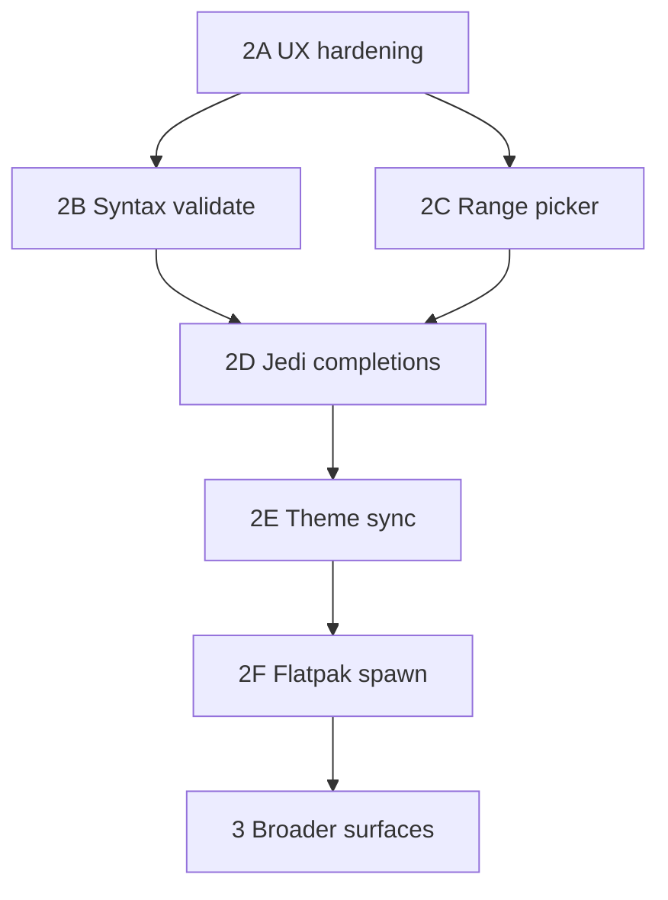

# Technical Dev Plan: WebView Monaco Code Editor

Architectural design for the **LibrePythonista-style Monaco editor** in WriterAgent.

**Status (Phase 2A complete):** Calc **Edit Python in Cell…** (menubar + cell right-click) opens a Monaco/pywebview window in the user venv. A **persistent background child** stays warm between edits; switching cells reloads the editor (no “already open” block). Dual save modes, editable **Data:** range textbox, save feedback, WM-close lifecycle, stderr drain to debug log, and full-traceback failure dialogs are implemented. Jedi autocompletion is wired but **stub-only** (no debounce/background thread yet). See `plugin/scripting/` and `plugin/calc/python_editor.py`.

**`=PYTHON()` is not localized:** The Calc add-in always registers the English function name `PYTHON` (programmatic `python`). Formulas stored by Calc must use that token in `getFormula()` / `FormulaLocal`. A localized alias (e.g. a translated function name) is a **bug** in add-in registration — do **not** add `FormulaOpCodeMapper` workarounds in the editor or formula parser.

**Session 1 fixes (post-MVP):** venv path required (no LibreOffice embedded Python for the editor); `resolve_venv_python` tries `bin/python`, `bin/python3`, and `bin/python3.*`; `ready` is sent only after `window.events.loaded` / `shown` (not before `webview.start()`); child uses `http_server=True` with **absolute** path to `assets/editor/index.html` (relative `index.html` resolves against `plugin/scripting/` and 404s); probe/save failures show child stderr + Python tracebacks via [`editor_diagnostics.py`](../plugin/scripting/editor_ipc.py).

**Dual save modes:** Monaco always edits **stripped Python source** (inline `=PYTHON("…")` code is parsed on load; plain-text cells use `getString`). Toolbar checkbox **Save as plain text** writes `cell.setString(code)` only (for `=PYTHON($A$1; …)` workflows elsewhere). Default Save wraps `=PYTHON("…")` via `setFormula`, preserving existing data-range suffixes. Opening `=PYTHON($A$1; …)` on the formula cell remains blocked; edit the code storage cell instead.

---

## 1. Architectural Overview

The editor is a **separate native window** in the user's configured Python venv. It talks to LibreOffice over **stdin/stdout** (length-prefixed pickle protocol 5), not TCP sockets.

### Core components

| Component | Module | Role |
|-----------|--------|------|
| Editor launcher | [`plugin/scripting/editor_host.py`](../plugin/scripting/editor_host.py) | Require Settings venv, probe `import webview`, `Popen` child |
| Editor diagnostics | [`plugin/scripting/editor_ipc.py`](../plugin/scripting/editor_ipc.py) | Msgbox text: stderr + `traceback.format_exception` |
| Editor bridge | [`plugin/scripting/editor_host.py`](../plugin/scripting/editor_host.py) | Pipe reader thread; UNO on main thread via [`QueueExecutor`](../plugin/framework/queue_executor.py) |
| Editor process | [`plugin/scripting/editor_main.py`](../plugin/scripting/editor_main.py) | `pywebview` + Monaco (venv only) |
| Calc integration | [`plugin/calc/python_editor.py`](../plugin/calc/python_editor.py), [`python_formula_edit.py`](../plugin/calc/python_formula_edit.py), [`python_editor_context_menu.py`](../plugin/calc/python_editor_context_menu.py) | Active cell `=PYTHON()` load/save; cell context menu |
| Protocol | [`plugin/scripting/editor_ipc.py`](../plugin/scripting/editor_ipc.py) | `!I` length + pickle protocol 5 |
| Frontend | [`plugin/contrib/scripting/assets/editor/`](../plugin/contrib/scripting/assets/editor/) | Bundled Monaco `vs/` (see [`scripts/fetch_monaco_editor.sh`](../scripts/fetch_monaco_editor.sh)) |

Menu: `org.extension.writeragent:scripting.edit_python_cell` in [`extension/Addons.xcu`](../extension/Addons.xcu) (Calc menubar). Cell right-click uses [`python_editor_context_menu.py`](../plugin/calc/python_editor_context_menu.py) (`XContextMenuInterceptor` — LibreOffice has no static Addons.xcu merge point for Calc cell popups).

---

## 2. IPC protocol (pipe)

Same framing as [`worker_harness.py`](../plugin/scripting/worker_harness.py) (`struct.pack("!I", …)` + **pickle protocol 5**).

| `type` | Direction | Purpose |
|--------|-----------|---------|
| `ready` | child → LO | GUI up (`window.events.loaded` or `shown`); safe to send `load` |
| `load` | LO → child | Initial `code` (stripped Python only—never `=PYTHON()`), optional `title`, `data_binding`, `plain_text_label`, optional `save_as_plain` (checkbox: off for `=PYTHON()`, on for plain-string cells, off when empty) |
| `save` | child → LO | User saved; includes `code`, optional `save_as_plain` (default false), optional `data_binding` (range text for formula suffix) |
| `saved` / `error` | LO → child | Apply result in UI; `saved` may include `save_as_plain` |
| `closed` / `cancel` | either | Tear down session |

---

## 3. Threading (critical)

### LibreOffice parent

- Pipe reader: [`run_in_background`](../plugin/framework/worker_pool.py) (`editor-pipe-reader`).
- **Never call UNO from the reader thread.** Use [`execute_on_main_thread`](../plugin/framework/queue_executor.py) for `save` (setFormula, `calculateAll`).
- MCP uses the same `QueueExecutor` / `AsyncCallback` pattern.

### Child (`pywebview`)

- **GUI thread:** `js_api` (`notify_save`, `notify_cancel`, `poll_messages`).
- **Pipe thread:** read stdin only; push `load` / `saved` / `error` to `_ui_queue`.
- **Never call `evaluate_js()` from the pipe thread** (GTK/WebView2 deadlock). JS polls `poll_messages()` ~80ms and updates Monaco.

---

## 4. Dependencies

- **Settings → Python → `scripting.python_venv_path`:** must point at the venv where you run `pip install pywebview`. The Monaco editor **does not** use LibreOffice’s embedded Python.
- **`pywebview`** and GUI backends in that venv. For robust cross-platform support (especially in isolated venvs on Linux/Python 3.14), the following stack is verified:
  ```bash
  pip install pywebview PyQt6 PyQt6-WebEngine qtpy
  ```
  - **Why:** `pywebview` requires a GUI driver. While it can use system GTK, a venv often cannot see system bindings. `PyQt6` + `WebEngine` provides a self-contained Chromium-based browser engine. `qtpy` is a mandatory shim for the `pywebview` Qt driver.
- **Linux GUI:** child inherits `DISPLAY`, `WAYLAND_DISPLAY`, `XDG_RUNTIME_DIR`, `DBUS_SESSION_BUS_ADDRESS`, `LD_LIBRARY_PATH` from the LO process. Optional `WRITERAGENT_PYWEBVIEW_GUI=qt|gtk` for [`editor_main.py`](../plugin/scripting/editor_main.py).
- **Monaco:** vendored under `plugin/contrib/scripting/assets/editor/vs/` (python-only prune + Terser; typically ~4–5 MB on disk). Refresh: `make fetch-monaco` ([`scripts/fetch_monaco_editor.sh`](../scripts/fetch_monaco_editor.sh)). Re-strip comments anytime: `make minify-editor-js` ([`scripts/minify_editor_js.sh`](../scripts/minify_editor_js.sh); requires Node.js).
- **`jedi`** (session 2+): optional, persistent `Environment` in child — see below.

**Note:** **Run Python Script…** opens Monaco when the configured venv has pywebview (Python syntax highlighting, **Run** button, editor stays open after execution). If pywebview is unavailable, it falls back to the native multiline dialog in [`python_runner.py`](../plugin/scripting/python_runner.py). That legacy dialog is **modeless by default** (`scripting.native_run_script_modeless`, Settings → Python); uncheck it for the classic modal dialog. The Calc **Edit Python in Cell…** menu does **not** fall back—it explains how to fix the configured venv instead.

---

## 5. Deferred (session 2+)

| Feature | Notes |
|---------|--------|
| Syntax validation | Debounced `compile()` on LO main thread; squiggles in Monaco |
| Range picker | `GlobalCalcRangeSelector` via pipe + main thread (**deferred**; editable textbox for data ranges shipped first) |
| Theme sync | LO VCL → `vs` / `vs-dark` |
| Flatpak/Snap spawn | `flatpak-spawn --host` |
| Formula bar button | Optional |
| Jedi completions | **Stub shipped** in [`editor_jedi.py`](../plugin/scripting/editor_main.py) + `get_completions` in JS; Phase 2D adds debounce, background thread, Settings hint |

### Autocompletion (Jedi)

- Run Jedi only in the **editor child**, not over the pipe on every key.
- One `jedi.create_environment(venv_path)` per window lifetime.
- Target: sub-10ms after warm-up.

---

## 6. File structure (implemented)

```text
plugin/
├── calc/
│   ├── python_editor.py              # Menu entry, launch bridge
│   ├── python_editor_context_menu.py # Calc cell right-click entry
│   └── python_formula_edit.py        # Parse/rebuild =PYTHON() formulas
├── contrib/
│   └── scripting/
│       └── assets/editor/
│           ├── index.html
│           ├── editor.js
│           ├── scripts_manager.js  # Run Python Script picker (Sample + My Scripts)
│           ├── style.css
│           └── vs/                   # Monaco bundle (generated)
└── scripting/
    ├── document_scripts.py         # scripts_list IPC + document-attached scripts
    ├── editor_host.py                # Spawn, PersistentEditor, session launch
    ├── editor_ipc.py                 # Pickle protocol 5 + failure formatting
    └── editor_main.py                # pywebview child entry (+ JediSession)

tests/
├── calc/
│   ├── test_python_formula_edit.py
│   ├── test_python_editor_save_modes.py
│   ├── test_python_editor_multi_cell.py
│   └── test_python_editor_context_menu.py
└── scripting/
    ├── test_editor_host.py
    ├── test_editor_ipc.py
    ├── test_editor_main_closed.py
    └── test_editor_jedi.py
```

---

## 7. Manual test

1. Create or pick a venv; `pip install pywebview` (and any packages your `=PYTHON()` code needs).
2. **WriterAgent Settings → Python:** set **Python venv path** to that directory (not merely “venv active” in a terminal).
3. `make deploy`, restart LibreOffice, open Calc.
4. Select any cell (empty or `=PYTHON("result = 1")`).
5. **WriterAgent → Edit Python in Cell…** — Monaco window should open.
6. Edit, **Save** — cell should become/update `=PYTHON("…")` and recalc; toolbar status line shows green **Status: Saved.** and stays until the next action.
7. Close the editor with the window **X** (not Cancel), reopen immediately — should **not** show “already open.”
8. Edit cell A, Save, select cell B, run **Edit Python in Cell…** again — editor reloads B’s code (no blocking dialog).
9. Right-click a cell — **Edit Python in Cell…** should appear at the bottom of the cell context menu.
10. On save error (if reproducible), toolbar shows red error text and the editor stays open.
11. **Run Python Script…** (Writer/Calc/Draw): with venv + pywebview, opens Monaco with colored Python, **Run** / **Save** / **Close** buttons (no Data/plain-text controls). **Run** executes and inserts result; **Save** persists script to config only; **Close** hides the editor. Without pywebview, the plain multiline dialog appears (no error msgbox).
12. **Run Python Script… script picker:** save scratchpad content via **Save** while **Sample** is selected; switch to a **My Scripts** entry — editor changes; switch back to **Sample** — scratchpad content must reload (not a no-op). **Delete** on Sample clears the scratchpad.

**If it fails:** the msgbox should include child stderr and a Python traceback. Also check `writeragent_debug.log` under the LO user profile (`writeragent.json` directory). Common causes: wrong venv path in Settings, pywebview not installed in *that* venv, or missing display/GTK backend on Linux.

---

## 8. Next development plan (detailed)

Session 1 proves the **pipe + subprocess + Monaco** spine. The work below is ordered by **user-visible value per risk**, not by file layout. Each phase should ship with tests and a short manual checklist before piling on the next.

### Phase 2A — Editor UX hardening (low risk, high polish)

**Goal:** Make the existing flow feel finished, not prototype.

| Task | Detail | Status |
|------|--------|--------|
| **Window lifecycle** | Wire `window.events.closed` (pywebview) to send `closed`; bridge clears session when child exits. | **Done** |
| **Save feedback** | Green status on `saved`; red status on `error` with message; editor stays open. Status line is always visible (`Status: Ready` initially; last message persists). | **Done** |
| **Context menu** | Calc cell right-click via [`python_editor_context_menu.py`](../plugin/calc/python_editor_context_menu.py) (`XContextMenuInterceptor`; same dispatch URL as menubar). | **Done** |
| **stderr logging** | Continuous stderr drain thread in [`editor_bridge.py`](../plugin/scripting/editor_host.py) (`editor-stderr-drain`); lines logged at debug; tail kept for failure msgboxes. | **Done** |
| **Multi-cell reload** | Editor open on cell A → Save → select B → menu again sends fresh `load` (callbacks retargeted; `save_as_plain` reflects B’s cell type). | **Done** |

**Protocol:** no new message types required.

**Tests:** [`tests/scripting/test_editor_main_closed.py`](../tests/scripting/test_editor_main_closed.py); optional UNO smoke “open editor on fixture sheet” only if stable in CI.

---

### Phase 2B — Real-time syntax validation (medium risk)

**Goal:** Red squiggles for invalid Python before Save, without blocking the GUI thread in the child.

**Flow:**

1. Monaco `onDidChangeModelContent` debounced (~400ms) in JS.
2. Child sends `{"type": "validate", "code": "…"}` on stdin (GUI thread is fine for writes).
3. LO pipe reader receives `validate` → `execute_on_main_thread(_compile_check, code)`.
4. `_compile_check` uses `compile(code, "<editor>", "exec")`; on `SyntaxError`, return `{type: "validate_result", ok: false, line, col, message}`; else `{ok: true}`.
5. LO writes result to child stdin; pipe thread → `_ui_queue` → `poll_messages` → Monaco `editor.setModelMarkers` or deltaDecorations.

**Why LO for compile:** matches what Calc will eventually run in the venv worker; catches nothing Jedi would miss for syntax-level errors. Keep validation **syntax-only** (no imports execution).

**Protocol additions:**

| `type` | Direction |
|--------|-----------|
| `validate` | child → LO |
| `validate_result` | LO → child |

**Pitfall:** flooding LO with validate while user types fast — debounce in JS **and** drop stale responses (sequence id in message).

**Tests:** pure-Python tests for `_compile_check`; no LO required.

---

### Phase 2C — Calc range picker (medium risk, high value)

**Goal:** “Insert range” inserts `Sheet1.A1:B10` (or active sheet shorthand) at the cursor — WriterAgent style, not LibrePythonista’s `lp("…")` unless we add a helper later.

**Flow:**

1. Toolbar button in `editor.js` → `api.request_range()`.
2. Child writes `{"type": "pick_range"}`.
3. LO main thread: `GlobalCalcRangeSelector` (see LP analysis in [`libre_pythonista_features_analysis.md`](libre_pythonista_features_analysis.md)), modal selection, format range with [`address_utils`](../plugin/calc/address_utils.py), reply `{"type": "range_result", "text": "A1:B10"}` or cancel.
4. Child queues `range_result` → JS inserts at `editor.getPosition()`.

**Threading:** selector and all UNO on main thread only; child blocks in API method with `threading.Event` until result (same pattern as MCP `execute_on_main_thread` with timeout). Cap wait at 120s.

**UX:** While picker is open, Monaco can stay open behind LO modal — document z-order quirk on Wayland.

**Tests:** `@native_test` in `tests/calc/test_python_editor_uno.py` — open Calc, stub or real selector if automatable; at minimum test range formatting helpers.

---

### Phase 2D — Jedi autocompletion (child-only, performance-sensitive)

**Goal:** IntelliSense that feels instant after warm-up.

**New module:** [`plugin/scripting/editor_main.py`](../plugin/scripting/editor_main.py) — imported **only** from `editor_main.py` (not from LO).

```text
EditorSession.start()
  → JediSession.create(venv_python_path)  # once
on debounced complete (child GUI thread pool or worker thread)
  → Script(full_source, environment=env).complete(line, col)
  → format Completion items for Monaco
  → ui_queue.put({type: "completions", items: [...]})
```

**Rules (non-negotiable):**

- **One** `jedi.create_environment` per editor window.
- Never recreate `Environment` per keystroke.
- `jedi.Script` per request is OK; environment reuse is what buys sub-10ms.
- Do **not** RPC every keypress to LO for Jedi.

**Monaco:** register `monaco.languages.registerCompletionItemProvider('python', …)` in `editor.js`; provider calls exposed `api.complete(line, column, fullText)` which runs Jedi on a **background thread in the child** (not pipe thread) and returns when done — still must not touch `evaluate_js` off-thread; return value via pywebview expose is synchronous from JS’s view if we block expose (acceptable for 150ms debounce) or use async expose pattern if pywebview version supports it.

**Optional Phase 2D+:** LO sends `{"type": "calc_symbols", "names": ["Sheet1", …]}` once on `load` for sheet/tab completion — only if Jedi alone is insufficient.

**Deps:** document `pip install jedi` next to pywebview in Settings helper text.

**Tests:** unit tests with fixed source snippets and mocked `Environment` if needed; manual benchmark log for cold vs warm complete latency.

---

### Phase 2E — Theme sync (low/medium risk)

**Goal:** Monaco `vs` / `vs-dark` tracks LO light/dark.

On `load`, LO includes `theme: "dark" | "light"` from VCL (probe existing LO theme APIs or config; Calc `ThemeCalc` mentioned in LP docs). JS calls `monaco.editor.setTheme(...)`. Toolbar chrome in `style.css` can follow CSS variables set from the same message.

Defer custom per-color mapping until simple binary dark/light works.

---

### Phase 2F — Sandboxed LO installs (Flatpak/Snap)

**Goal:** `Popen` from inside Flatpak can reach the host venv.

Port spawn helpers from LibrePythonista (see analysis doc): detect sandbox, wrap invocation with `flatpak-spawn --host` or snap equivalent. Centralize in [`editor_launcher.py`](../plugin/scripting/editor_host.py) beside existing `resolve_venv_python`.

**Tests:** hard to automate; maintain a manual matrix in this doc (Flatpak LO + host venv path).

**Priority:** bump up if user reports are mostly Flatpak; otherwise after 2A–2D.

---

### Phase 3 — Broader surfaces

| Item | Rationale | Status |
|------|-----------|--------|
| **Run Python Script… → Monaco** | Reuse bridge with `load` from `last_python_script_*` config keys; **Run** persists config and executes (not formula save). Falls back to native dialog when pywebview unavailable. Shared launcher: [`editor_host.py`](../plugin/scripting/editor_host.py). Script picker UI: [`scripts_manager.js`](../plugin/contrib/scripting/assets/editor/scripts_manager.js) + [`document_scripts.py`](../plugin/scripting/document_scripts.py). | **Done** |
| **Sample scratchpad reload** | **Sample** in the picker is the personal scratchpad (`last_python_script_*`), not a saved script. Initial open loads via `load.code`; switching back to Sample after picking **My Scripts** must reload scratchpad text (native XDL dialog already did this; Monaco initially did not). | **Done** |
| **Formula bar button** | Needs LO UI extension research (Calc input line customization). High effort; do after context menu. | |
| **Tier-2 document store** | [`enabling_numpy_in_libreoffice.md`](enabling_numpy_in_libreoffice.md) Tier 2 (formula key + side store) is a **separate** product decision — do not mix with Monaco until formula-in-cell workflow is stable. | |
| **Core extension split** | Keep all editor code in `plugin/scripting/` + thin `plugin/calc/python_editor.py` per [`ROADMAP.md`](../docs/ROADMAP.md) Phase 3–4 so a future core OXT can ship `=PYTHON()` + editor without the LLM stack. | |

#### Phase 3 fix: Sample scratchpad in script picker (2026-06)

**Symptom:** In **Run Python Script…** Monaco, the dropdown shows **Sample** at the top (personal scratchpad), then **My Scripts** / helper sections. First open worked; selecting another script and clicking **Sample** again did nothing — the editor kept the other script’s text.

**Root cause:** [`scripts_manager.js`](../plugin/contrib/scripting/assets/editor/scripts_manager.js) builds Sample as `<option value="">Sample</option>`. `onDropdownChange` only called `editor.setValue` when the name matched `scriptIndex` (named scripts). Empty value fell through to a no-op. The native fallback in [`python_runner_ui.py`](../plugin/scripting/python_runner_ui.py) correctly loads `get_config_str(ctx, config_key)` when **Sample** is selected.

**Fix (no new IPC message types):**

| Layer | Change |
|-------|--------|
| **LO → child** | [`build_scripts_list_message()`](../plugin/scripting/document_scripts.py) adds `sample_code`: `get_config_str(ctx, resolve_run_script_config_key(doc))`. Sent on every `request_scripts` / `_send_scripts_list` (same path as section refresh). |
| **Child JS** | Track module-level `sampleCode` from `load.code` (run_script), `scripts_list.sample_code`, and `saved` while `currentOrigin === "sample"`. On Sample select (`value === ""`), `editor.setValue(sampleCode)`. Clear `sampleCode` when user confirms scratchpad delete. |
| **Tests** | [`test_build_scripts_list_message_includes_sample_code`](../tests/scripting/test_document_scripts.py); [`test_persistent_editor_dispatches_script_actions`](../tests/scripting/test_python_runner_monaco.py) asserts `sample_code` on `scripts_list`. |

**Parity note:** Sample remains a reserved scratchpad label (see [`enabling_numpy_in_libreoffice.md`](enabling_numpy_in_libreoffice.md)). A user script literally named `"Sample"` under **My Scripts** is a separate `<option value="Sample">` — pre-existing ambiguity in the native list too.

---

### Protocol evolution summary

```text
Session 1:  ready | load | save | saved | error | closed | cancel
Phase 2B: + validate | validate_result
Phase 2C: + pick_range | range_result
Phase 2D: + completions (child-internal, optional calc_symbols from LO)
Phase 2E: load.theme field (no new type)
Phase 3:  load.mode / save_label / show_plain_text / show_data_binding / status_ok_text (no new IPC types)
         scripts_list.sample_code field (scratchpad text for Sample picker entry)
```

Consider a top-level `seq: int` on all messages once 2B is in place so async validate/range responses never apply out of order.

---

### Testing strategy (cumulative)

| Layer | What to add |
|-------|-------------|
| **Unit** | `validate` compile helper; Jedi completion formatting (no LO); `scripts_list.sample_code` in [`test_document_scripts.py`](../tests/scripting/test_document_scripts.py) |
| **Integration** | subprocess test: spawn `editor_main.py`, write `ready`/`load`, read responses (headless skip if no display); optional probe test against a fixture venv with pywebview |
| **UNO** | range picker happy path; optional “edit cell → save → recalc” one-shot |
| **Manual** | checklist in §7 extended per phase; Flatpak row when 2F ships |

---

### Suggested implementation order



**Rationale:** 2A reduces support burden immediately. 2B and 2C are the two features users ask for after “it opens.” Jedi (2D) depends on stable editor loop and should not compete with range picker for main-thread LO time. Theme and Flatpak are polish/distribution. Phase 3 only after Calc cell editing is trusted daily-driver quality.

---

### Open questions (decide before large work)

1. **Auto-close on Save?** LP keeps editor open; WriterAgent today shows “Saved.” — default stay open; optional setting later.
2. **Multiple editor windows?** Session singleton forbids two — enough for now; multi-cell edit is rare.
3. **Monaco bundle size:** pruned python-only tree (~4–5 MB) is bundled in OXT for offline use; `make fetch-monaco` / `make minify-editor-js` documented in release notes when refreshing Monaco.
4. **Validate in child with `ast.parse` instead of LO?** Faster but diverges from worker `compile` mode — prefer LO for consistency unless latency forces child-side AST-only pass first.

---

### Success criteria for “editor feature complete”

- **Session 1 (done):** native LO + configured venv with pywebview: menubar **Edit Python in Cell…**, edit any selected Calc cell, Save updates `=PYTHON()` and recalc; failures show full tracebacks.
- **Phase 2A (done):** context menu, stderr drain, multi-cell reload, persistent child reuse.
- **Later:** syntax squiggles (2B), range picker button (2C), Jedi finish (2D), theme sync (2E), Flatpak spawn (2F).
- `make test` green; typecheck clean; no UNO calls off main thread in bridge code paths.

### Session 1 behavior reference

| Topic | Behavior |
|-------|----------|
| Cell selection | Uses sheet controller selection ([`python_editor.py`](../plugin/calc/python_editor.py)), same idea as Calc extend/edit |
| Empty / non-PYTHON cells | Editor opens; Save (default) writes `=PYTHON("code")`; plain-text checkbox writes raw script via `setString` |
| Load source | Inline PYTHON → stripped `code`; plain cell → `getString()`; Monaco never shows `=PYTHON()` |
| Data ranges | Editable toolbar textbox (`data_binding` on load/save); written into `=PYTHON("code"; …)` suffix via [`python_formula_edit.py`](../plugin/calc/python_formula_edit.py); single range → `data`, multiple comma/semicolon-separated → `data_list` |
| Formula strings | Reads `getFormula()`, `FormulaLocal`, `Formula`; normalizes leading `=`, array braces, smart quotes |
| Unparsed PYTHON (e.g. `=PYTHON(A1; B1)`) | Blocked with msgbox — cannot safely preserve data args |
| Single session | One **persistent child** process; **multi-cell reload** retargets save callbacks and sends `load` (assumes user saved before switching). WM close hides window and clears session; process stays warm. |
| Child stderr | `editor-stderr-drain` thread logs lines at debug; `read_stderr_tail()` uses ring buffer for failure dialogs. |
| Child `sys.path` | [`editor_main.py`](../plugin/scripting/editor_main.py) bootstraps repo root so `plugin.scripting.editor_protocol` imports |
| Save errors to UI | Bridge sends `error` + `traceback` to child; red toolbar status (Phase 2A) |
| Formula function name | Always English `PYTHON`; localized tokens are a bug, not supported |

### Run Python Script behavior reference (Phase 3)

| Topic | Behavior |
|-------|----------|
| Scratchpad (**Sample**) | Personal-only; stored in `last_python_script_writer` / `_calc` / `_draw` via `resolve_run_script_config_key`. Dropdown value is `""`; label is **Sample**. |
| Initial load | `load.code` from config key; `scripts_manager.js` seeds `sampleCode` from the same string. |
| Switch to named script | `onDropdownChange` loads from `scriptIndex[name].code` (from `scripts_list.sections`). |
| Switch back to Sample | Reload `sampleCode` from latest `scripts_list.sample_code` (or last Save while Sample selected). |
| Save while Sample | **Save** → `notify_save_script` → `set_config(config_key, code)`; JS updates `sampleCode` on `saved`. |
| Delete while Sample | Confirms clear; `notify_save_script("")`; clears editor and `sampleCode`. |
| Named script Save | Intercepted in `scripts_manager.js` → `save_script` IPC (user or document origin). |

---

## 9. Alternative: Embedded Writer as Python Editor (Research Notes)

Feasibility analysis for replacing Monaco/pywebview with an embedded Writer document (hidden-doc HTML import / paste patterns from the RichTextControl chat sidebar, or a visible frame in a modal dialog) as the Python code editing surface. Preserved here for future reference.

---

### What stays unchanged (editor-agnostic)

- **Formula parser** ([`python_formula_edit.py`](../plugin/calc/python_formula_edit.py)) — purely string-level `=PYTHON()` decomposition/reconstruction. No changes needed.
- **Cell resolution** (`python_editor.py`: `_get_active_calc_cell`, `_load_cell_editor_code`) — finding the active cell and extracting initial code.
- **Save logic** (`python_editor.py`: `_apply_cell_save`, `_apply_formula_save`, `build_editor_formula_save`) — writing code back to the cell.
- **Auto-imports** (`venv_sandbox.py`: `apply_auto_imports`) — reusable with any completion backend.

### What gets eliminated

- `editor_main.py`, `editor_bridge.py`, `editor_protocol.py` — the entire subprocess + IPC pipe layer.
- `editor_launcher.py` / `editor_session_launch.py` — venv probing and process spawn.
- `plugin/contrib/scripting/assets/editor/` — the Monaco JS bundle (~4–5 MB).
- The pywebview dependency (and the requirement for a configured venv just to open the editor).
- The persistent child process lifecycle, stderr drain thread, and warm-reuse logic.

### Easy (already proven by the RichTextControl chat sidebar)

| Task | Notes |
|------|-------|
| Hidden Writer doc for formatted paste | Hidden-doc + copy pattern in `rich_text_control.py` / `append_rich_text` in `rich_text.py` |
| Loading code into it | `text.setString(code)` |
| Extracting code from it | `text.getString()` |
| Monospace font | Set `CharFontName = "Liberation Mono"` on the Standard paragraph style |
| Save/Cancel buttons | Standard XDL dialog hosting the embedded Writer frame + toolbar area |
| Theme-aware background | `get_theme_colors()` from `rich_text.py` |
| No subprocess/IPC | Direct in-process calls; huge architectural simplification |

### Medium difficulty

| Task | Notes |
|------|-------|
| **Python syntax highlighting** | Use stdlib `tokenize` module to map token types → Writer character styles (keyword=blue, string=green, comment=gray, etc.). Apply via `XTextCursor` + `CharColor`. |
| **Re-tokenization on edit** | Attach an `XModifyListener`; debounce and re-tokenize only changed lines. **Key insight:** the realtime grammar checker's proofreader callback ([`grammar_proofread_text.py`](../plugin/writer/locale/grammar_proofread_text.py)) already solves this exact pattern — paragraph-level change detection, background processing, and applying results back to ranges. The same `XProofreadListener` / work-queue architecture could drive syntax coloring with minimal adaptation. |
| **Performance** | Re-styling the entire document on every keystroke will flicker/lag. Incremental (per-paragraph) re-tokenization + the grammar queue's dedup/supersede pattern keeps it fast. |
| **Code aesthetics** | Writer's default paragraph spacing, line spacing, and text boundaries are prose-oriented. Needs tuning: zero `ParaTopMargin`/`ParaBottomMargin`, tight line spacing, hidden boundaries. |

### Hard (significant effort)

| Task | Notes |
|------|-------|
| **Autocompletion UI** | Writer has no built-in autocomplete dropdown for arbitrary content. Options: (a) custom positioned `XListBox` popup near the cursor, (b) a floating XDL dialog with a list, (c) abuse Writer's own AutoComplete word list (limited). Jedi can run in-process (no pipe needed) but needs a background thread to avoid blocking the main thread. |
| **Line numbers** | No built-in mechanism for an embedded Writer doc. Would need a side panel or paragraph-prefix hack. |
| **Bracket matching** | Must be implemented from scratch — scan for matching `()[]{}` and apply a highlight character style. |
| **Auto-indent** | Writer's autocorrect is prose-oriented. Would need a `XKeyListener` intercepting Enter/Tab to insert appropriate whitespace based on the previous line's indentation and trailing `:`. |
| **Tab → spaces** | Writer tab inserts a tab stop. Need to intercept Tab key and insert 4 spaces instead. |
| **Block selection / multi-cursor** | Not possible in Writer. |
| **The shutdown crash** | Sidebar-parented embedded Writer (removed from chat) had VCL exit crashes. A **modal** dialog hosting an embedded frame has explicit lifecycle and may avoid that; the shipped chat path uses **hidden** Writer docs only (no nested `swriter` in the panel). |

### Trade-off summary

| | Monaco (current) | Writer-embedded |
|---|---|---|
| Syntax highlighting | Excellent (built-in Python tokenizer) | DIY via `tokenize` + CharColor (medium effort, likely inferior) |
| Autocompletion | Full Monaco CompletionProvider | Custom popup from scratch (hard) |
| Code editing UX | Professional IDE-grade | Prose editor repurposed for code (workable but not great) |
| Dependency | Requires pywebview + venv | Zero external deps |
| Architecture | Subprocess + IPC (complex) | In-process (simple) |
| Shutdown | Clean (separate process) | Inherits VCL lifecycle issues (unless modal dialog) |
| Startup time | ~2s first launch (warm after) | Instant (in-process) |
| Bundle size | ~4–5 MB Monaco JS | Zero |

### When this might make sense

- If pywebview proves too fragile across distros/Flatpak/Wayland.
- If the goal shifts to "lightweight quick-edit" rather than "IDE-grade editor" (e.g., a modal dialog for short snippets that doesn't need full autocomplete).
- If the grammar proofreader's infrastructure is already mature enough that wiring it for syntax highlighting is low marginal effort.

### Recommendation

For a **minimal viable Writer-based editor** (no autocomplete, basic syntax highlighting only), the effort is moderate — perhaps 3–5 days given the sidebar embedding is already proven and the grammar queue pattern exists. For feature parity with Monaco (autocomplete, bracket matching, line numbers), the effort is 2–4 weeks and the result would still feel inferior to a real code editor. The sweet spot may be a hybrid: use the Writer-embedded approach for the "Run Python Script" quick-edit dialog (where full IDE features aren't critical), and keep Monaco for the Calc cell editor where users write longer code.

---

## 10. Run Python Script: Document-Attached Scripts (Design & Implementation)

### Overview
**Status:** Shipped (2026-05). The personal scratchpad + named library still lives in `writeragent.json`. **Attach** (Monaco toolbar or legacy XDL dialog) stores named scripts in document `UserDefinedProperties` (`WriterAgentDocumentPythonScripts`) so they travel with `.odt`/`.ods`/`.odg`. The script picker shows **My Scripts** and **This Document** as separate sections; execution is unchanged (manual Run only).

### User workflow
Open **Run Python Script…** → write code → **Attach** (or Save while a document script is selected) → save the document. On another machine, reopen the file and pick the script under **This Document**. **Copy to My Scripts** copies a document script into the personal library. Read-only documents fall back to My Scripts with a clear message.

Implementation: [`document_scripts.py`](../plugin/scripting/document_scripts.py), [`editor_host.py`](../plugin/scripting/editor_host.py) IPC, [`scripts_manager.js`](../plugin/contrib/scripting/assets/editor/scripts_manager.js). Tests: [`test_document_scripts.py`](../tests/scripting/test_document_scripts.py), [`test_document_scripts_uno.py`](../tests/scripting/test_document_scripts_uno.py).

This is the "both" solution to the storage dilemma (personal reusable library vs. self-contained documents). The notebook interactive dev plan already flags a related cross-feature item under the same name.

### Technical Problem Statement
`Run Python Script...` (menu, Monaco, and legacy XDL dialog) currently persists two things exclusively in user profile config:
- Per-app-type scratchpads: `last_python_script_writer`, `last_python_script_calc`, `last_python_script_draw` (and the generic fallback).
- Global named library: `saved_python_scripts` (dict of name → source).

These appear in:
- [`plugin/framework/config.py`](../plugin/framework/config.py) (dataclass defaults and schema)
- [`plugin/scripting/python_runner.py`](../plugin/scripting/python_runner.py) (`show_python_input_dialog`, `_run_python_monaco`, `resolve_run_script_config_key`, `execute_and_insert_result`)
- [`plugin/scripting/editor_host.py`](../plugin/scripting/editor_host.py) (the `request_scripts` / `save_script` / `delete_script` handlers that feed the Monaco script picker)

The consequence: substantial analysis scripts, data-cleaning helpers, or Monte-Carlo drivers written in the dialog do not travel with the `.odt`/`.ods`/`.odg` when the file is emailed, checked into version control, or opened on another machine. Contrast with:
- `=PYTHON()` code (lives in cell formulas or referenced cells — document-native).
- Calc initialization scripts (`WriterAgentCalcInitScript` in `UserDefinedProperties`, see [`document_scripts.py`](../plugin/scripting/document_scripts.py)).
- Notebook import registry (`WriterAgentNotebookRegistry` + source path, see [`notebook/cell_registry.py`](../plugin/notebook/cell_registry.py)).

Users who want reproducibility must manually copy code into cells or the init script editor. This is workable but loses the convenient library UI, Monaco editing, one-click "Run + insert result", and the personal scratchpad affordances.

### Goals
- Allow a user to mark a script (or copy one) so that it is stored inside the current document and survives save/reopen/share.
- Preserve the existing personal library experience unchanged for the common "my tools" case.
- Make the ownership of any given script in the picker visually and operationally obvious (no spooky action at a distance when switching documents).
- Keep execution semantics simple: document-attached scripts are still manually invoked via the Run dialog (they do **not** become auto-run like init scripts, and they do **not** participate in the chat `run_venv_python_script` tool unless a later phase explicitly adds them).
- Reuse existing `UserDefinedProperties` infrastructure with its already-fixed existence checks.

### Non-goals
- Automatic migration or "smart" attachment heuristics.
- Making document scripts visible to the LLM agent by default.
- Deep integration with notebook interactive cells (they already live in the document as TextFields + registry metadata).
- Per-script execution permissions, signing, or provenance UI.
- Exporting a document-attached script back to a `.py` file on disk (nice-to-have, out of scope for first cut).

### Data model & storage layer
**Property name:** `WriterAgentDocumentPythonScripts`

**Stored value:** UTF-8 JSON string (never raw Python). Recommended envelope:
```json
{
  "version": 1,
  "scripts": {
    "Clean Sales Data": "import pandas as pd\nresult = ...",
    "Monte Carlo 10k": "..."
  }
}
```
- Use a versioned envelope from day one (even if v1 is the only value) so future structural changes do not require property migration gymnastics.
- Total payload cap: start with the same 900 000 byte limit used by document scripts in [`document_scripts.py`](../plugin/scripting/document_scripts.py). Per-script soft warning at ~200 kB is reasonable.
- On write, always JSON-encode the whole map; never store individual scripts as separate properties (simpler deletion, atomicity, and size accounting).

**New module (recommended):** `plugin/scripting/document_scripts.py`
Mirror the shape and error-handling style of `document_scripts.py`:
- `get_document_scripts(doc: Any) -> dict[str, str]`
- `set_document_scripts(doc: Any, scripts: dict[str, str]) -> str | None` (returns error message or None)
- `has_document_scripts(doc: Any) -> bool`
- Internal helpers: `_load_raw`, `_save_raw`, size check with localized message, hash for change detection if needed later.
- Import the careful `_user_defined_property_exists` + `get_document_property` / `set_document_property` logic from [`document_helpers.py`](../plugin/doc/document_helpers.py) (the `hasPropertyByName` via `getPropertySetInfo` path is required; the old `hasByName` path was the source of the grammar cache bug).

The module must be importable without side effects and must not pull in UI or editor code.

**Read-only documents:** `set_document_scripts` must attempt the write, catch the inevitable UNO exceptions (or the `UnoObjectError` wrapper), and return a clear error. Callers surface "Document is read-only or properties cannot be written. Script saved to your personal library instead."

### UI architecture – two sources, explicit sections
The script picker must never present a flat merged namespace. Two clearly separated groups are required:
1. **My Scripts** — sourced from `saved_python_scripts` in config (unchanged behavior).
2. **This Document** — sourced from the document property above (empty section when no document or no scripts).

**Monaco path (primary):**
- Extend the payload of `request_scripts` (see `editor_host.py:362`).
- Return shape example:
  ```json
  {
    "scripts": [
      {"name": "Prime Numbers", "code": "...", "origin": "user"},
      {"name": "Regional Analysis", "code": "...", "origin": "document"}
    ],
    "document_readonly": false
  }
  ```
- The editor JS already renders a script list; it will need (small) changes to show section headers or two distinct lists. The host side does the grouping.
- `save_script` and `delete_script` messages must carry (or the host must remember) the origin of the script being acted on. The handler in `editor_host.py` routes the `set_config` vs. `document_scripts.set_...` call accordingly.
- On "Run" or explicit Save while a document-origin script is active, the save must target the document property (subject to read-only check).

**Legacy XDL dialog (`show_python_input_dialog` in `python_runner.py`):**
- The current dropdown (`ScriptSelect`) + Save/Save As/Delete buttons will need the same origin awareness.
- Simplest first-cut: prefix document scripts with `[Doc] ` in the item list and maintain an in-memory `origin_map[name] = "user"|"document"`.
- The four action listeners (`_SaveListener`, `_SaveAsListener`, `_DeleteListener`, `_ScriptSelectListener`) must consult the map and call either `set_config(..., "saved_python_scripts", ...)` or the new document helper.
- "Save As..." on a document script should offer to save into the document store (default) or copy into the personal library.
- The "Sample" scratchpad remains a special personal-only concept.

**Entry point changes:**
- `run_python_dialog` already resolves a `config_key` via `resolve_run_script_config_key`. Extend it (or add a parallel resolver) to also return the active document handle so the document script helpers can be called without re-walking the desktop.
- `_run_python_monaco` and the fallback path both need the document reference at load time.

**Visual & interaction details:**
- In both UIs, document scripts should be visually distinct (section header, icon, or `[Doc]` badge). Disappearing scripts when the user switches windows must not be a surprise.
- "Attach to this document" (or "Copy to document scripts") is an explicit action, not a silent checkbox on every save. This matches the mental model of "personal library" vs. "artifact that belongs to the file."
- Reverse action: "Copy to My Scripts" (one-way, with overwrite confirmation).
- When the active document changes while the editor is open, the safest behavior is to disable document-script operations and show a status line; re-opening the dialog picks up the new document.

### Execution & integration points
- No change to `venv_worker.py`, `python_function.py`, or `venv_python.py`. A document-attached script is still just a string passed to `run_code_in_user_venv`.
- No automatic execution on document load (unlike Calc init scripts, which deliberately run in a dedicated `calc:…:init` session).
- Future phase could expose document scripts to a specialized "document python" tool surface, but that is explicitly out of scope for the first implementation.
- The `last_python_script_*` scratchpad keys remain personal-only; they are not candidates for document attachment.

### Edge cases & invariants that must be handled
- **No active document** (e.g., floating dialog, desktop has no component, or the user is in a non-Writer/Calc/Draw context): treat the document section as empty and disable attach. Fall back to personal library only.
- **Read-only or properties write failure**: never lose the user's edit. Offer to save to the personal scratchpad/library instead, with a clear message.
- **Property stripping** (email gateways, some PDF export paths, certain version-control round-trips that export/import ODF): document this as a known limitation, same as for init scripts and the notebook registry. Do not add heroic "re-attach on open" logic.
- **Name collision on Attach**: if the personal name already exists in the document store, require explicit overwrite confirmation.
- **Large scripts**: enforce the byte limit at save time in the helper; surface the same style of error message used by init scripts.
- **Multiple documents open**: each document carries its own independent script map. Switching documents in the UI must refresh the "This Document" section (Monaco can re-request the list; the XDL dialog can be closed/reopened or listen for focus changes).
- **Save As on the document itself**: LibreOffice copies `UserDefinedProperties` on "Save As". The attached scripts therefore travel correctly. No special handling required.
- **Document without the property yet**: `get_document_scripts` returns `{}` cleanly.
- **Unicode / encoding**: all storage is UTF-8 JSON; the existing config path already handles this.

### Interaction with existing document-attached Python state
- **Calc init scripts**: remain separate (auto-run, one script, special session ID). A user may reasonably have both an init script *and* several manually-run document scripts. Do not merge the concepts.
- **Notebook registry**: the imported code cells live in the document as first-class TextFields + control shapes + the registry metadata. Document-attached Run scripts are a parallel, simpler "bag of named sources" for the ad-hoc execution surface. They can coexist.
- **Grammar persistence** and other per-document caches: unrelated; different property names and lifecycles.

### Phased implementation plan
- **Phase 0 – Storage layer only (no UI, safe to land early)**
  - Create `plugin/scripting/document_scripts.py` with get/set, size check, proper property existence logic, error returns.
  - Add unit tests in `tests/scripting/test_document_scripts.py` (mock the doc + UserDefinedProperties bag; exercise add vs. set, size error, round-trip).
  - No changes to dialogs or editor host. The module can be imported by tests and by later phases.
- **Phase 1 – Read-only visibility**
  - Wire `request_scripts` (and the XDL dropdown population) to also return document scripts when a real document is active.
  - Show the "This Document" section (initially empty or read-only) in both UIs.
  - No write path yet. This proves the two-source plumbing and the "document can be missing" cases.
- **Phase 2 – Attach + write path + basic Save routing**
  - Implement "Attach to document" action (button in Monaco toolbar or XDL dialog).
  - Extend `save_script` / the Save listeners to route writes correctly based on origin.
  - Handle the read-only error path and fall back to personal library.
  - Persist the origin tag so subsequent Saves in the same session go to the right place.
- **Phase 3 – Delete, Save As, conflict resolution, polish**
  - Delete routing + confirmation for document scripts.
  - "Save As..." semantics when the current script is document-backed.
  - Collision UI on Attach and on explicit rename.
  - Refresh behavior when the user switches the active document while the editor is open.
  - Status / error surfacing improvements.
- **Phase 4 – Documentation, tests, cross-feature verification**
  - End-to-end UNO tests via `testing_runner.py` (create a real document, attach a script, save/reopen, verify the property survived, run it).
  - Update documentation, add user-facing text in the Python scripting section and in any "Run Python Script" help.
  - Add a short note to the notebook interactive dev plan cross-reference if the two features later want to share a kernel.
  - Consider a lightweight `document_scripts_enabled` setting only if the feature proves noisy; default on.

### Testing strategy
- **Unit**: pure tests of the helper module (no UNO). Use `unittest.mock` for the document model and the `UserDefinedProperties` bag. Cover the exact existence check path that bit the grammar cache.
- **Config + runner integration**: extend or add to `tests/scripting/test_python_runner_config.py` and `test_python_runner_monaco.py`. The existing mocks for `get_config`/`set_config` must be joined by mocks (or real-ish fakes) for the new document helper.
- **UNO / integration**: new or extended tests under `tests/uno/` or via `@native_test` in the scripting test area. Typical scenario:
  1. Open a fresh Writer doc.
  2. Run Python Script, write code, Attach to document.
  3. Save the document to a temp file.
  4. Close and reopen.
  5. Re-open the dialog; assert the script appears under "This Document" and executes.
- Property stripping is hard to test in unit harness; document it and rely on manual verification with email or `libreoffice --headless --convert-to pdf`.

This item is deliberately scoped as Priority 3 because the personal library + cell-based and init-script patterns already cover the majority of real workflows. It is the correct incremental completion of the storage model, not a blocker for the core scientific Python bridge.
