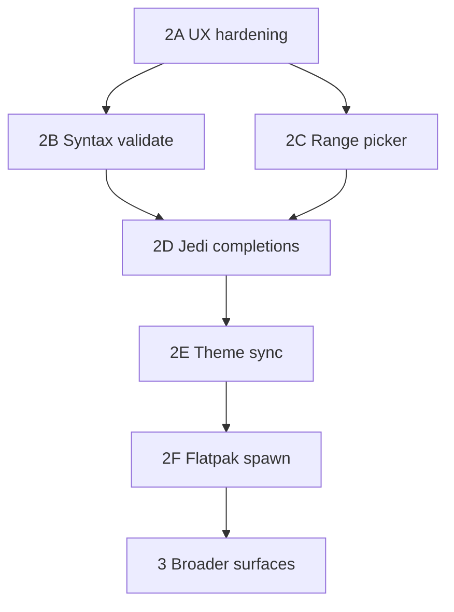

# Technical Dev Plan: WebView Monaco Code Editor

Architectural design for the **LibrePythonista-style Monaco editor** in WriterAgent.

**Status (session 1 complete, Phase 2A lifecycle + save feedback):** Calc menu **Edit Python in Cell…** opens a Monaco/pywebview window in the user venv, edits any selected cell (empty or existing `=PYTHON()`), and writes back `=PYTHON("…")` on Save. WM close (title-bar X) sends `closed` immediately so LibreOffice clears the session; Save shows green/red toolbar status. Pipe IPC, bundled Monaco, formula parse/rebuild, venv-only spawn, and full-traceback failure dialogs are implemented. See `plugin/scripting/` and `plugin/calc/python_editor.py`.

**`=PYTHON()` is not localized:** The Calc add-in always registers the English function name `PYTHON` (programmatic `python`). Formulas stored by Calc must use that token in `getFormula()` / `FormulaLocal`. A localized alias (e.g. a translated function name) is a **bug** in add-in registration — do **not** add `FormulaOpCodeMapper` workarounds in the editor or formula parser.

**Session 1 fixes (post-MVP):** venv path required (no LibreOffice embedded Python for the editor); `resolve_venv_python` tries `bin/python`, `bin/python3`, and `bin/python3.*`; `ready` is sent only after `window.events.loaded` / `shown` (not before `webview.start()`); child uses `http_server=True` with **absolute** path to `assets/editor/index.html` (relative `index.html` resolves against `plugin/scripting/` and 404s); probe/save failures show child stderr + Python tracebacks via [`editor_diagnostics.py`](../plugin/scripting/editor_diagnostics.py).

**Dual save modes:** Monaco always edits **stripped Python source** (inline `=PYTHON("…")` code is parsed on load; plain-text cells use `getString`). Toolbar checkbox **Save as plain text** writes `cell.setString(code)` only (for `=PYTHON($A$1; …)` workflows elsewhere). Default Save wraps `=PYTHON("…")` via `setFormula`, preserving existing data-range suffixes. Opening `=PYTHON($A$1; …)` on the formula cell remains blocked; edit the code storage cell instead.

---

## 1. Architectural Overview

The editor is a **separate native window** in the user's configured Python venv. It talks to LibreOffice over **stdin/stdout** (length-prefixed JSON), not TCP sockets.

### Core components

| Component | Module | Role |
|-----------|--------|------|
| Editor launcher | [`plugin/scripting/editor_launcher.py`](../plugin/scripting/editor_launcher.py) | Require Settings venv, probe `import webview`, `Popen` child |
| Editor diagnostics | [`plugin/scripting/editor_diagnostics.py`](../plugin/scripting/editor_diagnostics.py) | Msgbox text: stderr + `traceback.format_exception` |
| Editor bridge | [`plugin/scripting/editor_bridge.py`](../plugin/scripting/editor_bridge.py) | Pipe reader thread; UNO on main thread via [`QueueExecutor`](../plugin/framework/queue_executor.py) |
| Editor process | [`plugin/scripting/editor_main.py`](../plugin/scripting/editor_main.py) | `pywebview` + Monaco (venv only) |
| Calc integration | [`plugin/calc/python_editor.py`](../plugin/calc/python_editor.py), [`python_formula_edit.py`](../plugin/calc/python_formula_edit.py) | Active cell `=PYTHON()` load/save |
| Protocol | [`plugin/scripting/editor_protocol.py`](../plugin/scripting/editor_protocol.py) | `!I` length + UTF-8 JSON |
| Frontend | [`plugin/scripting/assets/editor/`](../plugin/scripting/assets/editor/) | Bundled Monaco `vs/` (see [`scripts/fetch_monaco_editor.sh`](../scripts/fetch_monaco_editor.sh)) |

Menu: `org.extension.writeragent:scripting.edit_python_cell` in [`extension/Addons.xcu`](../extension/Addons.xcu) (Calc only).

---

## 2. IPC protocol (pipe)

Same framing idea as [`worker_harness.py`](../plugin/scripting/worker_harness.py) (`struct.pack("!I", …)`), but payloads are **JSON** (not pickle).

| `type` | Direction | Purpose |
|--------|-----------|---------|
| `ready` | child → LO | GUI up (`window.events.loaded` or `shown`); safe to send `load` |
| `load` | LO → child | Initial `code` (stripped Python only—never `=PYTHON()`), optional `title`, `data_binding`, `plain_text_label` |
| `save` | child → LO | User saved; includes `code`, optional `save_as_plain` (default false), optional `data_binding` (range text for formula suffix) |
| `saved` / `error` | LO → child | Apply result in UI; `saved` may include `save_as_plain` |
| `closed` / `cancel` | either | Tear down session |

---

## 3. Threading (critical)

### LibreOffice parent

- Pipe reader: [`run_in_background`](../plugin/framework/worker_pool.py) (`editor-pipe-reader`).
- **Never call UNO from the reader thread.** Use [`execute_on_main_thread`](../plugin/framework/queue_executor.py) for `save` (setFormula, `calculateAll`).
- MCP uses the same `QueueExecutor` / `AsyncCallback` pattern.

### Child (`pywebview`)

- **GUI thread:** `js_api` (`notify_save`, `notify_cancel`, `poll_messages`).
- **Pipe thread:** read stdin only; push `load` / `saved` / `error` to `_ui_queue`.
- **Never call `evaluate_js()` from the pipe thread** (GTK/WebView2 deadlock). JS polls `poll_messages()` ~80ms and updates Monaco.

---

## 4. Dependencies

- **Settings → Python → `scripting.python_venv_path`:** must point at the venv where you run `pip install pywebview`. The Monaco editor **does not** use LibreOffice’s embedded Python.
- **`pywebview`** and GUI backends in that venv. For robust cross-platform support (especially in isolated venvs on Linux/Python 3.14), the following stack is verified:
  ```bash
  pip install pywebview PyQt6 PyQt6-WebEngine qtpy
  ```
  - **Why:** `pywebview` requires a GUI driver. While it can use system GTK, a venv often cannot see system bindings. `PyQt6` + `WebEngine` provides a self-contained Chromium-based browser engine. `qtpy` is a mandatory shim for the `pywebview` Qt driver.
- **Linux GUI:** child inherits `DISPLAY`, `WAYLAND_DISPLAY`, `XDG_RUNTIME_DIR`, `DBUS_SESSION_BUS_ADDRESS`, `LD_LIBRARY_PATH` from the LO process. Optional `WRITERAGENT_PYWEBVIEW_GUI=qt|gtk` for [`editor_main.py`](../plugin/scripting/editor_main.py).
- **Monaco:** vendored under `assets/editor/vs/` (~14MB); refresh with [`scripts/fetch_monaco_editor.sh`](../scripts/fetch_monaco_editor.sh).
- **`jedi`** (session 2+): optional, persistent `Environment` in child — see below.

**Note:** [`python_runner.py`](../plugin/scripting/python_runner.py) still offers a native multiline dialog for other flows (e.g. **Run Python Script…**). The Calc Monaco menu does **not** fall back to that dialog when pywebview is missing—it explains how to fix the configured venv instead.

---

## 5. Deferred (session 2+)

| Feature | Notes |
|---------|--------|
| Syntax validation | Debounced `compile()` on LO main thread; squiggles in Monaco |
| Range picker | `GlobalCalcRangeSelector` via pipe + main thread (**deferred**; editable textbox for data ranges shipped first) |
| Theme sync | LO VCL → `vs` / `vs-dark` |
| Flatpak/Snap spawn | `flatpak-spawn --host` |
| Formula bar button | Optional |
| Jedi completions | Persistent `jedi.Environment` in child; **do not** recreate env per keystroke; debounced `Script.complete`; results via `_ui_queue` + `poll_messages` |

### Autocompletion (Jedi)

- Run Jedi only in the **editor child**, not over the pipe on every key.
- One `jedi.create_environment(venv_path)` per window lifetime.
- Target: sub-10ms after warm-up.

---

## 6. File structure (implemented)

```text
plugin/
├── calc/
│   ├── python_editor.py       # Menu entry, launch bridge
│   └── python_formula_edit.py # Parse/rebuild =PYTHON() formulas
└── scripting/
    ├── editor_launcher.py
    ├── editor_bridge.py
    ├── editor_diagnostics.py
    ├── editor_protocol.py
    ├── editor_main.py
    └── assets/editor/
        ├── index.html
        ├── editor.js
        ├── style.css
        └── vs/                  # Monaco bundle (generated)

tests/
├── calc/test_python_formula_edit.py
├── calc/test_python_editor_save_modes.py
└── scripting/
    ├── test_editor_protocol.py
    ├── test_editor_diagnostics.py
    └── test_editor_main_closed.py
```

---

## 7. Manual test

1. Create or pick a venv; `pip install pywebview` (and any packages your `=PYTHON()` code needs).
2. **WriterAgent Settings → Python:** set **Python venv path** to that directory (not merely “venv active” in a terminal).
3. `make deploy`, restart LibreOffice, open Calc.
4. Select any cell (empty or `=PYTHON("result = 1")`).
5. **WriterAgent → Edit Python in Cell…** — Monaco window should open.
6. Edit, **Save** — cell should become/update `=PYTHON("…")` and recalc; toolbar shows green **Saved.** briefly.
7. Close the editor with the window **X** (not Cancel), reopen immediately — should **not** show “already open.”
8. On save error (if reproducible), toolbar shows red error text and the editor stays open.

**If it fails:** the msgbox should include child stderr and a Python traceback. Also check `writeragent_debug.log` under the LO user profile (`writeragent.json` directory). Common causes: wrong venv path in Settings, pywebview not installed in *that* venv, or missing display/GTK backend on Linux.

---

## 8. Next development plan (detailed)

Session 1 proves the **pipe + subprocess + Monaco** spine. The work below is ordered by **user-visible value per risk**, not by file layout. Each phase should ship with tests and a short manual checklist before piling on the next.

### Phase 2A — Editor UX hardening (low risk, high polish)

**Goal:** Make the existing flow feel finished, not prototype.

| Task | Detail | Status |
|------|--------|--------|
| **Window lifecycle** | Wire `window.events.closed` (pywebview) to send `closed`; bridge clears session when child exits. | **Done** |
| **Save feedback** | Green status on `saved` (auto-clear ~3s); red status on `error` with message; editor stays open. | **Done** |
| **Context menu** | Duplicate menu entry under Calc cell context in [`extension/Addons.xcu`](../extension/Addons.xcu) (same URL as menubar). Users expect right-click on a `=PYTHON()` cell. | |
| **stderr logging** | Session 1 surfaces child stderr in failure msgboxes (64KB tail) and logs probe/spawn errors. Optional: continuous stderr drain to `writeragent_debug.log` while the editor runs. | |

**Protocol:** no new message types required.

**Tests:** [`tests/scripting/test_editor_main_closed.py`](../tests/scripting/test_editor_main_closed.py); optional UNO smoke “open editor on fixture sheet” only if stable in CI.

---

### Phase 2B — Real-time syntax validation (medium risk)

**Goal:** Red squiggles for invalid Python before Save, without blocking the GUI thread in the child.

**Flow:**

1. Monaco `onDidChangeModelContent` debounced (~400ms) in JS.
2. Child sends `{"type": "validate", "code": "…"}` on stdin (GUI thread is fine for writes).
3. LO pipe reader receives `validate` → `execute_on_main_thread(_compile_check, code)`.
4. `_compile_check` uses `compile(code, "<editor>", "exec")`; on `SyntaxError`, return `{type: "validate_result", ok: false, line, col, message}`; else `{ok: true}`.
5. LO writes result to child stdin; pipe thread → `_ui_queue` → `poll_messages` → Monaco `editor.setModelMarkers` or deltaDecorations.

**Why LO for compile:** matches what Calc will eventually run in the venv worker; catches nothing Jedi would miss for syntax-level errors. Keep validation **syntax-only** (no imports execution).

**Protocol additions:**

| `type` | Direction |
|--------|-----------|
| `validate` | child → LO |
| `validate_result` | LO → child |

**Pitfall:** flooding LO with validate while user types fast — debounce in JS **and** drop stale responses (sequence id in message).

**Tests:** pure-Python tests for `_compile_check`; no LO required.

---

### Phase 2C — Calc range picker (medium risk, high value)

**Goal:** “Insert range” inserts `Sheet1.A1:B10` (or active sheet shorthand) at the cursor — WriterAgent style, not LibrePythonista’s `lp("…")` unless we add a helper later.

**Flow:**

1. Toolbar button in `editor.js` → `api.request_range()`.
2. Child writes `{"type": "pick_range"}`.
3. LO main thread: `GlobalCalcRangeSelector` (see LP analysis in [`libre_pythonista_features_analysis.md`](libre_pythonista_features_analysis.md)), modal selection, format range with [`address_utils`](../plugin/calc/address_utils.py), reply `{"type": "range_result", "text": "A1:B10"}` or cancel.
4. Child queues `range_result` → JS inserts at `editor.getPosition()`.

**Threading:** selector and all UNO on main thread only; child blocks in API method with `threading.Event` until result (same pattern as MCP `execute_on_main_thread` with timeout). Cap wait at 120s.

**UX:** While picker is open, Monaco can stay open behind LO modal — document z-order quirk on Wayland.

**Tests:** `@native_test` in `tests/calc/test_python_editor_uno.py` — open Calc, stub or real selector if automatable; at minimum test range formatting helpers.

---

### Phase 2D — Jedi autocompletion (child-only, performance-sensitive)

**Goal:** IntelliSense that feels instant after warm-up.

**New module:** [`plugin/scripting/editor_jedi.py`](../plugin/scripting/editor_jedi.py) — imported **only** from `editor_main.py` (not from LO).

```text
EditorSession.start()
  → JediSession.create(venv_python_path)  # once
on debounced complete (child GUI thread pool or worker thread)
  → Script(full_source, environment=env).complete(line, col)
  → format Completion items for Monaco
  → ui_queue.put({type: "completions", items: [...]})
```

**Rules (non-negotiable):**

- **One** `jedi.create_environment` per editor window.
- Never recreate `Environment` per keystroke.
- `jedi.Script` per request is OK; environment reuse is what buys sub-10ms.
- Do **not** RPC every keypress to LO for Jedi.

**Monaco:** register `monaco.languages.registerCompletionItemProvider('python', …)` in `editor.js`; provider calls exposed `api.complete(line, column, fullText)` which runs Jedi on a **background thread in the child** (not pipe thread) and returns when done — still must not touch `evaluate_js` off-thread; return value via pywebview expose is synchronous from JS’s view if we block expose (acceptable for 150ms debounce) or use async expose pattern if pywebview version supports it.

**Optional Phase 2D+:** LO sends `{"type": "calc_symbols", "names": ["Sheet1", …]}` once on `load` for sheet/tab completion — only if Jedi alone is insufficient.

**Deps:** document `pip install jedi` next to pywebview in Settings helper text.

**Tests:** unit tests with fixed source snippets and mocked `Environment` if needed; manual benchmark log for cold vs warm complete latency.

---

### Phase 2E — Theme sync (low/medium risk)

**Goal:** Monaco `vs` / `vs-dark` tracks LO light/dark.

On `load`, LO includes `theme: "dark" | "light"` from VCL (probe existing LO theme APIs or config; Calc `ThemeCalc` mentioned in LP docs). JS calls `monaco.editor.setTheme(...)`. Toolbar chrome in `style.css` can follow CSS variables set from the same message.

Defer custom per-color mapping until simple binary dark/light works.

---

### Phase 2F — Sandboxed LO installs (Flatpak/Snap)

**Goal:** `Popen` from inside Flatpak can reach the host venv.

Port spawn helpers from LibrePythonista (see analysis doc): detect sandbox, wrap invocation with `flatpak-spawn --host` or snap equivalent. Centralize in [`editor_launcher.py`](../plugin/scripting/editor_launcher.py) beside existing `resolve_venv_python`.

**Tests:** hard to automate; maintain a manual matrix in this doc (Flatpak LO + host venv path).

**Priority:** bump up if user reports are mostly Flatpak; otherwise after 2A–2D.

---

### Phase 3 — Broader surfaces

| Item | Rationale |
|------|-----------|
| **Run Python Script… → Monaco** | Reuse bridge with `load` from `last_python_script_*` config keys; save writes config not formula. Same child process, different `on_save` handler. |
| **Formula bar button** | Needs LO UI extension research (Calc input line customization). High effort; do after context menu. |
| **Tier-2 document store** | [`enabling_numpy_in_libreoffice.md`](enabling_numpy_in_libreoffice.md) Tier 2 (formula key + side store) is a **separate** product decision — do not mix with Monaco until formula-in-cell workflow is stable. |
| **Core extension split** | Keep all editor code in `plugin/scripting/` + thin `plugin/calc/python_editor.py` per [`ROADMAP.md`](../docs/ROADMAP.md) Phase 3–4 so a future core OXT can ship `=PYTHON()` + editor without the LLM stack. |

---

### Protocol evolution summary

```text
Session 1:  ready | load | save | saved | error | closed | cancel
Phase 2B: + validate | validate_result
Phase 2C: + pick_range | range_result
Phase 2D: + completions (child-internal, optional calc_symbols from LO)
Phase 2E: load.theme field (no new type)
```

Consider a top-level `seq: int` on all messages once 2B is in place so async validate/range responses never apply out of order.

---

### Testing strategy (cumulative)

| Layer | What to add |
|-------|-------------|
| **Unit** | `validate` compile helper; Jedi completion formatting (no LO) |
| **Integration** | subprocess test: spawn `editor_main.py`, write `ready`/`load`, read responses (headless skip if no display); optional probe test against a fixture venv with pywebview |
| **UNO** | range picker happy path; optional “edit cell → save → recalc” one-shot |
| **Manual** | checklist in §7 extended per phase; Flatpak row when 2F ships |

---

### Suggested implementation order



**Rationale:** 2A reduces support burden immediately. 2B and 2C are the two features users ask for after “it opens.” Jedi (2D) depends on stable editor loop and should not compete with range picker for main-thread LO time. Theme and Flatpak are polish/distribution. Phase 3 only after Calc cell editing is trusted daily-driver quality.

---

### Open questions (decide before large work)

1. **Auto-close on Save?** LP keeps editor open; WriterAgent today shows “Saved.” — default stay open; optional setting later.
2. **Multiple editor windows?** Session singleton forbids two — enough for now; multi-cell edit is rare.
3. **Monaco bundle size (~14MB):** acceptable in OXT vs download-on-first-use — current bundle-in-OXT is correct for offline; document `fetch_monaco_editor.sh` in release notes.
4. **Validate in child with `ast.parse` instead of LO?** Faster but diverges from worker `compile` mode — prefer LO for consistency unless latency forces child-side AST-only pass first.

---

### Success criteria for “editor feature complete”

- **Session 1 (done):** native LO + configured venv with pywebview: menubar **Edit Python in Cell…**, edit any selected Calc cell, Save updates `=PYTHON()` and recalc; failures show full tracebacks.
- **Phase 2A (partial):** WM close clears session; save toolbar feedback (green/red).
- **Later:** context menu, range insert, squiggles, Jedi completions, theme sync, Flatpak spawn.
- `make test` green; typecheck clean; no UNO calls off main thread in bridge code paths.

### Session 1 behavior reference

| Topic | Behavior |
|-------|----------|
| Cell selection | Uses sheet controller selection ([`python_editor.py`](../plugin/calc/python_editor.py)), same idea as Calc extend/edit |
| Empty / non-PYTHON cells | Editor opens; Save (default) writes `=PYTHON("code")`; plain-text checkbox writes raw script via `setString` |
| Load source | Inline PYTHON → stripped `code`; plain cell → `getString()`; Monaco never shows `=PYTHON()` |
| Data ranges | Editable toolbar textbox (`data_binding` on load/save); written into `=PYTHON("code"; …)` suffix via [`python_formula_edit.py`](../plugin/calc/python_formula_edit.py); single range → `data`, multiple comma/semicolon-separated → `data_list` |
| Formula strings | Reads `getFormula()`, `FormulaLocal`, `Formula`; normalizes leading `=`, array braces, smart quotes |
| Unparsed PYTHON (e.g. `=PYTHON(A1; B1)`) | Blocked with msgbox — cannot safely preserve data args |
| Single session | Second open while editor running shows “already open” |
| Child `sys.path` | [`editor_main.py`](../plugin/scripting/editor_main.py) bootstraps repo root so `plugin.scripting.editor_protocol` imports |
| Save errors to UI | Bridge sends `error` + `traceback` to child; red toolbar status (Phase 2A) |
| Formula function name | Always English `PYTHON`; localized tokens are a bug, not supported |
