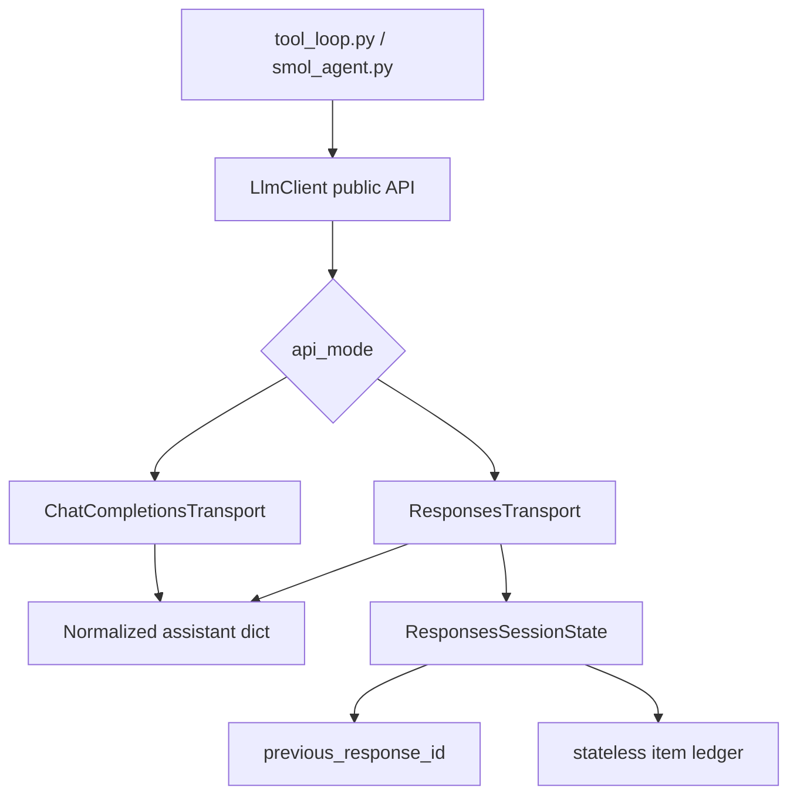

# Responses API Implementation Plan

## Summary

The Responses API is the successor shape to Chat Completions for OpenAI-style models. It keeps the familiar idea of "send input, receive model output", but replaces chat `messages` and `choices[0].message` with typed `input` and `output` items. A message, a function call, a function-call output, reasoning metadata, and built-in tool results are all separate items.

For WriterAgent, the product opportunity is not just "support another endpoint". The useful opportunity is cheaper and more reliable long-running chat:

- OpenAI Responses can reuse prior turns through `previous_response_id` or the Conversations API, so WriterAgent does not need to resend the whole conversation and all intermediate tool-call items every round.
- OpenAI reports better cache utilization for Responses, especially with reasoning models and stable tool schemas.
- Responses has a cleaner tool-call item model than Chat Completions, which maps well to WriterAgent's existing multi-round tool loop.
- OpenRouter's Responses API is currently beta and explicitly stateless. It is useful for early compatibility testing, but it will not provide the server-side state/cost benefit until OpenRouter implements stateful continuation or equivalent caching.

This plan keeps the implementation small: preserve WriterAgent's current session, tool registry, FSM, smolagents wrapper, streaming UI, cancellation, and provider auth. Add a Responses transport below `LlmClient` that normalizes Responses wire data back into the same return shape the rest of WriterAgent already consumes.

## Audience Primer

### Chat Completions Today

WriterAgent currently sends this shape to OpenAI-compatible providers:

```json
{
  "model": "openai/gpt-oss-120b",
  "messages": [
    {"role": "system", "content": "You are WriterAgent..."},
    {"role": "user", "content": "Make the intro shorter"}
  ],
  "tools": [
    {
      "type": "function",
      "function": {
        "name": "apply_document_content",
        "description": "...",
        "parameters": {"type": "object", "properties": {}}
      }
    }
  ],
  "tool_choice": "auto",
  "parallel_tool_calls": false,
  "stream": true,
  "max_tokens": 16384
}
```

The response is centered on `choices[0].message`. If the model wants a tool, `message.tool_calls` contains OpenAI-style calls. WriterAgent executes those tools, appends `role: "tool"` messages with `tool_call_id`, and sends the full updated message list again.

### Responses API

Responses moves the same workflow to typed items:

```json
{
  "model": "gpt-5",
  "instructions": "You are WriterAgent...",
  "input": [
    {
      "type": "message",
      "role": "user",
      "content": [{"type": "input_text", "text": "Make the intro shorter"}]
    }
  ],
  "tools": [
    {
      "type": "function",
      "name": "apply_document_content",
      "description": "...",
      "parameters": {"type": "object", "properties": {}},
      "strict": false
    }
  ],
  "tool_choice": "auto",
  "parallel_tool_calls": false,
  "stream": true,
  "max_output_tokens": 16384
}
```

The response has an `id` and an `output` array. A final answer is usually an output item like:

```json
{
  "type": "message",
  "id": "msg_123",
  "status": "completed",
  "role": "assistant",
  "content": [{"type": "output_text", "text": "Here is a shorter intro.", "annotations": []}]
}
```

A tool request is a separate item:

```json
{
  "type": "function_call",
  "id": "fc_123",
  "call_id": "call_abc",
  "name": "apply_document_content",
  "arguments": "{\"old_text\":\"...\",\"new_text\":\"...\"}"
}
```

The application returns a result with the same `call_id`:

```json
{
  "type": "function_call_output",
  "id": "fc_output_123",
  "call_id": "call_abc",
  "output": "{\"status\":\"ok\"}"
}
```

### Stateful vs Stateless Responses

There are two relevant operating modes:

1. Stateless Responses: send all prior input and output items every request. This is what OpenRouter beta documents today.
2. Stateful Responses: send only the new user/tool input plus `previous_response_id` or a `conversation` id. This is the cost and payload-size win for OpenAI proper.

Important nuance: `previous_response_id` does not mean old tokens become free. OpenAI still bills input represented by the chain, but server-side state and cache utilization can reduce cost and latency. It also avoids large request payloads and makes reasoning/tool context easier to preserve.

## Current WriterAgent Architecture

The existing boundaries are favorable:

- `plugin/chatbot/tool_loop.py` owns the sidebar multi-round loop. It sends `self.session.messages` to `client.stream_request_with_tools(...)`.
- `plugin/chatbot/tool_loop_state.py` is pure FSM logic. It expects a normalized response dict with `content`, `tool_calls`, `finish_reason`, and `usage`.
- `plugin/framework/client/llm_client.py` builds requests, handles streaming/non-streaming HTTP, provider shims, OpenRouter extra body merging, token cleanup, and text-parser fallback.
- `plugin/framework/tool.py` converts `ToolBase` objects to OpenAI Chat Completions tool schemas.
- `plugin/chatbot/panel.py` keeps `ChatSession.messages` as OpenAI-style `system` / `user` / `assistant` / `tool` messages. Persistent history currently stores only clean text messages; tool calls and tool results are intentionally not persisted.
- `plugin/chatbot/smol_agent.py` already routes smolagents through `LlmClient.request_with_tools(...)`, so smol can inherit Responses support if `LlmClient` keeps its public return shape stable.

That means the plan should not rewrite the chat loop or the tool execution model. The transport should adapt Responses to WriterAgent's current normalized internal shape.

## Product Plan

### Goals

- Let users opt into the Responses API for OpenAI and OpenRouter endpoints.
- Enable immediate OpenRouter beta testing without claiming stateful cost savings that OpenRouter does not yet provide.
- Enable OpenAI stateful continuation to reduce repeated prompt/tool-history payloads and benefit from provider-side cache behavior.
- Keep Chat Completions as the stable default until Responses has enough real-world coverage.
- Preserve current chat UX: streaming text, thinking display when available, tool banners, stop button, document context refresh, specialized tool delegation, and smolagents behavior.

### Non-Goals

- Do not replace the main chat FSM with the OpenAI Agents SDK.
- Do not adopt OpenAI built-in tools as a first milestone. WriterAgent already has document, web, image, Python, and MCP-like local tools with LibreOffice-specific permission and UI semantics.
- Do not introduce a second smolagents HTTP path.
- Do not make OpenRouter beta look stateful. Its documentation says each `/responses` request is independent and must include full history.
- Do not attempt a broad history database redesign in the first milestone.

### User-Facing Settings

Add one experimental transport setting:

- `LLM API Mode`: `Chat Completions` default, `Responses API (experimental)`.

Add one state strategy setting visible only when Responses is selected:

- `Responses State`: `Auto` default, `Stateless full history`, `OpenAI previous_response_id`.

Add one compaction setting visible only when Responses is selected:

- `Responses Compaction`: `Off` default for the first release, `Auto when provider supports it`, `Manual compact before long sends`.

Recommended behavior:

- `Auto` on OpenRouter uses stateless full history.
- `Auto` on OpenAI uses `previous_response_id` after the first successful response.
- Any unknown/custom endpoint uses stateless unless the user explicitly chooses `previous_response_id`.
- `Responses Compaction: Auto` should initially be OpenAI-only unless OpenRouter documents compatible support. Unknown providers should ignore the setting with a debug log, not fail the chat.

Add explanatory helper text:

> Responses API is experimental. OpenAI can continue conversations by response id for better cache behavior and smaller requests. OpenRouter's beta Responses API is currently stateless, so WriterAgent must send full history there.

> Compaction can shrink a long Responses context when the provider supports it. It is an optimization for long chats, not a way to erase or edit prior provider-side state.

### Rollout

1. Developer-only config support through `writeragent.json` for fast testing.
2. Add Settings UI once the OpenRouter beta request/response path works.
3. Keep Chat Completions default for at least one release.
4. Add a debug log line per request showing `api_mode`, `responses_state_strategy`, `previous_response_id_present`, `stateless_input_items`, and redacted body size.

### Acceptance Criteria

- A normal Writer chat without tools streams correctly on Chat Completions and Responses.
- A Writer chat that calls one document tool works on Responses.
- A multi-round tool loop works when the model calls multiple tools across rounds.
- OpenRouter Responses beta can be selected and receives valid `/api/v1/responses` bodies.
- OpenAI Responses can continue a chat using `previous_response_id` after the first turn.
- Clear Chat starts a genuinely fresh Responses conversation: no `previous_response_id`, no conversation id, no retained stateless item ledger, and no reused synthetic history ids.
- A future edited-history flow can intentionally fork/rebuild Responses context from WriterAgent's edited local transcript instead of accidentally continuing provider-side state that still contains deleted text.
- OpenAI compaction can be enabled as an optional optimization, and the returned compacted context becomes the canonical next Responses input window.
- Disabling Responses returns the app to the current Chat Completions behavior with no transcript migration.
- Existing smolagents flows continue to work through `WriterAgentSmolModel`.

### Success Metrics

- Provider request body size drops sharply on OpenAI stateful continuation after the first turn.
- OpenAI prompt/cache cost is lower or latency improves on repeated long document chats.
- Tool-call success rate is not worse than Chat Completions for the same models.
- No increase in "No text from model" or malformed tool-call errors.

### Risks

- OpenRouter beta may change item requirements, especially around assistant message `id` / `status` and streaming event names.
- Responses tools are internally tagged, while current WriterAgent tools are Chat Completions tagged under `function`.
- Responses defaults tools toward strict mode. WriterAgent's schemas are normalized for strict-ish providers, but not all tools necessarily meet strict mode requirements. The first implementation should explicitly set `strict: false` on converted Responses function tools.
- Stateful OpenAI continuation can break if the previous response id is expired, unavailable, belongs to another model, or was produced before a settings/tool-schema change.
- Document context changes every send. If the system/document prompt changes while using `previous_response_id`, the next request must include the new instructions or intentionally reset the chain.

## Development Plan

### Design Principle

Keep one public client contract:

```python
client.request_with_tools(...) -> {
    "role": "assistant",
    "content": str,
    "tool_calls": list | None,
    "finish_reason": str | None,
    "images": list,
    "usage": dict,
}
```

Everything above `LlmClient` should continue to think in WriterAgent's current internal chat shape. Responses support belongs below that boundary.

### Proposed Layers



### Phase 1: Config and Mode Selection

Add config keys:

- `api_mode`: string, default `chat_completions`, options `chat_completions` / `responses`.
- `responses_state_strategy`: string, default `auto`, options `auto` / `stateless` / `previous_response_id`.

Implementation notes:

- Put durable config schema in `WriterAgentConfig`.
- Add settings metadata only after the transport works.
- Include these values in `get_api_config(ctx)`.
- Do not repurpose `openrouter_chat_extra`; add a separate `responses_extra` only if real testing shows a need. If added, blocklist `input`, `tools`, `tool_choice`, `stream`, `previous_response_id`, `conversation`, and `model`.

### Phase 2: Responses Tool Schema Conversion

Add a converter beside the existing tool schema conversion:

```python
def to_responses_schema(tool, *, doc_type=None):
    chat_schema = to_openai_schema(tool, doc_type=doc_type)
    fn = chat_schema["function"]
    return {
        "type": "function",
        "name": fn["name"],
        "description": fn["description"],
        "parameters": fn["parameters"],
        "strict": False,
    }
```

Then extend `ToolRegistry.get_schemas(protocol=...)` to support `protocol="responses"`.

Why `strict: false` first:

- Responses treats functions as strict by default or normalizes toward strict behavior.
- Strict mode requires `additionalProperties: false` and all fields required unless nullable.
- Existing tools were built for Chat Completions, where non-strict is the default.
- OpenRouter examples use `strict: null`, but `strict: false` is clearer for preserving current behavior. If OpenRouter rejects it, make the converter provider-aware and use `strict: null` only for OpenRouter.

### Phase 3: Message and Item Adapters

Create a small adapter module, for example `plugin/framework/client/responses_adapter.py`.

Responsibilities:

- Convert WriterAgent chat messages to Responses `input` items.
- Convert Responses `output` items to the existing normalized assistant dict.
- Convert Responses streaming events into the existing delta shape consumed by `accumulate_delta(...)`, or bypass `accumulate_delta` with a Responses-specific accumulator that returns the same final dict.

Message conversion:

- `system` messages become top-level `instructions` when possible.
- `user` string content becomes a `message` item with `role: "user"` and `input_text`.
- `user` list content maps current text parts to `input_text` and audio parts to the closest supported Responses input type. If Responses audio is not supported by the provider, fall back to the existing STT path.
- `assistant` content becomes a Responses assistant `message` item with `id`, `status: "completed"`, and `output_text`.
- Chat Completions `assistant.tool_calls` becomes one or more Responses `function_call` items.
- Chat Completions `tool` messages become `function_call_output` items using `tool_call_id` as `call_id`.

Important OpenRouter stateless requirement:

- OpenRouter requires `id` and `status` on assistant messages included in history.
- Current persisted history does not store provider message IDs.
- For active in-memory sessions, keep the real response output items returned by the provider.
- For loaded legacy text history, generate stable synthetic ids like `msg_wa_<session_id>_<index>` and set `status: "completed"`.

Tool-call id mapping:

- Chat Completions uses `tool_calls[].id` and `tool` messages use `tool_call_id`.
- Responses uses `function_call.call_id` for correlation, plus a separate item `id`.
- For normalized responses returned to `tool_loop`, set the OpenAI-style `tool_call.id` to the Responses `call_id`. Store the Responses item id in metadata if needed.

### Phase 4: Responses Session State

Add lightweight per-session state without changing the top-level chat loop contract.

Recommended model:

```python
@dataclasses.dataclass
class ResponsesSessionState:
    provider: str = ""
    model: str = ""
    state_strategy: str = "stateless"
    previous_response_id: str | None = None
    last_instructions_hash: str = ""
    last_tools_hash: str = ""
    output_items_by_turn: list[list[dict[str, Any]]] = dataclasses.field(default_factory=list)
```

Attach this to `ChatSession`, not the global `LlmClient`, because it is conversation state, not HTTP connection state.

For smolagents:

- `WriterAgentSmolModel` can initially use stateless Responses only, because smolagents has its own ReAct transcript and step state.
- Stateful smol can be considered later if a single smol run makes many model calls and cost data shows value.

Reset conditions for `previous_response_id`:

- User clears chat.
- Endpoint or model changes.
- Tool schema hash changes.
- Base system prompt or document-context strategy changes in a way not included in the next request.
- Provider returns an invalid/expired previous response id error.
- User switches document or the sidebar resolves a different document URL.

Clear Chat behavior:

- Treat Clear Chat as a hard local boundary. `ChatSession.clear()` must clear `session.messages`, `ResponsesSessionState.previous_response_id`, any future `conversation_id`, `output_items_by_turn`, synthetic id counters, hashes, and any provider-state metadata stored in memory.
- The next send after Clear Chat must omit `previous_response_id` / `conversation` and build a new first Responses request from the fresh system/document context plus the new user message.
- For OpenAI, no provider API call is required to "clear" the old response chain for correctness. The old stored response objects may still exist on the provider side until their retention policy expires, but WriterAgent will not reference them again.
- For OpenRouter stateless mode, clearing the local message/item ledger is sufficient because OpenRouter does not persist Responses conversation state.
- If a future Conversations API mode is added, Clear Chat should either create a new conversation id for the next send or omit the old one. Deleting the old provider conversation can be offered as a privacy cleanup, but correctness must not depend on deletion succeeding.

Document context handling:

- WriterAgent updates `[DOCUMENT CONTENT]` every send. Since document content is short and changes constantly, having stale document text cached in the provider-side conversation history under old response chains would be highly confusing.
- To ensure the model always sees a completely fresh, accurate view of the document, we will always pass the latest document context fresh in every request.
- In practice, this means when using the stateful Responses API (`previous_response_id`), we must supply the fresh document context either by overriding the `instructions` system prompt parameter in the `/responses` request block (which is updated dynamically on each turn), or by appending it as a new system-role message item in the current turn's `input` ledger.
- This ensures the model receives a fresh, up-to-date document snapshot on every turn without relying on outdated cached context.

Edited-history complication:

- `previous_response_id` is append/fork oriented, not an editable transcript. There is no provider-agnostic API that rewrites an existing response chain so deleted local text disappears from prior provider state.
- OpenAI can fork from an earlier response id, but that only helps if the edit is "drop everything after this old turn". It does not edit the content of that earlier response chain.
- The canonical transcript must therefore remain WriterAgent's local chat history. If the user later edits history to remove excess text, WriterAgent should invalidate `previous_response_id` and rebuild the next Responses request from the edited local transcript in stateless form.
- After the rebuild request succeeds, store the new response id as the start of a new provider-side chain. From that point forward, `previous_response_id` can be used again.
- If OpenAI `/responses/compact` is adopted later, use it only after constructing the edited transcript locally. Compaction can shrink a chosen context window, but it is not a safe substitute for deleting or rewriting provider-side history.

### Phase 5: Request Building

Add a Responses transport path under `LlmClient.make_chat_request(...)`, or split the current method into transport-specific builders:

- `build_chat_completions_request(...)`
- `build_responses_request(...)`

Responses request fields:

- URL: `<endpoint><api_path>/responses`, where OpenRouter should become `https://openrouter.ai/api/v1/responses` and OpenAI should become `https://api.openai.com/v1/responses`.
- `model`: existing selected text model.
- `instructions`: coalesced system prompt, including the existing date prefix and dev-build prefix rules.
- `input`: current turn items, full item history, or full converted message history depending on state strategy.
- `tools`: Responses-shaped tools when available.
- `tool_choice`: `"auto"` when tools are present.
- `parallel_tool_calls`: `True` (to let the model return multiple tool calls when appropriate). Our existing FSM state machine (`ToolLoopState` / `next_state` in `plugin/chatbot/tool_loop_state.py`) already seamlessly handles parallel tool calls by queuing them into `pending_tools` and executing them serially, only querying the LLM again once all pending tools are resolved. Thus, no FSM changes are needed.
- `stream`: current stream flag.
- `max_output_tokens`: map from current `max_tokens`.
- `temperature`: include only when configured, same as current logic.
- `store`: `True` for OpenAI `previous_response_id`; omit or set provider default for stateless OpenRouter. Consider a future privacy setting for `store: false`.
- `previous_response_id`: only when strategy is `previous_response_id` and state has an id.
- `context_management`: include only when OpenAI compaction is enabled and using server-side automatic compaction. Example shape is a compaction entry with `compact_threshold`.

Do not remove Chat Completions. Responses is a peer transport, not a replacement yet.

### Phase 6: Non-Streaming Response Normalization

Parse Responses result:

- `result["id"]` becomes the new `previous_response_id`.
- `result["output"]` is scanned in order.
- Text content comes from message items with `output_text`.
- Function calls become OpenAI-style tool calls:

```python
{
    "id": item["call_id"],
    "type": "function",
    "function": {
        "name": item["name"],
        "arguments": item.get("arguments") or "{}",
    },
}
```

- `finish_reason` can be synthesized:
  - `"tool_calls"` if any function calls exist.
  - `"stop"` if final text exists and status is completed.
  - `"length"` or `"content_filter"` if the API exposes equivalent incomplete status/details.
- `usage` should be normalized to include both Responses-native usage and Chat-style aliases:
  - `prompt_tokens` from `input_tokens`
  - `completion_tokens` from `output_tokens`
  - `total_tokens`

Store raw Responses output items in `ResponsesSessionState` for stateless replay and debugging.

### Phase 7: Streaming Response Normalization

Current streaming assumes Chat Completions chunks with `choices[0].delta`. Responses streams events like:

- `response.created`
- `response.output_item.added`
- `response.content_part.delta`
- `response.function_call_arguments.delta`
- `response.function_call_arguments.done`
- `response.output_item.done`
- `response.done`

Add a Responses stream accumulator:

- On `response.created`, capture response id.
- On `response.content_part.delta`, call the existing content callback with `delta`.
- On reasoning summary/text events, call the existing thinking callback if available.
- On `response.output_item.added` for `function_call`, create an accumulator entry by `output_index` or `item.id`.
- On `response.function_call_arguments.delta`, append argument fragments.
- On `response.function_call_arguments.done` or `response.output_item.done`, finalize the tool call.
- On `response.done`, capture usage and final status.

Return the same normalized assistant dict as the Chat Completions streaming path.

Do not force Responses events into `accumulate_delta(...)` unless the mapping stays simple. A dedicated accumulator is likely less code and less brittle.

### Phase 8: Tool Loop Integration

Minimal changes:

- In `_do_send_chat_with_tools`, choose schema protocol based on client mode:
  - Chat Completions: `get_schemas("openai", ...)`
  - Responses: `get_schemas("responses", ...)`
- Pass the `ChatSession` or `ResponsesSessionState` into `LlmClient.request_with_tools(...)` through an optional keyword, for example `conversation_state=self.session.responses_state`.
- Keep `ToolLoopState` unchanged.
- Keep `AddMessageEffect` unchanged for the first milestone.

Potential tiny addition:

- When `AddMessageEffect(role="assistant", tool_calls=...)` fires, let `ChatSession.add_assistant_message(...)` also accept optional metadata so Responses raw output items can be retained in memory. Do not persist tool outputs unless required for stateless replay after restart.

### Phase 9: Responses Compaction

Treat compaction as an optional OpenAI optimization layered on top of the canonical local transcript.

There are two OpenAI compaction modes worth supporting:

- Server-side automatic compaction: include `context_management` with a `compact_threshold` in `/responses` requests. When the rendered context crosses the threshold, OpenAI compacts and returns an encrypted compaction item in the response stream/output.
- Standalone compaction: call `POST /v1/responses/compact` with a full context window. The API returns a compacted context window containing an opaque `compaction` item plus any retained items. That returned window should be passed to the next `/responses` request as-is.

Recommended first implementation:

- Keep compaction off by default until the base Responses path is stable.
- Add a `ResponsesSessionState.compacted_input_items` field that, when present, is used as the base item window for the next stateless or rebuilt request.
- When standalone `/responses/compact` succeeds, replace the replay ledger with the returned compacted window. Do not prune or reinterpret the compaction output.
- When server-side automatic compaction returns a compaction item, retain it in `ResponsesSessionState` with the rest of the raw output items so future stateless/rebuild requests can include it.
- Do not use compaction while sending only `previous_response_id` plus new input unless OpenAI documents how the returned compaction item should be combined with that stateful chain. The safe first path is compaction for stateless/rebuilt windows.
- If `previous_response_id` fails and WriterAgent falls back to stateless full context, compaction may run before the fallback request if the full rebuilt window is large.
- If the user edits history, rebuild from the edited local transcript first, then optionally compact the rebuilt window. Compaction is never the source of truth for what the user wanted deleted.
- If the user clears chat, discard all compaction items and compacted windows.

OpenRouter behavior:

- OpenRouter's documented Responses beta is stateless and does not currently advertise `/responses/compact` or `context_management` compatibility. Treat compaction as unsupported for OpenRouter until docs or testing prove otherwise.
- If OpenRouter later adds compatible compaction, add provider capability detection rather than assuming OpenAI endpoints and OpenRouter endpoints behave the same.

Implementation details:

- Add a low-level `compact_responses_context(model, input_items, tools=None, instructions=None, ...)` helper under the Responses transport, reusing `LlmClient` auth, headers, timeout, pacing, local SSL fallback, redacted logging, and `NetworkError` formatting.
- Stamp compact calls with the same `history_revision` used for normal Responses requests. If the user clears or edits history while compaction is in flight, discard the compacted result.
- Track compaction metadata in debug logs: provider, input item count, output item count, whether a compaction item was returned, and redacted byte size before/after.
- Keep compacted context opaque. The UI can say "context compacted" in debug/agent logs, but should not show encrypted compaction content.

Tests:

- standalone compact helper builds `POST /responses/compact` only for supported providers.
- returned compacted window replaces the replay ledger exactly.
- Clear Chat discards compaction items.
- edited history rebuilds local input before compaction.
- in-flight compaction result is ignored when `history_revision` changes.

### Phase 10: Persistence

First milestone:

- Preserve current clean user-visible history behavior.
- Do not persist raw tool outputs by default.
- Persist only enough Responses metadata to resume provider state during the active LibreOffice session.
- Persist no provider continuation metadata after Clear Chat. If a clear event happens while a request is in flight, the eventual response id must be discarded unless it still belongs to the active send generation.

Second milestone if useful:

- Extend `message_to_dict(...)` to allow an optional `metadata` key inside the existing JSON message blob. No SQLite schema migration is needed because `message_store.message` is already JSON text.
- Store:
  - `responses.response_id`
  - `responses.output_items` for assistant turns
  - `responses.synthetic_id` for generated legacy assistant ids
  - `responses.compacted_input_items` only if we decide compacted windows should survive restart
- Keep the existing `role` and `content` fields unchanged so old history remains readable.

Future edited-history support:

- Add a `history_revision` integer on `ChatSession`. Increment it on Clear Chat and on any future user edit of prior messages.
- Stamp each Responses request with the current `history_revision`. When a response returns, only save `previous_response_id` and output item metadata if the revision still matches.
- When history is edited, mark `ResponsesSessionState` as `needs_rebuild=True`, clear provider continuation ids, and regenerate Responses input items from the edited local messages.
- If the edited transcript includes assistant messages without raw Responses output item metadata, synthesize valid assistant message items (`id`, `status: "completed"`, `output_text`) for stateless replay.
- If the edit removes a message that originally led to a tool call, also remove the paired function call/output items from the rebuilt item ledger. Never send orphan `function_call_output` items.
- Do not call a provider "delete" or "compact" API as the primary history-edit mechanism. The local transcript is the source of truth; provider APIs are optional optimization after the edited context is rebuilt.

Privacy note:

- If persisting provider IDs, document that response ids refer to provider-side objects. Provide a clear reset path through Clear Chat.

### Phase 11: Error Handling and Fallbacks

Add targeted fallback behavior:

- If `previous_response_id` fails with expired/not found/incompatible model, log it, clear the id, retry once stateless with full current context.
- If OpenRouter rejects assistant history ids/status, retry once with synthetic ids regenerated and log the raw validation error.
- If Responses streaming event parsing sees unknown event types, ignore them unless they indicate an error.
- If a provider rejects `strict: false`, retry once with `strict: null` for OpenRouter only.
- If compaction fails, log the provider error and continue with the uncompacted context unless the request would exceed known context limits.
- Do not silently fall back to Chat Completions after a semantically valid Responses request fails. That makes debugging provider beta issues confusing. Show the Responses error.

### Phase 12: Tests

Unit tests:

- `tests/framework/client/test_responses_adapter.py`
  - chat messages to Responses input items
  - Responses output message to normalized content
  - Responses function call to normalized OpenAI-style `tool_calls`
  - function output item generation
  - synthetic assistant ids for legacy history
  - usage normalization

- `tests/framework/client/test_llm_client_responses.py`
  - builds `/responses` URL for OpenAI and OpenRouter
  - maps `max_tokens` to `max_output_tokens`
  - includes `previous_response_id` only when allowed
  - sends full input history for OpenRouter auto/stateless
  - adds `parallel_tool_calls: false`
  - handles non-200 errors with current `NetworkError`
  - includes `context_management` only when compaction is enabled and supported
  - builds `/responses/compact` requests through the shared Responses transport

- `tests/chatbot/test_tool_loop_responses.py`
  - mocked model returns a Responses tool call, tool executes, next round receives normalized result
  - max tool rounds behavior unchanged
  - document mutation still triggers document context refresh

- `tests/chatbot/test_chat_session_responses_state.py`
  - clear chat resets `previous_response_id`
  - clear chat clears output item ledger, synthetic ids, and any future conversation id
  - late response after clear does not repopulate provider continuation state
  - model/endpoint/tool hash changes reset provider state
  - legacy history can be converted to stateless Responses input
  - edited history invalidates `previous_response_id` and rebuilds stateless input from local messages
  - edited history removes paired function call/output items and never sends orphan tool outputs
  - compaction items are retained for replay and discarded on clear/edit revision changes

Streaming tests:

- Feed sample SSE events from OpenAI/OpenRouter docs to the Responses stream accumulator.
- Assert streamed text callbacks receive content deltas in order.
- Assert final returned dict contains the complete function call arguments.

Manual test matrix:

- OpenRouter beta, no tools, streaming.
- OpenRouter beta, one simple read-only tool.
- OpenRouter beta, one mutating Writer tool.
- OpenAI Responses, no tools, two-turn chat with `previous_response_id`.
- OpenAI Responses, tool call followed by final answer with `previous_response_id`.
- OpenAI Responses, long stateless/rebuilt context compacted before continuation.
- Stop button during Responses streaming.
- Specialized delegation through smolagents with Chat Completions still default.

Per project rule, run `make test` before considering implementation complete.

## Recommended Milestones

### Milestone 1: OpenRouter Stateless Beta

Purpose: make the beta testable with minimal blast radius.

Work:

- Add config-only `api_mode=responses`.
- Add Responses tool schema converter with `strict: false`.
- Add stateless message/item adapter.
- Add non-streaming parser and streaming accumulator.
- Keep all state local and in-memory.
- Use full converted history for every OpenRouter Responses request.

Exit criteria:

- OpenRouter `/api/v1/responses` works for normal chat and at least one tool loop.

### Milestone 2: OpenAI `previous_response_id`

Purpose: unlock the cost/payload/cache benefit.

Work:

- Add `ResponsesSessionState` on `ChatSession`.
- Store response ids after every successful Responses call.
- Send `previous_response_id` on eligible follow-up turns.
- Reset state on endpoint/model/tool/system/document boundary changes.
- Retry once stateless on expired/invalid previous id.

Exit criteria:

- Same chat can run first request full, second request with previous id and only new input/current instructions.

### Milestone 3: Settings UI and Telemetry

Purpose: make it understandable and supportable.

Work:

- Add settings controls and help text.
- Add debug logging for request mode and state strategy.
- Add docs for users explaining OpenRouter beta limitations.
- Optionally display a subtle debug line in agent log when stateful continuation is used.

Exit criteria:

- A user can enable Responses without editing JSON, and logs explain which state path was used.

### Milestone 4: Persistence and Optimization

Purpose: improve restarts and reduce repeated context/tool schema cost further.

Work:

- Persist optional Responses metadata inside existing history JSON message blobs.
- Consider tool-schema hash based caching and `allowed_tools` for OpenAI models that benefit from stable tool lists.
- Add OpenAI compaction behind the `Responses Compaction` setting once the non-compacted Responses path is proven.
- Use standalone `/responses/compact` for explicit local-history rebuilds and long stateless windows; consider server-side automatic compaction only after streaming/item retention is well tested.
- Consider Conversations API only after `previous_response_id` is proven useful. It has stronger persistence semantics and likely needs clearer privacy/product controls.

Exit criteria:

- Restarted LibreOffice sessions can preserve enough Responses context for useful continuation, compact when supported, or deliberately reset with a clear reason.

## Provider compatibility matrix (May 2026)

**Snapshot date:** May 2026. Treat this table as a starting point — provider APIs move quickly; verify against each vendor’s docs before shipping config defaults.

**Legend**

| Symbol | Meaning |
|--------|---------|
| **Yes** | Documented and intended for production use (may still be beta). |
| **Partial** | Endpoint or subset exists; gaps vs OpenAI Responses spec (see Notes). |
| **No** | No native `/v1/responses` (use Chat Completions or a gateway). |
| **Beta** | Available but vendor warns of breaking changes. |
| **Stateless** | Accepts Responses-shaped requests but does not persist server-side chains (`previous_response_id` ineffective or unsupported). |
| **Stateful** | Supports continuation via `previous_response_id`, `store`, Conversations, or equivalent. |

**Cross-cutting:** The [Open Responses](https://www.openresponses.org/) open spec (March 2026 launch partners include OpenRouter, Hugging Face, NVIDIA, Ollama, vLLM, LM Studio, Azure) standardizes a portable Responses-shaped schema. Implementations vary on **statefulness**, **compaction**, and **strict OpenAI parity**.

### Hosted cloud APIs

| Provider | `/v1/responses` | Status (May 2026) | Stateful | Tools | Streaming | Compaction | WriterAgent notes | Docs |
|----------|-----------------|-------------------|----------|-------|-----------|------------|-------------------|------|
| **OpenAI** | Yes | GA (reference) | Yes — `previous_response_id`, `store`, Conversations | Yes | Yes | Yes — `context_management`, `POST /v1/responses/compact` | Primary target for cost savings and compaction phases | [Migrate to Responses](https://developers.openai.com/api/docs/guides/migrate-to-responses), [Conversation state](https://developers.openai.com/api/docs/guides/conversation-state) |
| **Azure OpenAI / Microsoft Foundry** | Yes | GA | Yes — OpenAI-compatible state | Yes | Yes | Likely yes (OpenAI parity on supported models) | Same adapter as OpenAI with Azure base URL | [Azure Responses](https://learn.microsoft.com/en-us/azure/ai-foundry/openai/how-to/responses) |
| **Amazon Bedrock** (Mantle / GPT-OSS) | Yes | GA (Dec 2025+) | Yes — stateful conversation rebuild | Yes — client-side + server-side custom tools (Jan 2026) | Yes | Unknown | Only on OpenAI-compatible Mantle endpoints; model coverage limited vs OpenAI | [Bedrock Responses API](https://aws.amazon.com/about-aws/whats-new/2025/12/amazon-bedrock-responses-api-from-openai/) |
| **xAI (Grok)** | Yes | GA | Yes — `previous_response_id`, `store` (~30d) | Yes — native server-side tools (web/X search, code) | Yes | No documented `/compact` | Strong stateful story; native tools differ from WriterAgent client-side tool loop | [xAI API](https://docs.x.ai/docs) |
| **Fireworks AI** | Yes | GA | Yes — `previous_response_id`, `store` | Yes — MCP / SSE tools | Yes | No documented `/compact` | Good stateful alternative for open-weight models | [Responses API guide](https://docs.fireworks.ai/guides/response-api) |
| **Groq** | Yes | Beta | **No** — `previous_response_id`, `store`, `truncation` unsupported | Yes | Yes | No | Responses-shaped but **stateless**; send full history each turn (like OpenRouter) | [Groq Responses API](https://console.groq.com/docs/responses-api) |
| **OpenRouter** | Yes | Beta | **No** — explicitly stateless | Yes | Yes | No | WriterAgent’s likely first Responses endpoint; no token savings from chaining | [OpenRouter Responses Beta](https://openrouter.ai/docs/api/reference/responses/overview) |
| **NVIDIA NIM** (hosted) | Yes | Experimental | Unknown | Partial | Yes | No | Also exposes Anthropic-shaped `/v1/messages`; verify per deployment | [NIM API reference](https://docs.nvidia.com/nim/large-language-models/latest/api-reference.html) |
| **Together AI** | **No** | N/A | N/A | Via `/v1/chat/completions` | Via chat | N/A | Docs explicitly: use `chat.completions.create`; `responses.create` → n/a | [OpenAI compatibility](https://docs.together.ai/docs/inference/openai-compatibility) |
| **Mistral AI** | **No** | N/A | N/A | Via chat | Via chat | N/A | `/v1/chat/completions` only | [Mistral API](https://docs.mistral.ai/api/) |
| **DeepSeek** | **No** | N/A | N/A | Via chat | Via chat | N/A | OpenAI-compatible chat only on official API | [DeepSeek API](https://api-docs.deepseek.com/) |
| **Cerebras** | **No** | N/A | N/A | Via chat | Via chat | N/A | `/v1/chat/completions` only | [Cerebras inference API](https://inference-docs.cerebras.ai/api-reference/chat-completions) |
| **Anthropic** | **No** | N/A | N/A | Native Messages API | Native | N/A | OpenAI SDK shim maps to **chat completions**, not Responses | [Anthropic API](https://docs.anthropic.com/en/api/messages) |
| **Google Gemini** | **No** (different API) | GA (Interactions) | Yes — `previous_interaction_id` | Yes | Yes | Different model | **Interactions API** is parallel design, not drop-in `/v1/responses` | [Gemini Interactions](https://ai.google.dev/gemini-api/docs/interactions) |
| **Perplexity** | Partial | Agent API | Check agent docs | Agent tools | Yes | No | Some clients alias `/v1/responses` to Agent API — not full OpenAI parity | [Perplexity API](https://docs.perplexity.ai/) |

### Gateways, routers, and proxies

| Provider | `/v1/responses` | Status (May 2026) | Stateful | Tools | Streaming | Compaction | WriterAgent notes | Docs |
|----------|-----------------|-------------------|----------|-------|-----------|------------|-------------------|------|
| **Hugging Face Inference Providers** | Yes | Early access / router | **Stateless** at router (full history per request) | Yes | Yes | No | `https://router.huggingface.co/v1/responses`; provider suffix on model id (`:groq`, `:together`, etc.) | [HF Responses guide](https://huggingface.co/docs/inference-providers/en/guides/responses-api), [Open Responses blog](https://huggingface.co/blog/open-responses) |
| **LiteLLM** (proxy) | Yes | GA (translator) | Bridges — depends on upstream | Yes | Yes | Upstream | Useful for custom endpoints: translates Responses ↔ Chat Completions when backend lacks native support | [LiteLLM Responses](https://docs.litellm.ai/docs/response_api) |
| **Open WebUI** | Yes | Experimental | Optional — `ENABLE_RESPONSES_API_STATEFUL` | Yes | Yes | No | UI/proxy layer, not a model host; behavior depends on upstream | [Open WebUI env docs](https://docs.openwebui.com/getting-started/env-configuration/) |

### Local and self-hosted inference

| Provider | `/v1/responses` | Status (May 2026) | Stateful | Tools | Streaming | Compaction | WriterAgent notes | Docs |
|----------|-----------------|-------------------|----------|-------|-----------|------------|-------------------|------|
| **Ollama** | Yes | GA (≥ **v0.13.3**) | **No** — non-stateful Open Responses flavor | Yes | Yes | No | Common local endpoint; always rebuild `input` from local history | [Ollama OpenAI compatibility](https://github.com/ollama/ollama/blob/main/docs/openai.md) |
| **llama.cpp server** | Partial | Active development | Partial — LRU `item_reference` / `store` in open PRs, not fully merged | Partial | Partial | No | Base Responses merged Jan 2026 ([PR #18486](https://github.com/ggml-org/llama.cpp/pull/18486)); Codex compliance work ongoing ([PR #21174](https://github.com/ggml-org/llama.cpp/pull/21174) open May 2026) | [llama.cpp server](https://github.com/ggml-org/llama.cpp/tree/master/tools/server) |
| **vLLM** | Yes | GA (~v0.10+) | Via gateway optional; native server stateless by default | Yes | Yes | No | `vllm serve --responses-api` / Open Responses compliance tests | [vLLM OpenAI server](https://docs.vllm.ai/en/latest/serving/openai_compatible_server.html) |
| **LM Studio** | Yes | GA | Check version — Open Responses compliant | Yes | Yes | No | Local `/v1/responses` for compatible builds | [LM Studio docs](https://lmstudio.ai/docs) |
| **LocalAI** | Yes | GA (Jan 2026) | **Yes** — response IDs for continuation | Yes | Yes (+ WebSocket) | No | Strongest local stateful option if self-hosting | [LocalAI blog](https://localai.io/blog/) |

### Summary for WriterAgent rollout

| Priority tier | Providers | Implication |
|---------------|-----------|-------------|
| **Tier 1 — stateful + compaction candidate** | OpenAI, Azure, xAI, Fireworks, Bedrock (limited models), LocalAI | Enable `previous_response_id` path and compaction settings when configured |
| **Tier 2 — Responses transport, stateless** | OpenRouter, Groq, Ollama, vLLM, LM Studio, HF router, llama.cpp (partial) | Use Responses request/response adapters but **always** send full rebuilt `input`; no token savings from chaining |
| **Tier 3 — Chat Completions only** | Together, Mistral, DeepSeek, Cerebras, Anthropic (Messages) | Keep existing `OpenAIShim` → `/chat/completions`; no Responses work |
| **Tier 4 — parallel API** | Google Gemini Interactions | Separate adapter if ever supported; not OpenAI Responses |

**Ollama vs llama.cpp (May 2026):** Ollama ships a **documented, stable** non-stateful `/v1/responses` on recent releases. llama.cpp’s server has **merged baseline Responses support** but **stateful Codex-style flows** (item references, richer streaming events) were still landing via open PRs at snapshot time — treat as **Partial** until your target build passes Open Responses compliance tests.

**Together AI (May 2026):** Official compatibility matrix lists `responses.create` as **Not supported** with explicit guidance to use `chat.completions.create`. Together-hosted models remain reachable via **Hugging Face’s Responses router** (`model:…:together`), but that path is HF’s API, not `api.together.ai/v1/responses`.

## Open Questions

- Should the first UI expose Responses only for OpenAI/OpenRouter, or allow custom endpoints with a warning?
- Should OpenAI `store` default to true for cost/state benefits, or should WriterAgent add an explicit privacy setting before enabling stateful mode?
- How much raw Responses item history should be persisted, given that tool outputs may include document excerpts or generated content?
- Should smolagents use stateful Responses within a single run, or stay stateless until the main chat path proves the value?
- Does OpenRouter accept `strict: false`, or does it require `strict: null` as shown in examples?
- Does OpenRouter require assistant `id` / `status` only for assistant messages in manually supplied history, or also tolerate simple assistant role objects? Test this early.

## References

- OpenAI: [Migrate to the Responses API](https://developers.openai.com/api/docs/guides/migrate-to-responses)
- OpenAI: [Conversation state](https://developers.openai.com/api/docs/guides/conversation-state)
- OpenAI: [Function calling](https://developers.openai.com/api/docs/guides/function-calling)
- OpenRouter: [Responses API Beta](https://openrouter.ai/docs/api/reference/responses/overview)
- OpenRouter: [Responses Basic Usage](https://openrouter.ai/docs/api/reference/responses/basic-usage)
- OpenRouter: [Responses Tool Calling](https://openrouter.ai/docs/api-reference/responses/tool-calling)
- Open Responses: [Specification](https://www.openresponses.org/specification), [GitHub](https://github.com/openresponses/openresponses)
- Together AI: [OpenAI compatibility (Responses not supported)](https://docs.together.ai/docs/inference/openai-compatibility)
- Groq: [Responses API](https://console.groq.com/docs/responses-api)
- Fireworks: [Responses API guide](https://docs.fireworks.ai/guides/response-api)
- xAI: [API documentation](https://docs.x.ai/docs)
- AWS: [Bedrock Responses API](https://aws.amazon.com/about-aws/whats-new/2025/12/amazon-bedrock-responses-api-from-openai/)
- Hugging Face: [Inference Providers Responses guide](https://huggingface.co/docs/inference-providers/en/guides/responses-api), [Open Responses blog](https://huggingface.co/blog/open-responses)
- Google: [Gemini Interactions API](https://ai.google.dev/gemini-api/docs/interactions)
- Ollama: [OpenAI API compatibility](https://github.com/ollama/ollama/blob/main/docs/openai.md)
- llama.cpp: [Server README](https://github.com/ggml-org/llama.cpp/tree/master/tools/server), [Responses PR #18486](https://github.com/ggml-org/llama.cpp/pull/18486), [Codex compliance PR #21174](https://github.com/ggml-org/llama.cpp/pull/21174)
- vLLM: [OpenAI-compatible server](https://docs.vllm.ai/en/latest/serving/openai_compatible_server.html)
- LiteLLM: [Responses API proxy](https://docs.litellm.ai/docs/response_api)
