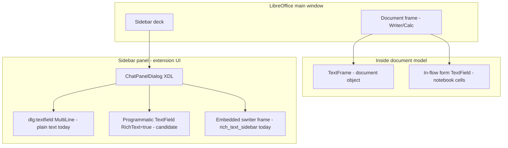

# RichTextControl sidebar spike — feasibility and dev plan

**Status:** Phase 0 + Phase 2 + styling parity; **on by default** via `rich_text_control_sidebar` (requires restart). Hidden Writer → formatted copy into RichTextControl; theme role colors, Liberation Sans 10pt, list tightening via shared `append_rich_text`.  
**Config:** Settings → **Rich Text Control Sidebar** (default **on**). **Rich Text Chat Sidebar** (embedded Writer) stays off unless enabled — if both are on, embedded Writer wins.  
**Code:** [`plugin/chatbot/rich_text_control.py`](../plugin/chatbot/rich_text_control.py), wired from [`panel_wiring.py`](../plugin/chatbot/panel_wiring.py).  
**Streaming:** Plain text chunks during assistant stream; HTML clipboard paste on `rerender_rich_text_session` when the final message contains HTML tags.  
**Tests:** [`tests/chatbot/test_rich_text_control.py`](../tests/chatbot/test_rich_text_control.py), [`tests/chatbot/test_rich_text_control_uno.py`](../tests/chatbot/test_rich_text_control_uno.py).  
**Audience:** Developers evaluating alternatives to plain-text sidebar chat and embedded Writer (`rich_text_sidebar`)  
**Related:** [rich-text-sidebar.md](rich-text-sidebar.md), [chat-sidebar-implementation.md](chat-sidebar-implementation.md), [AGENTS.md](../AGENTS.md)

---

## Spike results (automated)

UNO test `_disabled_test_rich_text_control_html_clipboard_paste` (in [`test_rich_text_control_uno.py`](../tests/chatbot/test_rich_text_control_uno.py), currently **skipped** via `SKIP_NATIVE_RUN_ALL`) exercises hidden Writer → clipboard → paste into a dialog `TextField` with `RichText=true`. Re-enable when the `_process_idle` / `_copy_formatted_from_hidden_doc_to_control` path is stable in headless LO. Manual sidebar QA still recommended (see checklist below).

---

## Executive summary

**Verdict: plausible enough for a short spike, not plausible enough to bet the product on without experiments.**

LibreOffice exposes a **`RichTextControl`** (`com.sun.star.form.component.RichTextControl`) that can sit on a **`TextField`** form model with **`RichText=true`**. That control can live in a **dialog** (`UnoControlDialogModel`), which means it can live in the **sidebar panel** — the same place WriterAgent already hosts `ChatPanelDialog.xdl` via `ContainerWindowProvider`. It is **not** tied to the document window the way **text frames** or in-flow **form fields** are.

What it is **not**:so

- An HTML/Markdown renderer (LO-native character/paragraph attributes via `TextRange`, same family as form rich-text / EditEngine)
- Available from XDL (`dlg:textfield` has `multiline` but **no `richtext` attribute** in [dialog.dtd](https://github.com/LibreOffice/core/blob/master/xmlscript/dtd/dialog.dtd))
- Proven to work cleanly outside database-form context (forum reports are mixed; see [OO forum t=92134](https://forum.openoffice.org/en/forum/viewtopic.php?t=92134))

Your **hidden Writer → HTML → clipboard → paste** idea is the right first experiment: low code, answers whether programmatic rich content can reach a sidebar control at all.

---

## Topology: where UI can live

| Surface | Outside document window? | Rich text? | WriterAgent today |
|---------|--------------------------|------------|-------------------|
| `dlg:textfield` / `UnoControlEdit` | Yes (sidebar XDL) | No — plain `Text` string | Default chat `response` |
| `TextField` + `RichText=true` | Yes (dialog model) | LO-native formatting | Not used |
| In-flow `TextField` (`AS_CHARACTER`) | No — in document body | Plain (notebook) | Notebook import |
| `TextFrame` | No — document object | Full Writer content | N/A for sidebar |
| Embedded `swriter` in container window | Yes (overlay on sidebar) | Full Writer/HTML import | `rich_text_sidebar` |
| Out-of-process pywebview | Yes (separate OS window) | HTML/CSS | Monaco pattern |

**Your intuition is correct:** text frames are **document-owned**. They cannot be reparented into the sidebar deck next to the document. The sidebar already **is** outside the document — it is a sibling UI subtree under the frame ([Sidebar for Developers](https://wiki.openoffice.org/wiki/Sidebar_for_Developers), [chat-sidebar-implementation.md](chat-sidebar-implementation.md)).

---

## What RichTextControl supports (API)

Source: [RichTextControl service](https://www.openoffice.org/api/docs/common/ref/com/sun/star/form/component/RichTextControl.html), [TextField service](https://api.libreoffice.org/docs/idl/ref/servicecom_1_1sun_1_1star_1_1form_1_1component_1_1TextField.html).

### Model services

- **`com.sun.star.form.component.TextField`** — base multiline text input; can live in **`UnoControlDialogModel`** (`UnoControlDialogElement`).
- **`RichTextControl`** — optional capability on TextField when **`RichText=true`**.
- Implements **`com.sun.star.text.TextRange`** plus character/paragraph property interfaces (bold, font, alignment, etc.) — **not** a mini Writer document.

### Properties that matter

| Property | Effect |
|----------|--------|
| `RichText` | `false` → ordinary edit; `true` → formatted mode (ignores plain-edit props like `MultiLine` per API) |
| `HardLineBreaks` | Wrap vs manual line breaks |
| `ReadOnly` | Display-only chat log candidate |

### Formatting model

- **LO-native attributes** (dispatch-style: bold, italic, font height, para adjust) — see LO `RichTextControl` C++ (`SID_ATTR_*` slots in toolkit sources).
- **Not** Markdown parsing, **not** a guaranteed HTML layout engine.
- **Paste:** likely uses the same clipboard / EditEngine path as other rich fields; HTML support would be via **`text/html`** flavor ([LibreOffice clipboard notes](https://lists.freedesktop.org/archives/libreoffice/2023-March/090135.html), [Using the Clipboard](https://flywire.github.io/lo-p/43-Using_the_Clipboard.html)) — **must be validated**, not assumed.

### Form stack caveat

`RichTextControl` includes **`FormControlModel`**. Database forms are the primary design center. Extension dialogs use form *components* without a bound database in many places (notebook code fields, WriterAgent forms tools), but **`RichText=true`** specifically has **little extension-side precedent** in this repo and conflicting anecdote in forum threads.

---

## Comparison to current approaches

| Criterion | Plain multiline edit | RichTextControl spike | Embedded Writer (`rich_text.py`) | OOP webview (future) |
|-----------|---------------------|----------------------|----------------------------------|----------------------|
| Sidebar placement | Shipped | Should work (dialog child) | Shipped (overlay) | Separate window |
| Lifecycle / exit crash | Boring | Likely simpler than embedded frame | **Known Signal 11** ([rich-text-sidebar.md](rich-text-sidebar.md)) | Process boundary |
| Streaming assistant text | Easy append `.Text` | Unknown — range insert + attributes? | `append_text_chunk` / HTML import | DOM updates |
| Code blocks / lists | Poor | Maybe via para styles | HTML import | Full CSS |
| Resize | `panel_resize.py` quirks | Same listener + new control metrics | Heavy (Browse layout) | N/A |
| Implementation cost | Done | **Small spike → medium if viable** | Large (already paid) | Medium (Monaco reuse) |

---

## Recommended spike (1–2 days)

Goal: **fail fast** on whether sidebar RichText can display programmatic formatted content without embedding Writer.

### Phase 0 — Minimal control in sidebar (UNO test menu)

Add a debug-only path (or `_uno.py` test) that:

1. Obtains the chat panel dialog model (or builds a tiny test dialog with same parent window as sidebar).
2. Creates **`com.sun.star.form.component.TextField`** (not `UnoControlEditModel`).
3. Sets **`RichText=true`**, **`ReadOnly=true`**, reasonable size where `response` sits.
4. Inserts into dialog model, **`createPeer`**, shows.

**Pass:** control renders, accepts focus, survives sidebar resize with [`panel_resize.py`](../plugin/chatbot/panel_resize.py) (may need to add control name to `_STRETCH_CONTROLS`).

**Fail:** instantiation error, blank control, crash on peer creation, form service missing → stop.

### Phase 1 — LO-native formatting (no HTML)

Using `TextRange` / character properties on the control model:

1. Insert plain text.
2. Apply bold + font color to a substring (mirror assistant/user role colors from [`rich_text.py`](../plugin/chatbot/rich_text.py)).
3. Append second chunk (simulate two streaming tokens).

**Pass:** two-tone text, append without clearing.

**Fail:** only plain text visible despite `RichText=true` → control not actually in rich mode.

### Phase 2 — Hidden document → clipboard → paste (your idea)

1. Create **hidden** Writer doc (`Hidden=true` load prop — same family as embedded path in [`rich_text.py`](../plugin/chatbot/rich_text.py)).
2. Import HTML via existing Writer HTML path ([`format_support.py`](../plugin/writer/format_support.py) / `insert_content_at_position` patterns).
3. Select all → **dispatch Copy** (or `SystemClipboard` with `text/html` transferable — [list thread](https://lists.freedesktop.org/archives/libreoffice/2023-March/090135.html)).
4. Focus RichText sidebar control → **dispatch Paste**.

**Pass:** formatted content appears in sidebar control (bold, lists, or code monospace — whatever HTML produced).

**Fail:** plain text only, paste no-op, or garbage → HTML bridge not viable; would need attribute-by-attribute construction.

### Phase 3 — Streaming simulation

1. Loop: append plain chunk → sleep → append styled chunk (10–20 iterations).
2. Measure flicker, scroll behavior, latency.

**Pass:** acceptable UX for chat streaming.

**Fail:** full redraw per token, scroll stuck, UI freeze → not suitable for main chat path.

### Phase 4 — Lifecycle

1. Open sidebar, populate RichText, close document, quit LO.
2. Compare to embedded Writer crash profile.

**Pass:** no worse than today; ideally no exit crash.

---

## HTML → RichText: realistic expectations

| Approach | Likelihood | Notes |
|----------|------------|-------|
| Paste from hidden Writer copy | **Medium** — worth Phase 2 | Reuses LO's own HTML importer; clipboard is the bridge |
| Set `Text` property with HTML string | **Low** | Plain string property |
| Programmatic `TextRange` + parse Markdown | **Medium effort** | Reinvent subset of `append_rich_text` regex path |
| StarWriter filter directly into control | **Unknown** | No documented filter target for RichTextControl |

If Phase 2 works for **batch** paste but not **streaming**, RichText might still help for **final message render** (replace rerender HTML step) while streaming stays plain — hybrid architecture.

---

## Integration sketch (if spike passes)

**Do not replace `rich_text_sidebar` immediately.** Possible incremental path:

1. Config flag `rich_text_control_sidebar` (default **true** since 2026-05).
2. When enabled: replace `response` plain field with programmatic RichText `TextField` in [`panel_wiring.py`](../plugin/chatbot/panel_wiring.py) (keep XDL for chrome; hide plain `response` like embedded path does).
3. Streaming: plain append during stream; optional styled rerender on `STREAM_DONE` (similar to current HTML rerender).
4. Keep embedded Writer path until RichText proves strictly better on lifecycle + resize.

**Files likely touched:** `panel_wiring.py`, `panel_resize.py`, new `rich_text_control.py` (~200–400 LOC if viable), `tests/chatbot/test_rich_text_control.py` (pytest mocks) + optional `_uno.py` spike.

---

## Risks and likely blockers

1. **Form context** — RichText may expect form runtime services not initialized in sidebar dialog ([forum t=92134](https://forum.openoffice.org/en/forum/viewtopic.php?t=92134)).
2. **No XDL support** — control must be created in Python; complicates [`manifest_registry.py`](../scripts/manifest_registry.py) / XDL-only settings tabs (not fatal for chat panel).
3. **RichText ignores `MultiLine`** — scroll/height behavior may differ from current `response` field; resize testing required.
4. **Streaming** — EditEngine rich fields may not be designed for high-frequency append; embedded Writer has the same problem but with more layout power.
5. **Markdown/code fences** — even on success, you still own mapping MD → LO attributes unless paste-from-HTML covers it.
6. **Calc/Draw sidebar** — same panel factory; verify RichText on non-Writer decks.

---

## Go / no-go criteria

**Proceed beyond spike if:**

- Phase 0–1 pass on Writer sidebar (control renders, native bold/color works).
- Phase 2 passes for at least simple HTML (paragraph + bold + list or `<pre>`).
- Phase 3 streaming is acceptable OR batch rerender-only is acceptable product-wise.
- Phase 4 is **not worse** than embedded Writer exit behavior.

**Stop and prefer OOP webview if:**

- Control cannot be created in sidebar dialog at all.
- Only plain text works despite `RichText=true`.
- Paste from hidden Writer HTML fails.
- Streaming causes visible flicker or multi-second stalls on typical replies.

**Keep plain text default if:**

- Spike works but only marginally better than plain + final HTML rerender in embedded Writer — complexity not justified.

---

## Why this might still be worth trying

- **Smaller VCL footprint** than embedding a full `swriter` frame ([`create_embedded_writer_doc`](../plugin/chatbot/rich_text.py)) — no nested frame/document/layout manager in sidebar.
- **Stays in-process** — no pywebview dependency for chat.
- **Sidebar-native** — unlike text frames, actually lives where you want it.
- **Spike cost is low** — mostly UNO experiments; reuse hidden Writer + clipboard patterns already familiar from Writer tooling.

---

## References

- [RichTextControl API](https://www.openoffice.org/api/docs/common/ref/com/sun/star/form/component/RichTextControl.html)
- [TextField API (dialog-capable)](https://api.libreoffice.org/docs/idl/ref/servicecom_1_1sun_1_1star_1_1form_1_1component_1_1TextField.html)
- [UnoControlEdit / plain text DevGuide](https://wiki.openoffice.org/wiki/Documentation/DevGuide/GUI/Text_Field)
- [dialog.dtd — textfield attributes](https://github.com/LibreOffice/core/blob/master/xmlscript/dtd/dialog.dtd)
- [Sidebar for Developers](https://wiki.openoffice.org/wiki/Sidebar_for_Developers)
- [LO clipboard / HTML transferable discussion](https://lists.freedesktop.org/archives/libreoffice/2023-March/090135.html)
- [LibreOffice Programming — Clipboard](https://flywire.github.io/lo-p/43-Using_the_Clipboard.html)
- WriterAgent: [rich-text-sidebar.md](rich-text-sidebar.md), [chat-sidebar-implementation.md](chat-sidebar-implementation.md)
