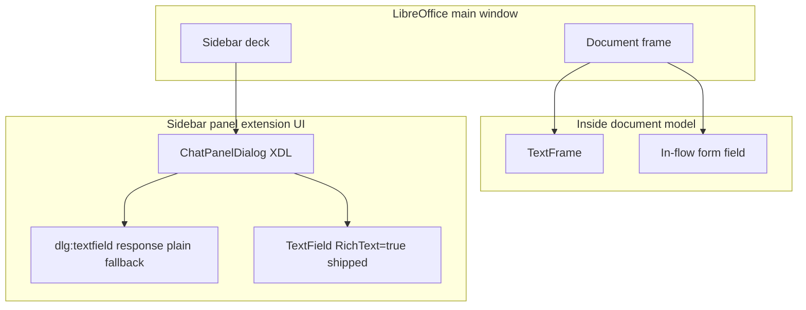
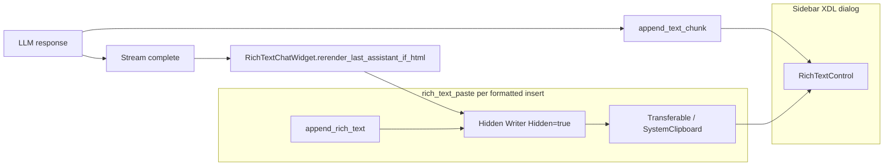

# Rich Text Control Sidebar

**Status:** Shipped; **on by default** via `rich_text_control_sidebar` (requires LibreOffice restart after toggle).  
**Config:** Settings → **Rich Text Control Sidebar**. Uncheck for plain-text chat only.  
**Code:** [`plugin/chatbot/rich_text_control.py`](../plugin/chatbot/rich_text_control.py), [`plugin/chatbot/rich_text_paste.py`](../plugin/chatbot/rich_text_paste.py), [`plugin/chatbot/rich_text.py`](../plugin/chatbot/rich_text.py), wired from [`plugin/chatbot/panel_wiring.py`](../plugin/chatbot/panel_wiring.py).  
**Tests:** [`tests/chatbot/test_rich_text_control.py`](../tests/chatbot/test_rich_text_control.py), [`tests/chatbot/test_rich_text_paste.py`](../tests/chatbot/test_rich_text_paste.py), [`tests/chatbot/test_rich_text_control_uno.py`](../tests/chatbot/test_rich_text_control_uno.py).  
**Related:** [chat-sidebar-implementation.md](chat-sidebar-implementation.md), [streaming-and-threading.md](streaming-and-threading.md), [AGENTS.md](../AGENTS.md)

**Audience:** Product and engineering — product behavior up front, implementation detail below.

---

## Product summary

### What users get

When **Rich Text Control Sidebar** is enabled (default), the chat transcript area uses LibreOffice’s **`RichTextControl`** (`com.sun.star.form.component.TextField` with `RichText=true`) instead of the plain multiline `dlg:textfield` named `response`. Users see:

- **Role styling:** **You:** and **Assistant:** prefixes with theme-aware colors (light/dark follow sidebar `StyleSettings`).
- **Formatted assistant replies:** bold, lists, tables, code blocks, and other HTML the model emits within the supported tag subset — rendered with LibreOffice-native character and paragraph attributes after the message completes.
- **Readable layout:** Liberation Sans 10pt, tightened list indents for the narrow sidebar, paragraph margins tuned for chat density.

When the setting is off, behavior reverts to the legacy plain-text sidebar; models are not instructed to use HTML ([`get_chat_response_format_instructions`](../plugin/framework/constants.py)).

### Settings and rollout

| Item | Detail |
|------|--------|
| Config key | `rich_text_control_sidebar` ([`plugin/chatbot/module.yaml`](../plugin/chatbot/module.yaml)) |
| Default | `true` |
| Restart | Required after changing the checkbox — hot toggle is not supported |
| Decks | Same panel factory as Writer/Calc/Draw; formatted path is not Writer-document-specific |

### Streaming experience

During an assistant stream, text is appended as **plain** characters on the RichTextControl (styled with assistant body color). If the model streams HTML tags, users may see raw tags until the stream finishes — that is expected today.

After **`STREAM_DONE`** / **`FINAL_DONE`**, if the final assistant message contains HTML tags (detected by `_HTML_TAG_RE`), the sidebar **re-renders only the tail** of that message: it truncates from `_assistant_stream_start_len`, then pastes formatted content via the hidden-Writer bridge. Earlier messages in the control keep their formatting.

Producer-side **250 ms batching** of stream chunks reduces UI stutter; see [streaming-and-threading.md](streaming-and-threading.md).

### Why RichTextControl instead of embedded Writer in the sidebar

An earlier approach hosted a **visible** embedded Writer document (`private:factory/swriter`) inside the sidebar panel via `toolkit.createWindow` + `XFrame`. That path was removed.

| Embedded Writer in panel | RichTextControl (shipped) |
|--------------------------|---------------------------|
| Nested `swriter` frame and layout manager in the sidebar | Form `TextField` peer over the existing XDL dialog |
| Auto-scroll broken in Browse/Online layout (`MakeVisible` ineffective; `screenDown` workarounds fragile) | Scroll via EditEngine tail nudge (`nudge_rich_control_view_to_end`) |
| Exit-time VCL parent/child teardown crashes (Signal 11) accepted as trade-off | No nested Writer frame in the panel; hidden docs are short-lived |
| Large implementation surface (lazy peer, lifecycle hooks, theme on virtual page) | Smaller footprint; HTML via off-screen Writer + paste |

Writer is still used **off-screen**: a **hidden** document imports HTML, then a transferable / system clipboard paste copies formatting into the RichTextControl. Users never see a Writer frame in the sidebar.

---

## Shipped features

| Feature | Implementation |
|---------|----------------|
| Programmatic RichText `TextField` over `response` placeholder | `create_sidebar_rich_text_control`, `RichTextControlListener`, [`panel_wiring.py`](../plugin/chatbot/panel_wiring.py) |
| Plain `response` / label hidden when rich control is active | `set_control_visible` in wiring callback |
| Theme-aware **You:** / **Assistant:** colors | `get_theme_colors` in [`rich_text.py`](../plugin/chatbot/rich_text.py) |
| Chat typography (Liberation Sans 10pt, para side margins) | `CHAT_FONT_*`, `CHAT_PARA_SIDE_MARGIN`, `apply_chat_char_props`, `configure_hidden_writer_for_chat` in [`rich_text.py`](../plugin/chatbot/rich_text.py) |
| Spellcheck off for hidden HTML import doc | `zxx` locale on Standard style in `configure_hidden_writer_for_chat` (`rich_text.py`) |
| List indent tightening after HTML import | `_tighten_list_indent` in `append_rich_text` (`rich_text.py`) |
| Streaming plain append | `RichTextChatWidget.append_assistant_stream_chunk` via `panel.py` `_append_response` |
| Post-stream HTML rerender | `SendButtonListener.rerender_rich_text_session` → `RichTextChatWidget.rerender_last_assistant_if_html` |
| Truncate stream tail without flattening earlier formatting | `truncate_control_from` (cursor delete, not `model.Text = ""`) |
| Scroll-to-end without stealing query focus | `nudge_rich_control_view_to_end`; focus preserved via `focus_preserved` in [`uno_context.py`](../plugin/framework/uno_context.py) |
| History reload in ~16 KB batches | `HISTORY_RENDER_BATCH_CHARS`, `RichTextChatWidget.render_session_history` |
| Resize / width sync with Send–Clear row | `sync_rich_control_bounds`, `sidebar_content_right_edge`, [`panel_resize.py`](../plugin/chatbot/panel_resize.py) — query, model, image model, and aspect ratio comboboxes share the same right-edge clamp |
| LLM HTML format instructions gated on config | `get_chat_response_format_instructions` → `RICH_CHAT_SIDEBAR_INSTRUCTIONS` |
| Web research / librarian share same format + finalize | `finalize_sidebar_assistant_response` in `rich_text.py` |
| Legacy `AI:` label stripped on rich path | `strip_legacy_assistant_stream_chunk`, `strip_legacy_ai_label` |

---

## Architecture

### Where UI can live

| Surface | Outside document? | Rich text? | WriterAgent chat |
|---------|-------------------|------------|------------------|
| `dlg:textfield` / `UnoControlEdit` | Yes | Plain `Text` | Fallback when config off |
| `TextField` + `RichText=true` | Yes (dialog model) | LO-native attributes | **Default transcript** |
| In-flow `TextField` | No | Plain | Notebook import, not sidebar |
| `TextFrame` | No | Full Writer | Not used for sidebar |
| Out-of-process pywebview | Yes (OS window) | HTML/CSS | Monaco / future rich UI |

The sidebar deck is a sibling of the document frame, not inside the document model ([Sidebar for Developers](https://wiki.openoffice.org/wiki/Sidebar_for_Developers), [chat-sidebar-implementation.md](chat-sidebar-implementation.md)).

### Data flow

**Streaming path:** `append_text_chunk` → `TextRange` insert at end with assistant color and optional `nudge_rich_control_view_to_end`.

**Formatted path:** `create_hidden_html_writer` → `append_rich_text` (HTML filter + list tightening) → transferable or clipboard → `insertTransferable` / paste into control → close hidden doc. User and history batches use `append_rich_messages_via_clipboard` with batching for large sessions.

**Rerender path:** On stream end, `finalize_sidebar_assistant_response` calls `rerender_rich_text_session` only if HTML tags are present; otherwise the plain stream text remains.

### RichTextControl vs HTML

- Implements **`com.sun.star.text.TextRange`** and character/paragraph properties — not a mini Writer document and not a general HTML layout engine.
- **Not** available from XDL (`dlg:textfield` has no `richtext` attribute in [dialog.dtd](https://github.com/LibreOffice/core/blob/master/xmlscript/dtd/dialog.dtd)); the control is created in Python and registered as `response_rich`.
- Supported HTML for detection and prompts is the constrained set in `_HTML_TAG_RE` and `RICH_CHAT_SIDEBAR_INSTRUCTIONS` — not arbitrary web HTML.

---

## Comparison to alternatives

| Criterion | Plain multiline | RichTextControl (shipped) | OOP webview |
|-----------|-----------------|---------------------------|-------------|
| Sidebar placement | Config off | Dialog child + hidden Writer bridge | Separate window |
| Exit / teardown | Simple | No nested `swriter` in panel | Process boundary |
| Streaming | `.Text` append | Plain chunks + HTML rerender on done | DOM updates |
| Code blocks / complex CSS | Poor | HTML import via Writer filter | Full CSS |
| Resize | `panel_resize.py` | `sync_rich_control_bounds` | Manual positioning |
| Cost | Done | `rich_text_control.py` + `rich_text_paste.py` + `rich_text.py` | Monaco / pywebview stack |

---

## Limitations and backlog

- **Raw HTML during streaming** — Tags may be visible until rerender; an incremental stripper on the hot path is possible future work but not shipped.
- **Rerender only when tags match `_HTML_TAG_RE`** — Plain-text-looking HTML or unusual tags may skip formatted rerender.
- **Form component caveat** — `RichTextControl` is designed around database forms; extension dialogs use form components without a bound DB, but edge cases on some LO builds are possible ([forum discussion](https://forum.openoffice.org/en/forum/viewtopic.php?t=92134)).
- **Calc/Draw QA** — Same wiring as Writer deck; verify formatted paste and resize on non-Writer sidebars when changing behavior.
- **Native UNO HTML paste test** — `_disabled_test_rich_text_control_html_clipboard_paste` in `test_rich_text_control_uno.py` is skipped via `SKIP_NATIVE_RUN_ALL`; re-enable when headless clipboard path is stable.

---

## Developer reference

### Entry points

| Concern | Location |
|---------|----------|
| Enable control, hide plain field | [`panel_wiring.py`](../plugin/chatbot/panel_wiring.py) § Rich Text Control — constructs `RichTextChatWidget` |
| Send / stream / rerender | [`panel.py`](../plugin/chatbot/panel.py) `SendButtonListener` via `rich_text_widget` |
| Session clear / history render | [`panel_factory.py`](../plugin/chatbot/panel_factory.py) via `rich_text_widget.render_session_history` |
| Resize stretch | [`panel_resize.py`](../plugin/chatbot/panel_resize.py) (`response_rich`, `sidebar_content_right_edge`) |
| Stream finalize hook | [`tool_loop.py`](../plugin/chatbot/tool_loop.py), [`send_handlers.py`](../plugin/chatbot/send_handlers.py) → `finalize_sidebar_assistant_response` |
| Config schema | [`module.yaml`](../plugin/chatbot/module.yaml) `rich_text_control_sidebar` |

### Key APIs (`rich_text.py`)

| Export | Role |
|--------|------|
| `CHAT_FONT_*`, `CHAT_PARA_SIDE_MARGIN` | Single source of truth for sidebar chat typography |
| `apply_chat_char_props` | Set Liberation Sans / weight / height on cursor, portion, or style |
| `apply_rich_control_para_margins` | EditEngine horizontal inset for sidebar density |
| `configure_hidden_writer_for_chat` | Standard style zero margins, `zxx` locale, font names on hidden import doc |
| `append_rich_text` | HTML filter import + list tightening |
| `get_theme_colors`, `_HTML_TAG_RE` | Theme-aware role colors; HTML detection for rerender |

### Key APIs (`rich_text_control.py`)

| Function | Role |
|----------|------|
| `create_sidebar_rich_text_control` | Create `TextField` model + peer, position over placeholder |
| `RichTextControlListener` | Deferred create on `windowShown`; resize via panel listener |
| `RichTextChatWidget` | **Primary panel facade** — user/assistant append, stream chunks, rerender, clear, history |
| `append_text_chunk` | Streaming plain append (widget delegates here) |
| `truncate_control_from` | Remove stream tail before HTML rerender |
| `nudge_rich_control_view_to_end` | Scroll transcript without focus steal |
| `clear_control` | Clear transcript |
| `sync_rich_control_bounds` | Resize transcript to match placeholder |

### Focus / idle (`uno_context.py`)

| Function | Role |
|----------|------|
| `focus_preserved(ctx)` | Context manager: capture focus window, yield, restore (query field stays focused during RichTextControl mutations) |
| `process_events_to_idle(ctx, rounds=1)` | Drain UI events between append/nudge steps |

### Key APIs (`rich_text_paste.py`)

| Function | Role |
|----------|------|
| `append_rich_text_via_clipboard` | Single message formatted paste |
| `append_rich_messages_via_clipboard` | Batched history restore |
| `create_hidden_html_writer` | Short-lived hidden Writer for HTML import |
| `insert_transferable_into_rich_control` | Transferable / clipboard fallback paste |
| `session_history_items` | Build `(role, content)` pairs for history reload |

Shared HTML import and theme: [`format.py`](../plugin/writer/format.py) (`insert_html_fragment_at_cursor`), [`rich_text.py`](../plugin/chatbot/rich_text.py) (`append_rich_text`, `get_theme_colors`, `_HTML_TAG_RE`, sidebar list CSS via `_SIDEBAR_LIST_CSS`).

### Scroll behavior (why nudge exists)

After bulk copy or history reload, `gotoEnd` alone does not move the RichTextControl viewport; VCL scrollbars are not exposed on this control. The implementation inserts a zero-width sentinel (`\u200b`) at the tail under `focus_preserved` ([`uno_context.py`](../plugin/framework/uno_context.py)), then removes it, with several `process_events_to_idle` rounds — same family of fix as streaming appends. See `nudge_rich_control_view_to_end` comments in source.

`_assistant_stream_start_len` is set when the **user** message insert completes (main chat). When `_record_assistant_start` marks the **final answer** (web research / librarian), it is re-set to the current control length so rerender replaces only that report tail and preserves internal search-step lines above it. Rich appends from the main-thread drain loop run **inline** (`_run_rich_ui`) so scroll nudges apply before the next queue item.

### Manual QA checklist

1. Fresh LO with default config: sidebar shows formatted control; plain `response` not visible.
2. Send a message: **You:** styling; assistant streams plain; after completion, HTML reply shows lists/bold/code as appropriate.
3. Toggle setting off, restart: plain multiline only; model should not receive HTML instructions.
4. Toggle on, restart: rich control returns; session history reloads with scroll at bottom.
5. Resize sidebar width: control tracks placeholder and Clear-button right edge.
6. Switch OS/LO light/dark theme: role colors and background remain readable.
7. Calc or Draw deck (if available): open sidebar, send formatted reply, resize.
8. Exit LibreOffice with an active formatted sidebar: no worse than plain path (no nested embedded Writer crash profile).

### References

- [RichTextControl API](https://www.openoffice.org/api/docs/common/ref/com/sun/star/form/component/RichTextControl.html)
- [TextField API](https://api.libreoffice.org/docs/idl/ref/servicecom_1_1sun_1_1star_1_1form_1_1component_1_1TextField.html)
- [UnoControlEdit / plain text DevGuide](https://wiki.openoffice.org/wiki/Documentation/DevGuide/GUI/Text_Field)
- [dialog.dtd — textfield attributes](https://github.com/LibreOffice/core/blob/master/xmlscript/dtd/dialog.dtd)
- [Sidebar for Developers](https://wiki.openoffice.org/wiki/Sidebar_for_Developers)
- [LibreOffice Programming — Clipboard](https://flywire.github.io/lo-p/43-Using_the_Clipboard.html)

---

## Troubleshooting

### Plain multiline `response` field still visible (RichTextControl never took over)

When init succeeds, wiring hides the plain `response` / `response_label` controls and shows the programmatic `response_rich` RichTextControl. If you still see the plain multiline field, init never reached `on_rich_control_ready`.

Check `writeragent_debug.log` (same directory as `writeragent.json`) for `[RICH-CONTROL]` lines:

| Log pattern | Meaning |
|-------------|---------|
| `config rich_text_control_sidebar=false` | Setting off — plain sidebar is expected (restart LO after toggling). |
| `RichTextControlListener attached` but no `on_rich_control_ready` | Init stalled before control creation. |
| `phase=eager_init peer=0` | Root window had no VCL peer at wiring time — init cannot run yet. |
| `phase=eager_init peer=1` then `deferred_init result=control_ok` | Normal GNOME path: init at wiring time (sidebar deck often never fires `windowShown`). |
| `phase=window_shown peer=1` | KDE-style fallback: init from `windowShown` when eager init did not run. |
| `_append_response plain fallback while rich_text_control_sidebar enabled` | Messages go to plain field because `rich_text_widget` was never wired. |

Set `log_level` to **DEBUG** in Settings (or `writeragent.json`) if you need peer-creation attempt detail beyond the INFO lifecycle lines.

### Formatted insert used a fallback path (diagnostics)

When HTML is pasted into the RichTextControl, the preferred path is **direct copy** from a hidden Writer doc (`_copy_formatted_from_hidden_doc_to_control`). If that fails, the code falls back to **transferable insert** and then **SystemClipboard + synthetic Ctrl+V**.

Search `writeragent_debug.log` for **INFO** lines (default `log_level` is DEBUG, so INFO is always written):

| Log pattern | Meaning |
|-------------|---------|
| `_copy_formatted_from_hidden_doc_to_control: ok` | Direct copy succeeded (no fallback). |
| `failed reason=model_no_createTextCursor` | Sidebar control model cannot create a text cursor. |
| `failed reason=no_content_inserted` | Hidden doc had no insertable portions (empty import or enumeration produced nothing). |
| `failed reason=exception` | Direct copy raised (stack trace in same window). |
| `append_rich_text_via_clipboard: falling back to transferable insert direct_copy_reason=…` | Per-message formatted insert is using transferable/clipboard fallback. |
| `insert_transferable_into_rich_control: insertTransferable paths exhausted (…)` | Lists which `insertTransferable` attempts failed before trying clipboard. |
| `ok via SystemClipboard+Ctrl+V source=…` | Clipboard + Ctrl+V fallback succeeded (`source` is e.g. `append_rich_text:assistant` or `history_batch`). |
| `all rich insert paths failed … attempts=…` | Every sidebar insert path failed (includes `direct_copy_reason` upstream). |

**Reporter workflow:** reproduce the issue, then grep:

`grep -E 'direct_copy_reason|falling back to transferable|insertTransferable paths exhausted|SystemClipboard|_copy_formatted' writeragent_debug.log`

If logs show only `via=direct_copy` / `_copy_formatted… ok` during the leak, the sidebar paste pipeline is unlikely to be the cause — check `enable_agent_log` for `apply_document_content` tool calls.

---

## Remaining backlog

### Current state

- **`rich_text.py`** — theme, typography, HTML import wrapper, list tightening, `finalize_sidebar_assistant_response`.
- **`rich_text_control.py`** — `RichTextChatWidget`, lifecycle/layout, streaming, scroll.
- **`rich_text_paste.py`** — hidden Writer import, direct copy, clipboard fallbacks, batched history.

### Shared hidden Writer factory

**Duplication:** `rich_text_paste.py:create_hidden_html_writer`, `plugin/writer/format.py` (html-to-plain-text paths), `plugin/calc/rich_html.py` — all use `desktop.loadComponentFromURL("private:factory/swriter", …, (Hidden=True,))`.

Add `create_hidden_writer(ctx, *, title="_blank")` to [`plugin/doc/document_helpers.py`](../plugin/doc/document_helpers.py) (or `uno_context.py`); optional `create_hidden_writer_for_html_import(ctx)` for shared configure steps. Update the three call sites and delete local versions.

### Smaller cleanups

- `build_message_html` — test-only today ([`test_rich_text_paste.py`](../tests/chatbot/test_rich_text_paste.py)); remove or make private if dead.
- List prefix reconstruction (`_list_prefix_for_paragraph`) — comment why direct copy beats clipboard paste for `NumberingRules`.
- Peer creation fallbacks (`_create_rich_control_peer`) — comment why multiple creation attempts exist.

### Risks & verification

**Must not regress:** streaming plain append + assistant color; post-`FINAL_DONE` HTML rerender of assistant tail only; batched history reload + scroll-to-bottom; focus stays on query field; resize tracks Clear-button edge; light/dark role colors; Calc/Draw decks; no exit crashes.

Run `make test` and the manual QA checklist above after changes. Preserve history batching in `append_rich_messages_via_clipboard`.

### Open questions

- Incremental HTML formatting during stream (vs. rerender on done)?
- Preserve real `NumberingRules` on paste and drop manual list-prefix reconstruction?
- Spellcheck/grammar on the transcript?
- Out-of-process webview still worth it long-term?
