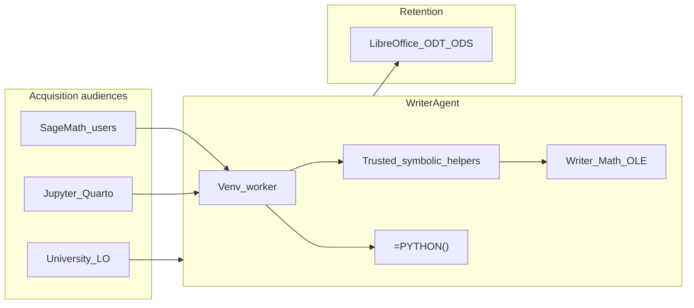
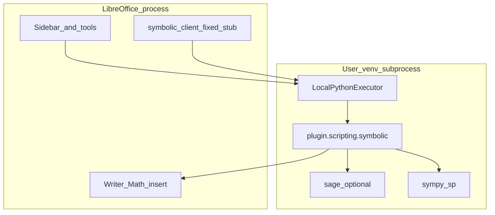
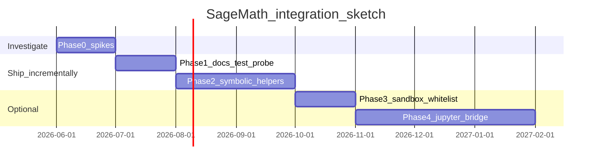

# SageMath Integration — Product & Engineering Plan

> **Status:** Proposal / investigation — not scheduled for a release milestone yet.  
> **Product note (2026-06):** SymPy trusted helpers (`symbolic_math`, Run Python Script **[Math]**) ship first; Sage integration below remains optional future work.  
> **Last updated:** 2026-06-07  
> **Owner:** WriterAgent core  
> **Related:** [Scientific Python bridge](enabling_numpy_in_libreoffice.md) · [Symbolic Math roadmap (§3)](enabling_numpy_in_libreoffice.md#symbolic-math) · [Analysis sub-agent](analysis-sub-agent.md) · [Jupyter notebook import](jupyter-notebook-import.md) · [Math / TeX design](math-tex.md) · [Community integration strategy](../community_integration_strategy.md)

---

## Executive summary

**SageMath is niche compared to NumPy/pandas**, but it is a strong strategic fit for WriterAgent’s **Calc + scientific Python** story at a time when **Calc-specific user feedback is scarce**. Sage users (universities, researchers, open-source math) already live in Python notebooks, exact algebra, and local tooling — the same audience that cares about **LibreOffice, local LLMs, and no cloud CAS**.

WriterAgent does **not** need to ship Sage inside the extension. The existing **user-provided venv + warm subprocess worker** (`[venv_worker.py](../plugin/scripting/venv_worker.py)`) is the correct integration surface — the same architecture that made NumPy safe without ABI crashes in LibreOffice.

**Recommended direction (after spikes):**

1. **Investigate first** — sandbox compatibility, install paths, timeouts, serialization (cheap; de-risks everything else).
2. **Ship symbolic helpers with Sage-or-SymPy backend** — reuse the planned “Symbolic Math” trusted-helper domain; Sage as an optional accelerator, SymPy as default fallback.
3. **If spikes look good:** document + optional community story — only after the core bridge is stable; not something promised in the initial Stein note.

**Explicit non-goals:** bundling Sage in the OXT, cloud SageCell, managed Sage install by the extension, or replacing SymPy in the default stack.

---

## Problem & opportunity

### User problem

Researchers and students who use **SageMath** (or Sage worksheets / Sage Jupyter kernels) still deliver work as **Word/ODT, PDF, and spreadsheets**. Today that handoff is manual: export LaTeX or screenshots, paste into LibreOffice, lose editability, or re-type formulas.

They want:

- Exact computation (number theory, algebra, PARI/GAP-backed operations) **without leaving LibreOffice**
- AI assistance that **inserts real Math objects**, not hallucinated Unicode
- **Local-first** execution (no CoCalc/SageCell dependency for core workflows)

### Product opportunity for WriterAgent


| Signal                                       | Implication                                                                                                                                                             |
| -------------------------------------------- | ----------------------------------------------------------------------------------------------------------------------------------------------------------------------- |
| **Zero Calc power-user feedback loop today** | Sage/math is a **differentiated wedge** — a concrete persona (math grad student, engineering TA, small-university LO deploy) even if small in absolute numbers          |
| **Scientific Python bridge already shipped** | `=PYTHON()`, `run_venv_python_script`, shared Calc kernel, Jupyter import — Sage plugs into **existing** plumbing                                                       |
| **Symbolic Math helpers already on roadmap** | [enabling_numpy §3](enabling_numpy_in_libreoffice.md#symbolic-math) lists `solve_equation`, `latex_to_math_object` — **Sage extends that plan**, not a parallel product |
| **SymPy already in venv**                    | Default path works without Sage; Sage is **optional depth**, not a hard dependency                                                                                      |
| **GPL + FOSS alignment**                     | Natural conversation with SageMath / Passagemath community (local tools, no proprietary CAS lock-in)                                                                    |


---

## Strategic fit (what we reuse)




### Positioning vs SymPy (avoid confusion)


|                     | **SymPy (`sp`)**                                | **Sage (`sage`)**                                                   |
| ------------------- | ----------------------------------------------- | ------------------------------------------------------------------- |
| **Default**         | Yes — auto-imported, whitelisted, lightweight   | Optional — user installs in venv                                    |
| **Best for**        | General symbolic algebra in LLM scripts         | Number theory, GAP/PARI, advanced rings, Sage-specific APIs         |
| **Product message** | “Works out of the box with `pip install sympy`” | “Power users: point Settings at a Sage venv for research-grade CAS” |


---

## Current codebase baseline

### Already built (Sage-adjacent)


| Asset                   | Location                                                                                                                                  | Notes                                                                  |
| ----------------------- | ----------------------------------------------------------------------------------------------------------------------------------------- | ---------------------------------------------------------------------- |
| Venv subprocess worker  | `[plugin/scripting/venv_worker.py](../plugin/scripting/venv_worker.py)`, `[worker_harness.py](../plugin/scripting/worker_harness.py)`     | Warm process; Pickle5 IPC                                              |
| AST sandbox + whitelist | `[plugin/scripting/venv_sandbox.py](../plugin/scripting/venv_sandbox.py)`, `[sandbox.py](../plugin/scripting/sandbox.py)` | `**sympy` whitelisted; `sage` not**                                    |
| Auto-imports            | `[AUTO_IMPORTS](../plugin/framework/constants.py)`                                                                                        | `np`, `pd`, `sp`, `math` — **do not auto-import Sage** (slow, clashes) |
| Writer Math insert      | `[math_formula_insert.py](../plugin/writer/math/math_formula_insert.py)`, [math-tex.md](math-tex.md)                                      | LaTeX → StarMath → OLE                                                 |
| Trusted helper RPC      | `[analysis_client.py](../plugin/framework/client/analysis_client.py)` → `[analysis.py](../plugin/scripting/analysis.py)`                  | **Template for `symbolic_client.py`**                                  |
| Jupyter import + kernel | `[plugin/notebook/](../plugin/notebook/)`                                                                                                 | Cells run in WriterAgent venv, not Sage kernel                         |
| Settings Test           | `[run_venv_self_check](../plugin/scripting/venv_worker.py)`                                                                               | Scientific / EDA / Vision groups — **no Sage probe yet**               |
| Symbolic roadmap        | [enabling_numpy §3](enabling_numpy_in_libreoffice.md#symbolic-math)                                                                       | Helpers **not shipped**                                                |


### Architecture (target state)




**Invariant (from [AGENTS.md](../AGENTS.md)):** LLM-submitted code stays in the AST sandbox; **shipped** Sage logic lives in reviewed modules under `plugin/scripting/`, invoked via **fixed stubs** from the host — same as analysis, vision, embeddings.

---

## Install models (both supported in plan)

Users may provide Sage in two ways. The plan supports **both**; spikes determine how much **code** each path needs.

### Model A — Pip venv (recommended default in docs)

Official flow (Sage ≥ 10.7): `python3 -m venv ~/sage-venv` → `pip install sage_conf` → wheelhouse → `sagemath-standard`.


|                   |                                                                                                             |
| ----------------- | ----------------------------------------------------------------------------------------------------------- |
| **Settings**      | `scripting.python_venv_path` = venv root (e.g. `~/sage-venv`)                                               |
| **Compatibility** | `[resolve_venv_python](../plugin/scripting/venv_worker.py)` finds `bin/python` — **works today**            |
| **Constraints**   | Python 3.12–3.14; large download/build; first import slow                                                   |
| **User doc**      | One-page “Sage venv for WriterAgent” section (link from [enabling_numpy](enabling_numpy_in_libreoffice.md)) |


### Model B — System / distro Sage (`sage -python`)

Traditional install: interpreter often at  
`$SAGE_ROOT/local/var/lib/sage/venv-python3.*/bin/python3`.


|                         |                                                                      |
| ----------------------- | -------------------------------------------------------------------- |
| **Gap today**           | Settings expect a **venv directory**, not a bare executable path     |
| **Phase 0 (doc-only)**  | Symlink `~/writeragent-sage/bin/python` → Sage’s python              |
| **Phase 1 (if needed)** | Optional `scripting.python_executable` override in config + Settings |
| **Avoid**               | Magic `sage_root` autodetection — hard to maintain across platforms  |


**Decision gate:** spike Model B on Linux + one of Windows/macOS before committing to `python_executable`.

---

## Critical unknowns (spikes — must run before build)

These are **engineering gates**, not optional polish.

### Spike 1 — Sandbox vs `import sage`

User/`=PYTHON()` code runs in `[LocalPythonExecutor](../plugin/contrib/smolagents/local_python_executor.py)` with blocked imports (`subprocess`, `os`, `pty`, …). Sage uses **pexpect/PTY** for PARI, GAP, Maxima ([SageSpawn](https://doc.sagemath.org/html/en/reference/interfaces/sage/interfaces/sagespawn.html)).

**Test matrix (temporary whitelist branch):**

```python
result = factor(2^100 - 1)           # PARI
result = SymmetricGroup(5).order()   # GAP
result = integrate(sin(x), x)        # symbolic
```

**Record:** import time, error class (ImportError / InterpreterError / hang), whether failure is import-time or operation-time.

**Working hypothesis:** full `sage.all` in **user sandbox** may be **partially broken**; **trusted `symbolic.py`** is the reliable path for Sage-specific features. If hypothesis holds, **prioritize Tier 2 over Tier 1** for product quality.

### Spike 2 — Result serialization

`[serialize_result](../plugin/scripting/venv_sandbox.py)` handles numpy/pandas/matplotlib today. Sage `Integer`, `Rational`, `Matrix`, etc. do not.

**Normalization rules (draft):**


| Sage type    | Wire format                                      |
| ------------ | ------------------------------------------------ |
| Exact scalar | `str()` or `float()` when approximate OK         |
| Symbolic     | `latex(expr)` for Writer Math pipeline           |
| Matrix       | `.tolist()` where supported                      |
| Unknown      | Clear error: use `result = latex(...)` or `.n()` |


### Spike 3 — Timeouts & warm worker


| Today                                                                                    | Sage risk                               |
| ---------------------------------------------------------------------------------------- | --------------------------------------- |
| Default user timeout **10s** ([Settings](enabling_numpy_in_libreoffice.md#3-user-guide)) | Cold `import sage` may exceed 10s       |
| Warm worker ~30s internal budget                                                         | May need longer warm for Sage-only pool |


**Measure:** cold vs warm import in existing worker. Options: docs-only “raise timeout to 60s for Sage”, dedicated worker pool, or **lazy import only in trusted helpers** (preferred).

### Spike 4 — Writer Math round-trip

Validate: Sage/SymPy → `latex()` → existing `[math_formula_insert](../plugin/writer/math/math_formula_insert.py)` → editable OLE in Writer. One UNO or manual golden test.

---

## Phased delivery plan

Phases are **ordered by risk reduction**, not by marketing flash. Sage is niche — **small, correct slices** beat a big bang.

### Phase 0 — Investigation & decision record (1–2 weeks, part-time)

**Goal:** Go/no-go evidence; no user-facing promises.


| Task                                                        | Output                                                      |
| ----------------------------------------------------------- | ----------------------------------------------------------- |
| Build pip Sage venv; point Settings; run Test + `=PYTHON()` | Notes in this doc § Spike results                           |
| Sandbox spike (PARI/GAP/integrate)                          | Pass/fail matrix                                            |
| System Sage symlink spike                                   | Doc recipe or `python_executable` requirement               |
| Serialization + LaTeX round-trip                            | Normalization spec                                          |
| **Decision record**                                         | Tier 1 yes/no; SymPy-only vs dual backend; timeout guidance |


**Exit criteria:** All four spikes documented; recommended tier chosen; no open “unknown unknowns” on sandbox.

---

### Phase 1 — Documentation & Settings probe (low code)

**Goal:** Sage-aware users can **try** WriterAgent without new tools.


| Deliverable                                                                                          | Effort                                                         |
| ---------------------------------------------------------------------------------------------------- | -------------------------------------------------------------- |
| User section: Sage venv + system Sage paths, timeouts, SymPy vs Sage                                 | Docs                                                           |
| Settings **Test** group: **Computer Algebra** (`sympy`, `sage`)                                      | Small — `[venv_worker.py](../plugin/scripting/venv_worker.py)` |
| Link from [enabling_numpy Related](enabling_numpy_in_libreoffice.md)                                 | Docs                                                           |
| Optional: `[community_integration_strategy.md](../community_integration_strategy.md)` Sage paragraph | Docs                                                           |


**Exit criteria:** Test button reports Sage present/missing; install doc reviewed by someone who has built a Sage venv once.

---

### Phase 2 — Trusted symbolic helpers (recommended product MVP)

**Goal:** Reliable CAS for LLM + Run Python Script — **implements existing Symbolic Math roadmap** with optional Sage backend.

Aligns with [enabling_numpy §3 Symbolic Math](enabling_numpy_in_libreoffice.md#symbolic-math).


| Component                                                                   | Pattern                                                                                        |
| --------------------------------------------------------------------------- | ---------------------------------------------------------------------------------------------- |
| `[plugin/scripting/symbolic.py](../plugin/scripting/)`                      | `run_symbolic(spec, data)` — **try Sage if importable, else SymPy**                            |
| `[plugin/framework/client/symbolic_client.py](../plugin/framework/client/)` | Fixed stub (mirror `[analysis_client.py](../plugin/framework/client/analysis_client.py)`)      |
| Tools                                                                       | `solve_equation`, `symbolic_simplify`, `integrate`, `differentiate`, `latex_to_math_object`    |
| Run Python Script                                                           | `[Math] solve_equation`, … in `[document_scripts.py](../plugin/scripting/document_scripts.py)` |
| Writer egress                                                               | Reuse math insert path                                                                         |
| Tests                                                                       | `tests/scripting/test_symbolic.py` — SymPy always; Sage gated `importorskip`                   |
| Prompts                                                                     | When to prefer helpers vs raw `sp` / `run_venv_python_script`                                  |


**Why Phase 2 before “free-form Sage in chat”:** Matches analysis/vision quality bar; avoids LLM generating fragile Sage; sandbox limits matter less inside trusted module.

**Exit criteria:** `make test` green; one demo workflow: “solve equation → insert Math in Writer” and “numeric check in Calc via `=PYTHON()`”.

---

### Phase 3 — Sage-capable sandbox (optional, spike-gated)

**Only if Spike 1 passes with acceptable coverage.**


| Deliverable                                                                                  | Notes                   |
| -------------------------------------------------------------------------------------------- | ----------------------- |
| Whitelist `sage`, `sage.`* in `[sandbox.py](../plugin/scripting/sandbox.py)` | + serialization helpers |
| Prompt policy: explicit `import sage.all` when needed                                        | Never auto-import Sage  |
| LLM examples in `domain=python`                                                              | Advanced users only     |


**Exit criteria:** Automated tests for at least PARI + one symbolic op in sandbox; documented limitations (GAP failures, etc.).

---

### Phase 4 — Worksheet & Jupyter bridge (longer horizon)

**Goal:** Sage **notebook** users — draft in Sage/Jupyter, finish in LO.


| Step           | Scope                                                                                                                                     |
| -------------- | ----------------------------------------------------------------------------------------------------------------------------------------- |
| **4a (docs)**  | Import `.ipynb` via [jupyter-notebook-import](jupyter-notebook-import.md); cells use WriterAgent venv — document Sage syntax requirements |
| **4b**         | Detect `kernelspec.name == "sage"` → actionable Settings message                                                                          |
| **4c (defer)** | External Sage Jupyter kernel subprocess — only if 4a–4b insufficient                                                                      |


**Exit criteria for 4a:** Published tutorial: Sage notebook → Writer import → Math polish with AI.

---

### Explicitly deferred / out of scope


| Item                           | Reason                                                                                                  |
| ------------------------------ | ------------------------------------------------------------------------------------------------------- |
| Sage inside OXT                | Size, build, GPL bundling complexity                                                                    |
| Extension-managed Sage install | Same deferral as Strategy 2 in [enabling_numpy §7](enabling_numpy_in_libreoffice.md#7-deferred-roadmap) |
| SageCell / cloud CAS           | Network, auth, local-first brand                                                                        |
| In-process Sage in LO Python   | ABI crash risk (rejected for NumPy)                                                                     |
| Replacing SymPy as default     | SymPy stays default; Sage optional                                                                      |


---

## Engineering reference (when implementing)

### Files by phase


| Phase | Primary touch points                                                                                                                                                                                                     |
| ----- | ------------------------------------------------------------------------------------------------------------------------------------------------------------------------------------------------------------------------ |
| 0     | Spike branch only; update this doc                                                                                                                                                                                       |
| 1     | `[venv_worker.py](../plugin/scripting/venv_worker.py)`, [enabling_numpy](enabling_numpy_in_libreoffice.md), this doc                                                                                                     |
| 2     | `symbolic.py`, `symbolic_client.py`, calc/writer tools, `[document_scripts.py](../plugin/scripting/document_scripts.py)`, `[sandbox.py](../plugin/scripting/sandbox.py)` (whitelist trusted module only) |
| 3     | `[venv_sandbox.py](../plugin/scripting/venv_sandbox.py)`, `[import_policy.py](../plugin/scripting/import_policy.py)`, `[constants.py](../plugin/framework/constants.py)`                                                 |
| 4     | `[plugin/notebook/](../plugin/notebook/)`, jupyter docs                                                                                                                                                                  |


### Test strategy ([AGENTS.md](../AGENTS.md))

- **Unit:** `tests/scripting/test_symbolic.py` — helper logic, SymPy path, mocked Sage.
- **Integration:** extend `[tests/scripting/test_venv_worker.py](../tests/scripting/test_venv_worker.py)` — self-check includes `sage` when installed.
- **Sage optional in CI:** `pytest.importorskip("sage")` — do not block default `make test` on Sage install.
- **UNO (optional):** Writer Math insert smoke for one LaTeX result from symbolic helper.

---

## Risks & mitigations


| Risk                                    | Likelihood  | Impact          | Mitigation                                                              |
| --------------------------------------- | ----------- | --------------- | ----------------------------------------------------------------------- |
| Sage broken in AST sandbox (GAP/PARI)   | Medium–High | High for Tier 3 | Ship Tier 2 trusted helpers first; Tier 3 spike-gated                   |
| Import time > default timeout           | High        | Medium          | Docs + Test message; lazy import; optional higher timeout               |
| User confusion SymPy vs Sage            | Medium      | Medium          | Clear Settings Test groups; prompts prefer helpers                      |
| Sage install fragility on Windows/macOS | Medium      | Medium          | Document pip venv path; defer system Sage to symlink/override           |
| Niche audience → low usage              | High        | Low             | Acceptable — **differentiation** and community outreach, not MAU driver |
| Maintenance burden of dual backend      | Medium      | Medium          | Single `symbolic.py` dispatcher; SymPy-only CI path always on           |


---

## Success metrics (lightweight, local)

Per [community integration strategy](../community_integration_strategy.md) — no telemetry controversy:


| Metric                             | How                                               |
| ---------------------------------- | ------------------------------------------------- |
| Settings Test reports Sage present | Support requests / manual surveys                 |
| `[Math]` helper usage              | Debug log counts if `enable_agent_log` (optional) |
| Outreach responses                 | Sage forum / Stein follow-up meeting              |
| Demo reproducibility               | One documented end-to-end workflow in docs        |


**North star (qualitative):** A Sage user can say: “I kept exact math local, edited the paper in LibreOffice, and the AI didn’t dumb down my formulas.”

---

## Community & partnership notes

### Messaging (one-liners)

- **Sage / university:** “LibreOffice + local Sage: exact math in your document, AI that inserts real formulas — GPL, no cloud CAS.”
- **Jupyter bridge:** “Draft in a Sage notebook → import to Writer → polish with WriterAgent.”
- **Calc:** “Symbolic result in Writer, numeric grid in Calc — same venv, same Settings path.”

### Where WriterAgent shows up for Sage users


| Channel                    | Action                                                    |
| -------------------------- | --------------------------------------------------------- |
| Sage / Passagemath forums  | Phase 0 demo + install doc                                |
| University LO deployments  | Symbolic helpers + local LLM story                        |
| Jupyter / Quarto community | Notebook import tutorial with Sage venv                   |
| MCP / Cursor               | Document `run_venv_python_script` + future symbolic tools |


---

## Recommended sequencing (12-month sketch)




**Dependency:** Phase 2 can start SymPy-only while Phase 0 Sage spikes run in parallel; wire Sage backend when spikes complete.

**ROADMAP placement:** Tier **2** — after core Calc/analysis feedback loops improve, but **Phase 0–1** are cheap enough to do opportunistically for outreach.

---

## Open decisions (track here)


| #   | Decision                    | Options                                        | Target date    |
| --- | --------------------------- | ---------------------------------------------- | -------------- |
| D1  | User sandbox Sage (Tier 3)? | Yes / helpers-only / defer                     | After Spike 1  |
| D2  | Backend default             | SymPy-only helpers / Sage+SymPy dual           | After Spike 1  |
| D3  | System Sage support         | Symlink doc only / `python_executable` setting | After Spike 3  |
| D4  | Worker pool                 | Shared worker / Sage lazy import only          | After Spike 3  |
| D5  | Sub-agent domain            | Extend `python` / new `math` delegate          | Phase 2 design |


---

## Spike results log (fill during Phase 0)

> *Empty until investigation runs. Paste summaries, timings, and pass/fail here.*


| Spike               | Date | Environment | Result | Notes |
| ------------------- | ---- | ----------- | ------ | ----- |
| Pip venv + Settings |      |             |        |       |
| Sandbox PARI/GAP    |      |             |        |       |
| System Sage path    |      |             |        |       |
| LaTeX → Writer Math |      |             |        |       |


---

## Appendix — SymPy roadmap overlap

Phase 2 **does not duplicate work** — it **implements** the deferred item in [enabling_numpy §8](enabling_numpy_in_libreoffice.md#8-implementation-status):

> Scientific domain roadmaps — trusted helpers for … **Symbolic Math** …

Proposed helpers (unchanged names; Sage adds backend):


| Helper                        | Purpose                                                              |
| ----------------------------- | -------------------------------------------------------------------- |
| `solve_equation`              | Symbolic solve; optional numeric substitution from Calc `data_range` |
| `symbolic_simplify`           | Simplify expressions                                                 |
| `integrate` / `differentiate` | Calculus                                                             |
| `latex_to_math_object`        | LaTeX → Writer Math OLE                                              |


Sage-specific **extras** (optional later): factorization helpers, polynomial rings, group order — only if Phase 2 core is stable and users ask.

---

