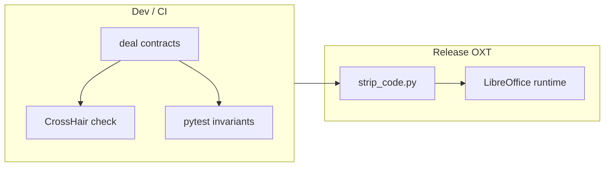

# Serialization Formal Verification

**Goal:** Apply the formal verification approach from [`docs/formal_verification.md`](formal_verification.md) to the split_grid serialization code in [`plugin/scripting/payload_codec.py`](../plugin/scripting/payload_codec.py).

This is the reference implementation for Tier-0 (pure Python) contract + CrossHair verification in WriterAgent.

---

## Status (2026-05)

| Item | State |
|------|--------|
| `deal` contracts | 8 functions in `payload_codec.py` (see list below) |
| Dev dependencies | `deal`, `crosshair-tool` in [`pyproject.toml`](../pyproject.toml) |
| Release strip | [`scripts/strip_code.py`](../scripts/strip_code.py) removes `@deal.*` decorators and import shim |
| Pytest hook | [`tests/scripting/test_serialization_verification.py`](../tests/scripting/test_serialization_verification.py) |
| Makefile target | `make verify-serialization` |
| Status tracking | [`verification_status.json`](../verification_status.json) |
| CI integration | Not yet wired |

**Functions with contracts:**

1. `_flatten_grid_to_components` — core flatten logic
2. `host_pack_split_grid`
3. `host_pack_data`
4. `host_unpack_split_grid`
5. `child_unpack_split_grid`
6. `child_unpack_data`
7. `child_pack_split_grid`
8. `child_pack_result`

`host_unpack_data` is a thin dispatcher with **no** contracts (delegates to `host_unpack_split_grid`).

Round-trip equality (`host_unpack(host_pack(grid)) == grid`) is validated in pytest, not as `@deal.ensure` (too expensive for CrossHair).

---

## Architecture



### Release no-ops (zero runtime cost in LibreOffice)

**Two-layer safety:**

1. **Guarded import** — `_DummyDeal` no-op shim when `deal` is not installed:

   ```python
   try:
       deal = importlib.import_module("deal")
   except ImportError:
       class _DummyDeal:
           def __getattr__(self, name: str) -> Any:
               return lambda *args, **kwargs: lambda f: f
       deal = _DummyDeal()
   ```

2. **Build-time stripping** — [`scripts/strip_code.py`](../scripts/strip_code.py) removes `@deal.*` decorators and the import/shim block from the production bundle. Tests in [`scripts/tests/test_strip_code.py`](../scripts/tests/test_strip_code.py).

---

## Contract design

### Helpers

Shared predicates keep `@deal` lambdas short and CrossHair-friendly:

- `_is_grid_sequence(grid)` — empty, 1D, or 2D list/tuple (jagged 2D allowed; flatten raises `ValueError`)
- `_is_split_grid_envelope(envelope)` — valid split_grid wire dict shape
- `_is_ndarray(obj)` — NumPy ndarray type check without importing NumPy at module load

### Key invariants encoded

- `strings` dict keys are integers; values are strings
- `column_kinds` length matches column count
- Buffer byte length is a multiple of 8 (float64 cells)
- When `strings == {}`, child unpack returns ndarray (pytest); when strings present, returns list (`@deal.ensure` on `child_unpack_split_grid`)
- Jagged 2D grids raise `ValueError` via `@deal.raises` on `_flatten_grid_to_components`

### Dispatch wrappers

`host_pack_data`, `child_unpack_data`, and `child_pack_result` use **minimal** pre/post contracts. Branch-specific guarantees (ndarray vs list vs split_grid dict) live in pytest oracles.

Functions with keyword-only parameters use `@deal.pre(lambda arg, *_, **__: ...)` to avoid Deal/CrossHair `TypeError` on default-arg forwarding.

---

## Workflow

### Local verification

```bash
# Runtime invariant tests (fast)
make verify-serialization

# CrossHair on full module (slow; no per-condition timeout — correctness over speed)
make crosshair-check
make crosshair-cover

# Or pipe manually
crosshair check -v --report_all plugin/scripting/payload_codec.py 2>&1 \
    | python scripts/crosshair_stream.py check
```

**Targeting:** use fully-qualified function names or a file path. There is no `--include` flag in current CrossHair; contracts are auto-discovered from `deal` (no `--contracts` flag needed).

### Interpreting CrossHair output

| Message | Command | Meaning |
|---------|---------|---------|
| `Confirmed over all paths` | `check` | Condition proven for explored paths |
| `Not confirmed` | `check` | No counterexample found, but not proven (common for complex ensures) |
| `Unable to meet precondition` | `check` | CrossHair could not synthesize valid inputs (e.g. ndarray for `child_pack_split_grid`) |
| `: error:` | `check` | **Counterexample** — contract violation; must fix |
| `host_pack_split_grid([])` | `cover` | **Example call** — input that added coverage; not an correctness assertion |
| `payload_codec child_unpack ... failed` | `cover` | **Exploration noise** — bad input hit your log/except path; normal during fuzzing |
| Traceback at end | `cover` | **Fatal** — CrossHair crashed (often type-hint limits); not a contract failure |

Full **`cover`** semantics (examples vs noise vs fatals, pytest workflow): [`docs/formal_verification.md`](formal_verification.md) § CrossHair `cover`.

The pytest CrossHair hook fails only on `: error:` lines (counterexamples), not on `Not confirmed`.

**Live dashboard:** pipe ``crosshair -v`` through the formatter (see [`docs/formal_verification.md`](formal_verification.md)):

```bash
crosshair check -v --report_all plugin/scripting/payload_codec.py 2>&1 \
    | python scripts/crosshair_stream.py check
make verify-serialization
make crosshair-check
```

### Existing test coverage

[`tests/scripting/test_serialization_ab.py`](../tests/scripting/test_serialization_ab.py) is the expanded A/B round-trip suite (in default `make test`): ~50 named fixture grids (including cases from [`serialization_cases.py`](../tests/calc/serialization_cases.py)), **always vs `force="never"`** parity (split_grid vs nested list), codec decode and real venv worker round-trips via [`worker_harness._execute_request`](../plugin/scripting/worker_harness.py) / [`PythonWorkerManager`](../plugin/scripting/venv_worker.py), and Hypothesis fuzzing on small rectangular grids. Shared helpers live in [`serialization_ab_support.py`](../tests/scripting/serialization_ab_support.py); manual runs: `python scripts/run_serialization_ab.py --list`. Formal contract/CrossHair checks: [`test_serialization_verification.py`](../tests/scripting/test_serialization_verification.py) via **`make slowtests`**.

[`tests/scripting/test_payload_codec.py`](../tests/scripting/test_payload_codec.py) covers unit edge cases. Verification tests complement these with formal contracts and optional concolic search.

---

## Known gaps

- Most `@deal.ensure` conditions report `Not confirmed` — expected for complex serialization logic; no counterexamples found to date.
- `child_pack_split_grid` pre may report `Unable to meet precondition` when CrossHair cannot synthesize ndarrays.
- Round-trip and branch-specific oracles remain in pytest, not `@deal.ensure`.
- CI matrix entry not yet added.

---

## Next steps

1. Optional CI job running `make verify-serialization` on a schedule or PR label.
2. Extend contracts to other Tier-0 helpers: `should_use_binary_envelope`, `column_kinds_for_grid`.
3. Consider `scripts/update_verification_status.py` to refresh [`verification_status.json`](../verification_status.json) after CrossHair runs.

---

## Why this module is high value

- Pure Tier 0 logic (no UNO)
- Complex numeric + mixed-type handling with subtle edge cases
- Strong existing test coverage
- Performance-critical path for `=PYTHON()` and chat tools
- Mistakes affect both Calc and LLM observation quality
