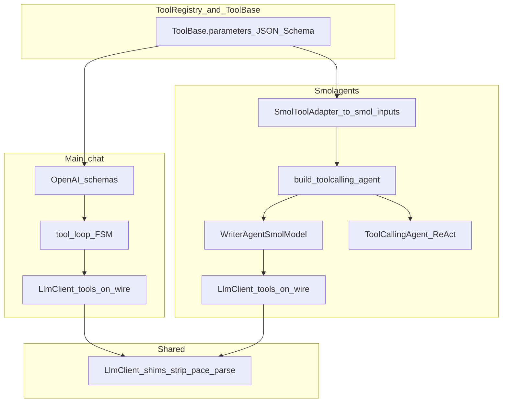

# Smolagents vs main chat: tooling, HTTP policy, and reuse

This document is for maintainers who already understand OpenAI-style chat completions, tool schemas, and basic LibreOffice extension threading. It explains why WriterAgent has **two agent stacks** (main chat vs smolagents), where the code lives, and how we keep the codebase **small**: **maximal reuse below the HTTP “wire” policy**, **minimal branching**, and **no second parallel HTTP stack**.

---

## 1. Design principle: small code, reuse under the wire

**Goal:** As little code as possible, as robust as possible.

| Layer | Approach |
|-------|----------|
| **HTTP wire policy** | Main chat and smol both send OpenAI **`tools`** when tools are available. Smol also keeps the ReAct prompt tool list. This preserves the historical LocalAI-compatible request shape; avoid config matrices. |
| **Everything below that** | **Unify aggressively**: same **`LlmClient`**, same **`ToolBase`**, same registry execution semantics, shared **`WriterAgentSmolModel`** → `request_with_tools`, shared **`build_toolcalling_agent`**, **`to_smol_inputs` / `SmolToolAdapter`**. Fix bugs once. |

**Do not** “unify” by adding capability detection, automatic retries that toggle wire tools, or observability layers **unless** a concrete bug forces it—those paths **grow** the codebase and the test surface.

---

## 2. Terminology

| Term | Meaning in WriterAgent |
|------|-------------------------|
| **Wire tools** | The JSON `tools` array in the HTTP body. The server may return `tool_calls`. |
| **Smol ReAct tools** | Tool definitions in the smol system prompt (`__TOOLS_LIST__` / ReAct). WriterAgent also sends smol's generated OpenAI schemas on the wire for compatibility with the historical request shape. |
| **Main chat tool loop** | Streaming + FSM (`tool_loop`, `tool_loop_state`), OpenAI-shaped history (`assistant` / `tool` / `tool_call_id`). |
| **Smolagents runtime** | Vendored `ToolCallingAgent` + ReAct steps (`ActionStep`, `ToolCall`, `FinalAnswerStep`). Librarian + specialized delegation. |
| **Client-side parsing** | Plain-text responses: `LlmClient` + parsers; smol may also parse `Action:` / JSON in **content**. Native `tool_calls` still flow through `ChatMessage.from_dict` when present. |

Smol still **runs tools** via adapters and ReAct parsing; sending OpenAI schemas on the wire helps some backends choose their tool-call/parser path.

---

## 3. Problem statement

WriterAgent must support:

1. **Providers** that handle OpenAI **`tools`** on the wire well.
2. **Local inference** that often **errors** when `tools` enables constrained paths or interacts badly with leaked template tokens (HTTP 500, parse failures).
3. **Smolagents** prompts built for **text-first** tool invocation; wire `tool_calls` are optional extras after `LlmClient`.

Merging the **two runtimes** (ReAct vs chat FSM) would change prompts, stops, and transcripts. **Merging execution and HTTP client code** does not.

---

## 4. Current architecture



- **Main chat:** registry schemas → wire `tools` → `tool_calls` → `ToolRegistry.execute` → history.
- **Smol:** `ToolBase` → `SmolToolAdapter` → `ToolCallingAgent` → **`WriterAgentSmolModel`** → `request_with_tools(..., tools=completion_kwargs.get("tools"))` → `ChatMessage.from_dict` → smol steps.

**Shared:** [`LlmClient`](../plugin/framework/client/llm_client.py) only—no duplicate strip/shim/parser logic in smol-specific files.

---

## 5. Code map

| Concern | Location |
|---------|-----------|
| Smol wire policy **send generated schemas** | [`plugin/framework/smol_model.py`](../plugin/framework/smol_model.py) — `WriterAgentSmolModel.generate` |
| Smol agent construction | [`plugin/chatbot/smol_agent.py`](../plugin/chatbot/smol_agent.py) — `build_toolcalling_agent` |
| Smol few-shot examples (Action/Observation) | [`plugin/chatbot/smol_examples.py`](../plugin/chatbot/smol_examples.py) — edit in place; refresh with [`scripts/generate_smol_examples.py`](../scripts/generate_smol_examples.py) |
| `ToolBase` → smol `inputs` | [`plugin/framework/smol_tool_adapter.py`](../plugin/framework/smol_tool_adapter.py) |
| Librarian | [`plugin/chatbot/librarian.py`](../plugin/chatbot/librarian.py) |
| Specialized delegation | [`plugin/doc/specialized_base.py`](../plugin/doc/specialized_base.py) |
| Main chat loop | [`plugin/chatbot/tool_loop.py`](../plugin/chatbot/tool_loop.py), [`tool_loop_state.py`](../plugin/chatbot/tool_loop_state.py) |
| HTTP client | [`plugin/framework/client/llm_client.py`](../plugin/framework/client/llm_client.py) |
| Orientation | [`AGENTS.md`](../AGENTS.md) §4, §8 |

Tests: [`test_smol_model.py`](../plugin/tests/test_smol_model.py), [`test_smol_tool_adapter.py`](../plugin/tests/test_smol_tool_adapter.py), [`test_librarian_smol.py`](../plugin/tests/test_librarian_smol.py), [`test_specialized_delegation.py`](../plugin/tests/test_specialized_delegation.py).

---

## 6. Why smol sends wire tools

This restores the request shape that worked in earlier WriterAgent builds:

- Smol prompts still carry tool definitions for ReAct parsing.
- The same tool schemas are also sent in the OpenAI-compatible request body.
- Some LocalAI/Harmony-style backends appear to select a safer parser path when OpenAI **`tools`** are present.

Keep this centralized in **`WriterAgentSmolModel`**. Do not add user-facing toggles unless a concrete backend requires it and tests pin the behavior.

---

## 7. Few-shot example blocks

The shared ReAct **system template** lives in [`toolcalling_agent_prompts.py`](../plugin/contrib/smolagents/toolcalling_agent_prompts.py). **Action/Observation demos** are selected by [`get_examples_block()`](../plugin/chatbot/smol_examples.py):

| Key | Block | Finish tool in example |
|-----|--------|-------------------------|
| `librarian` | `LIBRARIAN_EXAMPLES` in `smol_examples.py` | `reply_to_user` |
| `web_research` | `WEB_RESEARCH_EXAMPLES_BLOCK` | `final_answer` |
| `writer:python`, `calc:python`, `draw:python`, … | `PYTHON_SPECIALIZED_EXAMPLES` | **`specialized_workflow_finished`** (after `run_venv_python_script`) |
| Any other (`writer:shapes`, `document_research:calc`, …) | `DELEGATE_GENERIC_EXAMPLES_BLOCK` | **`specialized_workflow_finished`** |

The delegate block reuses the web-research *shape* (two `web_search` steps) only to teach the ReAct JSON format; those tool names are not on the specialized tool list. The real task is the manager’s user message; domain behavior is in `instructions=` and `__TOOLS_LIST__`.

Refresh librarian copy only:

```bash
python scripts/generate_smol_examples.py
```

`ToolCallingAgent.initialize_system_prompt` also rewrites `final_answer` → `final_answer_tool_name` inside the examples block when they differ (belt-and-suspenders).

---

## 8. What is already unified (keep it that way)

- Single smol HTTP entry: **`WriterAgentSmolModel`** only.
- Shared **`build_toolcalling_agent`**, **`to_smol_inputs`**, **`SmolToolAdapter`**.
- No second copy of **`LlmClient`** behavior inside librarian/specialized.

Do **not** merge **`tool_loop`** with **`ToolCallingAgent`** without a product decision—that duplicates **transcript semantics**, not HTTP reuse.

---

## 9. What stays separate (two idioms, shared plumbing)

| Separate | Because |
|----------|---------|
| Transcript shape | OpenAI multi-turn vs ReAct steps |
| Streaming / FSM | Chat drain + sidebar state vs sub-agent `run()` |
| Final-answer tools | `reply_to_user`, `specialized_workflow_finished`, `switch_to_document_mode` |
| Threading | Specialized `execute_safe` + main thread vs librarian `execute` where safe |

---

## 10. Wire tools for smol

Shipped behavior: **`WriterAgentSmolModel`** passes **`completion_kwargs.get("tools")`** into **`LlmClient.request_with_tools`**. There is no JSON toggle; this is source-level policy.

---

## 11. Anti-patterns

- Second smol HTTP path bypassing **`WriterAgentSmolModel`**.
- Adding a user config flag or second HTTP path for smol wire tools before a concrete backend requires it.
- Duplicating strip/parse/shim logic outside **`LlmClient`**.
- Large “unification roadmaps” before a concrete need—prefer **delete duplication** and **one** wire policy in source.

---

## 12. Summary

- **Small:** **`WriterAgentSmolModel`** owns one smol HTTP policy; one **`LlmClient`**, shared adapters/factory, no parallel HTTP implementations.
- **Robust:** preserves the known-good LocalAI request shape while keeping smol's ReAct parser.
- **Reuse:** maximal **below** the wire policy.

---

## References

- [`AGENTS.md`](../AGENTS.md)
- [`docs/chat-sidebar-implementation.md`](chat-sidebar-implementation.md)
- [`docs/streaming-and-threading.md`](streaming-and-threading.md)
