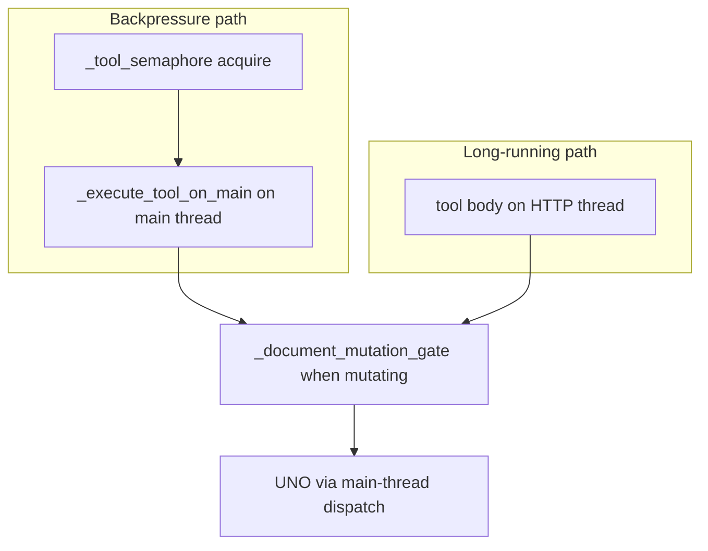

# WriterAgent Threading Architecture

This document outlines the threading and concurrency model used within the WriterAgent project (located in the `plugin/` directory). It details how backgrounds tasks, asynchronous network communication, streaming LLM execution, and external process management are handled without blocking the LibreOffice/UNO main UI thread.

## Overview

The LibreOffice UNO environment is **not thread-safe**. Calling UNO API methods from background threads can lead to unexpected UI behavior, corruption, or outright crashes, particularly with complex documents or frequent UI updates. 

Because WriterAgent connects to external LLM services and relies on streaming responses, it cannot block the main UI thread during these network calls or when waiting for AI generation. Therefore, WriterAgent relies heavily on standard Python threading for asynchronous I/O and process monitoring, coupled with specific mechanisms to marshal results back to the UNO main thread when document manipulation or UI updates are required.

## Threading Components

### 1. Main Thread Dispatch (`plugin/framework/main_thread.py`)

This is the core concurrency bridge. Because background threads (like the HTTP server or AI streaming loop) cannot safely execute UNO commands, they use `execute_on_main_thread(fn, *args, **kwargs)` to offload UNO interactions back to the main thread.

*   **Mechanism:** It pushes a `_WorkItem` containing the callable and arguments onto a `queue.Queue`. It then signals LibreOffice to wake up and process the queue using `com.sun.star.awt.AsyncCallback`.
*   **Synchronization:** The calling background thread blocks on a `threading.Event()` (`_WorkItem.event.wait()`) until the main thread picks up the item, executes it, and sets the result or exception. This provides a synchronous feel to the caller while executing safely on the UI thread.
*   **Safety:** A `threading.Lock` (`_init_lock`) protects the lazy initialization of the AsyncCallback UNO service.

### 2. HTTP Server and MCP Protocol (`plugin/mcp/`)

The plugin runs an embedded HTTP server to provide a local API and support the Model Context Protocol (MCP).

*   **`server.py`:** The `HTTPServer` runs in a dedicated daemon thread (`name="http-server"`) via `self._thread = threading.Thread(target=self._run, daemon=True)`. This allows the server to perpetually listen for incoming requests without blocking LibreOffice.
*   **`mcp_protocol.py`:** Incoming HTTP requests land on the server's thread. Document resolution and UNO context lookup run on the main thread via `QueueExecutor`; tool bodies that touch the document either run entirely on the main thread (backpressure path) or on the HTTP worker with UNO work marshalled through `execute_on_main_thread` (long-running path).

#### MCP tool execution paths

MCP `tools/call` routes to one of two handlers in [`mcp_protocol.py`](../plugin/mcp/mcp_protocol.py), depending on the tool's `long_running` flag:

| Path | Method | Thread | Global limit | Per-document gate |
|------|--------|--------|--------------|-------------------|
| Backpressure | `_execute_with_backpressure` | Main (via queue) | `_tool_semaphore(1)` → `BusyError` if busy | Mutating tools only |
| Long-running | `_execute_long_running` | HTTP worker | None (by design) | Mutating tools only |

**Why two layers?** The global semaphore keeps fast MCP tools from piling up on the main thread and surfaces `BusyError` (HTTP 429) under overload. Long-running tools (image generation, delegate sub-agents) skip the semaphore so a minutes-long job does not block every other MCP client. That left a hole: parallel long-running mutators could target the same document. The per-document gate closes that without blocking read-only work or work on other documents.

**Per-document gate:** [`_document_mutation_gate`](../plugin/mcp/mcp_protocol.py) serializes mutating MCP runs that share a normalized document key (`X-Document-URL`, `doc.getURL()`, or `RuntimeUID`). Tools opt out via [`ToolBase.requires_document_lock()`](../plugin/framework/tool.py) (defaults to `detects_mutation()`). Delegate gateways return `False` for read-only domains (`document_research`, `web_research`).

**UNO thread safety:** All UNO access is marshalled to the LibreOffice main thread. The per-document gate is **logical** serialization — it prevents overlapping mutating MCP tool runs on the same file, not raw cross-thread UNO calls.

**Tests:** [`tests/mcp/test_long_running_concurrency.py`](../tests/mcp/test_long_running_concurrency.py) covers same/different document, read-only, delegate opt-out, normalized URLs, cross-path (long-running + backpressure), and unknown-tool conservative locking.

**Not covered by MCP gates (different models):**
*   **Sidebar chat** ([`tool_loop.py`](../plugin/chatbot/tool_loop.py)) — one tool per LLM round; async tools run on worker threads but the loop waits for `TOOL_RESULT` before spawning the next.
*   **Gate dict lifetime** — `_doc_gates` entries are not pruned on document close (fine for typical sessions).
*   **Save-as key migration** — after Save As, old and new URLs may map to different gate keys briefly.

**Related docs:** [MCP protocol — Concurrency](mcp-protocol.md#concurrency-and-parallel-toolscall) (integrator-facing); [ROADMAP](ROADMAP.md) §14 (specialized tool MCP exposure).

### 3. Agent Backends and CLI Management (`plugin/agent_backend/`)

When interacting with external CLI-based agent tools (like Hermes), WriterAgent spawns background processes and needs to monitor their streams asynchronously.

*   **`cli_backend.py`:** Manages the lifecycle of CLI tools.
    *   **Threads:** It spawns `_reader_thread` (monitoring `stdout`) and `_stderr_thread` (draining `stderr`) so that the main application isn't blocked reading from pipes.
    *   **Synchronization:** Uses `threading.Lock` to protect internal state (like the process reference). It uses `threading.Event` (`_reader_ready`, `_response_done`) to signal when the backend is ready to accept input or has finished generating a response.
*   **`hermes_proxy.py`:** Implements the Actor Context Protocol (ACP) over standard streams.
    *   **Threads:** Spawns a dedicated daemon thread to continuously parse JSON-RPC messages from the subprocess stdout (ACP over stdio).
    *   **Synchronization:** Uses a `threading.Lock` to protect the `_pending` requests dictionary. Each outbound request creates a `threading.Event` which the caller waits on until the reader thread receives the corresponding response and sets the event.

### 4. Chatbot Streaming and Tool Execution (`plugin/chatbot/`)

The core chatbot interaction relies heavily on threads to handle streaming LLM responses and asynchronous tool executions.

*   **`send_handlers.py`:** When a user sends a message, handlers (like `run_agent`, `run_search`, `run_direct_image`) are wrapped in a daemon `threading.Thread` to prevent blocking the UI while calling external APIs.
*   **`tool_loop.py`:** Manages the ReAct (Reasoning and Acting) loop.
    *   **Threads:** Uses `threading.Thread` to run `run_async` (spawning background LLM generation), `run` (evaluating tool responses), and `run_final` (handling the final no-tools stream). 
    *   This architecture allows the UI to stay responsive while the system generates text chunk-by-chunk or waits for API responses.

### 5. Utilities, UI Updates, and Monitoring

*   **`plugin/framework/async_stream.py`:** Provides an `async_stream` decorator and helper functions that wrap generator functions (like streaming network calls) using `run_in_background`. The worker consumes the stream and periodically calls a main-thread UI update function.
*   **`plugin/main.py`:** Uses `run_in_background` to pre-load icons into the `ImageManager` (`_update_menu_icons`) and dispatch menu updates (`notify_menu_update`) without freezing the startup or dispatch sequence.
*   **`plugin/tunnel/__init__.py`:** Runs local tunneling tools (like ngrok or localtunnel) using an `AsyncProcess` to parse the tunnel URL from the subprocess output asynchronously. Uses a `threading.Lock()` to protect access to the `_process` and tunnel URL.
*   **`plugin/launcher/__init__.py`:** Spawns a launcher-monitor using `run_in_background` to `wait()` on launched external processes (like Claude or Gemini desktop apps) so the menu status can be updated when the user closes the external app.
*   **`plugin/framework/logging.py`:** Spawns a background thread (`_watchdog_loop`) to periodically flush status logs or monitor system health without interrupting document flow. Uses `_init_lock` and `_activity_lock` to protect logging state.
*   **`plugin/chatbot/dialogs.py`:** Spawns a probe update thread (`run_in_background(_probe_update)`) to dynamically update dialog UI elements in the background.
*   **`plugin/framework/worker_pool.py`:** Provides the `run_in_background(func, *args, error_callback=None)` function to spawn an un-blocking thread with standardized exception handling and logging.
*   **`plugin/framework/process_manager.py`:** Provides the `AsyncProcess` class, standardizing how external processes are started and how their `stdout`, `stderr`, and exit callbacks are handled safely without blocking.

---

## Recent Architecture Consolidations

The threading model has recently been refactored to eliminate duplicate concurrency patterns that had evolved independently. 

### 1. Unified Background Process Monitoring (`AsyncProcess`)
Multiple modules previously spawned `subprocess.Popen` manually and wrapped them in custom `threading.Thread` implementations to monitor stdout/stderr loops. This has been consolidated into an `AsyncProcess` class in `plugin/framework/process_manager.py`. It encapsulates process spawning, thread-based stream monitoring (via asynchronous readers), and exit handling. It provides cleaner process lifecycle monitoring in `launcher`, `tunnel`, and `agent_backend/cli_backend`.

### 2. Main Thread Execution (`main_thread.py` vs `mcp_protocol.py`)
Both `mcp_protocol.py` and `main_thread.py` previously contained duplicate logic for pushing execution callbacks back to the LibreOffice UI thread. These have been consolidated: `mcp_protocol` now relies on standard main thread dispatch mechanisms, eliminating redundant `_Future` wait implementations.

### 3. Asynchronous Worker Spawning (`run_in_background`)
Raw `threading.Thread(target=..., daemon=True).start()` calls scattered throughout the codebase for "fire-and-forget" tasks lacked standardized exception handling or logging. This pattern has been replaced by `plugin/framework/worker_pool.py` and the `run_in_background` utility. This component standardizes thread execution, cleanly logging raised exceptions directly rather than failing silently.

### 4. Streaming Execution Wrappers
Streaming wrappers such as `_start_tool_calling_async` in tool loop handlers, process reading threads, and asynchronous pipeline streams in `async_stream` have been updated to utilize `run_in_background` to improve event reliability and debug logging.
