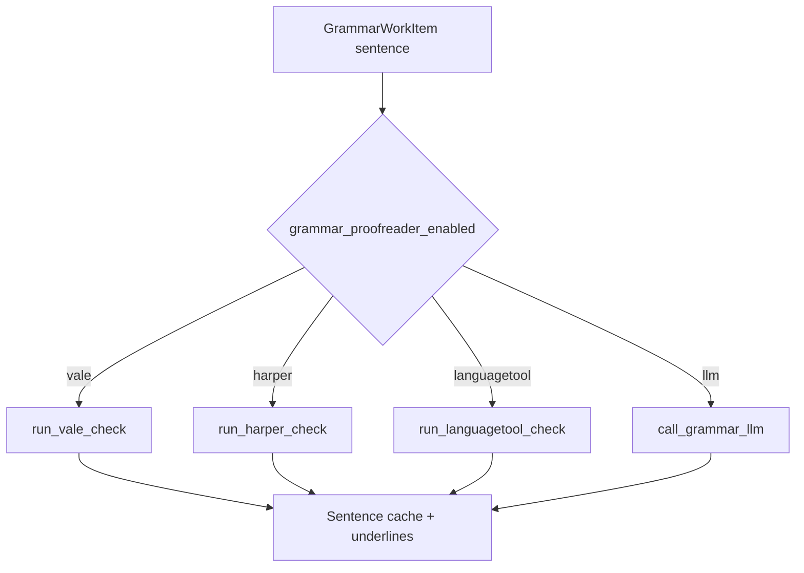

# Development Plan: Vale Editorial Style Linter Integration

This document outlines the development plan for **Vale** as an offline, local style-guide checker inside WriterAgent's grammar proofreader pipeline.

---

## 1. Objectives

1. **Editorial compliance:** Run style guides (Microsoft, Google, write-good) for tone, wordiness, passive voice, and formatting consistency.
2. **Zero custom binary plumbing:** Use the official **`vale` PyPI wrapper**, which downloads the compiled Go binary into the user venv's `bin/` (same pattern as `language-tool-python`, unlike Harper's profile `harper/` auto-download).
3. **Unified error mapping:** Parse Vale JSON and map alerts into the shared grammar-queue shape (`n_error_start`, `n_error_length`, `rule_identifier`, etc.).
4. **Multi-style compatibility:** Apply Microsoft + Google + write-good together, with `.vale.ini` rules that resolve known conflicts (e.g. heading casing).

---

## 2. Configuration & Integration Design

### UI schema (`plugin/doc/module.yaml`)

Vale is selected via the shared grammar checker dropdown (`grammar_proofreader_enabled`), not a separate style-only toggle:

```yaml
      - value: "vale"
        label: "Vale (Local Style) (WIP)"
```

Config coercion: [`get_grammar_provider()`](plugin/framework/config.py) returns `"vale"` when that value is selected.

**Not implemented (original plan):** separate `style_linter_enabled` / `style_linter_styles` fields from early drafts. Active style packages are currently **hardcoded** in [`grammar_work_queue.py`](plugin/writer/locale/grammar_work_queue.py) as `"Microsoft,Google,write-good"`.

### Vale assets (profile directory)

Vale needs:

1. **`.vale.ini`** under the WriterAgent user config dir (`user_config_dir()`).
2. **Style packages** under `vale_styles/`, fetched by `vale sync`.

First run (when `.vale.ini` is missing): [`vale.py`](plugin/scripting/venv/vale.py) writes the ini, then runs `vale sync` via the venv binary.

---

## 3. Worker-Side Vale Helper (`plugin/scripting/venv/vale.py`)

Vale lints **files**, not raw strings. The helper:

1. Resolves `vale` / `vale.exe` from `Path(sys.executable).parent` (PyPI-installed wrapper).
2. Ensures `.vale.ini` + `vale sync` on first use.
3. Writes the sentence string to a temp `.txt` file.
4. Runs `vale --config … --output JSON <file>`.
5. Maps JSON alerts to grammar-queue error dicts (including `Action` → `correct` / `suggestions` when `Name == "replace"`).

Primary implementation: [`plugin/scripting/venv/vale.py`](plugin/scripting/venv/vale.py).

Host RPC: [`plugin/scripting/client.py`](plugin/scripting/client.py) (`run_vale_check` via `_run_trusted_helper`, session `writeragent:vale`).

Queue wiring: [`plugin/writer/locale/grammar_work_queue.py`](plugin/writer/locale/grammar_work_queue.py) — one sentence per `run_vale_check` call (same scheduling model as Harper and LanguageTool).

Manual smoke test: [`scripts/test_vale.py`](scripts/test_vale.py).

---

## 4. Provider Model (not a cascade)

Vale is a **mutually exclusive grammar provider**, like LLM, LanguageTool, and Harper — not a first stage in a multi-linter cascade.



**Deferred (original §5 idea):** sequential Style → Grammar cascade in one pass. Would require queue/cache changes and UX rules for overlapping underlines. Not planned until there is a clear product requirement.

---

## 5. Vendoring & Third-Party Code Strategy

WriterAgent prefers **proven upstream code in `plugin/contrib/`** (or official PyPI wrappers in the user venv) over hand-rolled infrastructure. Vale fits the **PyPI wrapper** pattern; Harper fits **contrib + profile download**.

| Concern | Vale approach | Harper analogue (for comparison) |
|--------|---------------|--------------------------------|
| **Native binary** | `uv pip install vale` → binary in venv `bin/` | GitHub release → [`plugin/contrib/pooch/`](../plugin/contrib/pooch/) + profile `harper/` |
| **Style / rule packages** | Official `vale sync` (Vale's own downloader) | N/A |
| **Protocol / I/O** | Subprocess + JSON stdout | LSP → [`plugin/contrib/lsp/`](../plugin/contrib/lsp/) |
| **Offset mapping** | Vale `Span` (1-indexed file offsets) | LSP UTF-16 → [`position_codec.py`](../plugin/contrib/lsp/position_codec.py) |

### What to vendor for Vale (recommendations)

| Item | Recommendation | Rationale |
|------|----------------|-----------|
| **Binary download (Pooch)** | **Not needed** | PyPI `vale` package already ships the Go binary; do not duplicate Harper's fetch path. |
| **Style package sync** | **Keep `vale sync`** | Official mechanism; replacing with Pooch would fight Vale's package layout and updates. |
| **JSON parsing** | **Stdlib `json`** | Vale output is small; no need for a vendored parser. |
| **langdetect-style contrib pin** | **Optional later** | Only if we **vendor frozen style YAML** under `plugin/contrib/vale_styles/` for fully offline/air-gapped installs (large, high maintenance). Default remains `vale sync`. |
| **UTF-16 / multiline offsets** | **Evaluate if bugs appear** | Vale spans are file character indices, not LSP UTF-16. Sentence-scoped checks usually hit a single line; sentences with embedded newlines (Writer soft breaks) may need Harper-style line/offset handling — see [§7](#7-known-limitations). |

### Contrib refresh pattern (when we do vendor)

Follow the [langdetect model](../plugin/contrib/langdetect/README.md): pin upstream version in README + `scripts/update_*_contrib.py` + `make …-contrib`. Do not hand-edit vendored trees except documented patches.

---

## 6. Implementation Status (WIP)

Shipped:

- Vale as grammar provider `"vale"` in Settings → Doc.
- [`vale.py`](plugin/scripting/venv/vale.py): binary resolution, first-run ini + sync, temp file lint, JSON mapping, `Action.replace` suggestions.
- Host worker RPC and queue branch with `worker_style_done` observability.
- Routing test: [`tests/writer/locale/test_grammar_work_queue.py`](../tests/writer/locale/test_grammar_work_queue.py) (`test_grammar_check_routes_to_vale`).

Still **WIP** (dropdown label): replacement alignment and suggestion quality vs LLM/Harper; tuning continues.

---

## 7. Known Limitations

### Sentence-scoped, file-based lint

Each check writes **one sentence** to a temp file. Offsets map from Vale's `Span` into that string. This matches LanguageTool/Harper scheduling but differs from whole-document Vale runs.

### Multiline sentences

If a sentence contains embedded `\n` (soft line breaks), Vale sees multiple lines in the temp file while offset math assumes a flat span over the sentence buffer. **Untested** for non-BMP / multiline edge cases (Harper uses explicit UTF-16 codec for LSP; Vale does not yet).

### Configuration rigidity

- `.vale.ini` is created **once** when missing; changing active styles in settings later will not update an existing ini (styles are also hardcoded in the queue today).
- `Packages` in ini lists Microsoft, Google, write-good; `BasedOnStyles` comes from the `styles` argument passed from the queue.

### Install surface

- Requires `uv pip install vale` in the configured venv (same as LanguageTool).
- **No** Settings → Python probe/install hint for Vale yet (unlike Vision/NLP stacks in [`venv_diagnostics.py`](../plugin/scripting/venv_diagnostics.py)).

### Suggestions

- Many rules are descriptive only; `correct` / `suggestions` populate only when Vale emits `Action` with `Name == "replace"`.
- `n_error_length` uses `max(1, …)` so zero-width spans still underline at least one character.

---

## 8. Future Work

| Item | Rationale | Status |
|------|-----------|--------|
| **`grammar_proofreader_vale_styles` setting** | Expose comma-separated styles in `module.yaml` instead of hardcoding in `grammar_work_queue.py`. | Deferred |
| **Settings → Python Vale probe** | Report `vale` binary presence + install hint (`uv pip install vale`), like other optional venv stacks. | Deferred |
| **`tests/scripting/test_vale.py`** | Unit tests for JSON mapping, `Action.replace`, span offsets, missing binary (mocked); mirror [`test_harper.py`](../tests/scripting/test_harper.py). | Deferred |
| **Re-sync / upgrade styles** | Document or automate `vale sync` when packages update; optional version sidecar under profile. | Deferred |
| **Multiline / Unicode offset audit** | If user reports misaligned underlines, add tests + mapping fixes (may reuse ideas from [`position_codec.py`](../plugin/contrib/lsp/position_codec.py) only if Vale spans prove UTF-16-like). | Deferred |
| **Offline vendored style packages** | langdetect-style contrib pin of frozen Microsoft/Google/write-good YAML for air-gapped users; trade size vs `vale sync`. | Deferred |
| **Sequential Style → Grammar cascade** | Run Vale then LLM/LT on clean sentences only. | Not planned |
| **Pooch for Vale** | Custom download/cache for Vale binary or styles. | **Not planned** (PyPI wrapper + `vale sync` are sufficient) |

---

## 9. References

- Vale: https://vale.sh
- PyPI wrapper: https://pypi.org/project/vale/
- Related: [Harper integration plan](harper-grammar-linter-dev-plan.md), [realtime grammar checker plan](realtime-grammar-checker-plan.md)
