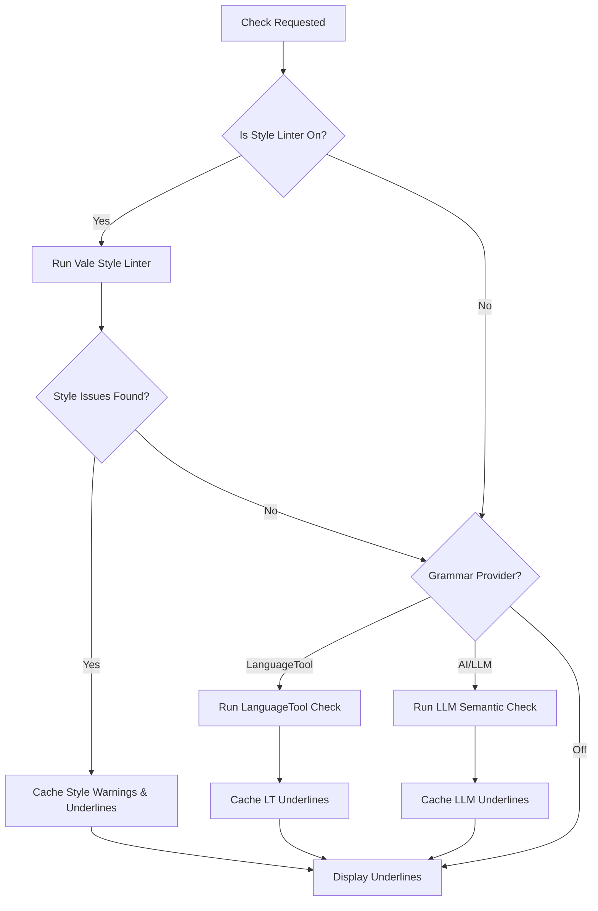

# Development Plan: Vale Editorial Style Linter Integration

This document outlines the detailed development plan to integrate the **Vale Prose Linter** into WriterAgent as an offline, local style-guide checking engine. 

---

## 1. Objectives

1.  **Editorial Compliance:** Allow users to run style guides (Microsoft, Google, write-good) to check for tone, wordiness, passive voice, and formatting consistency.
2.  **Zero-Dependency Binary Distribution:** Leverage the `vale` package on PyPI to auto-download and run the compiled Vale Go binary inside the user's venv.
3.  **Unified Error Mapping:** Parse Vale's structured JSON output and translate style alerts (suggestions, warnings, errors) into red lines / tooltips inside LibreOffice Writer.
4.  **Multi-Style Compatibility:** Enable both Microsoft and Google style guides simultaneously, with a custom configuration that resolves conflicts (e.g., heading casing).

---

## 2. Configuration & Packaging Design

### Configuration Schema (`plugin/doc/module.yaml`)
We will add Vale configuration settings on the Doc tab:
```yaml
  style_linter_enabled:
    type: boolean
    default: false
    widget: checkbox
    label: Enable Vale Style Linter
    helper: "Enforces professional editorial style guides (Google, Microsoft, write-good) locally."
    inline: true
    x: 8
    width: 205

  style_linter_styles:
    type: string
    default: "Microsoft,Google,write-good"
    widget: text
    label: Active Styles
    helper: "Comma-separated list of style guide packages to enforce (e.g., Microsoft, Google, write-good)."
    label_x: 220
    label_width: 95
    x: 318
    width: 106
```

### Vale Initialization & Assets
To function, Vale requires:
1.  A `.vale.ini` configuration file.
2.  Style guide packages downloaded locally (usually stored in a `styles/` folder).

During worker initialization:
*   We will generate a `.vale.ini` configuration file inside the user's WriterAgent config folder.
*   If the style directories do not exist, the worker will run `vale sync` using the downloaded binary to automatically pull the official Microsoft, Google, and write-good style guides.

---

## 3. Worker-Side Vale Helper

We will create a worker script `plugin/scripting/venv/vale.py` that handles writing the text segment to a temporary file (Vale runs on files), executing the binary, and parsing the JSON output.

### Target Script: `plugin/scripting/venv/vale.py`
```python
import os
import sys
import json
import subprocess
import tempfile
from pathlib import Path

# Resolve path to the vale binary downloaded by PyPI wrapper
def _get_vale_binary() -> str:
    # Usually installed in the venv's bin directory
    venv_bin = Path(sys.executable).parent
    vale_path = venv_bin / "vale"
    if not vale_path.exists():
        raise RuntimeError("Vale binary not found. Please run 'uv pip install vale' in the venv.")
    return str(vale_path)

def run_vale_check(text: str, user_config_dir: str, styles: str) -> dict:
    """Run Vale linter on the text segment and return the style errors list."""
    vale_bin = _get_vale_binary()
    
    # 1. Ensure .vale.ini exists in user config dir
    ini_path = Path(user_config_dir) / ".vale.ini"
    styles_path = Path(user_config_dir) / "vale_styles"
    
    if not ini_path.exists():
        styles_path.mkdir(parents=True, exist_ok=True)
        ini_content = f"""
StylesPath = {styles_path.as_posix()}
MinAlertLevel = suggestion
Packages = Microsoft, Google, write-good

[*]
BasedOnStyles = {styles}
# Resolve heading case conflict: prefer Google sentence-casing
Microsoft.Headings = NO
"""
        ini_path.write_text(ini_content, encoding="utf-8")
        
        # Pull packages from the web on first initialization
        try:
            subprocess.run([vale_bin, "--config", str(ini_path), "sync"], check=True, capture_output=True)
        except Exception as e:
            raise RuntimeError(f"Failed to sync Vale styles: {e}")

    # 2. Write text segment to a temporary file
    with tempfile.NamedTemporaryFile(suffix=".txt", mode="w+", delete=False, encoding="utf-8") as temp_file:
        temp_file.write(text)
        temp_file_name = temp_file.name

    try:
        # 3. Execute Vale check
        cmd = [
            vale_bin,
            "--config", str(ini_path),
            "--output", "JSON",
            temp_file_name
        ]
        proc = subprocess.run(cmd, capture_output=True, text=True, encoding="utf-8")
        
        if proc.returncode not in (0, 1): # Vale returns 1 if it flags warnings/errors
            raise RuntimeError(f"Vale linter exited with error: {proc.stderr}")

        # 4. Parse output
        output_data = json.loads(proc.stdout or "{}")
        file_errors = output_data.get(temp_file_name, [])
        
        errors = []
        for err in file_errors:
            # err keys: Line, Span (list of start/end), Text, Severity, Title, Message, Description
            span = err.get("Span", [1, 1])
            start = span[0] - 1  # 1-indexed to 0-indexed
            length = span[1] - span[0] + 1
            
            severity = err.get("Severity", "suggestion")
            rule = err.get("Check", "Style")
            
            errors.append({
                "wrong": text[start:start+length],
                "correct": "", # Vale rarely suggests a single replacement string; it gives descriptions
                "n_error_start": start,
                "n_error_length": length,
                "short_comment": f"[{severity.upper()}] {err.get('Message')}",
                "full_comment": err.get("Description") or err.get("Message"),
                "rule_identifier": f"vale||{rule}",
                "suggestions": [],
                "reason": err.get("Message"),
                "type": f"Style ({severity})"
            })
            
        return {"errors": errors}
        
    finally:
        if os.path.exists(temp_file_name):
            os.remove(temp_file_name)
```

---

## 4. Host-Side Integration

### Client Hook (`plugin/scripting/client.py`)
Expose the facade launcher method:
```python
_VALE_STUB = """\
from plugin.scripting.venv.vale import run_vale_check as _run
result = _run(data["text"], data["config_dir"], data["styles"])
"""

def run_vale_check(ctx: Any, text: str, config_dir: str, styles: str) -> dict[str, Any]:
    """Execute a trusted Vale linter helper inside the user venv worker."""
    return _run_trusted_helper(
        ctx,
        session_id="writeragent:vale",
        stub=_VALE_STUB,
        payload={"text": text, "config_dir": config_dir, "styles": styles},
        timeout_sec=15,
        error_code="VALE_ERROR",
        error_label="Vale Linter",
    )
```

---

## 5. Sequential Cascading Checking Pipeline

We can implement a multi-stage linter pipeline inside the worker dispatcher (`grammar_work_queue.py`):



### Why this pipeline is optimal:
1.  **No Visual Conflicts:** If a sentence has stylistic issues (e.g. passive voice or corporate jargon), it gets highlighted first. Once the user edits the sentence to fix the style, it naturally flows to Phase 2 to verify grammar.
2.  **API Conservation:** We do not trigger LLM calls on sentences that are already flagged as having style or grammar warnings, saving on cost and latency.

---

## 6. Implementation Status (WIP)

The Vale style linter has been successfully integrated as a distinct, mutually-exclusive linter provider choice alongside LLM and LanguageTool:
*   **Active Styles:** Enforces Google, Microsoft, and write-good guidelines.
*   **Contraction & Style Replacements:** Initial support for parsing the linter's `Action` fields to extract suggestions.
*   **Status Tagged as WIP:** The dropdown label is marked as `Vale (Local Style) (WIP)` in [module.yaml](file:///home/keithcu/Desktop/Python/writeragent/plugin/doc/module.yaml) because replacement alignment can sometimes be imprecise compared to advanced LLM-based replacements, and will be tuned in future revisions.

