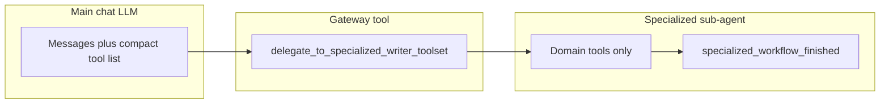

# Writer specialized toolsets (nested delegation)

This document describes **why** Writer exposes many UNO-backed tools through a **two-level** model (main chat + domain-scoped sub-agent), **how** that is implemented in code, and the **API design philosophies** (Fine-grained vs. Fat APIs) driving these decisions.

---

## 1. Problem and goals

### 1.1 Why this feature exists

Writer documents support a large surface area in LibreOffice UNO: tables, styles, text frames, drawing shapes, embedded OLE objects, fields, indexes (TOC, bibliographies), bookmarks, charts, **track changes** (record/review markup), and more. Each area has many service names, properties, and multi-step workflows (DevGuide "create table in five steps," field masters + dependents + refresh, etc.).

If **every** tool were advertised to the primary chat model on every turn:

- **Context cost** grows quickly (dozens of long JSON schemas).
- **Decision quality** drops: the model must choose among unrelated tools (e.g. `create_table` vs `indexes_update_all`).
- **Strict JSON-schema providers** (e.g. some Gemini/OpenRouter paths) are harder to satisfy when schemas proliferate.

The design goal is **progressive disclosure**: keep a **small, stable default tool list** for routine chat and document editing, while still allowing **full access** to deep Writer operations when the user or model explicitly enters a **domain**.

### 1.2 Two Perspectives on API Design

Another way to solve the tool proliferation problem is through API design. There are two primary perspectives on how to structure the tools exposed to the LLM:

**Perspective A: Fine-Grained (Skinny) APIs**
Create highly specific, narrowly-scoped tools for each operation. 
Examples: `create_footnote`, `edit_footnote`, `delete_footnote`, `create_rectangle`, `create_ellipse`.

- **Pros:** Simpler parameter schemas per tool, easier to map directly to underlying UNO DevGuide steps, less confusing validation logic per tool. LLMs often perform better with explicit constraints.
- **Cons:** Exploding tool counts. Even with nested delegation, a single domain like "Shapes" could end up with a dozen individual tools (`create_rectangle`, `create_ellipse`, `create_line`, `create_text_shape`, etc.).

**Perspective B: Fat APIs**
Combine related operations into broader, multi-purpose "fat" tools. 
Examples: `manage_footnotes(action, ...)` or `create_shape(shape_type="rectangle", ...)` or `insert_element(type="footnote", text="...")`

- **Pros:** Drastically reduces the total number of tools, limiting context size. A polymorphic schema allows more capabilities to remain in the main chat prompt, potentially eliminating the need for the sub-agent delegation pattern.
- **Cons:** The parameter schemas become extremely large and complex (e.g., union types or deeply nested generic objects). LibreOffice operations are highly disparate, making a unified underlying Python handler harder to write compared to pure RPC bindings, and LLMs may struggle to reliably structure the union parameters correctly.

#### Detailed Comparison 1: What the two APIs would look like (Footnotes)

**Skinny API (Granular Approach):**

```json
// Tool 1: create_footnote
{
  "name": "create_footnote",
  "parameters": {
    "text": {"type": "string", "description": "The content of the footnote"}
  }
}

// Tool 2: edit_footnote
{
  "name": "edit_footnote",
  "parameters": {
    "footnote_index": {"type": "integer"},
    "new_text": {"type": "string"}
  }
}

// Tool 3: delete_footnote
{
  "name": "delete_footnote",
  "parameters": {
    "footnote_index": {"type": "integer"}
  }
}
```

**Fat API (Polymorphic Approach):**

```json
// Single Tool: manage_footnotes
{
  "name": "manage_footnotes",
  "parameters": {
    "action": {"type": "string", "enum": ["create", "edit", "delete"]},
    "footnote_index": {"type": "integer", "description": "Required for edit/delete"},
    "text": {"type": "string", "description": "Required for create/edit"}
  }
}
```

#### Detailed Comparison 2: What the two APIs would look like (Shapes)

LibreOffice provides numerous drawing shapes through the generic UNO `com.sun.star.drawing.Shape` interface, but instances are created using specific service names (e.g., `RectangleShape`, `EllipseShape`, `LineShape`, `TextShape`).

**Skinny API (Granular Approach):**

```json
// Tool 1: create_rectangle
{
  "name": "create_rectangle",
  "parameters": {
    "x": {"type": "integer"},
    "y": {"type": "integer"},
    "width": {"type": "integer"},
    "height": {"type": "integer"},
    "bg_color": {"type": "string", "description": "e.g., 'red' or '#FF0000'"}
  }
}

// Tool 2: create_ellipse
// (Similar schema to create_rectangle)

// Tool 3: create_text_shape
{
  "name": "create_text_shape",
  "parameters": {
    "x": {"type": "integer"},
    "y": {"type": "integer"},
    "width": {"type": "integer"},
    "height": {"type": "integer"},
    "text": {"type": "string"}
  }
}
```

**Fat API (Polymorphic Approach):**
*(Note: This is similar to how WriterAgent currently implements shapes via `CreateShape`)*

```json
// Single Tool: create_shape
{
  "name": "create_shape",
  "parameters": {
    "shape_type": {"type": "string", "enum": ["rectangle", "ellipse", "text", "line"]},
    "x": {"type": "integer"},
    "y": {"type": "integer"},
    "width": {"type": "integer"},
    "height": {"type": "integer"},
    "text": {"type": "string", "description": "Initial text (optional, applicable to text shapes)"},
    "bg_color": {"type": "string", "description": "Background color (optional)"}
  }
}
```

**Ultra-Fat API (Single `manage_shapes` Tool):**

```json
{
  "name": "manage_shapes",
  "parameters": {
    "action": {"type": "string", "enum": ["create", "edit", "delete"]},
    "shape_index": {"type": "integer", "description": "Target shape (for edit/delete)"},
    "shape_type": {"type": "string", "enum": ["rectangle", "ellipse", "text", "line"], "description": "Required for create"},
    "geometry": {
      "type": "object", 
      "properties": {"x": {"type": "integer"}, "y": {"type": "integer"}, "width": {"type": "integer"}, "height": {"type": "integer"}}
    },
    ...
  }
}
```

While the "Fat API" approach drastically reduces tool count and could potentially eliminate the need for nested sub-agents, we currently use the "Fine-Grained + Nested Delegation" approach for most domains because LibreOffice UNO bindings map better to explicit discrete steps, and many LLMs perform better with simpler parameter shapes than with highly polymorphic schemas. However, domains like `shapes` do employ a "medium-fat" API (`create_shape` vs `create_rectangle`, `create_ellipse`) to balance practical usability with LLM schema robustness.

### 1.3 What "success" looks like under the Delegation model

- The **main** sidebar chat sees **core**-tier tools (default main list) plus the **gateway** `delegate_to_specialized_writer_toolset`, not the full set of table/style/chart/… tools.
- When the model (or product logic) calls the gateway with a **domain** and **task**, the system dynamically grants access to that domain's focused toolset.
- **MCP** and **direct `execute(tool_name, …)`** remain able to run any registered tool by name (registry does not block execution by tier).
- **Tests** can enumerate specialized tools with `exclude_tiers=()` when registration needs to be asserted.

### 1.4 Two Implementations for Specialized Workflows

We currently support two alternative implementations for the `delegate_to_specialized_writer_toolset` tool. This allows us to experiment, research, and quantify which approach works best (e.g., perhaps smaller models need the sub-agent approach to avoid confusion, while larger models can handle in-place tool switching seamlessly). You can toggle between them using the `USE_SUB_AGENT` global variable in `plugin/writer/specialized.py`. Both modes use a `final_answer` tool to explicitly return control and exit the mode.

**Approach A: The Sub-Agent Model (`USE_SUB_AGENT = True`)**

- The gateway tool launches a **short-lived sub-agent** (via `smolagents`) in a background thread.
- This sub-agent receives the user's task description and has access *only* to the specialized domain tools (and `smolagents`' built-in `final_answer` tool).
- The main chat model is blocked, waiting for the sub-agent to finish and return its final answer.

**Approach B: In-Place Tool Switching (`USE_SUB_AGENT = False`)**

- The gateway tool simply sets an active domain flag on the current session and immediately returns control to the main chat model with a message like: `"Tool call switched to '{domain}'..."`.
- On the next turn, the main chat model receives *only* the specialized tools for that domain, plus a custom `final_answer` tool (designed to perfectly mimic the smolagents exit approach). All normal default-tier (**core**) tools are hidden to keep the context clean and make the sub-task easy for the model.
- The model continues its reasoning within the same context and explicitly calls `final_answer` when the sub-task is complete, which clears the active domain and restores the default toolset.

---

## 2. Architecture overview




1. **Tier filtering** on `ToolRegistry.get_tools` / `get_schemas` hides `specialized` and `specialized_control` from the default lists used by chat and MCP `tools/list`. The registry accepts an `active_domain` parameter to explicitly bypass this exclusion when the session is in a specialized mode.
2. **Domain bases** (`ToolWriterTableBase`, …) set `tier = "specialized"` and a `specialized_domain` string.
3. **Delegation** (Sub-Agent mode) collects tools where `isinstance(t, ToolWriterSpecialBase) and t.specialized_domain == domain`, wraps them for smolagents, and runs a bounded `ToolCallingAgent` loop in a **background thread** (`is_async()` on the gateway).
4. **Delegation** (In-Place mode) sets the `active_specialized_domain` on the `ChatSession`, dynamically returning a customized `final_answer` tool along with the domain tools, and responds to the LLM to trigger a new cycle with the updated schema.

---

## 3. Implementation reference

### 3.1 Registry: default exclusion of specialized tiers

**File:** `[plugin/framework/tool_registry.py](../../plugin/framework/tool_registry.py)`

- Constants: `_DEFAULT_EXCLUDE_TIERS = frozenset({"specialized", "specialized_control"})`.
- `get_tools(..., exclude_tiers=...)`:
  - If `exclude_tiers` is omitted (sentinel), those tiers are **filtered out**.
  - Pass `exclude_tiers=()` (empty) to **include all** tiers (used when building the sub-agent tool list).

`get_schemas` forwards `**kwargs` to `get_tools`, so chat and MCP inherit the same default.

**Call sites (default listing):**

- Chat: `[plugin/chatbot/tool_loop.py](../../plugin/chatbot/tool_loop.py)` — `get_schemas("openai", doc=model)` (no `exclude_tiers` → default exclusion).
- MCP: `[plugin/mcp/mcp_protocol.py](../../plugin/mcp/mcp_protocol.py)` — `get_schemas("mcp", doc=doc)` (same).

**Execution:** `ToolRegistry.execute` is unchanged; any registered name can still be invoked if the caller passes it.

### 3.2 Gateway: delegate to sub-agent

**File:** `[plugin/writer/specialized.py](../../plugin/writer/specialized.py)`

- Tool name: `delegate_to_specialized_writer_toolset`.
- Parameters: `domain` (enum aligned with `_AVAILABLE_DOMAINS`), `task` (natural language).
- `tier = "core"`, `long_running = True`, `is_async()` → **True** so the sidebar drain loop is not blocked.
- Tool gathering:
  - `registry.get_tools(filter_doc_type=False, exclude_tiers=())` — **all** tiers, no doc filter (needed so specialized tools are discoverable server-side).
  - Filter to `ToolWriterSpecialBase` with matching `specialized_domain`, plus `specialized_workflow_finished`.
- Depending on the `USE_SUB_AGENT` toggle, it either uses `ToolCallingAgent` + `WriterAgentSmolModel` to execute the task autonomously, or calls `ctx.set_active_domain_callback(domain)` to switch the context for the main model.
- **Sub-agent UNO threading (USE_SUB_AGENT=True):** the gateway runs on a background worker (`is_async()`). Before the smol loop starts, UNO scaffolding (`ToolRegistry.get_tools(doc=…)`, shapes canvas context, document-research open-doc list, embeddings index wakeup) is marshalled via `execute_on_main_thread` in [`plugin/doc/specialized_base.py`](../../plugin/doc/specialized_base.py). Sync domain tools are wrapped with `SmolToolAdapter(..., main_thread_sync=True)` so each tool call marshals to the main thread; async tools must marshal UNO internally (e.g. `generate_image`, `delegate_read_document`). See [docs/uno-thread-safety-enforcement.md](../uno-thread-safety-enforcement.md).

### 3.3 System prompt guidance

**File:** `[plugin/framework/constants.py](../../plugin/framework/constants.py)`

Block `WRITER_SPECIALIZED_DELEGATION` is prepended into `DEFAULT_CHAT_SYSTEM_PROMPT` so the main Writer model is told **when** to call the gateway and **which** domain strings are valid.

### 3.4 Exceptions: tools that stay on the main list

Some Writer tools intentionally use the default main-chat tier (**`tier = "core"`**, `ToolBase` default) so users do not need delegation for common actions, for example:

- **Track changes:** `[plugin/writer/tracking.py](../../plugin/writer/tracking.py)` — `set_track_changes`, `get_tracked_changes`, `manage_tracked_changes` (nelson-aligned behavior; combined accept/reject in `manage_tracked_changes`).
- **Style apply / update:** `[plugin/writer/styles.py](../../plugin/writer/styles.py)` — `apply_style` and `update_style` subclass [`plugin.framework.tool.ToolBase`](../../plugin/framework/tool.py) with the default **`core`** tier.

**Style discovery** (`list_styles`, `get_style_info`) remains under `ToolWriterStyleBase` (specialized) so the main list does not duplicate large style catalog traffic; the prompt steers toward delegation or other discovery when needed.

## 4. Testing and operations

- **Default tool list:** Specialized tools must **not** appear in `get_schemas(..., doc=...)` without overriding `exclude_tiers`.
- **Registration checks:** Use `get_tools(..., exclude_tiers=())` (and a real or mock `doc` as required by `uno_services`) to assert that table tools and other specialized tools are registered. See `[plugin/tests/modules/writer/smoke_writer_tools.py](../../plugin/tests/modules/writer/smoke_writer_tools.py)` and `[plugin/tests/framework/test_tool.py](../../plugin/tests/framework/test_tool.py)` (`TestExcludeSpecializedTiers`).
- **Run tests from the WriterAgent repo root** (`make test`), not from `nelson-mcp/` (different project and pytest layout).

---

## 5. Implementation status and feature coverage

### 5.1 Domain, modules, and extended LO surface

**WriterAgent** modules/tools (columns 1–3) and **broader LibreOffice** gaps not covered by the agent (column 4). Core/advanced narrative lists remain in §5.5–5.6.

**Math:** Editable **MathML in HTML** is imported on the **default core** tool `apply_document_content` (math-aware segmentation and OLE Math insertion in `format_support`), not through `delegate_to_specialized_writer_toolset`. There is no separate specialized **domain** for equations; models use the same HTML rules as other body content (`WRITER_APPLY_DOCUMENT_HTML_RULES` in `[plugin/framework/constants.py](../../plugin/framework/constants.py)`). See [docs/math-tex.md](math-tex.md).

**`get_document_content` (core read):** [`plugin/writer/content.py`](../../plugin/writer/content.py) → [`document_to_content()`](../plugin/writer/format.py) (XHTML export + semantic HTML). Parameters: `scope` (`full` / `selection` / `range`), `max_chars`, `start` / `end`, and **`include_images`** (boolean, default **`false`**). When `include_images` is false, inline `data:image/...;base64,...` payloads are removed from the export; external `` URLs are kept. Pass `include_images: true` to include embedded image bytes. See also [docs/llm-styles.md](llm-styles.md) and [docs/html_style_model_plan.md](html_style_model_plan.md).


| Domain / area               | WriterAgent status      | Module & tools                                                                                                                                                                                                                                     | Extended LO API (gaps)                                                                                 |
| --------------------------- | ----------------------- | -------------------------------------------------------------------------------------------------------------------------------------------------------------------------------------------------------------------------------------------------- | ------------------------------------------------------------------------------------------------------ |
| **Styles**                  | ✅ Implemented           | `styles.py`: ListStyles, GetStyleInfo, UpdateStyle, CreateStyle, ImportStyles; ApplyStyle (core tier, main chat)                                                                                                                                                          | Advanced typography: ligatures/special chars, kerning/tracking, OpenType features, font embedding      |
| **Page**                    | ✅ Implemented           | `page.py`: Get/SetPageStyleProperties, Get/SetHeaderFooterText, Get/SetPageColumns, InsertPageBreak                                                                                                                                                | Custom page layouts; page backgrounds (see Watermark row)                                              |
| **Text frames**             | ✅ Implemented           | `textframes.py`: ListTextFrames, GetTextFrameInfo, SetTextFrameProperties                                                                                                                                                                          | —                                                                                                      |
| **Embedded OLE**            | ✅ Implemented           | `embedded.py`: EmbeddedInsert, EmbeddedEdit                                                                                                                                                                                                        | —                                                                                                      |
| **Images**                  | ✅ Implemented           | `images.py`: GenerateImage (async), List/Get/SetImage*, DownloadImage, Insert/Delete/ReplaceImage                                                                                                                                                  | Advanced image editing                                                                                 |
| **Shapes**                  | ✅ Implemented           | `shapes.py`: Create/Edit/DeleteShape, GetDrawSummary, ListWriterImages, ConnectShapes, GroupShapes (Draw lineage)                                                                                                                                  | —                                                                                                      |
| **Charts**                  | ✅ Specialized           | `manage_charts` via `domain=charts` ([`plugin/calc/charts.py`](../plugin/calc/charts.py), Calc registration). Legacy per-action tools remain disabled (`ToolBaseDummy`). | Full 3D / per-app schema split — see `ManageCharts` docstring.                                      |
| **Indexes**                 | ✅ Implemented           | `indexes.py`: IndexesUpdateAll, RefreshIndexesAlias, IndexesList, IndexesCreate, IndexesAddMark                                                                                                                                                    | —                                                                                                      |
| **Fields**                  | ✅ Implemented           | `fields.py`: FieldsUpdateAll, UpdateFieldsAlias, FieldsList, FieldsDelete, FieldsInsert                                                                                                                                                            | User-defined variables, conditional text, DB fields overlap LO; distinct from **Forms** (business) row |
| **Tracking**                | ✅ Implemented           | `tracking.py`: TrackChangesStart/Stop/List/Show, Accept/Reject (all or single), comment insert/list/delete                                                                                                                                         | Document comparison; version control / integration (not agent)                                         |
| **Bookmarks**               | ✅ Implemented           | `bookmark_tools.py`: List/Cleanup/Create/Delete/Rename/GetBookmark                                                                                                                                                                                 | —                                                                                                      |
| **Footnotes / endnotes**    | ✅ Implemented           | `footnotes.py`: Insert, List, Edit, Delete, SettingsGet/Update                                                                                                                                                                                     | —                                                                                                      |
| **Tables**                  | ✅ Implemented           | HTML path for cell *content*, plus `specialized/tables.py` UNO toolset via `domain=tables`: `list_tables`, `get_table_cells`, `set_table_cell`, `insert_table_row`/`delete_table_row`, `insert_table_column`/`delete_table_column`                  | Merge/split cells; nested tables; per-cell formatting                                                  |
| **Structural navigation**   | ✅ Implemented           | `structural.py` (`list_sections`, `goto_page`, `read_section`), `navigation.py` (`navigate_heading`, `get_surroundings`), `outline.py` (`get_heading_children`); delegate `domain=structural`. Core `get_document_tree` includes document stats (`stats` object); `get_document_stats` was removed. `get_page_objects` stays core. | Technical docs: cross-refs, callouts, revision marks, change bars (not agent)                          |
| **Sections**                | ✅ Partially implemented | `structural.py`: `list_sections`, `read_section` (read-only). Create/edit/delete and per-section property setters not implemented. See [§5.3 Future work: Sections specialized toolset](#53-future-work-sections-specialized-toolset).             | Create/insert `TextSection`; `TextColumns`, `IsVisible`/`Condition`, `IsProtected` (+ password), `SectionLeft/RightMargin`, `BackColor`/`BackGraphic*`, `FileLink`/`LinkRegion`, `DDECommand*`, per-section footnote/endnote scoping; nesting; delete/rename |
| **Forms**                   | ✅ Partially implemented | 'forms.py'                                                                                                                                                                                                                                         | remaining: DB integration                                                                              |
| **Mail merge**              | ❌ Not implemented       | No module                                                                                                                                                                                                                                          | Data sources (CSV/DB/sheets); merge fields; execution; labels; envelopes; email merge                  |
| **Bibliography**            | ❌ Not implemented       | No module                                                                                                                                                                                                                                          | Bib DB; citation styles; insertion/formatting; bibliography generation; reference managers             |
| **Watermark**               | ❌ Not implemented       | No module                                                                                                                                                                                                                                          | Text/image watermarks; page backgrounds; positioning/transparency                                      |
| **AutoText**                | ❌ Not implemented       | No module                                                                                                                                                                                                                                          | —                                                                                                      |
| **TOC enhancement**         | ❌ Not implemented       | Basic TOC via indexes; richer multi-level/style TBD                                                                                                                                                                                                | —                                                                                                      |
| **Document automation**     | ❌ Not in agent          | —                                                                                                                                                                                                                                                  | Macros/scripting (Basic/Python/JS); event handling; custom functions; add-ins/extensions               |
| **Security**                | ❌ Not in agent          | —                                                                                                                                                                                                                                                  | Digital signatures; encryption; password protection; redaction                                         |
| **Document management**     | ❌ Not in agent          | —                                                                                                                                                                                                                                                  | Properties/metadata; version history; document comparison; assembly                                    |
| **Math (MathML in HTML)**   | ✅ Implemented (core)    | `content.py`: `apply_document_content`; `format_support.py`, `html_math_segment.py`, `math_mml_convert.py`, `math_formula_insert.py`. Not a delegated domain.                                                                                      | MathML or TeX (preferred) as-input in HTML; chemistry notation; plotting; extra UNO beyond import path |
| **Real-time collaboration** | ❌ Not in agent          | —                                                                                                                                                                                                                                                  | Co-authoring; shared access; change notification; conflict resolution                                  |
| **External integration**    | ❌ Not in agent          | —                                                                                                                                                                                                                                                  | Database connectivity; web services; cloud storage; API access                                         |
| **Customization**           | ❌ Not in agent          | —                                                                                                                                                                                                                                                  | Custom toolbars/menus; keyboard shortcuts; UI customization; extension development                     |


`tables` now has a dedicated UNO toolset (`ToolWriterTableBase` in `specialized/tables.py`) for structural row/column/cell operations, alongside the core HTML path used for table *content*. **Math** still uses the core HTML insert path, not a `specialized_domain`. Rows above combine specialized domains, planned gaps, and LO-wide areas not covered by WriterAgent tools.

### 5.2 Core infrastructure

- **Tier filtering:** `exclude_tiers` default in `ToolRegistry.get_tools` / `get_schemas` hides specialized tools from default chat/MCP lists.
- **Domain grouping:** `ToolWriter*Base.specialized_domain` + `tier = "specialized"`.
- **Gateway:** `delegate_to_specialized_writer_toolset` (`tier = "core"`, `is_async()`); sub-agent or in-place domain switch per `specialized.py`.
- **Prompt:** `WRITER_SPECIALIZED_DELEGATION` in `constants.py` teaches when to delegate.
- **Execution:** `ToolRegistry.execute` unchanged — tier affects listing, not dispatch.


#### Charts (OLE Lifecycle Findings)

The Writer chart toolset is currently under maintenance. During development, it was discovered that Writer's OLE container (`SwXTextEmbeddedObject`) has a highly sensitive lifecycle compared to Calc:
- **CLSID format**: Braced CLSIDs (`{...}`) are rejected by the `insertTextContent` validator as invalid.
- **Initialization Order**: While setting CLSID before insertion is standard, `insertTextContent` sometimes fails to populate the `EmbeddedObject.Component` (the actual ChartDocument) even after successful return.
- **Platform Sensitivity**: Linux builds may require raw `ByteSequence` CLSIDs for registry mapping.

The toolset is temporarily disabled by deriving from `ToolBaseDummy` while these UNO lifecycle issues are investigated.

### 5.3 Future work: Sections specialized toolset

#### What sections are

A `TextSection` is a range of **complete paragraphs** in a Writer document, grouped so that a focused set of layout, visibility, linking, and footnote-handling properties apply to that range only. Sections can be **nested**. UI entry points are **Insert > Section** and **Format > Sections**.

#### What sections scope (and why this is a substantial domain)

Sections are the **only** way Writer can vary several properties below the page-style level on the same page, which makes them tightly coupled with page styles, columns, and footnotes. Properties scoped by a section include:

- **Multi-column layout** — `TextColumns` (`XTextColumns`); independent of the page style; required when mixing single- and multi-column blocks on one page.
- **Visibility / conditional hiding** — `IsVisible` (boolean) and `Condition` (string, boolean expression evaluated against fields/user variables).
- **Protection** — `IsProtected` (boolean), optionally password-secured via the section dialog.
- **Margins / indents** — `SectionLeftMargin`, `SectionRightMargin` (long, 1/100 mm).
- **Background** — `BackGraphicURL`, `BackGraphicFilter`, `BackGraphicLocation`, plus background color (paragraph-style-like properties).
- **External content link** — `FileLink` (`SectionFileLink` struct: file URL + filter), `LinkRegion` (named source section/bookmark in the linked file).
- **DDE** — `DDECommandFile`, `DDECommandType`, `DDECommandElement` for live data exchange.
- **Footnote / endnote scoping** — `FootnoteIsCollectAtTextEnd`, `FootnoteIsRestartNumbering`, `FootnoteNumberingType`, `FootnoteNumberingPrefix`/`Suffix`, plus endnote equivalents (`Endnote*`).

UI restriction worth surfacing in tool errors: a section **cannot** be hidden when it is the only content on a page or when it lives inside a header, footer, footnote, endnote, frame, or table cell.

#### Why this belongs in its own specialized domain

- **Schema surface is large** (file link, DDE, footnote scoping, columns, background) and overlaps **page** (page columns), **fields** (condition expressions), **footnotes** (per-section overrides), and **structural** (existing read-only navigation). Putting these in the default chat tool list would noticeably grow context and confuse tool selection — the exact problem the delegation pattern solves (see [§1.1 Why this feature exists](#11-why-this-feature-exists)).
- **Multi-step workflows** (create section, set columns, set protection, optionally attach a file link) map well to a short-lived sub-agent with only `sections_*` tools visible.
- **Read path already lives in `structural`**; the write path should get its own `sections` domain so `structural` stays purely navigational.

#### Granular APIs required (small models choke on fat tools)

Sections must use **fine-grained, narrowly scoped tools** — not a single `manage_section(action, …)` or `set_section_properties(name, …)` catch-all. A polymorphic schema that bundles columns, visibility, protection, file links, DDE, and footnote scoping into one call produces a parameter object that **small and mid-size models reliably fail to fill correctly** (wrong optional combinations, omitted required fields, invalid unions). The delegation pattern already limits context; within the `sections` domain we should still keep each tool’s schema skinny so sub-agents and in-place specialized mode remain usable on local Ollama-class models. See [§1.2 Two Perspectives on API Design](#12-two-perspectives-on-api-design).

Deferred capabilities (file link, DDE, footnote scoping, background, rename) should land as **additional single-purpose tools** in later phases — same rule: one concern per tool, not folded into a mega-schema.

#### Proposed tools (not implemented)

**1. Discovery and Inspection Tools**

- **`sections_list()`**
  - **Purpose:** Returns a list of all existing section names in the document.
  - **UNO implementation:** Accesses `doc.getTextSections()` and enumerates the keys via `XNameAccess`. (Overlaps today’s core `list_sections` in `structural.py`; may alias or move under the `sections` domain.)

- **`sections_get_info(name)`**
  - **Purpose:** Returns a detailed JSON payload of a specific section’s current properties.
  - **Payload fields:** Maps `IsVisible`, `Condition`, `IsProtected`, left/right margins, and column counts via `XPropertySet.getPropertyValue`. (Extends read-only `read_section`; full property surface can grow incrementally.)

**2. Creation and Destruction Tools**

- **`sections_create_from_range(name, range_locator)`**
  - **Purpose:** Wraps a specific multi-paragraph range into a named section.
  - **UNO implementation:** Calls `doc.createInstance("com.sun.star.text.TextSection")`. Crucially, it must execute `XText.insertTextContent(xRange, xSection, bAbsorb=True)` to absorb the existing selection range without destroying text content.

- **`sections_delete(name)`**
  - **Purpose:** Removes the section container while preserving the underlying text payload.
  - **UNO implementation:** Uses `XTextContent` interface constraints to invoke `removeTextContent`.

**3. Layout and Property Mutation Tools**

- **`sections_set_columns(name, count, gap_mm)`**
  - **Purpose:** Modifies multi-column properties for layout shifts on a single page.
  - **UNO implementation:** Instantiates an independent column object via `doc.createInstance("com.sun.star.text.TextColumns")`, invokes `setColumnCount(count)`, calculates gaps in 1/100 mm, and writes it back using `setPropertyValue("TextColumns", cols)`.

- **`sections_set_visibility(name, visible, condition?)`**
  - **Purpose:** Handles conditional text hiding.
  - **UNO implementation:** Maps `visible` to `IsVisible` and `condition` to the string property `Condition`.

- **`sections_set_protection(name, protected, password?)`**
  - **Purpose:** Toggles modification locking.
  - **UNO implementation:** Directly writes to the `IsProtected` property set.

**Later phases (same granular rule):** `sections_rename`, `sections_set_margins`, `sections_set_link` / `sections_clear_link`, `sections_set_dde`, `sections_set_footnote_scope`, background graphic tools — each as its own tool, not bundled into `sections_create_from_range` or a generic property setter.

#### References

- TextSection service: [api.libreoffice.org TextSection](https://api.libreoffice.org/docs/idl/ref/servicecom_1_1sun_1_1star_1_1text_1_1TextSection.html).
- User-facing guide: [help.libreoffice.org "Using Sections"](https://help.libreoffice.org/latest/en-US/text/swriter/guide/sections.html).
- Existing read tools: [`plugin/writer/structural.py`](../../plugin/writer/structural.py).

### 6.9 Feature: Structural Integrity & Object Preservation

WriterAgent must ensure that rich document objects—images, shapes, charts, and OLE objects—are not lost during bulk document transformations (e.g., "translate the whole document").

#### The Challenge: The "HTML Destruction" Problem
When the agent uses `get_document_content(scope='full')` and then `apply_document_content(target='full_document')`, it effectively performs a "destructive update." 
1.  **HTML Export**: LibreOffice's HTML filter extracts images to temporary local files.
2.  **LLM Cycle**: The LLM receives text and image tags (``) but lacks the actual binary data.
3.  **Destructive Apply**: `target='full_document'` clears the document before importing the new HTML. If the image links are broken or the objects were "shapes" (which aren't well-represented in HTML), they are gone forever.

#### Strategy 1: Tokenized Placeholder Protocol (Recommended)
This approach "protects" objects by replacing them with stable markers that the LLM is instructed to preserve.
*   **Export (Tokenization)**: Before the HTML is sent to the LLM, the `FormatService` scans for `GraphicObjects` and `CustomShapes`. It replaces them in the HTML with tokens like `[[WA_OBJECT_IMG_001]]` and stores the original UNO object references in a session-bound lookup table.
*   **Preservation**: The system prompt instructs the agent: *"You will see object markers like [[WA_OBJECT_*]]. These represent images and shapes. You MUST preserve these markers in their exact relative positions during translation or editing."*
*   **Import (Restoration)**: During `apply_document_content`, the system intercepts the tokens and re-inserts the **original** UNO objects from the lookup table at the correct anchors. This ensures binary data and complex shape properties remain identical.

#### Strategy 2: Structural Paragraph Patching (The "Non-Destructive" Path)
Instead of replacing the whole document, the agent uses its structural awareness to perform surgical edits.
*   **Workflow**: The agent uses `get_document_tree` to identify paragraph and heading blocks.
*   **Batching**: It translates the document block-by-block (similar to the "Batch Section Rewriting" feature).
*   **Application**: It uses `target='search'` or `target='selection'` to update the text within specific ranges.
*   **Integrity**: Because the agent never calls `full_document` replace, any images anchored "To Page" or "To Paragraph" that were not part of the edited text remain perfectly untouched.

#### Strategy 3: Base64 embedding (export default; optional in tool output)
The XHTML read path embeds graphics as `data:image/...;base64,...` in the HTML. By default, `get_document_content` **strips** those payloads (`include_images: false`); external image URLs in `` are unchanged. Pass **`include_images: true`** when the agent needs the embedded bytes (small assets only — large images blow token budgets).

### 6.7 Cross-cutting Enhancements

- **MCP / API opt-in:** Config or query parameter to list `specialized` tools on `tools/list` for power users or external agents that do not use `delegate_to_specialized_writer_toolset`.
- **Review domain:** Optional `delegate` domain for **track changes** + comment workflows if the main list should shrink further; see [§6.8 Track changes](#68-track-changes-specialized-toolset) for UNO entry points.
- **Limits:** Tune `max_steps` / timeouts for the sub-agent; add telemetry on which domains are used.
- **Documentation:** Keep `[AGENTS.md](../../AGENTS.md)` in sync when behavior or entry points change.

---

## 7. Summary


| Concern                   | Mechanism                                                               |
| ------------------------- | ----------------------------------------------------------------------- |
| Smaller default tool list | `exclude_tiers` default in `ToolRegistry.get_tools` / `get_schemas`     |
| Domain grouping           | `ToolWriter*Base.specialized_domain` + `tier = "specialized"`           |
| User/model entry point    | `delegate_to_specialized_writer_toolset` (`tier = "core"`, async)       |
| Sub-agent completion      | `final_answer` (`tier = "specialized_control"`)                         |
| Prompt teaching           | `WRITER_SPECIALIZED_DELEGATION` in `constants.py`                       |
| Execution by name         | Unchanged `execute()` — tier only affects **listing**, not **dispatch** |


This design trades a second LLM hop (delegation) for a **cleaner main conversation** and **safer tool choice**, while preserving a path to **full** Writer automation per domain. Implementation status, infrastructure, priorities, phased roadmap, and the LO API coverage map are consolidated in [§5 Implementation status and feature coverage](#5-implementation-status-and-feature-coverage).

---

### 8.1 Possible Feature: Batch Section Rewriting

WriterAgent includes a "Batch Section Rewriting" mode that allows users to apply a single instruction to an entire document in one pass by intelligently chunking content based on heading structure. **This feature is an adaptation of the structural parsing logic found in the LibreAI project.**

#### The Concept
Instead of blind, whole-document processing, this feature parses the document into logical sections using `OutlineLevel`. This approach, **pioneered in LibreAI's `DocumentParser.cpp`**, allows for a "review-and-apply" workflow that respects the document's structure rather than treating it as a raw string of text.

#### Implementation (Ported Logic)
WriterAgent uses a generator pattern in `plugin/writer/outline.py` that mirrors the structural detection logic originally implemented by the LibreAI team.

```python
def get_batch_sections(ctx, doc_model, scope_level=0):
    """
    Yields sections of the document.
    scope_level: 0 = Paragraphs, 1 = H1 only, 2 = H2 only, etc.
    """
    paragraphs = doc_model.Text.createEnumeration()
    current_section = None

    while paragraphs.hasMoreElements():
        para = paragraphs.nextElement()
        level = para.OutlineLevel

        # Detection logic: check OutlineLevel to start a new section
        if level > 0 and (scope_level == 0 or level <= scope_level):
            if current_section:
                yield current_section
            current_section = {
                "title": para.String, 
                "level": level, 
                "ranges": [para] # Store XTextRanges for later application
            }
        elif current_section:
            current_section["ranges"].append(para)

    if current_section:
        yield current_section
```

#### FSM Integration
We introduce a `BatchRewriteState` in `plugin/chatbot/tool_loop_state.py`.
1. **Trigger:** The FSM enters this state when the user invokes a batch instruction (e.g., `/batch Rewrite for clarity`).
2. **Execution:** The state machine iterates through the generator output. Each section is passed to the worker pool (`plugin/framework/async_stream.py`).
3. **Application:** When the worker returns, the FSM uses `apply_document_content` on the original `XTextRanges` to update the document, preserving existing bold/italic/style attributes.
4. **Flow:** The state machine automatically sequences to the next section or pauses for user approval if "Review Mode" is enabled.

#### UI Updates
The existing sidebar chat interface updates its status label to provide feedback: 
- `[Batch] Rewriting section 1/15: "Introduction"...`
- `[Batch] Applied. Moving to "Methodology"...`
This provides clear progress tracking without needing a complex new dialog.

**Velocity Advantage:** Because WriterAgent already has the async worker pool and HTML/Plain-text apply logic, this feature only requires the chunking generator and a new FSM loop.


## 8.2. Prior art: Kyber (Interlink Bridge)

Review of [`Kyber_Complete_v24/`](../Kyber_Complete_v24/) (v2.4, local Ollama, EU/GDPR positioning). Kyber is **not** a peer architecture: it is an external **tkinter** paste-in/out assistant plus optional LibreOffice Basic macros, while WriterAgent is a native sidebar with UNO tool-calling. Kyber’s large `backend/` stack (kiosk, industrial IoT) is out of scope here.

**Already covered in WriterAgent (no need to copy):** local endpoint presets (`ENDPOINT_PRESETS`), extend/edit selection, `get_document_tree` / `apply_style`, indexes/TOC tools, page tools, Calc `detect_and_explain_errors`, gettext i18n.

### 8.1 Ideas worth adopting (future)

| Priority | Kyber idea | WriterAgent direction |
| -------- | ---------- | --------------------- |
| High | **Task presets** — one-click prompts for improve, business letter, administrative notice, meeting minutes, Calc explain/budget/report (see `PROMPTS` in `kyber_for_libreoffice_v24.py`) | Sidebar chips or menu items + `task_templates` resources; reuse `LlmClient` / selection paths — not a new HTTP stack |
| Medium–high | **Document Cleaner workflow** — LLM JSON analyze → cleanup profile (letter / report / minutes / notice / custom) → human preview → apply | New **structure cleanup** specialized domain or wizard: analyze → preview → UNO via `apply_style`, indexes, page tools. **Do not** ship Basic macros as the primary path |
| Medium | **HCB (Human Commit Boundary)** — explicit preview before bulk structural edits | Confirmation panel before first mutation in a cleanup batch (similar to web-research approval in `panel_factory.py`) |
| Medium (niche) | **Behördenhelfer** — block-by-block official-document form (`extras/behoerdenhelfer_v2.html`) | Optional XDL/HTML sidebar for EU public admin; defer unless product targets that segment |
| Low | Local **Ollama onboarding** copy (`check_ollama`, recommended model sizes) | Enrich connection-error / first-run hints in settings |

Smallest ROI if implementing later: **presets only**, then Cleaner wizard.

### 8.2 Document Cleaner → existing tools

Kyber generates LibreOffice Basic from analysis JSON (`headings`, `body_paragraphs`, etc.). WriterAgent should orchestrate the same outcomes with UNO:

| Kyber macro operation | WriterAgent tools |
| --------------------- | ----------------- |
| Heading styles by paragraph index | `get_document_tree` + `apply_style` |
| Remove direct formatting on body paragraphs | Styles domain / agent recipe (may need an explicit tool) |
| Insert TOC | `indexes` specialized tools (`ContentIndex`) |
| Page break / first page on H1 | [`plugin/writer/page.py`](../plugin/writer/page.py) |
| Table header row styling | Table tools |
| Footer page number | Page / header-footer tools |

**Gap:** Kyber’s single-shot JSON analysis and profile → operation list is an **orchestration** layer, not missing low-level UNO capability.

### 8.3 Not worth porting

- Standalone tkinter app or paste-only workflow
- Basic macro generator as default delivery (locale-fragile: `Überschrift` vs `Heading`)
- `kyber_backend_v5` / `kyber_nano` (kiosk, team DB, OPC-UA, MQTT)
- Duplicate Ollama/LM Studio preset list
- Shallow LO Python macros in `install/kyber_linux_setup.sh` (subset of extend/edit selection)

---

## 9. References

For complete LibreOffice Writer UNO API documentation:

- [Official LibreOffice API Reference](https://api.libreoffice.org/)
- [LibreOffice Developer's Guide](https://wiki.documentfoundation.org/Documentation/DevGuide)
- [LibreOffice Development Tools](https://help.libreoffice.org/latest/en-US/text/shared/guide/dev_tools.html)
- [NOA-libre: UNO API wrappers](https://github.com/LibreOffice/noa-libre)

For recent feature additions:

- [LibreOffice 26.2 Release Notes](https://www.howtogeek.com/libreoffices-first-big-update-for-2026-has-arrived/)
- [LibreOffice 26.2 New Features](https://9to5linux.com/libreoffice-26-2-open-source-office-suite-officially-released-this-is-whats-new)

