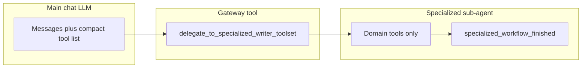

# Writer specialized toolsets (nested delegation)

This document describes **why** Writer exposes many UNO-backed tools through a **two-level** model (main chat + domain-scoped sub-agent), **how** that is implemented in code, and the **API design philosophies** (Fine-grained vs. Fat APIs) driving these decisions.

---

## 1. Problem and goals

### 1.1 Why this feature exists

Writer documents support a large surface area in LibreOffice UNO: tables, styles, text frames, drawing shapes, embedded OLE objects, fields, indexes (TOC, bibliographies), bookmarks, charts, **track changes** (record/review markup), and more. Each area has many service names, properties, and multi-step workflows (DevGuide "create table in five steps," field masters + dependents + refresh, etc.).

If **every** tool were advertised to the primary chat model on every turn:

- **Context cost** grows quickly (dozens of long JSON schemas).
- **Decision quality** drops: the model must choose among unrelated tools (e.g. `create_table` vs `indexes_update_all`).
- **Strict JSON-schema providers** (e.g. some Gemini/OpenRouter paths) are harder to satisfy when schemas proliferate.

The design goal is **progressive disclosure**: keep a **small, stable default tool list** for routine chat and document editing, while still allowing **full access** to deep Writer operations when the user or model explicitly enters a **domain**.

### 1.2 Two Perspectives on API Design

Another way to solve the tool proliferation problem is through API design. There are two primary perspectives on how to structure the tools exposed to the LLM:

**Perspective A: Fine-Grained (Skinny) APIs**
Create highly specific, narrowly-scoped tools for each operation. 
Examples: `create_footnote`, `edit_footnote`, `delete_footnote`, `create_rectangle`, `create_ellipse`.

- **Pros:** Simpler parameter schemas per tool, easier to map directly to underlying UNO DevGuide steps, less confusing validation logic per tool. LLMs often perform better with explicit constraints.
- **Cons:** Exploding tool counts. Even with nested delegation, a single domain like "Shapes" could end up with a dozen individual tools (`create_rectangle`, `create_ellipse`, `create_line`, `create_text_shape`, etc.).

**Perspective B: Fat APIs**
Combine related operations into broader, multi-purpose "fat" tools. 
Examples: `manage_footnotes(action, ...)` or `create_shape(shape_type="rectangle", ...)` or `insert_element(type="footnote", text="...")`

- **Pros:** Drastically reduces the total number of tools, limiting context size. A polymorphic schema allows more capabilities to remain in the main chat prompt, potentially eliminating the need for the sub-agent delegation pattern.
- **Cons:** The parameter schemas become extremely large and complex (e.g., union types or deeply nested generic objects). LibreOffice operations are highly disparate, making a unified underlying Python handler harder to write compared to pure RPC bindings, and LLMs may struggle to reliably structure the union parameters correctly.

#### Detailed Comparison 1: What the two APIs would look like (Footnotes)

**Skinny API (Granular Approach):**

```json
// Tool 1: create_footnote
{
  "name": "create_footnote",
  "parameters": {
    "text": {"type": "string", "description": "The content of the footnote"}
  }
}

// Tool 2: edit_footnote
{
  "name": "edit_footnote",
  "parameters": {
    "footnote_index": {"type": "integer"},
    "new_text": {"type": "string"}
  }
}

// Tool 3: delete_footnote
{
  "name": "delete_footnote",
  "parameters": {
    "footnote_index": {"type": "integer"}
  }
}
```

**Fat API (Polymorphic Approach):**

```json
// Single Tool: manage_footnotes
{
  "name": "manage_footnotes",
  "parameters": {
    "action": {"type": "string", "enum": ["create", "edit", "delete"]},
    "footnote_index": {"type": "integer", "description": "Required for edit/delete"},
    "text": {"type": "string", "description": "Required for create/edit"}
  }
}
```

#### Detailed Comparison 2: What the two APIs would look like (Shapes)

LibreOffice provides numerous drawing shapes through the generic UNO `com.sun.star.drawing.Shape` interface, but instances are created using specific service names (e.g., `RectangleShape`, `EllipseShape`, `LineShape`, `TextShape`).

**Skinny API (Granular Approach):**

```json
// Tool 1: create_rectangle
{
  "name": "create_rectangle",
  "parameters": {
    "x": {"type": "integer"},
    "y": {"type": "integer"},
    "width": {"type": "integer"},
    "height": {"type": "integer"},
    "bg_color": {"type": "string", "description": "e.g., 'red' or '#FF0000'"}
  }
}

// Tool 2: create_ellipse
// (Similar schema to create_rectangle)

// Tool 3: create_text_shape
{
  "name": "create_text_shape",
  "parameters": {
    "x": {"type": "integer"},
    "y": {"type": "integer"},
    "width": {"type": "integer"},
    "height": {"type": "integer"},
    "text": {"type": "string"}
  }
}
```

**Fat API (Polymorphic Approach):**
*(Note: This is similar to how WriterAgent currently implements shapes via `CreateShape`)*

```json
// Single Tool: create_shape
{
  "name": "create_shape",
  "parameters": {
    "shape_type": {"type": "string", "enum": ["rectangle", "ellipse", "text", "line"]},
    "x": {"type": "integer"},
    "y": {"type": "integer"},
    "width": {"type": "integer"},
    "height": {"type": "integer"},
    "text": {"type": "string", "description": "Initial text (optional, applicable to text shapes)"},
    "bg_color": {"type": "string", "description": "Background color (optional)"}
  }
}
```

**Ultra-Fat API (Single `manage_shapes` Tool):**

```json
{
  "name": "manage_shapes",
  "parameters": {
    "action": {"type": "string", "enum": ["create", "edit", "delete"]},
    "shape_index": {"type": "integer", "description": "Target shape (for edit/delete)"},
    "shape_type": {"type": "string", "enum": ["rectangle", "ellipse", "text", "line"], "description": "Required for create"},
    "geometry": {
      "type": "object", 
      "properties": {"x": {"type": "integer"}, "y": {"type": "integer"}, "width": {"type": "integer"}, "height": {"type": "integer"}}
    },
    ...
  }
}
```

While the "Fat API" approach drastically reduces tool count and could potentially eliminate the need for nested sub-agents, we currently use the "Fine-Grained + Nested Delegation" approach for most domains because LibreOffice UNO bindings map better to explicit discrete steps, and many LLMs perform better with simpler parameter shapes than with highly polymorphic schemas. However, domains like `shapes` do employ a "medium-fat" API (`create_shape` vs `create_rectangle`, `create_ellipse`) to balance practical usability with LLM schema robustness.

### 1.3 What "success" looks like under the Delegation model

- The **main** sidebar chat sees `core` / `extended` tools plus the **gateway** `delegate_to_specialized_writer_toolset`, not the full set of table/style/chart/… tools.
- When the model (or product logic) calls the gateway with a **domain** and **task**, the system dynamically grants access to that domain's focused toolset.
- **MCP** and **direct `execute(tool_name, …)`** remain able to run any registered tool by name (registry does not block execution by tier).
- **Tests** can enumerate specialized tools with `exclude_tiers=()` when registration needs to be asserted.

### 1.4 Two Implementations for Specialized Workflows

We currently support two alternative implementations for the `delegate_to_specialized_writer_toolset` tool. This allows us to experiment, research, and quantify which approach works best (e.g., perhaps smaller models need the sub-agent approach to avoid confusion, while larger models can handle in-place tool switching seamlessly). You can toggle between them using the `USE_SUB_AGENT` global variable in `plugin/modules/writer/specialized.py`. Both modes use a `final_answer` tool to explicitly return control and exit the mode.

**Approach A: The Sub-Agent Model (`USE_SUB_AGENT = True`)**

- The gateway tool launches a **short-lived sub-agent** (via `smolagents`) in a background thread.
- This sub-agent receives the user's task description and has access *only* to the specialized domain tools (and `smolagents`' built-in `final_answer` tool).
- The main chat model is blocked, waiting for the sub-agent to finish and return its final answer.

**Approach B: In-Place Tool Switching (`USE_SUB_AGENT = False`)**

- The gateway tool simply sets an active domain flag on the current session and immediately returns control to the main chat model with a message like: `"Tool call switched to '{domain}'..."`.
- On the next turn, the main chat model receives *only* the specialized tools for that domain, plus a custom `final_answer` tool (designed to perfectly mimic the smolagents exit approach). All normal core/extended tools are hidden to keep the context clean and make the sub-task easy for the model.
- The model continues its reasoning within the same context and explicitly calls `final_answer` when the sub-task is complete, which clears the active domain and restores the default toolset.

---

## 2. Architecture overview




1. **Tier filtering** on `ToolRegistry.get_tools` / `get_schemas` hides `specialized` and `specialized_control` from the default lists used by chat and MCP `tools/list`. The registry accepts an `active_domain` parameter to explicitly bypass this exclusion when the session is in a specialized mode.
2. **Domain bases** (`ToolWriterTableBase`, …) set `tier = "specialized"` and a `specialized_domain` string.
3. **Delegation** (Sub-Agent mode) collects tools where `isinstance(t, ToolWriterSpecialBase) and t.specialized_domain == domain`, wraps them for smolagents, and runs a bounded `ToolCallingAgent` loop in a **background thread** (`is_async()` on the gateway).
4. **Delegation** (In-Place mode) sets the `active_specialized_domain` on the `ChatSession`, dynamically returning a customized `final_answer` tool along with the domain tools, and responds to the LLM to trigger a new cycle with the updated schema.

---

## 3. Implementation reference

### 3.1 Registry: default exclusion of specialized tiers

**File:** `[plugin/framework/tool_registry.py](../../plugin/framework/tool_registry.py)`

- Constants: `_DEFAULT_EXCLUDE_TIERS = frozenset({"specialized", "specialized_control"})`.
- `get_tools(..., exclude_tiers=...)`:
  - If `exclude_tiers` is omitted (sentinel), those tiers are **filtered out**.
  - Pass `exclude_tiers=()` (empty) to **include all** tiers (used when building the sub-agent tool list).

`get_schemas` forwards `**kwargs` to `get_tools`, so chat and MCP inherit the same default.

**Call sites (default listing):**

- Chat: `[plugin/modules/chatbot/tool_loop.py](../../plugin/modules/chatbot/tool_loop.py)` — `get_schemas("openai", doc=model)` (no `exclude_tiers` → default exclusion).
- MCP: `[plugin/modules/http/mcp_protocol.py](../../plugin/modules/http/mcp_protocol.py)` — `get_schemas("mcp", doc=doc)` (same).

**Execution:** `ToolRegistry.execute` is unchanged; any registered name can still be invoked if the caller passes it.

### 3.2 Gateway: delegate to sub-agent

**File:** `[plugin/modules/writer/specialized.py](../../plugin/modules/writer/specialized.py)`

- Tool name: `delegate_to_specialized_writer_toolset`.
- Parameters: `domain` (enum aligned with `_AVAILABLE_DOMAINS`), `task` (natural language).
- `tier = "core"`, `long_running = True`, `is_async()` → **True** so the sidebar drain loop is not blocked.
- Tool gathering:
  - `registry.get_tools(filter_doc_type=False, exclude_tiers=())` — **all** tiers, no doc filter (needed so specialized tools are discoverable server-side).
  - Filter to `ToolWriterSpecialBase` with matching `specialized_domain`, plus `specialized_workflow_finished`.
- Depending on the `USE_SUB_AGENT` toggle, it either uses `ToolCallingAgent` + `WriterAgentSmolModel` to execute the task autonomously, or calls `ctx.set_active_domain_callback(domain)` to switch the context for the main model.

### 3.3 System prompt guidance

**File:** `[plugin/framework/constants.py](../../plugin/framework/constants.py)`

Block `WRITER_SPECIALIZED_DELEGATION` is prepended into `DEFAULT_CHAT_SYSTEM_PROMPT` so the main Writer model is told **when** to call the gateway and **which** domain strings are valid.

### 3.4 Exceptions: tools that stay on the main list

Some Writer tools intentionally use `**tier = "extended"`** (or `core`) so users do not need delegation for common actions, for example:

- **Track changes:** `[plugin/modules/writer/tracking.py](../../plugin/modules/writer/tracking.py)` — `set_track_changes`, `get_tracked_changes`, `manage_tracked_changes` (nelson-aligned behavior; combined accept/reject in `manage_tracked_changes`).
- **Style apply:** `[plugin/modules/writer/styles.py](../../plugin/modules/writer/styles.py)` — `apply_style` subclasses `plugin.framework.tool_base.ToolBase` with `tier = "extended"`.

**Style discovery** (`list_styles`, `get_style_info`) remains under `ToolWriterStyleBase` (specialized) so the main list does not duplicate large style catalog traffic; the prompt steers toward delegation or other discovery when needed.

## 4. Testing and operations

- **Default tool list:** Specialized tools must **not** appear in `get_schemas(..., doc=...)` without overriding `exclude_tiers`.
- **Registration checks:** Use `get_tools(..., exclude_tiers=())` (and a real or mock `doc` as required by `uno_services`) to assert that table tools and other specialized tools are registered. See `[plugin/tests/smoke_writer_tools.py](../../plugin/tests/smoke_writer_tools.py)` and `[plugin/tests/test_tool_registry.py](../../plugin/tests/test_tool_registry.py)` (`TestExcludeSpecializedTiers`).
- **Run tests from the WriterAgent repo root** (`make test`), not from `nelson-mcp/` (different project and pytest layout).

---

## 5. Implementation status and feature coverage

### 5.1 Domain, modules, and extended LO surface

**WriterAgent** modules/tools (columns 1–3) and **broader LibreOffice** gaps not covered by the agent (column 4). Core/advanced narrative lists remain in §5.5–5.6.

**Math:** Editable **MathML in HTML** is imported on the **default core** tool `apply_document_content` (math-aware segmentation and OLE Math insertion in `format_support`), not through `delegate_to_specialized_writer_toolset`. There is no separate specialized **domain** for equations; models use the same HTML rules as other body content (`WRITER_APPLY_DOCUMENT_HTML_RULES` in `[plugin/framework/constants.py](../../plugin/framework/constants.py)`). See `[docs/libreoffice-html-math-dev-plan.md](libreoffice-html-math-dev-plan.md)`.


| Domain / area               | WriterAgent status      | Module & tools                                                                                                                                                                                                                                     | Extended LO API (gaps)                                                                                 |
| --------------------------- | ----------------------- | -------------------------------------------------------------------------------------------------------------------------------------------------------------------------------------------------------------------------------------------------- | ------------------------------------------------------------------------------------------------------ |
| **Styles**                  | ✅ Implemented           | `styles.py`: ListStyles, GetStyleInfo; StylesApply (extended tier, main chat)                                                                                                                                                                      | Advanced typography: ligatures/special chars, kerning/tracking, OpenType features, font embedding      |
| **Page**                    | ✅ Implemented           | `page.py`: Get/SetPageStyleProperties, Get/SetHeaderFooterText, Get/SetPageColumns, InsertPageBreak                                                                                                                                                | Custom page layouts; page backgrounds (see Watermark row)                                              |
| **Text frames**             | ✅ Implemented           | `textframes.py`: ListTextFrames, GetTextFrameInfo, SetTextFrameProperties                                                                                                                                                                          | —                                                                                                      |
| **Embedded OLE**            | ✅ Implemented           | `embedded.py`: EmbeddedInsert, EmbeddedEdit                                                                                                                                                                                                        | —                                                                                                      |
| **Images**                  | ✅ Implemented           | `images.py`: GenerateImage (async), List/Get/SetImage*, DownloadImage, Insert/Delete/ReplaceImage                                                                                                                                                  | Advanced image editing                                                                                 |
| **Shapes**                  | ✅ Implemented           | `shapes.py`: Create/Edit/DeleteShape, GetDrawSummary, ListWriterImages, ConnectShapes, GroupShapes (Draw lineage)                                                                                                                                  | —                                                                                                      |
| **Charts**                  | ✅ Implemented           | `charts.py`: List/Get/Create/Edit/DeleteChart (Calc lineage)                                                                                                                                                                                       | —                                                                                                      |
| **Indexes**                 | ✅ Implemented           | `indexes.py`: IndexesUpdateAll, RefreshIndexesAlias, IndexesList, IndexesCreate, IndexesAddMark                                                                                                                                                    | —                                                                                                      |
| **Fields**                  | ✅ Implemented           | `fields.py`: FieldsUpdateAll, UpdateFieldsAlias, FieldsList, FieldsDelete, FieldsInsert                                                                                                                                                            | User-defined variables, conditional text, DB fields overlap LO; distinct from **Forms** (business) row |
| **Tracking**                | ✅ Implemented           | `tracking.py`: TrackChangesStart/Stop/List/Show, Accept/Reject (all or single), comment insert/list/delete                                                                                                                                         | Document comparison; version control / integration (not agent)                                         |
| **Bookmarks**               | ✅ Implemented           | `bookmark_tools.py`: List/Cleanup/Create/Delete/Rename/GetBookmark                                                                                                                                                                                 | —                                                                                                      |
| **Footnotes / endnotes**    | ✅ Implemented           | `footnotes.py`: Insert, List, Edit, Delete, SettingsGet/Update                                                                                                                                                                                     | —                                                                                                      |
| **Tables**                  | ✅ Implemented           | Tables edited via HTML                                                                                                                                                                                                                             | UNO table ops TBD if needed beyond HTML                                                                |
| **Structural navigation**   | ✅ Implemented           | `structural.py` (`list_sections`, `goto_page`, `read_section`), `navigation.py` (`navigate_heading`, `get_surroundings`), `outline.py` (`get_heading_children`); delegate `domain=structural`. `get_document_tree` / `get_page_objects` stay core. | Technical docs: cross-refs, callouts, revision marks, change bars (not agent)                          |
| **Forms**                   | ✅ Partially implemented | 'forms.py'                                                                                                                                                                                                                                         | remaining: DB integration                                                                              |
| **Mail merge**              | ❌ Not implemented       | No module                                                                                                                                                                                                                                          | Data sources (CSV/DB/sheets); merge fields; execution; labels; envelopes; email merge                  |
| **Bibliography**            | ❌ Not implemented       | No module                                                                                                                                                                                                                                          | Bib DB; citation styles; insertion/formatting; bibliography generation; reference managers             |
| **Watermark**               | ❌ Not implemented       | No module                                                                                                                                                                                                                                          | Text/image watermarks; page backgrounds; positioning/transparency                                      |
| **AutoText**                | ❌ Not implemented       | No module                                                                                                                                                                                                                                          | —                                                                                                      |
| **TOC enhancement**         | ❌ Not implemented       | Basic TOC via indexes; richer multi-level/style TBD                                                                                                                                                                                                | —                                                                                                      |
| **Document automation**     | ❌ Not in agent          | —                                                                                                                                                                                                                                                  | Macros/scripting (Basic/Python/JS); event handling; custom functions; add-ins/extensions               |
| **Security**                | ❌ Not in agent          | —                                                                                                                                                                                                                                                  | Digital signatures; encryption; password protection; redaction                                         |
| **Document management**     | ❌ Not in agent          | —                                                                                                                                                                                                                                                  | Properties/metadata; version history; document comparison; assembly                                    |
| **Math (MathML in HTML)**   | ✅ Implemented (core)    | `content.py`: `apply_document_content`; `format_support.py`, `html_math_segment.py`, `math_mml_convert.py`, `math_formula_insert.py`. Not a delegated domain.                                                                                      | MathML or TeX (preferred) as-input in HTML; chemistry notation; plotting; extra UNO beyond import path |
| **Real-time collaboration** | ❌ Not in agent          | —                                                                                                                                                                                                                                                  | Co-authoring; shared access; change notification; conflict resolution                                  |
| **External integration**    | ❌ Not in agent          | —                                                                                                                                                                                                                                                  | Database connectivity; web services; cloud storage; API access                                         |
| **Customization**           | ❌ Not in agent          | —                                                                                                                                                                                                                                                  | Custom toolbars/menus; keyboard shortcuts; UI customization; extension development                     |


`ToolWriterTableBase` / `tables` is the only **domain base** without a dedicated UNO table toolset (HTML path). **Math** likewise uses the core HTML insert path, not a `specialized_domain`. Rows above combine specialized domains, planned gaps, and LO-wide areas not covered by WriterAgent tools.

### 5.2 Core infrastructure

- **Tier filtering:** `exclude_tiers` default in `ToolRegistry.get_tools` / `get_schemas` hides specialized tools from default chat/MCP lists.
- **Domain grouping:** `ToolWriter*Base.specialized_domain` + `tier = "specialized"`.
- **Gateway:** `delegate_to_specialized_writer_toolset` (`tier = "core"`, `is_async()`); sub-agent or in-place domain switch per `specialized.py`.
- **Prompt:** `WRITER_SPECIALIZED_DELEGATION` in `constants.py` teaches when to delegate.
- **Execution:** `ToolRegistry.execute` unchanged — tier affects listing, not dispatch.

### 6.7 Cross-cutting Enhancements

- **MCP / API opt-in:** Config or query parameter to list `specialized` tools on `tools/list` for power users or external agents that do not use `delegate_to_specialized_writer_toolset`.
- **Review domain:** Optional `delegate` domain for **track changes** + comment workflows if the main list should shrink further; see [§6.8 Track changes](#68-track-changes-specialized-toolset) for UNO entry points.
- **Limits:** Tune `max_steps` / timeouts for the sub-agent; add telemetry on which domains are used.
- **Documentation:** Keep `[AGENTS.md](../../AGENTS.md)` in sync when behavior or entry points change.

---

## 7. Summary


| Concern                   | Mechanism                                                               |
| ------------------------- | ----------------------------------------------------------------------- |
| Smaller default tool list | `exclude_tiers` default in `ToolRegistry.get_tools` / `get_schemas`     |
| Domain grouping           | `ToolWriter*Base.specialized_domain` + `tier = "specialized"`           |
| User/model entry point    | `delegate_to_specialized_writer_toolset` (`tier = "core"`, async)       |
| Sub-agent completion      | `final_answer` (`tier = "specialized_control"`)                         |
| Prompt teaching           | `WRITER_SPECIALIZED_DELEGATION` in `constants.py`                       |
| Execution by name         | Unchanged `execute()` — tier only affects **listing**, not **dispatch** |


This design trades a second LLM hop (delegation) for a **cleaner main conversation** and **safer tool choice**, while preserving a path to **full** Writer automation per domain. Implementation status, infrastructure, priorities, phased roadmap, and the LO API coverage map are consolidated in [§5 Implementation status and feature coverage](#5-implementation-status-and-feature-coverage).

---

## 8. References

For complete LibreOffice Writer UNO API documentation:

- [Official LibreOffice API Reference](https://api.libreoffice.org/)
- [LibreOffice Developer's Guide](https://wiki.documentfoundation.org/Documentation/DevGuide)
- [LibreOffice Development Tools](https://help.libreoffice.org/latest/en-US/text/shared/guide/dev_tools.html)
- [NOA-libre: UNO API wrappers](https://github.com/LibreOffice/noa-libre)

For recent feature additions:

- [LibreOffice 26.2 Release Notes](https://www.howtogeek.com/libreoffices-first-big-update-for-2026-has-arrived/)
- [LibreOffice 26.2 New Features](https://9to5linux.com/libreoffice-26-2-open-source-office-suite-officially-released-this-is-whats-new)

